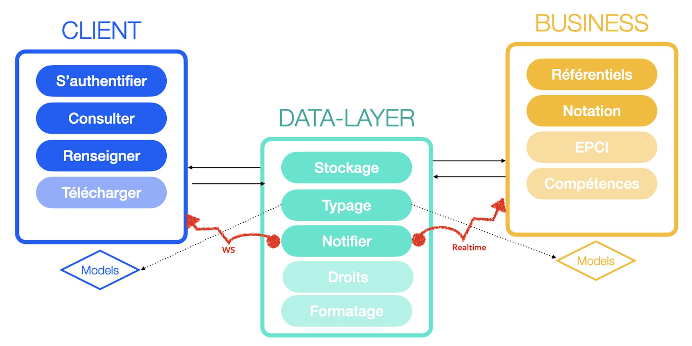

# Territoires en Transition

Dans le cadre des programmes d'accompagnement des collectivités dans leurs démarches de transition écologique,
l'[ADEME (l'Agence de la transition écologique)](https://www.ademe.fr/) s'est associée à
[beta.gouv.fr](https://beta.gouv.fr/) pour lancer une plateforme numérique pour faciliter et accélérer la mise en oeuvre
des actions de transition écologique dans les collectivités territoriales.

L'interface a pour objectifs de permettre aux utilisateurs :

- d'accéder aux référentiels d'actions de transition écologique
  (Climat-Air-Énergie et Économie Circulaire) et de personnaliser leur utilisation,
- de gérer et suivre ses actions et indicateurs de transition écologique,
- de prioriser les actions ayant le plus d'impact,
- de partager la progression des réalisations et des retours d'expériences entre collectivités.

### Organisation du dépôt

Ce dépôt Git contient :

- 3 services :
    - le ["data-layer"](./data_layer)
    - le ["business"](./business)
    - le [client](./app.territoiresentransitions.react)
- les données des référentiels en [markdown](./markdown)
- le [code du site statique](./territoiresentransitions.fr)

Chaque dossier à la racine contient son propre `README.md` et peut a priori fonctionner de manière autonome.

Vous pouvez contribuer à notre projet [en suivant cette documentation](docs/workflows/contribuer-au-projet.md).

# Conception

La conception, des données au choix de la stack.

## Données

### Les données métier

Les contenus de notre application sont écrits en markdown, ce faisant les experts métiers travaillent dans le même dépôt
que les devs.

Ces fichiers markdowns représentent des définitions auxquelles sont rattachées des données provenant d'utilisateurs. Par
exemple un indicateur tel que [Emissions de GES](markdown/indicateurs/crte/crte_001.md)
est destiné à permettre aux utilisateurs à saisir leurs données annuelles dans notre application.

Ces définitions sont lues par la partie [referentiel](business/business/referentiel) du `business` et sauvegardée en
base afin d'être

- utilisées pour le processus d'[évaluation](business/business/evaluation)
- affichées dans le `client`
- garantir la cohérence des données utilisateur stockées dans le `data layer` grace
  au [schema](data_layer/postgres/definitions)

### Les données utilisateurs

Les utilisateurs saisissent pour le compte de leur collectivité des données qui sont stockées dans le `data layer`
qui vérifie leurs droits en écriture grace aux
[row security policies](https://www.postgresql.˚org/docs/current/ddl-rowsecurity.html)

### Les données d'évaluation

Les données utilisateurs rattachées aux référentiels sont évaluées par le service évaluation du `business` qui inscrit
les résultats en base et les transmets au `client` via les WebSockets
de [supabase realtime](https://github.com/supabase/realtime)

## Design

L'application est composée de trois éléments :
le `client`, le `data layer` et le `business`.

Chacun de ses éléments a un périmètre définit :

- le `client` permet aux utilisateurs de se servir du produit et ne communique qu'avec le `data layer`
- le `data layer` se charge des données et de l'authentification.
    - Il permet au `client` de stocker les données de façon sécurisé et lui fournit les moyens via une API REST de lire
      les données simplement en lui fournissant des endpoints adaptés.
    - Il permet au `business` de stocker les données métier et d'accéder aux données utilisateurs
    - Dans le processus d'évaluation, il permet au `business` de réagir aux changements des données utilisateur et au
      `client` de réagir aux changements des évaluations.
    - Enfin, il garantit la cohérence des données.
- le `business` se charge des parties métier et ne communique qu'avec le `data layer`
    - il lit les contenus markdown et les enregistre dans le `data layer`
    - il évalue les données utilisateur et les enregistre dans le `data layer`

<div align="center">

</div>

## Stack

- Le `client` utilise React ce qui nous permet de bénéficier d'un écosystème riche. Il est développé en TypeScript.

- Le `data layer` utilise [Supabase](https://github.com/supabase/), une solution qui intègre tous
  les [services](https://supabase.com/docs/architecture) dont nous avons besoin en open source dont :
    - [gotrue](https://github.com/netlify/gotrue) pour l'authentification OAuth2
    - [PostgreSQL](https://www.postgresql.org/) la base qui nous apporte le typage et la consistence des données.
    - [PostgREST](https://postgrest.org/en/stable/) qui transforme la base de donnée en une API RESTful.

- le `business` est développé en Python 🐍.

## Lancer le projet en local pour le développement

Le `client`, le `data layer` et le `business` peuvent être lancés à partir de docker-compose.

### Variables d'environnement

#### Option 1 : à la main 
- Ajouter les variables d'environnement SUPABASE_SERVICE_ROLE_KEY et SUPABASE_ANON_KEY dans les .env de chaque projet 
- Remplacer dans la configuration kong les champs ${SUPABASE_SERVICE_ROLE_KEY} et  ${SUPABASE_ANON_KEY}) par ces variables

#### Option 2 : grâce à l'utilitaire make_dot_env.sh
- Renseigner dans votre environnement les variables SUPABASE_SERVICE_ROLE_KEY et SUPABASE_ANON_KEY (ex : export SUPABASE_SERVICE_ROLE_KEY=...)
- Lancer `make_dot_env.sh` qui se chargera d'ajouter les variables dans le fichier `.env` et dans la configuration kong. 

### Lancer les différents services

- le `client` et donc le `datalayer` et le `business` dont il dépend
  `docker-compose up client --build`
- le `business` et donc le `datalayer` dont il dépend
  `docker-compose up client --build`
- le `datalayer` qui est en fait supabase et les modèles/fonctions est démarré avec le container `loader` dont le role
  est de charger les modèles, les fonctions et les données `docker-compose up loader`

_Pro-tip_ pour mettre à jour le datalayer sans le redémarrer lorsque l'on change de branche :

```sh
docker compose run sqitch_revert && docker compose run --no-deps sqitch
```

### Lancer les tests

Les trois services sont des projets indépendants qui peuvent-être testés en local sous reserve que les dépendances de
développement soient installées.

Néanmoins, on peut lancer les tests à partir de docker compose :
- `docker-compose run client-test`
- `docker-compose run business-test`
- `docker-compose run datalayer-test`
- `docker-compose run datalayer-api-test`

## Déploiement

Aujourd'hui le `business` et le `client` sont déployés chez Scalingo, le `data layer` est chez supabase.io en mode SAAS.
