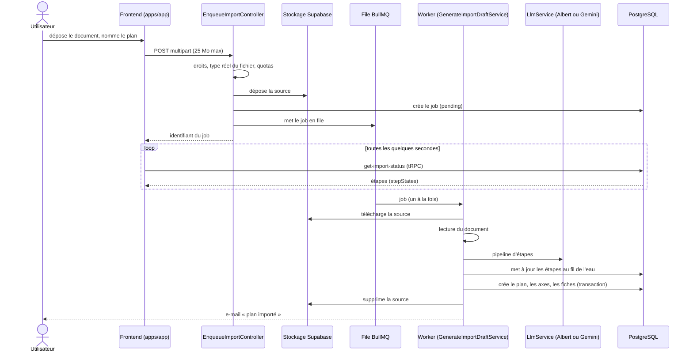
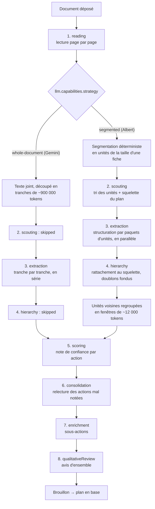
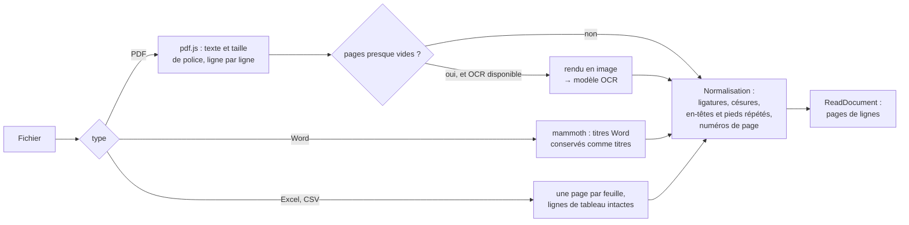
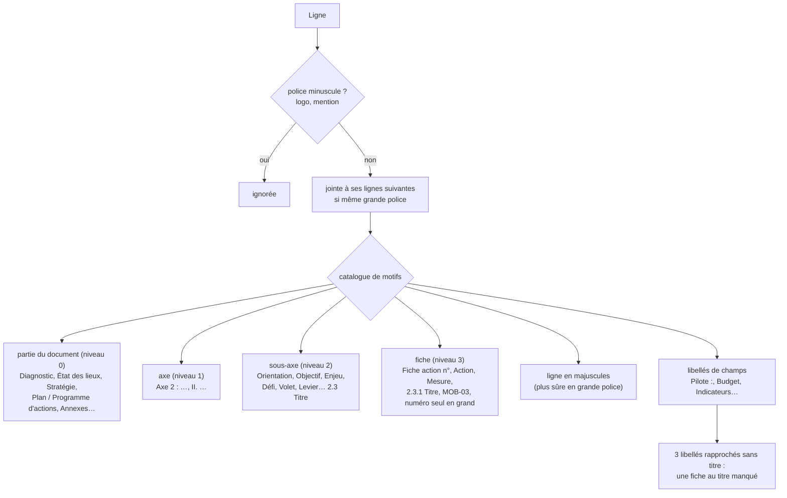
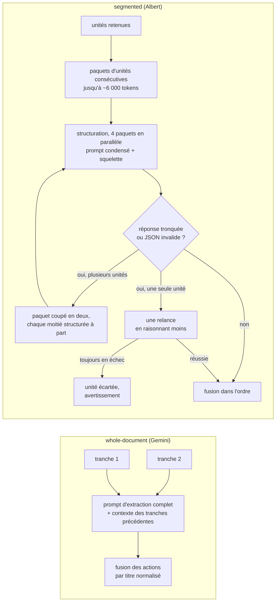

# Import IA d'un plan d'actions

Une collectivité dépose son plan (PCAET, plan climat, plan de transition…) en
PDF, Word, Excel ou CSV. L'import IA en tire les axes, sous-axes, actions et
sous-actions, puis crée le plan dans Territoires en Transitions. Le plan créé
est marqué « importé par l'IA » et reste à relire.

Deux fournisseurs de modèles sont branchés derrière `LlmService`, au choix par
`LLM_PROVIDER` :

| | Albert API | Gemini (défaut) |
|---|---|---|
| Opérateur | DINUM, socle interministériel | Google, via Vertex AI |
| Modèles | un par palier : `gpt-oss-120b` (fort), `ministral-3-8b` (léger), `lightonocr-2-1b` (OCR) | `GEMINI_MODEL` pour tout |
| Fenêtre du modèle fort | 131 000 tokens | 1 000 000 tokens |
| Stratégie | `segmented` : le document en morceaux de la taille d'une fiche | `whole-document` : le document en quelques grandes tranches |
| OCR des pages scannées | oui | non |
| Quotas | 128 000 tokens d'entrée et 10 requêtes par minute, par modèle | pas de limite connue |

Le code ne teste jamais le nom du fournisseur : tout passe par
`llm.capabilities` (`strategy`, `ocr`) et par `maxInputTokensFor(tier)`. Changer
de fournisseur se fait par la seule variable `LLM_PROVIDER`.

> **Appels payants.** Chaque import appelle un modèle externe. Les tests
> automatisés utilisent un faux modèle, et un agent ne lance jamais d'import
> réel (voir le `CLAUDE.md` racine). Pour mesurer la qualité à la main :
> [`eval/README.md`](eval/README.md).

## Vue d'ensemble



Garde-fous à l'entrée (`enqueue-import/`, `ai-plan-import.constants.ts`) :

- un seul import en cours par utilisateur (409), dix par collectivité et par
  24 heures (429), vingt en cours au total ;
- le type du fichier est vérifié sur son contenu, pas sur son extension ; une
  archive Office (xlsx, docx) est inspectée avant d'être acceptée ;
- 25 Mo compressés, 100 Mo décompressés.

## Le pipeline

`pipeline/run-import-pipeline.ts` enchaîne huit étapes. Chacune se termine en
`ok`, `skipped` ou échoue, et son état est écrit en base pour la barre de
progression du frontend. Les deux stratégies partagent la lecture et les
étapes de vérification ; elles diffèrent sur la façon de découper et de
structurer.



Les étapes 5 et 6 sautent si l'utilisateur désactive les vérifications, et
l'étape 7 s'il désactive les sous-actions.

Avant la création du plan, le brouillon est normalisé
(`adapters/extracted-action-to-import-action.ts`) : le numéro qui précède un
titre d'action (« 2.1.3 », « Action 3 - ») est retiré, car il ne sert qu'au
rattachement pendant l'import, sauf s'il est seul à distinguer deux fiches ;
un même axe ou sous-axe libellé de deux façons (mêmes mots aux accents et à
la casse près) prend une seule graphie, en casse normale de préférence, et un
numéro nu (« Axe 6 ») rejoint le seul libellé complet de ce numéro ; les
doublons exacts sont écartés.

La lecture (étape 1) porte aussi un garde-fou déterministe,
`pipeline/detect-document-tome/` : un PCAET se publie en plusieurs tomes, et
seul le programme d'actions s'importe. Si la zone de titre (premières pages,
lignes courtes de page de garde et de sommaire) annonce un tome qui ne
contient jamais de fiches actions — évaluation environnementale stratégique,
résumé non technique, diagnostic — l'import échoue immédiatement avec un
message qui cite la ligne fautive, avant tout appel au modèle. Une
« stratégie » passe (l'import sert aussi hors PCAET, et un plan stratégique
peut porter des fiches). Un titre de programme d'actions ancré en début de
ligne l'emporte toujours (cas du PCAET global qui contient aussi son
diagnostic), et les tableurs ne sont pas concernés.

Une étape en échec arrête l'import, qui n'enregistre alors aucun plan. Le
résultat du pipeline garde toutefois les actions d'avant l'étape fautive et
les avertissements accumulés : l'évaluation les mesure, pour comprendre ce qui
a fait échouer l'étape.

### Pourquoi deux stratégies

Gemini lit un PCAET de 300 pages d'un coup et en extrait fidèlement les
actions. `gpt-oss-120b`, lui, **résume au lieu d'extraire** dès qu'on lui
donne une grande tranche. Sur le même document, il a rendu 31 actions pauvres
là où Gemini en rendait 224, et sa fenêtre de 131 000 tokens impose de toute
façon plusieurs tranches, qui se contredisent sur la hiérarchie : 23 sous-axes
au lieu de 11. La stratégie `segmented` lui donne à lire des morceaux de la
taille d'une fiche, avec la structure du plan établie à part.

## 1. Lecture (`pipeline/read-document/`)



- Une page de moins de 200 caractères est candidate à l'OCR. Si au moins 80 %
  des pages le sont, le document est un scan : au-delà de 60 pages, il est
  refusé avec un message qui propose d'exporter le seul programme d'actions.
- Une page blanche ou une photo n'est pas un échec d'OCR. Un échec sur un
  document qui a du texte laisse la page telle que pdf.js l'a lue ; seul un
  scan intégral échoue au-delà de 20 % de pages en échec.
- La réponse de l'OCR est plafonnée à 3 500 tokens par page, au-delà desquels
  le modèle répète en boucle ce qu'il voit sur une photo. Une page presque
  vide d'un document qui a du texte a 30 secondes pour être transcrite, une
  page d'un scan intégral 90 secondes.
- Gemini n'a pas d'OCR branché : un scan intégral y aboutit à « document sans
  texte ».

## 2. Segmentation et repérage (Albert seulement)

### Segmentation déterministe (`pipeline/segment-document/`)

Aucun appel au modèle : on reconnaît les titres, on coupe aux frontières des
fiches, puis on ramène chaque unité entre 1 000 et 3 500 tokens (les petites
fusionnent avec leur voisine, les grandes sont fenêtrées avec une reprise).

Chaque unité garde ses pages, son chemin de titres (axe > sous-axe) et la
partie du document qui la contient (diagnostic, stratégie, plan d'actions,
annexes…).



Ce que la mise en page trompe, et comment la segmentation s'en garde (cas du
PCAET de Clisson Sèvre et Maine Agglo) :

- deux colonnes côte à côte : la lecture sépare deux morceaux de texte d'une
  même ligne quand plus de deux hauteurs de police les séparent, sans détacher
  un numéro ou un libellé court de sa valeur ;
- un titre sur plusieurs lignes : recollé jusqu'à quatre lignes de même
  police ; un titre explicite (« ACTION 2 - … », « OBJECTIF 2 - … ») admet une
  suite plus longue dans une autre grande police, mais n'avale jamais le titre
  explicite suivant ;
- le tableau récapitulatif : une page qui aligne au moins quatre lignes
  « 2.1.3 Titre » presque sans texte entre elles n'ouvre aucune fiche ;
- le bandeau d'objectif en tête de fiche (« 1- AMELIORER… » juste au-dessus de
  « ACTION 2 - … ») est le sous-axe, pas une fiche ;
- un titre de partie en corps de texte juste après une fiche (« Suivi et
  évaluation ») est un intertitre de la fiche ;
- un document qui nomme ses axes (« AXE STRATEGIQUE 4 ») ne prend pas une
  ligne en majuscules pour un axe, sauf si elle se dit axe (« AXE
  TRANSVERSAL »).

### Tri et squelette (`pipeline/scout-units/`)

- **Tri** (palier léger, lots de 40) : chaque unité est classée `fiche_action`,
  `structure`, `diagnostic`, `engagement_partenaire` ou `autre`, sur ses 600
  premiers caractères et sa place dans le document. On écarte le diagnostic,
  l'éditorial et les engagements de partenaires.
  Une unité que la segmentation tient pour une fiche reste toujours, tout comme
  une unité que le modèle a oubliée : mieux vaut lire un extrait de trop que
  perdre une action.
- Une partie titrée « Engagement(s) des partenaires » est écartée d'office,
  sans appel : ce sont les engagements d'autres acteurs, pas le plan de la
  collectivité.
- Quand une partie titrée « Plan / Programme d'actions » ou « Fiches actions »
  contient au moins trois fiches, seule cette partie est structurée : un PCAET
  suit une structure réglementaire, et le diagnostic, la stratégie ou les
  annexes n'ont pas d'action à donner. Sans partie de ce type, tout est lu.
- Avec des fiches, un extrait classé `structure` (sommaire, tableau
  récapitulatif) sert au squelette mais n'est pas structuré : il redit ce que
  les fiches détaillent.
- Après la structuration, les actions de même titre (à la casse, aux accents,
  à la ponctuation et à la numérotation près : « ACTION 3 - » et « 2.1.3 »)
  sont fondues sur tout le document, sur la version la plus complète.
- **Squelette** (palier fort, un appel) : les axes et sous-axes du plan, tirés
  des titres relevés et des extraits de structure (sommaire, tableau
  récapitulatif). Il sert ensuite de référence à la structuration et à la mise
  en cohérence.

## 3. Extraction



Une réponse tronquée vient d'un paquet trop riche : le couper donne des
réponses plus courtes, là où un budget plus large laisserait le modèle écrire
plus longtemps. Sur Albert, un import échoue si plus de 20 % des paquets
perdent une partie de leurs unités ; en dessous, il aboutit et les unités
écartées sont signalées en avertissement.

Le budget de réponse est large (32 000 tokens) parce que `gpt-oss-120b`
raisonne avant de répondre : ses tokens de raisonnement se prennent sur la
même limite, sans apparaître dans l'usage retourné. `ALBERT_REASONING_EFFORT`
(`low`, `medium`, `high`) règle cet effort pour tout le modèle fort ; une
étape peut aussi le demander bas pour ses propres appels, ce que font le tri
et la mise en cohérence.

## 4. Mise en cohérence (Albert seulement, `pipeline/consolidate-hierarchy/`)

Des paquets lus séparément ne se coordonnent pas : l'un écrit « Axe 2 :
Mobilité », l'autre « 2. Mobilités durables ». Le modèle fort reçoit la liste
compacte des actions (index, axe, sous-axe, titre, par lots de 50) avec le
squelette complet, et rend pour chacune l'axe et le sous-axe exacts du
squelette, ainsi que l'action dont elle serait le doublon. Les doublons sont
fusionnés, et une action que le modèle a oubliée garde son rattachement
d'origine.

Cette étape améliore le résultat sans en être une condition : un lot tronqué
est coupé en deux, et un lot qui échoue encore garde les rattachements de
l'extraction, avec un avertissement. Elle ne fait jamais échouer l'import.

## 5 à 8. Vérifications, sous-actions, avis

Communs aux deux stratégies. Sur Albert, les unités voisines sont regroupées
en fenêtres d'environ 12 000 tokens pour que ces étapes n'appellent pas le
modèle une fois par fiche.

- **scoring** : une note de confiance par action, en relisant la source.
- **consolidation** : les actions notées sous 90 sont reprises contre la source,
  par lots de 5.
- **enrichment** : les sous-actions, par lots de 30 actions.
- **qualitativeReview** : un avis d'ensemble sur le brouillon, sans la source.

## Couche LLM (`utils/llm/`)

```mermaid
flowchart TD
    P[Étape du pipeline] -->|"generateStructured / generateText<br/>tier: strong | light | ocr"| SV[LlmService]
    SV --> CL[ConcurrencyLimiter<br/>appels simultanés]
    CL --> RL[ModelRateLimiters<br/>tokens et requêtes par minute,<br/>un seau par modèle]
    RL --> REP{LlmRepository}
    REP -- albert --> AR[AlbertRepository<br/>SDK OpenAI, chat/completions,<br/>json_schema, flux]
    REP -- gemini --> GR[GeminiRepository<br/>@google/genai, Vertex AI]
    AR --> OB[LlmObserver<br/>une trace par tentative]
    GR --> OB
    SV -. "429 ou 503" .-> PEN[modèle mis en pause 15 s,<br/>jusqu'à 6 relances]
```

- La réservation de quota se fait au moment de l'envoi : le fournisseur compte
  une requête quand elle part, pas quand elle entre dans la file.
- Sur Albert, chaque palier a son modèle et son quota ; un palier sans modèle
  retombe sur le modèle fort, et l'OCR est désactivé sans modèle image-texte.
- Sur Gemini, tous les paliers utilisent `GEMINI_MODEL`, et une image renvoie
  une erreur `unsupported`.

Configuration (`utils/config/configuration.model.ts`) :

| Variable | Défaut | Rôle |
|---|---|---|
| `LLM_PROVIDER` | `gemini` | `gemini` ou `albert` |
| `ALBERT_MODEL` | — | modèle fort, requis avec Albert |
| `ALBERT_MODEL_LIGHT` | `ministral-3-8b-instruct-2512` | tri ; vide : le modèle fort |
| `ALBERT_MODEL_OCR` | `lightonocr-2-1b` | OCR ; vide : désactivé |
| `ALBERT_MAX_INPUT_TOKENS_PER_MINUTE` | 128 000 | quota de tokens, par modèle |
| `ALBERT_MAX_REQUESTS_PER_MINUTE` | 10 | quota de requêtes, par modèle |
| `ALBERT_MAX_CONCURRENT_CALLS` | 2 | appels simultanés, tous imports confondus |
| `ALBERT_REASONING_EFFORT` | — | effort de raisonnement du modèle fort |
| `GEMINI_MODEL` | — | modèle Gemini |

## Robustesse de la segmentation

La segmentation est la partie la plus fragile du chemin Albert : c'est elle qui
décide où une fiche commence. Elle repose sur un catalogue de motifs courants
dans les plans français, pas sur la mise en page d'un document en particulier.
Mais elle n'a été calibrée que sur un seul PCAET réel (Métropole de Lyon,
286 pages).

Ce qui limite les dégâts quand elle se trompe :

- un titre manqué ne perd pas de texte : il est lu dans l'unité voisine, et
  les paquets de ~6 000 tokens contiennent de toute façon plusieurs unités ;
- sans aucun titre reconnu, le document est lu en fenêtres fixes ;
- la hiérarchie finale vient du squelette et de la mise en cohérence, pas
  seulement des titres détectés ;
- les motifs à risque exigent plusieurs indices à la fois : un numéro seul
  n'est un titre de fiche qu'en grande police, en majuscules, et dans la suite
  des numéros précédents.

Ce qui reste à faire pour la rendre fiable : un petit corpus de PCAET aux mises
en page variées (5 à 10), chacun avec sa référence manuelle dans
[`eval/references/`](eval/references/), et un test hors ligne qui vérifie le
découpage de chacun, sans appel au modèle.

## Où regarder

| Sujet | Fichiers |
|---|---|
| Entrée HTTP, quotas, type de fichier | `enqueue-import/` |
| Worker, persistance, e-mail | `generate-import-draft/`, `notify-plan-imported/` |
| Suivi de progression | `get-import-status/`, frontend `apps/app/src/plans/plans/import-plan/` |
| Orchestration des étapes | `pipeline/run-import-pipeline.ts` |
| Lecture, OCR, normalisation | `pipeline/read-document/`, `pipeline/normalize-text/` |
| Segmentation (Albert) | `pipeline/segment-document/` |
| Tri et squelette (Albert) | `pipeline/scout-units/` |
| Extraction | `pipeline/extract-actions/` (`extract-actions.ts` Gemini, `structure-units.ts` Albert) |
| Mise en cohérence (Albert) | `pipeline/consolidate-hierarchy/` |
| Vérifications | `pipeline/score-actions/`, `pipeline/consolidate-actions/`, `pipeline/enrich-sous-actions/`, `pipeline/qualitative-review/` |
| Prompts | `prompts/`, et les `*.prompt.ts` de chaque étape |
| Couche LLM | `apps/backend/src/utils/llm/` |
| Évaluation manuelle | `eval/` |
