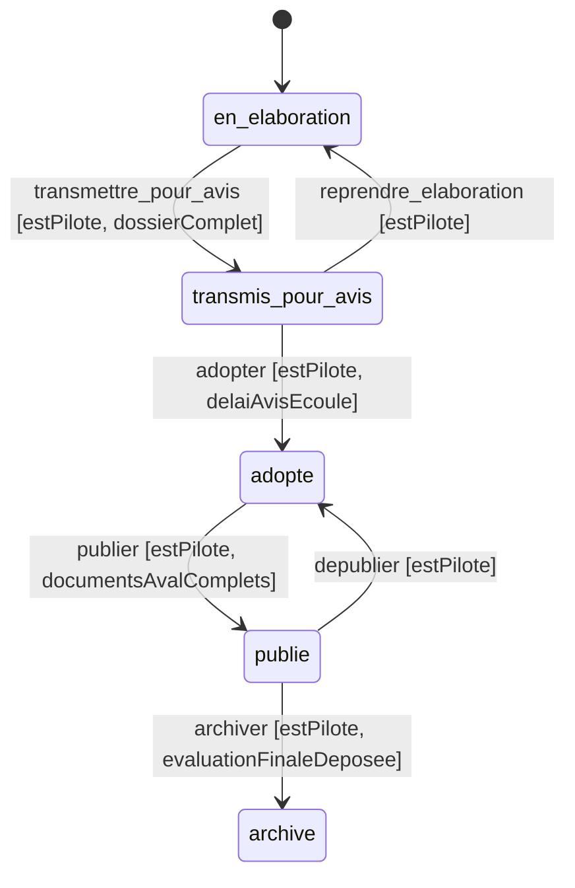

# 17. Modéliser un cycle de vie avec un workflow

Date: 2026-08-17

## Statut

Nouveau

## Contexte

Plusieurs objets métier de la plateforme ont un cycle de vie. Un dépôt PCAET
(Plan Climat-Air-Énergie Territorial) passe par exemple par les statuts « en
élaboration », « transmis pour avis », « adopté », « publié » et « archivé ». À
chaque fois, la même question se pose : _où vit la règle qui dit ce qu'on peut
faire, et qui la fait respecter ?_

Pour un cas simple, une colonne `status` en base et des `if` là où on en a
besoin suffisent. D'autres cas nous poussent à mettre en place un workflow :

1. **Les conditions ne se calculent pas au même endroit.** « Le dossier est
   complet » demande plusieurs lectures en base, « l'utilisateur est pilote »
   dépend de l'appelant, « le délai est écoulé » dépend du temps passé depuis
   une date enregistrée.

2. **Le front doit anticiper, le serveur doit trancher.** L'interface veut
   griser un bouton et dire _pourquoi_ avant le clic, alors que l'autorité doit
   rester au serveur. Sans mécanisme prévu pour ça, le front réimplémente les
   règles « juste pour l'affichage », et les deux versions finissent par
   diverger. Le jour où ça arrive, c'est le front qui ment à l'utilisateur.

3. **Les actions qu'un statut permet se multiplient.** Éditer l'en-tête, déposer
   une pièce, supprimer : autant de règles qui ne changent pas le statut mais en
   dépendent. Écrites à la main, elles se dispersent en listes de statuts
   recopiées dans le domaine, les services et les pages.

4. **Une transition traîne des effets.** Figer une date, prendre une photo des
   données, notifier. Attachés au code appelant par une cascade de
   `if (transition === …)`, ils deviennent le premier endroit qu'on oublie.

Sans cadre, on se retrouve vite avec deux sources de vérité qui se contredisent,
des messages d'erreur génériques, des régressions et un ensemble difficile à
maintenir.

## Décision

Tout cycle de vie évolué se déclare avec le moteur de workflow (`createWorkflow`,
dans `packages/domain/src/utils/workflow/`), selon quatre principes :

1. **Une table déclarative fait autorité**, dans `packages/domain`, donc
   partagée front et back. Les statuts, les transitions, ce qui reste
   modifiable et les noms des conditions y sont écrits une fois.
2. **La machine à états ne décrit que des transitions.** Ce qu'un statut
   autorise sans en sortir (éditer, déposer) n'en fait pas partie.
3. **Les guards sont évalués côté serveur uniquement.** Ils sont _nommés_ dans
   le domaine, _calculés_ dans le backend.
4. **Le front lit une évaluation, il ne la recompose pas.**

### Vocabulaire

| Terme             | Ce que c'est                                                                                               |
| ----------------- | ---------------------------------------------------------------------------------------------------------- |
| **statut**        | où en est l'objet (`en_elaboration`, `adopte`…)                                                            |
| **transition**    | action gardée qui déplace le statut (`adopter`)                                                            |
| **guard**         | condition _nommée_ dans le domaine, _évaluée_ côté serveur                                                 |
| **évaluation**    | ce que le serveur renvoie pour chaque transition : `reachable`, `enabled`, `blockedBy`                     |
| **modifiabilité** | ce qu'un statut laisse encore écrire sans en sortir (pour le PCAET, les pièces amont puis les pièces aval) |

### Le défaut est de refuser (_fail-closed_)

Un guard déclaré dont le résultat n'est pas explicitement `true` bloque
l'action. Oublier de renseigner une condition ferme une porte au lieu d'en
ouvrir une : une régression visible, pas une faille.

## Alternatives considérées

Le point de départ — une colonne `status` et des `if` dispersés — suffit tant
qu'un cycle reste trivial (cf. Contexte) ; c'est lui qu'on quitte ici. Quatre
autres pistes ont été écartées, faute de couvrir le besoin réel (un statut
courant, des transitions gardées, une évaluation que le front lit avant le
clic) sans coût disproportionné.

- **Une librairie de statecharts (XState, SCXML).** Elle apporte les états
  imbriqués, les régions parallèles et les actions d'entrée/sortie — dont nous
  n'avons pas l'usage aujourd'hui. En échange, une dépendance orientée runtime
  (interpréteurs, acteurs) là où nous voulons surtout une évaluation pure côté
  serveur et un read model côté front, et un poids ajouté à un paquet de
  domaine partagé entre les deux. À réévaluer le jour où un cycle réclamera
  vraiment ces états.
- **Une machine à états en base (enum + contraintes / triggers SQL).** Elle
  place l'intégrité au plus près des données, mais les guards demandent des
  lectures multiples et du contexte applicatif (pilote, délais) mal exprimables
  en SQL, le front ne peut pas lire d'évaluation anticipée, et la règle métier
  migre dans un endroit peu testable et peu portable.
- **L'event sourcing.** Le cycle deviendrait une suite d'événements, avec un
  audit natif. C'est surdimensionné pour le besoin — nous voulons le statut
  courant et ce qu'on peut en faire, pas rejouer un historique — et coûteux à
  poser (événements, projections).
- **Un moteur de règles générique.** Il externalise les conditions, mais au
  prix d'une indirection et de règles plus dures à typer et à tester qu'un
  simple `Record` exhaustif vérifié à la compilation (cf. _fail-closed_).

Le moteur maison — une centaine de lignes pures et typées, partagées entre
front et back — couvre le besoin actuel sans dépendance ni runtime. Le coût
assumé : le faire évoluer si un futur cycle réclame ce qu'un statechart offre
déjà.

## Mode d'emploi

Quatre étapes, du contrat de domaine à l'évaluation des règles.

### 1. Déclarer les statuts

Un enum et son schéma zod, dans `packages/domain/src/<domaine>/` :

```ts
export const DemandeStatusEnum = {
  BROUILLON: 'brouillon',
  ENVOYEE: 'envoyee',
  TRAITEE: 'traitee',
} as const;

export const demandeStatusValues = [DemandeStatusEnum.BROUILLON, DemandeStatusEnum.ENVOYEE, DemandeStatusEnum.TRAITEE] as const;

export const demandeStatusSchema = z.enum(demandeStatusValues);
export type DemandeStatus = z.infer<typeof demandeStatusSchema>;
```

### 2. Nommer les guards, sans les écrire

Une union de chaînes, documentée : c'est le contrat entre le domaine (qui les
nomme) et le backend (qui les calcule).

```ts
/**
 * - `estAuteur` : l'utilisateur a créé la demande.
 * - `pieceJointeFournie` : la pièce obligatoire est déposée.
 */
export type DemandeGuardId = 'estAuteur' | 'pieceJointeFournie';
```

### 3. Déclarer les transitions

L'ordre des guards est significatif : c'est celui dans lequel les refus sont
rapportés, donc l'ordre de priorité des messages affichés. Mettre l'acteur avant
l'état du dossier (« vous n'êtes pas l'auteur » avant « il manque une pièce »)
donne le message le plus utile.

```ts
export const demandeWorkflow = createWorkflow<DemandeStatus, DemandeTransition, DemandeGuardId>({
  initialStatus: DemandeStatusEnum.BROUILLON,
  transitions: {
    envoyer: {
      from: [DemandeStatusEnum.BROUILLON],
      to: DemandeStatusEnum.ENVOYEE,
      guards: ['estAuteur', 'pieceJointeFournie'],
    },
    // Retour en arrière : une transition ordinaire, vers l'étape précédente.
    reprendre: {
      from: [DemandeStatusEnum.ENVOYEE],
      to: DemandeStatusEnum.BROUILLON,
      guards: ['estAuteur'],
    },
  },
});
```

Un seul workflow, une seule enum de transitions, un seul évaluateur, et **un
seul chemin d'écriture du statut** : tout changement de statut passe par
`applyTransition`. C'est un chemin unique pour le _statut_, pas pour toutes les
écritures : les mises à jour ordinaires du dossier restent gardées par la
modifiabilité, et les guards, eux, n'écrivent rien — ils autorisent ou refusent
une transition. Trois mécanismes distincts, une seule table qui les déclare.

### 4. Implémenter les guards

Côté backend, chaque guard reçoit son évaluateur. Un `Record` typé sur l'union
des guards impose l'exhaustivité : déclarer un guard sans savoir le calculer ne
compile pas.

```ts
const GUARD_EVALUATORS: Record<DemandeGuardId, GuardEvaluator> = {
  estAuteur: (context, user) => context.createdBy === user.id,
  pieceJointeFournie: (context) => context.pieceJointe,
};
```

Ce `context` est chargé une fois par objet évalué, avant d'appliquer une
transition comme avant de renvoyer un DTO. Il n'est pas mutualisé entre les
objets d'une même requête : une liste de dix démarches charge dix contextes. Ce
que le workflow réduit, c'est leur contenu — `getRequiredGuards(status)` ne
retient que les guards dont dépend au moins une transition partant du statut
courant, donc seules ces lectures-là sont faites.

## Utilisation côté API (tRPC)

### Une opération par transition

Chaque transition est une route nommée, avec son dossier de feature
(`<verbe>-<entité>/`, cf. [ADR 11](0011-architecture-service-ddd.md)) :

```ts
router = this.trpc.router({
  envoyer: this.trpc.authedProcedure
    .input(demandeTransitionInputSchema) // les ids, et rien d'autre
    .mutation(async ({ input, ctx }) => this.getResultDataOrThrowError(await this.envoyerService.envoyer(input, { user: ctx.user }))),
});
```

Pourquoi pas un `applyTransition(transition)` générique : le client choisirait
alors le comportement du serveur par une chaîne, et les effets propres à chaque
transition devraient être dérivés d'une table. Une route par transition donne à
chacune son input, ses erreurs, ses effets et son test e2e.

Le socle partagé garde l'invariant, dans cet ordre : verrou (`forUpdate`),
permission générale (IDOR : sur le `collectiviteId` **stocké**), contexte des
guards, `applyTransition` du workflow, effets de l'opération, persistance et
journal, renvoi du DTO enrichi. La permission générale et les guards sont deux
choses distinctes : la première dit « cette personne peut écrire sur cette
collectivité », la seconde « cette action-ci est possible dans cet état ».

### Un code d'erreur par cause

Quand le workflow refuse, il dit quels guards ont échoué. Le service les traduit
en codes d'erreur typés, un par cause, conformément à
l'[ADR 12](0012-pattern-result.md) :

```ts
const GUARD_ERRORS = {
  estAuteur: 'NON_AUTEUR',
  pieceJointeFournie: 'PIECE_JOINTE_MANQUANTE',
} as const satisfies Record<DemandeGuardId, SpecificError>;
```

Chaque refus a ainsi son message et son code HTTP : `FORBIDDEN` pour un acteur,
`PRECONDITION_FAILED` pour un état incomplet, `CONFLICT` pour une transition
hors statut.

### Le DTO porte l'évaluation

Toute réponse qui contient l'objet contient aussi ce que l'utilisateur courant
peut en faire :

```ts
transitions: {
  [nom]: { reachable: boolean; enabled: boolean; blockedBy: GuardId[] }
}
champXModifiable: boolean
```

`reachable` et `enabled` répondent à deux questions distinctes : la transition
part-elle du statut courant (sinon elle n'a pas à être affichée du tout), et
est-elle applicable maintenant (sinon elle s'affiche désarmée, `blockedBy` disant
pourquoi). Un seul point d'enrichissement côté serveur sert tous les endpoints,
en lecture comme en écriture.

## Utilisation côté front

Grâce à ces informations dans le DTO, le front n'a plus que de la logique
d'affichage et ne prend aucune décision métier. Le flux reste celui du projet
(`useQuery` / `useMutation` → route tRPC) : une query charge le DTO — donc
l'évaluation — et **une mutation nommée par transition** appelle sa route.

```ts
// data/use-demande.ts
export const useDemande = (demandeId: number) => {
  const { collectiviteId } = useCurrentCollectivite();
  const trpc = useTRPC();

  // La query qui fournit le DTO, évaluation des transitions comprise.
  const { data: demande } = useQuery(trpc.demandes.get.queryOptions({ collectiviteId, demandeId }));

  // Une mutation par transition : on appelle l'opération, pas un aiguilleur.
  const options = useDemandeTransitionOptions();
  const { mutate: envoyer } = useMutation(trpc.demandes.envoyer.mutationOptions(options));
  const { mutate: reprendre } = useMutation(trpc.demandes.reprendre.mutationOptions(options));

  const ids = { collectiviteId, demandeId };
  return { demande, envoyer: () => envoyer(ids), reprendre: () => reprendre(ids) };
};
```

Ces options sont communes à toutes les transitions, parce que toutes renvoient
l'objet à jour : `onSuccess` écrit ce DTO dans le cache de la query — la
nouvelle évaluation comprise — et invalide les listes. Le front n'a donc jamais
à deviner ce qui devient possible après une transition, il le relit.

Le composant lit l'évaluation et branche la mutation correspondante :

```tsx
const { demande, envoyer } = useDemande(demandeId);
const evaluation = demande.transitions.envoyer;

<Tooltip label={getTransitionBlocageLabel(evaluation)}>
  <Button disabled={!evaluation.enabled} onClick={() => envoyer()}>
    {appLabels.demandeEnvoyer}
  </Button>
</Tooltip>;
```

`getTransitionBlocageLabel` ne fait que traduire le premier `blockedBy` en
libellé du catalogue. Pour un menu d'actions,
`listEnabledTransitions(demande.transitions)` donne les transitions applicables
ici et maintenant ; chacune garde _sa_ mutation, jamais une route générique
paramétrée par une chaîne.

Pour une zone en lecture seule, le serveur a déjà tranché : le front ne redérive
pas la règle du statut.

```tsx
<ContenuForm name="champX" isReadonly={!demande.champXModifiable} />
```

## Générateur de graphe

`workflowToMermaid(workflow)` rend la définition en `stateDiagram-v2` :
transitions en flèches et guards en étiquette. Le diagramme est dérivé de la
définition, il ne peut donc pas la contredire, contrairement à un schéma dessiné
à la main dans une doc.

À utiliser pour relire un cycle de vie, ses transitions et ses guards. Le dépôt
PCAET, par exemple :



## Conséquences

### Bénéfices

- Une seule table de vérité par cycle de vie, partagée front et back.
- Le compilateur interdit un guard sans évaluateur, un guard sans code d'erreur,
  une transition inconnue de l'API.
- Les messages de refus sont exacts, à l'écriture comme à la lecture.
- Un cycle de vie qu'on peut faire relire par le métier, sans schéma à maintenir
  à la main.

### Coûts

- Le moteur a une surface à connaître (transitions, guards, évaluation) : ce
  n'est plus une table de `from`/`to` triviale.
- Un objet traîne un contexte de guards, chargé avant toute écriture d'état
  comme avant tout renvoi de DTO. Un endpoint de liste le paie par élément :
  s'il devient un point chaud, c'est là qu'il faudra un chargement groupé.
- Modéliser une règle demande de choisir : transition, modifiabilité ou guard.
  C'est le prix d'une table unique. Deux questions suffisent en général : est-ce
  que la règle change le statut (transition) ? Sinon, dépend-elle de qui agit
  (guard) ou seulement du statut (modifiabilité) ?

### Implémentation de référence

Le dépôt PCAET, dans l'ordre où on le lit :

- `packages/domain/src/demarches/pcaet/workflow/` : la définition et sa façade.
- `packages/domain/src/demarches/pcaet/demarche-pcaet-modifiable.rules.ts` : ce
  qui reste modifiable.
- `apps/backend/src/demarches/pcaet/shared/demarche-pcaet-guards.service.ts` :
  les évaluateurs et le chargement du contexte.
- `apps/backend/src/demarches/pcaet/shared/demarche-pcaet-access.service.ts` :
  le préambule d'écriture sous verrou.
- `apps/backend/src/demarches/pcaet/shared/demarche-pcaet-transition.service.ts` :
  le socle des transitions (verrou, guards, journal).
- les six dossiers d'opération (`transmettre-pour-avis/`, `publier-demarche/`…) :
  les routes, leurs effets et leurs codes d'erreur.

## Références

- [ADR 11 — Architecture backend de services DDD](0011-architecture-service-ddd.md)
- [ADR 12 — Pattern Result pour la gestion d'erreurs](0012-pattern-result.md)
- [ADR 4 — tRPC](0004-trpc.md)
