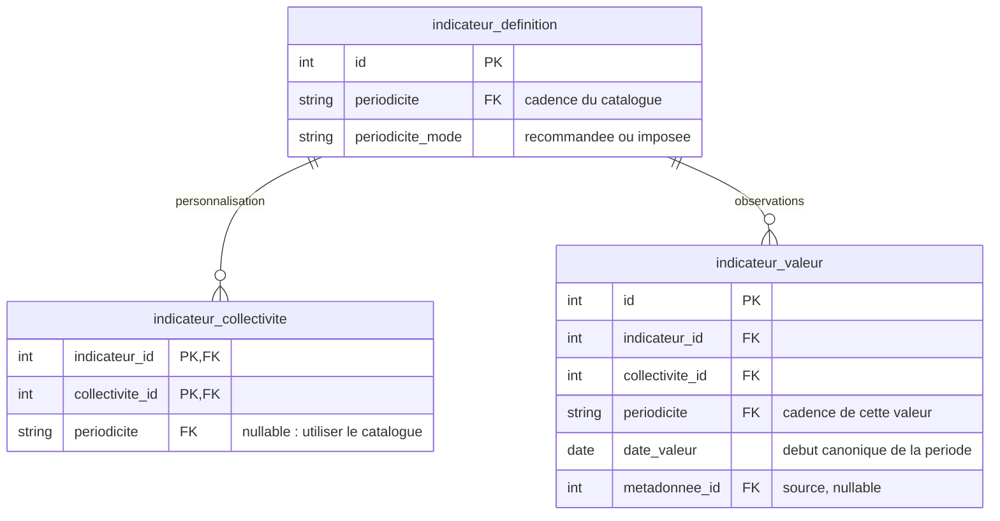
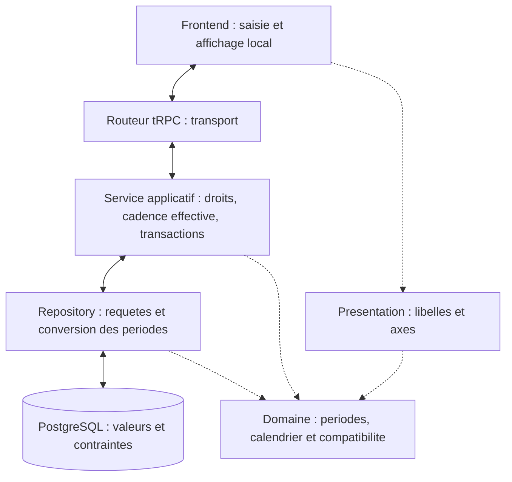

# 18. Périodicité des indicateurs

Date : 2026-09-03

## Statut

Proposé. À valider avant la revue et la fusion des PRs d’implémentation.

## Contexte

Les indicateurs sont historiquement suivis à l’année. Le programme Électrification nécessite
un suivi mensuel, sans modifier le sens des données existantes ni les parcours annuels, notamment PCAET.
Le modèle doit distinguer la cadence de saisie, l’identité d’une valeur et sa présentation.

Cette décision introduit les cadences **annuelle et mensuelle**. D’autres cadences pourront
étendre le même modèle. Une grille mensuelle générique et l’agrégation entre cadences restent hors périmètre.

## Décisions

### 1. La définition recommande ou impose la cadence de déclaration

Chaque indicateur porte une `periodicite` et un `periodicite_mode` :

- `recommandee` : chaque collectivité peut choisir sa propre cadence ;
- `imposee` : la collectivité ne peut pas personnaliser la cadence. L’API et la base font respecter cette règle.

La préférence locale appartient au couple indicateur/collectivité. Sans préférence, la cadence
du catalogue s’applique. Seule l’administration du catalogue peut modifier le mode.

**Les indicateurs existants sont classés annuels et recommandés.** Le mode recommandé est le
défaut des créations ; les anciens contrats de création conservent explicitement le défaut annuel recommandé.

Une collectivité peut suivre mensuellement un indicateur annuel recommandé, même après saisie.
Ses lectures courantes sélectionnent la cadence effective ; les autres séries restent accessibles
par demande explicite de leur cadence. Revenir à l’annuel retrouve les valeurs annuelles,
sans conversion, suppression ni effet sur les autres collectivités.

La cadence du catalogue devient immuable dès la première valeur. Le passage à `imposee` est refusé
tant qu’une préférence locale non nulle ou une valeur d’une autre cadence existe.
Les modifications de politique et les écritures concurrentes doivent respecter les mêmes invariants.

### 2. L’affichage ne change pas la déclaration ni les valeurs

La déclaration détermine les périodes saisies et les séries lues. L’affichage règle uniquement
les repères temporels du graphique :

| Déclaration | Affichage autorisé | Observations conservées                                       |
| ----------- | ------------------ | ------------------------------------------------------------- |
| Mensuelle   | Mensuel ou annuel  | Chaque point mensuel, avec sa date et son infobulle mensuelle |
| Annuelle    | Annuel             | Chaque point annuel                                           |

Douze observations mensuelles affichées par année restent **douze points**, sans somme, moyenne,
interpolation ni mois inventé. Les valeurs annuelles enregistrées ne sont pas mélangées à cette série.
Une cadence mensuelle imposée autorise aussi l’affichage annuel : le mode protège la déclaration.

Ce réglage est local à la vue et suit la déclaration par défaut. Il n’est pas une préférence
persistée de la collectivité. Cartes, téléchargements et rendus serveur appliquent la même règle ;
saisie et exports de valeurs conservent les périodes déclarées.

### 3. La cadence fait partie de l’identité de chaque valeur

Le stockage reste dans une seule table de valeurs. Schéma limité aux champs concernés :

L’unicité inclut collectivité, indicateur, cadence, début de période et identité de source.
**Janvier 2026 et l’année 2026 sont distincts**, même si leur date de début est `2026-01-01`.
La préférence locale ne réinterprète jamais les valeurs stockées ; les imports gardent leur cadence.
Les valeurs historiques sans cadence explicite sont classées annuelles, sans changer leurs résultats
ou leurs sources. La normalisation des dates est auditée, sans fusion automatique des collisions.

Le domaine manipule une période immuable et sérialisable, `IndicateurPeriod`, qui associe cadence
et date de début. Une fabrique opaque valide sa construction aux frontières ; les opérations reçoivent ensuite
cette période complète. Déduire une cadence depuis une date ou une forme de chaîne est interdit.

Le catalogue des cadences et les règles de canonisation sont cohérents entre domaine et SQL.
Une cadence publiée est immuable ; changer son sens exige un nouvel identifiant et une migration métier.
Une cadence inconnue est refusée, indépendamment par l’application et par la base.

Les calculs regroupent les valeurs par collectivité, cadence, période et source. Une formule
recommandée s’évalue séparément sur chaque série disponible ; une cible imposée ne produit que
sa cadence. Les cadences du catalogue doivent être homogènes entre formule et dépendances,
comme entre parents et enfants d’un groupe.

Aucune conversion n’est implicite : une future agrégation exigera une règle métier distincte.
Les horizons annuels de référence restent séparés des observations. PCAET, score indicatif et
publication GES sélectionnent explicitement la série annuelle, même si le suivi local est mensuel.

### 4. Calendrier, présentation et persistance ont des responsabilités séparées

Le calendrier utilise des stratégies pures et un registre exhaustif. Annuel et mensuel partagent
un algorithme fondé sur le mois, avec pas et ancrage explicites. Une extension ajoute sa politique,
sans disperser des branches annuelles/mensuelles ni introduire de fallback implicite.

La présentation partage libellés et contraintes d’axe entre frontend et serveur ; l’interface
ajoute les contrôles de saisie. Le calendrier ne dépend ni de React, ni d’ECharts, ni de SQL.
Chaque cadence doit avoir une stratégie de domaine et de présentation.

Les services portent droits, règles métier et transactions ; les repositories portent les
requêtes SQL et utilisent la transaction de l’appelant. Les entrées REST suivent la même séparation.
Les exceptions historiques restent temporaires : leur inventaire et leurs responsables sont
suivis dans le plan d’implémentation, avec migration préalable à toute extension de leurs accès.

Les valeurs d’un lot et leurs recalculs synchrones sont atomiques. Un import de catalogue valide
ensemble définitions, objectifs de référence et intentions durables de recalcul ; leur traitement
global après commit accepte une **cohérence éventuelle**. Une erreur doit rester visible et reprenable.
La réconciliation retire les résultats automatiques obsolètes, préserve le manuel et distingue
absence, `null` et zéro. Une génération de calcul ne peut pas acquitter le travail d’une autre.

## Conséquences et alternatives

Ce modèle conserve l’identité des valeurs de la saisie au calcul et à l’export. Il impose une
hydratation aux frontières, deux registres domaine/présentation et des adaptateurs annuels de compatibilité.

Une table mensuelle séparée dupliquerait les règles et les accès. Une cadence déduite des dates,
ou transportée séparément de la période, permettrait des interprétations incohérentes.
Des classes sérialisées perdraient leur comportement aux frontières JSON ; les périodes restent
des données simples. Une agrégation automatique est écartée car son sens dépend de l’indicateur.

La livraison doit préserver les anciens contrats annuels et séparer extension du schéma, migration
des consommateurs et activation du mensuel. Le retour à l’ancien modèle exige des définitions
annuelles recommandées, des valeurs annuelles et aucune préférence locale ; sinon une migration
métier explicite est nécessaire.

<!-- Anciennes ancres de deploiement : les procedures sont desormais dans la documentation de la base. -->

## Documents associés

Les étapes de déploiement et de reprise sont maintenues dans la
[documentation de la base](../../data_layer/README.md). Le plan de phase 1 porte les tâches,
les exceptions temporaires et les scénarios de validation.
