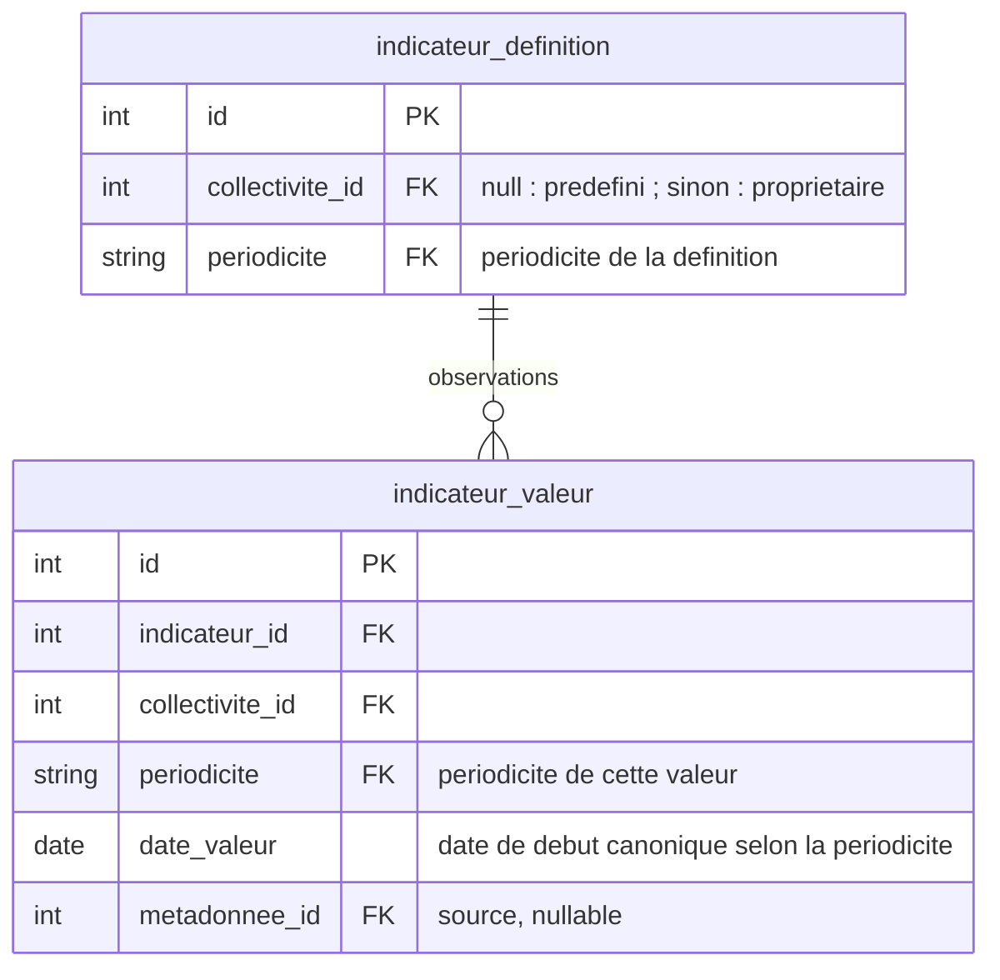
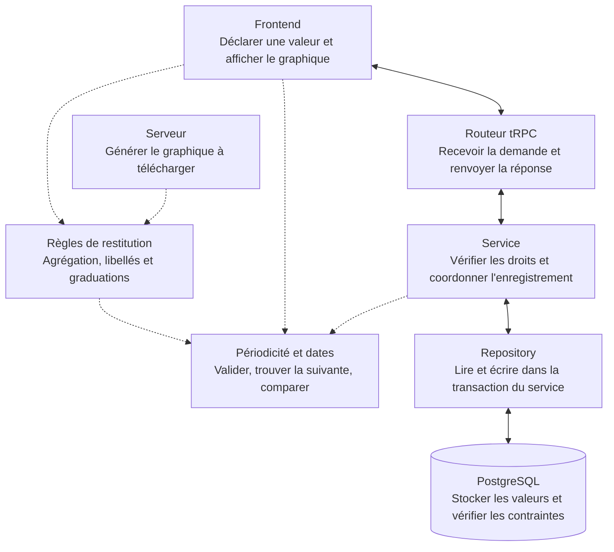

# 18. Périodicité des indicateurs

Date : 2026-09-03

## Statut

Validé.

## Contexte

Les collectivités suivent des indicateurs annuels, semestriels, trimestriels ou mensuels.
Elles doivent pouvoir consulter des valeurs regroupées sans modifier leur déclaration.

Le modèle couvre les **indicateurs prédéfinis et personnalisés** et distingue la périodicité
de déclaration, l'identité d'une valeur et sa visualisation. Un indicateur personnalisé est
une définition appartenant à une collectivité.

## Décisions

### 1. La périodicité de déclaration est fixe dès la création

Chaque définition porte une seule `periodicite` parmi **annuelle, semestrielle, trimestrielle
et mensuelle**. Elle détermine la périodicité des déclarations locales pour cet indicateur.

- Pour un **indicateur prédéfini**, la périodicité est définie à la création dans le catalogue
  et s'applique à toutes les collectivités.
- Pour un **indicateur personnalisé**, la collectivité choisit la périodicité à la création,
  y compris depuis une action. Sans choix explicite, la périodicité est annuelle.
- Après création, la périodicité n'est plus modifiable, **même sans valeur enregistrée**.
  L'API, les imports du catalogue et la base font respecter cette règle.

La définition est l'unique source de la périodicité de déclaration, sans mode ni préférence
locale par collectivité.
La grille de déclaration utilise la périodicité de la définition ; les déclarations locales
à une autre périodicité sont refusées.

### 2. La périodicité de visualisation est indépendante de la déclaration

La périodicité de déclaration détermine les valeurs à enregistrer. La périodicité de visualisation
(affichage) détermine leur restitution : à périodicité identique,
les valeurs déclarées sont affichées ; à une périodicité plus large, elles sont regroupées
et agrégées selon la règle métier de l'indicateur.

Pour une série de valeurs sources à une périodicité donnée :

| Périodicité des valeurs sources | Périodicités de visualisation prises en charge   |
| ------------------------------- | ------------------------------------------------ |
| Mensuelle                       | Mensuelle, trimestrielle, semestrielle, annuelle |
| Trimestrielle                   | Trimestrielle, semestrielle, annuelle            |
| Semestrielle                    | Semestrielle, annuelle                           |
| Annuelle                        | Annuelle                                         |

À périodicité identique, conserver chaque valeur déclarée. À une périodicité plus large,
calculer une valeur par trimestre, semestre ou année civile selon la règle de l'indicateur.

Les regroupements appliquent la règle métier d'agrégation de l'indicateur. Les indicateurs
additionnables utilisent la somme, notamment pour une visualisation mensuelle → annuelle.
La règle de calcul doit être définie pour les stocks, pourcentages, objectifs et données
incomplètes ; une règle inconnue ne devient pas automatiquement une somme.
Les valeurs absentes ne sont pas assimilées à zéro.

**Exemple :** pour un indicateur additionnable, douze déclarations mensuelles de `10` donnent
**quatre points trimestriels de `30`**, **deux points semestriels de `60`** ou **un point annuel
de `120`**. Revenir à l'affichage mensuel retrouve les **douze points de `10`**.
Le calcul ne modifie ni les valeurs sources ni leurs objectifs, commentaires, références ou sources.
Un simple changement des graduations de l'axe ne réalise pas cette agrégation.

Une valeur annuelle, semestrielle ou trimestrielle ne permet pas de reconstituer des valeurs
à une périodicité plus fine. L'affichage n'invente
ni ne répartit des observations absentes. Il ne mélange pas implicitement une série annuelle
enregistrée avec les agrégats de la série mensuelle couvrant les mêmes dates.

Un agrégat affiché n'est pas une nouvelle valeur enregistrée et n'est pas directement éditable.
La grille de déclaration édite les valeurs sources.
Les calculs enregistrés et la périodicité de déclaration restent inchangés.

Le réglage de visualisation reste local à la vue et suit la déclaration par défaut.
Il ne modifie jamais la périodicité de la définition. Les choix disponibles dépendent de
la périodicité des valeurs sources ; une source externe annuelle n'est pas transformée en mois.

La présentation des commentaires, références et sources des valeurs regroupées doit être
explicitement définie. Les données d'origine restent intactes dans tous les cas.

Le tableau de consultation, le graphique, les cartes et les rendus serveur appliquent les mêmes
règles d'agrégation. Les téléchargements de graphiques reprennent la restitution affichée ;
les exports de valeurs conservent la périodicité et les dates des valeurs enregistrées.

### 3. La périodicité fait partie de l’identité de chaque valeur

Les valeurs sont stockées dans une seule table. Schéma limité aux champs concernés :

L’unicité inclut collectivité, indicateur, périodicité, date de début et identité de source.
**Janvier, le premier trimestre, le premier semestre et l’année 2026 sont distincts**, même si
leur date de début est `2026-01-01`.
Une déclaration locale porte la périodicité fixée par la définition. Les sources externes
importées et les historiques conservent leur périodicité d'origine ; ils restent distincts
des nouvelles déclarations locales. Un changement de visualisation ne modifie aucune identité.

Le domaine utilise un objet immuable et sérialisable, `IndicateurPeriod`, qui associe explicitement
la périodicité et la date de début. Les données reçues par l’API ou lues en base sont validées
avant de construire cet objet : périodicité connue et date de début conforme à celle-ci.

| Périodicité   | Date de début canonique                | Libellé de déclaration       |
| ------------- | -------------------------------------- | ---------------------------- |
| Annuelle      | 1er janvier                            | 2026                         |
| Semestrielle  | 1er janvier ou 1er juillet             | S1 2026, S2 2026             |
| Trimestrielle | 1er janvier, avril, juillet ou octobre | T1 2026 à T4 2026            |
| Mensuelle     | Premier du mois                        | Janvier 2026 à décembre 2026 |

Les trimestres et semestres suivent l'année civile. Le trimestre suivant T4 2026 est T1 2027 ;
le semestre suivant S2 2026 est S1 2027.

Les opérations reçoivent ensuite ce couple périodicité/date ; une date seule ou une forme de chaîne
ne permet jamais de choisir la périodicité.

Le catalogue des périodicités et les règles de canonisation sont cohérents entre domaine et SQL.
Une périodicité publiée est immuable ; changer son sens exige un nouvel identifiant et une migration métier.
Une périodicité inconnue est refusée, indépendamment par l’application et par la base.

Les calculs enregistrés regroupent les valeurs par collectivité, périodicité, date de début
et source. Une formule produit des résultats à la périodicité fixée par sa définition.
Les périodicités des définitions doivent être homogènes entre formule et dépendances,
comme entre parents et enfants d'un groupe.
L'agrégation de visualisation reste un calcul à la lecture, distinct des calculs enregistrés.

Les horizons annuels de référence restent séparés des observations. PCAET, score indicatif
et publication GES sélectionnent explicitement la série annuelle et traitent son absence,
sans enregistrer une série annuelle à partir d'un agrégat de visualisation.

### 4. Les règles de périodicité et de date sont partagées

Le couple périodicité/date doit être compris de la même façon lors de la déclaration, du calcul et de l’affichage.
Pour cela, le code distingue trois responsabilités :

- **Manipuler les dates selon la périodicité (domaine)** : vérifier leur validité, trouver la suivante ou les comparer.
  Par exemple, le mois suivant décembre 2026 est janvier 2027. Ces fonctions sont partagées entre
  frontend et backend et ne dépendent ni des graphiques ni de la base de données.
- **Restituer les valeurs** : appliquer la règle d'agrégation d'affichage puis choisir les libellés
  et les graduations du graphique. Frontend et rendu serveur partagent ces règles ; le calcul
  des agrégats reste distinct de la mise en forme des dates.
- **Enregistrer les valeurs** : le service vérifie les droits et les règles métier ; le repository
  lit et écrit en base dans la transaction du service. La déclaration respecte la périodicité
  fixe de l'indicateur. Les contraintes SQL protègent aussi les données et l'immuabilité de cette périodicité.

Les quatre périodicités sont prises en charge par le catalogue, les validations API et SQL,
les choix à la création, les libellés, la navigation entre dates et les imports/exports.
Chaque périodicité applique ses propres règles de date et de visualisation.

**Exemple de déclaration.** Une collectivité déclare `42` pour mars 2026. Le frontend transmet la valeur,
l’indicateur, la collectivité, la périodicité mensuelle et la date `2026-03-01`. Le backend vérifie
les droits, la périodicité autorisée et la date, puis enregistre la valeur. Pour une déclaration par lot,
les valeurs et les résultats calculés pendant cet enregistrement sont validés ensemble : une erreur annule tout le lot.

**Exemple d'affichage agrégé.** Pour un indicateur additionnable, douze valeurs mensuelles de `10`
produisent une valeur annuelle affichée de `120`, à l'écran comme dans le graphique généré
par le serveur. Revenir au mensuel retrouve les douze valeurs de `10`, sans écriture en base.

L’import du catalogue enregistre ensemble les définitions, les objectifs de référence et les demandes
de recalcul. Les recalculs globaux s’exécutent ensuite : les résultats peuvent donc être temporairement
décalés par rapport aux définitions. Un échec reste visible et peut être repris. Le recalcul retire
les résultats automatiques obsolètes, préserve les valeurs manuelles et distingue absence, `null` et zéro.
Terminer un recalcul ne supprime pas une demande plus récente.

Le schéma montre le parcours d’une déclaration et les règles réutilisées. Les flèches pleines représentent
les échanges de données ; les pointillés indiquent l’utilisation de code partagé, sans appel réseau.

## Conséquences

La périodicité de déclaration est fixée une fois pour toutes à la création de l'indicateur.
Les valeurs conservent leur identité de la déclaration au calcul et à l'export.
Les couples périodicité/date sont validés aux frontières API et base de données.

La visualisation réutilise les règles d'agrégation entre tableau, graphique, cartes et rendu
serveur. Elle exige une règle métier explicite pour chaque regroupement et préserve les
valeurs sources. Les agrégats de consultation restent distincts des observations enregistrées.

## Documents associés

- [Cadrage Électrification](https://app.notion.com/p/accelerateur-transition-ecologique-ademe/lectrification-indicateurs-3c76523d57d78013aa2ae3785cf09f1f).
- [Plan de phase 1](https://github.com/incubateur-ademe/territoires-en-transitions/blob/85cf830f2fd89132b4c1b89df1237b8220ab9061/doc/plans/2026-08-31-001-feat-electrification-indicateurs-plan/phase-1-socle-mensuel.md) : tâches, migration et validation.
- [Documentation de la base](../../data_layer/README.md) : déploiement et reprise.
