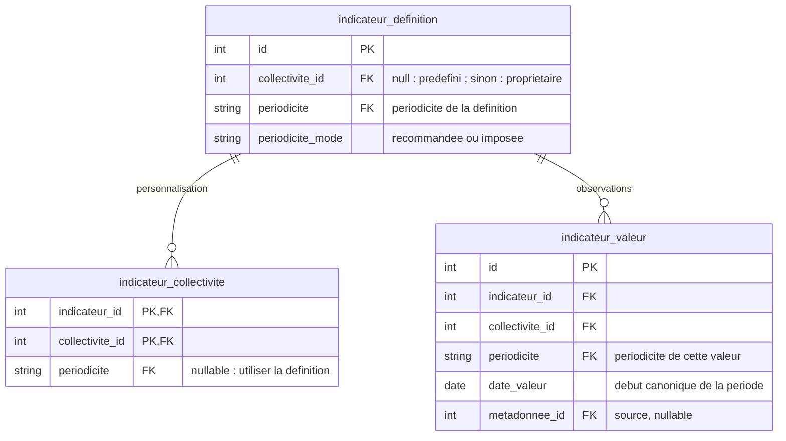

# 18. Périodicité des indicateurs

Date : 2026-09-03

## Statut

Proposé. À valider avant la revue et la fusion des PRs d’implémentation.

## Contexte

Les indicateurs sont historiquement suivis à l’année. Le programme Électrification nécessite
un suivi mensuel, sans modifier le sens des données existantes ni les parcours annuels, notamment PCAET.
Le modèle couvre les **indicateurs prédéfinis et personnalisés** et distingue la périodicité de saisie,
l’identité d’une valeur et sa présentation. Un indicateur personnalisé est une définition appartenant
à une collectivité ; personnaliser le suivi d’un indicateur prédéfini ne crée pas de nouvelle définition.

Cette décision introduit les périodicités **annuelle et mensuelle**. D’autres périodicités pourront
étendre le même modèle. Une grille mensuelle générique et l’agrégation entre périodicités restent hors périmètre.

## Décisions

### 1. La définition recommande ou impose la périodicité de déclaration

Chaque indicateur porte une `periodicite` et un `periodicite_mode` :

- `recommandee` : chaque collectivité peut choisir sa propre périodicité ;
- `imposee` : la collectivité ne peut pas personnaliser la périodicité. L’API et la base font respecter cette règle.

La préférence locale appartient au couple indicateur/collectivité. Sans préférence, la périodicité
de la définition s’applique. Pour un indicateur prédéfini, l’administration du catalogue fixe le mode ;
les commandes des collectivités ne permettent pas de le modifier.

**Tous les indicateurs existants, y compris personnalisés, sont classés annuels et recommandés.**
À la création d’un indicateur personnalisé, la collectivité choisit une périodicité disponible, annuelle
ou mensuelle, en mode recommandé. Sans choix explicite, les anciens contrats conservent le défaut
annuel recommandé. Les modifications restent soumises aux droits de sa collectivité propriétaire.
Le changement ultérieur de périodicité passe par la même préférence locale que pour un indicateur
prédéfini recommandé ; il ne modifie pas la périodicité initiale de la définition et ne permet pas
de choisir le mode imposé.

Une collectivité peut suivre mensuellement un indicateur annuel recommandé, même après saisie.
Ses lectures courantes sélectionnent la périodicité effective ; les autres séries restent accessibles
par demande explicite de leur périodicité. Revenir à l’annuel retrouve les valeurs annuelles,
sans conversion, suppression ni effet sur les autres collectivités.

La périodicité de la définition devient immuable dès la première valeur. Le passage à `imposee` est refusé
tant qu’une préférence locale non nulle ou une valeur d’une autre périodicité existe.
Les modifications de politique et les écritures concurrentes doivent respecter les mêmes invariants.

### 2. L’affichage ne change pas la déclaration ni les valeurs

Pour les indicateurs prédéfinis comme personnalisés, la périodicité de déclaration détermine
les périodes saisies et les séries lues. Le graphique conserve un **axe temporel continu** :
chaque point reste positionné à sa date. Le choix d’affichage change uniquement les graduations
et leurs libellés.

| Déclaration | Graduations du graphique autorisées | Points conservés                       |
| ----------- | ----------------------------------- | -------------------------------------- |
| Mensuelle   | Mensuelles ou annuelles             | Chaque observation à sa date mensuelle |
| Annuelle    | Annuelles                           | Chaque observation à sa date annuelle  |

Par exemple, 24 observations mensuelles de 2025–2026 restent **24 points aux mêmes dates**.
Avec des graduations annuelles, janvier, février et les autres mois restent répartis entre
les repères d’années ; le survol indique toujours le mois et sa valeur.
Ce choix allège les repères d’une série couvrant plusieurs années. Il ne calcule pas de valeur
annuelle : aucune somme, moyenne ou interpolation, et aucun mélange avec la série annuelle enregistrée.

L’utilisateur peut choisir ces graduations annuelles même si la déclaration mensuelle est imposée :
le mode imposé protège les périodes de saisie, pas les graduations du graphique.
Le réglage est local à la vue, suit la déclaration par défaut et n’est pas enregistré comme
préférence de la collectivité. Cartes, téléchargements et rendus serveur suivent la même règle ;
saisie et exports de valeurs conservent les périodes déclarées.

### 3. La périodicité fait partie de l’identité de chaque valeur

Le stockage reste dans une seule table de valeurs. Schéma limité aux champs concernés :

L’unicité inclut collectivité, indicateur, périodicité, début de période et identité de source.
**Janvier 2026 et l’année 2026 sont distincts**, même si leur date de début est `2026-01-01`.
La préférence locale ne réinterprète jamais les valeurs stockées ; les imports gardent leur périodicité.
Les valeurs historiques sans périodicité explicite sont classées annuelles, sans changer leurs résultats
ou leurs sources. La normalisation des dates est auditée, sans fusion automatique des collisions.

Le domaine utilise un objet immuable et sérialisable, `IndicateurPeriod`, qui associe explicitement
la périodicité et la date de début. Les données reçues par l’API ou lues en base sont validées
avant de construire cet objet : périodicité connue et date de début conforme à celle-ci
(premier du mois pour le mensuel, 1er janvier pour l’annuel).
Les opérations reçoivent ensuite cette période complète ; une date seule ou une forme de chaîne
ne permet jamais de choisir la périodicité.

Le catalogue des périodicités et les règles de canonisation sont cohérents entre domaine et SQL.
Une périodicité publiée est immuable ; changer son sens exige un nouvel identifiant et une migration métier.
Une périodicité inconnue est refusée, indépendamment par l’application et par la base.

Les calculs regroupent les valeurs par collectivité, périodicité, période et source. Une formule
recommandée s’évalue séparément sur chaque série disponible ; une cible imposée ne produit que
sa périodicité. Les périodicités des définitions doivent être homogènes entre formule et dépendances,
comme entre parents et enfants d’un groupe.

Aucune conversion n’est implicite : une future agrégation exigera une règle métier distincte.
Les horizons annuels de référence restent séparés des observations. PCAET, score indicatif et
publication GES sélectionnent explicitement la série annuelle, même si le suivi local est mensuel.

### 4. Les règles de période sont partagées

Le domaine définit comment valider une période, trouver la suivante et comparer deux périodes.
Ces fonctions sont indépendantes de l’interface et de la base. Les graphiques du frontend et
les rendus serveur partagent les mêmes libellés de périodes et règles de graduation.
Ajouter une périodicité exige de définir ces deux aspects, sans traitement annuel par défaut.

Les écritures suivent l’architecture existante : routeur → service → repository → base.
Le service vérifie les droits et les règles métier ; le repository exécute les requêtes dans
la transaction du service. Les accès historiques qui dérogent à cette règle sont suivis dans
le plan d’implémentation et doivent être migrés avant toute extension.

Les valeurs d’un lot et les résultats calculés avant sa validation sont enregistrés ensemble
ou tous annulés. Les recalculs globaux s’exécutent après l’enregistrement du catalogue importé :
les résultats peuvent donc être temporairement décalés par rapport aux définitions importées.
Définitions, objectifs de référence et demandes de recalcul sont enregistrés ensemble ;
un échec reste visible et peut être repris. Le recalcul retire les résultats automatiques obsolètes,
préserve les valeurs manuelles et distingue absence, `null` et zéro. Terminer un recalcul ne supprime
pas une demande plus récente. Les détails de traitement figurent dans le plan d’implémentation.

## Conséquences et alternatives

Ce modèle conserve l’identité des valeurs de la saisie au calcul et à l’export. Il nécessite une
validation des périodes reçues, des règles communes de calcul et d’affichage, et une adaptation
des anciens contrats annuels.

Une table mensuelle séparée dupliquerait les règles et les accès. Une périodicité déduite des dates,
ou transportée séparément de la période, permettrait des interprétations incohérentes.
Des classes sérialisées perdraient leur comportement aux frontières JSON ; les périodes restent
des données simples. Une agrégation automatique est écartée car son sens dépend de l’indicateur.

La livraison doit préserver les anciens contrats annuels et séparer extension du schéma, migration
des consommateurs et activation du mensuel. Le retour à l’ancien modèle exige des définitions
annuelles recommandées, des valeurs annuelles et aucune préférence locale ; sinon une migration
métier explicite est nécessaire.

<!-- Anciennes ancres de deploiement : les procedures sont desormais dans la documentation de la base. -->

## Documents associés

Les étapes de déploiement et de reprise sont maintenues dans la
[documentation de la base](../../data_layer/README.md). Le plan de phase 1 porte les tâches,
les exceptions temporaires et les scénarios de validation.
