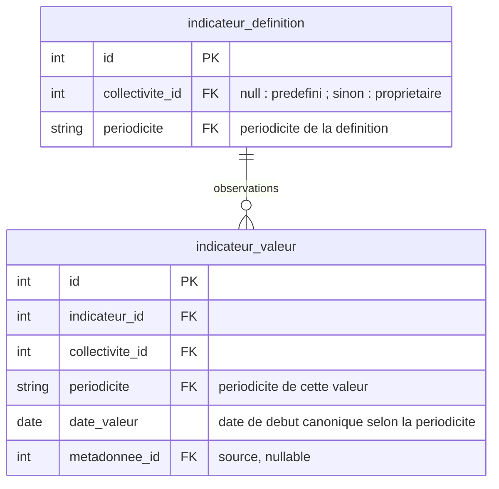
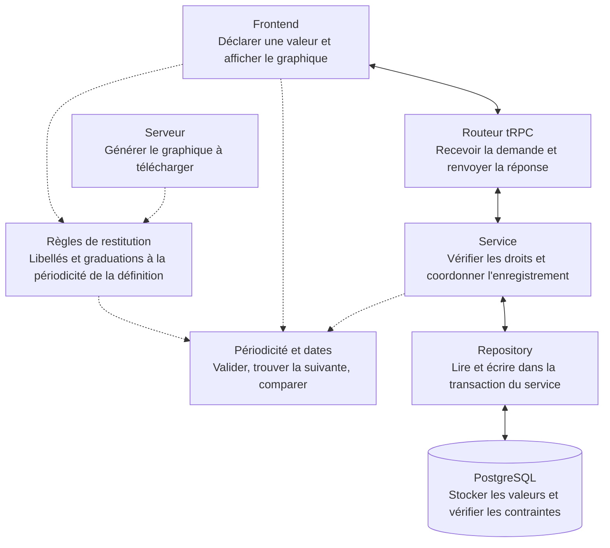

# 18. Périodicité des indicateurs

Date : 2026-09-03

Mise à jour : 2026-10-08, pour restituer la décision produit du 24 septembre 2026.

## Statut

Validé.

## Contexte

Les collectivités suivent des indicateurs annuels, semestriels, trimestriels ou mensuels.
La décision produit du 24 septembre 2026 impose une même périodicité pour la déclaration
et la visualisation, sans agrégation entre périodes.

Le modèle couvre les **indicateurs prédéfinis et personnalisés**. Il applique une périodicité
commune à la déclaration et à la visualisation, en préservant l'identité de chaque valeur.
Un indicateur personnalisé est une définition appartenant à une collectivité.

## Décisions

### 1. La périodicité est imposée et fixe dès la création

Chaque définition porte une seule `periodicite` parmi **annuelle, semestrielle, trimestrielle
et mensuelle**. Elle détermine la périodicité de déclaration et de visualisation de cet indicateur.

- Pour un **indicateur prédéfini**, la périodicité est définie à la création dans le catalogue
  et s'applique à toutes les collectivités.
- Pour un **indicateur personnalisé**, la collectivité choisit la périodicité à la création,
  y compris depuis une action. Sans choix explicite, la périodicité est annuelle.
- Après création, la périodicité n'est plus modifiable, **même sans valeur enregistrée**.
  L'API, les imports du catalogue et la base font respecter cette règle.

La définition est l'unique source de cette périodicité. Il n'existe plus de distinction entre
mode forcé et mode recommandé, ni de préférence locale par collectivité.
La grille de déclaration utilise la périodicité de la définition ; les déclarations locales
à une autre périodicité sont refusées.

### 2. La déclaration et la visualisation ont la même périodicité

La visualisation utilise la périodicité fixée dans la définition, comme la déclaration.
Il n'existe aucun sélecteur ni préférence de périodicité de visualisation indépendante,
y compris dans les vues enregistrées.

| Périodicité de l'indicateur | Déclaration   | Visualisation |
| --------------------------- | ------------- | ------------- |
| Mensuelle                   | Mensuelle     | Mensuelle     |
| Trimestrielle               | Trimestrielle | Trimestrielle |
| Semestrielle                | Semestrielle  | Semestrielle  |
| Annuelle                    | Annuelle      | Annuelle      |

Aucune agrégation entre périodes n'est réalisée pour l'affichage : ni somme, ni moyenne,
ni dernière valeur pour fabriquer une valeur à une autre périodicité. Aucune règle
d'agrégation de restitution n'est à configurer pour les résultats ou les objectifs.
Les valeurs absentes ne sont pas assimilées à zéro et aucune observation plus fine n'est inventée.

**Exemple :** douze déclarations mensuelles de `10` restent **douze points mensuels de `10`**
dans le tableau et le graphique. L'affichage ne produit ni points trimestriels de `30`,
ni semestriels de `60`, ni point annuel de `120`.
Consulter une plage couvrant une année ne change pas la périodicité des valeurs affichées.

La grille de déclaration, le tableau de consultation, le graphique, les cartes et les rendus
serveur respectent cette même périodicité. Les objectifs, commentaires, références et sources
restent attachés à leurs observations. Les téléchargements de graphiques reprennent l'affichage ;
les exports de valeurs conservent les observations enregistrées avec leur périodicité et leurs dates.

### 3. La périodicité fait partie de l’identité de chaque valeur

Les valeurs sont stockées dans une seule table. Schéma limité aux champs concernés :

```mermaid
erDiagram
    indicateur_definition ||--o{ indicateur_valeur : observations

    indicateur_definition {
        int id PK
        int collectivite_id FK "null : predefini ; sinon : proprietaire"
        string periodicite FK "periodicite de la definition"
    }
    indicateur_valeur {
        int id PK
        int indicateur_id FK
        int collectivite_id FK
        string periodicite FK "periodicite de cette valeur"
        date date_valeur "date de debut canonique selon la periodicite"
        int metadonnee_id FK "source, nullable"
    }
```

L’unicité inclut collectivité, indicateur, périodicité, date de début et identité de source.
**Janvier, le premier trimestre, le premier semestre et l’année 2026 sont distincts**, même si
leur date de début est `2026-01-01`.
Une déclaration locale porte la périodicité fixée par la définition. Les sources externes
importées et les historiques conservent leur périodicité d'origine ; ils restent distincts
des nouvelles déclarations locales. Leur reprise et leur accès relèvent d'un traitement de
migration explicite, sans conversion ni suppression implicite et sans introduire de réglage
de périodicité de visualisation.

Le domaine utilise un objet immuable et sérialisable, `IndicateurPeriod`, qui associe explicitement
la périodicité et la date de début. Les données reçues par l’API ou lues en base sont validées
avant de construire cet objet : périodicité connue et date de début conforme à celle-ci.

| Périodicité   | Date de début canonique                | Libellé de déclaration       |
| ------------- | -------------------------------------- | ---------------------------- |
| Annuelle      | 1er janvier                            | 2026                         |
| Semestrielle  | 1er janvier ou 1er juillet             | S1 2026, S2 2026             |
| Trimestrielle | 1er janvier, avril, juillet ou octobre | T1 2026 à T4 2026            |
| Mensuelle     | Premier du mois                        | Janvier 2026 à décembre 2026 |

Les trimestres et semestres suivent l'année civile. Le trimestre suivant T4 2026 est T1 2027 ;
le semestre suivant S2 2026 est S1 2027.

Les opérations reçoivent ensuite ce couple périodicité/date ; une date seule ou une forme de chaîne
ne permet jamais de choisir la périodicité.

Le catalogue des périodicités et les règles de canonisation sont cohérents entre domaine et SQL.
Une périodicité publiée est immuable ; changer son sens exige un nouvel identifiant et une migration métier.
Une périodicité inconnue est refusée, indépendamment par l’application et par la base.

Les calculs enregistrés regroupent les valeurs par collectivité, périodicité, date de début
et source. Une formule produit des résultats à la périodicité fixée par sa définition.
Les périodicités des définitions doivent être homogènes entre formule et dépendances,
comme entre parents et enfants d'un groupe.
Ces calculs métier sont conservés à la périodicité de la définition ; ils n'introduisent pas
d'agrégation entre périodes pour l'affichage.

Les horizons annuels de référence restent séparés des observations. PCAET, score indicatif
et publication GES sélectionnent explicitement la série annuelle et traitent son absence,
sans fabriquer une série annuelle à partir de valeurs d'une autre périodicité.

### 4. Les règles de périodicité et de date sont partagées

Le couple périodicité/date doit être compris de la même façon lors de la déclaration, du calcul et de l’affichage.
Pour cela, le code distingue trois responsabilités :

- **Manipuler les dates selon la périodicité (domaine)** : vérifier leur validité, trouver la suivante ou les comparer.
  Par exemple, le mois suivant décembre 2026 est janvier 2027. Ces fonctions sont partagées entre
  frontend et backend et ne dépendent ni des graphiques ni de la base de données.
- **Restituer les valeurs** : choisir les libellés et les graduations du graphique selon la
  périodicité de la définition, commune à la déclaration et à la visualisation. Frontend et
  rendu serveur partagent ces règles de présentation, sans agrégation entre périodes.
- **Enregistrer les valeurs** : le service vérifie les droits et les règles métier ; le repository
  lit et écrit en base dans la transaction du service. La déclaration respecte la périodicité
  fixe de l'indicateur. Les contraintes SQL protègent aussi les données et l'immuabilité de cette périodicité.

Les quatre périodicités sont prises en charge par le catalogue, les validations API et SQL,
les choix à la création, les libellés, la navigation entre dates et les imports/exports.
Chaque périodicité applique ses propres règles de date et de visualisation.

**Exemple de déclaration.** Une collectivité déclare `42` pour mars 2026. Le frontend transmet la valeur,
l’indicateur, la collectivité, la périodicité mensuelle et la date `2026-03-01`. Le backend vérifie
les droits, la périodicité autorisée et la date, puis enregistre la valeur. Pour une déclaration par lot,
les valeurs et les résultats calculés pendant cet enregistrement sont validés ensemble : une erreur annule tout le lot.

**Exemple d'affichage.** Pour un indicateur mensuel, la valeur `42` déclarée pour mars 2026
est affichée pour mars 2026, à l'écran comme dans le graphique généré par le serveur.
La consultation conserve la périodicité mensuelle, sans écriture en base.

L’import du catalogue enregistre ensemble les définitions, les objectifs de référence et les demandes
de recalcul. Les recalculs globaux s’exécutent ensuite : les résultats peuvent donc être temporairement
décalés par rapport aux définitions. Un échec reste visible et peut être repris. Le recalcul retire
les résultats automatiques obsolètes, préserve les valeurs manuelles et distingue absence, `null` et zéro.
Terminer un recalcul ne supprime pas une demande plus récente.

Le schéma montre le parcours d’une déclaration et les règles réutilisées. Les flèches pleines représentent
les échanges de données ; les pointillés indiquent l’utilisation de code partagé, sans appel réseau.

```mermaid
flowchart TB
    UI["Frontend<br/>Déclarer une valeur et afficher le graphique"] <--> API["Routeur tRPC<br/>Recevoir la demande et renvoyer la réponse"]
    API <--> SERVICE["Service<br/>Vérifier les droits et coordonner l'enregistrement"]
    SERVICE <--> REPO["Repository<br/>Lire et écrire dans la transaction du service"]
    REPO <--> DB[("PostgreSQL<br/>Stocker les valeurs et vérifier les contraintes")]

    UI -.-> PERIODES["Périodicité et dates<br/>Valider, trouver la suivante, comparer"]
    SERVICE -.-> PERIODES
    UI -.-> PRESENTATION["Règles de restitution<br/>Libellés et graduations à la périodicité de la définition"]
    RENDU["Serveur<br/>Générer le graphique à télécharger"] -.-> PRESENTATION
    PRESENTATION -.-> PERIODES
```

## Conséquences

La périodicité commune à la déclaration et à la visualisation est fixée une fois pour toutes
à la création de l'indicateur. La collectivité la choisit à la création d'un indicateur personnalisé.
Les valeurs conservent leur identité de la déclaration au calcul et à l'export.
Les couples périodicité/date sont validés aux frontières API et base de données.

Le tableau, le graphique, les cartes et le rendu serveur présentent les observations à cette
même périodicité, sans agrégation. Les modes forcé/recommandé, les préférences locales de
périodicité et le choix d'une périodicité de visualisation indépendante sont supprimés.

## Documents associés

- [Cadrage Électrification](https://app.notion.com/p/accelerateur-transition-ecologique-ademe/lectrification-indicateurs-3c76523d57d78013aa2ae3785cf09f1f).
- [Plan de phase 1](../plans/2026-08-31-001-feat-electrification-indicateurs-plan/phase-1-periodicites-des-indicateurs.md) : tâches, migration et validation.
- [Documentation de la base](../../data_layer/README.md) : déploiement et reprise.
