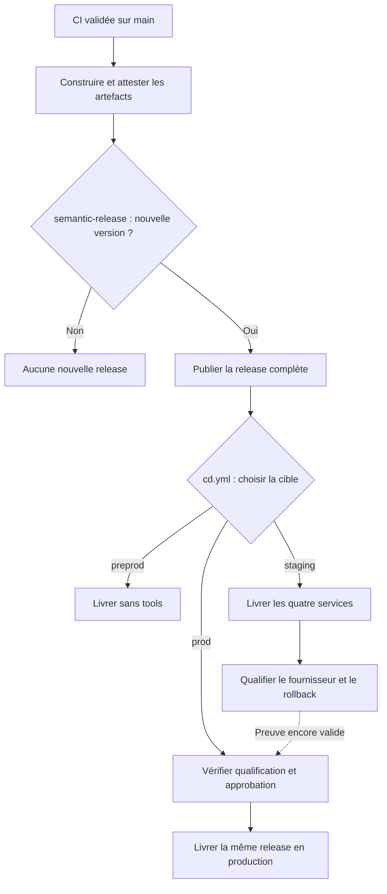
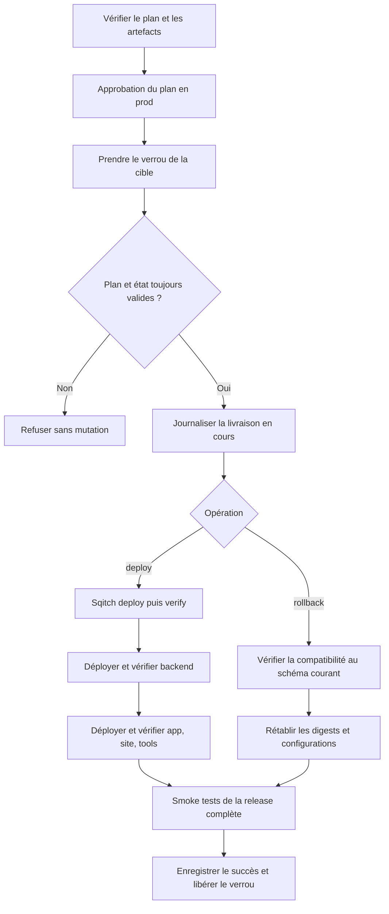
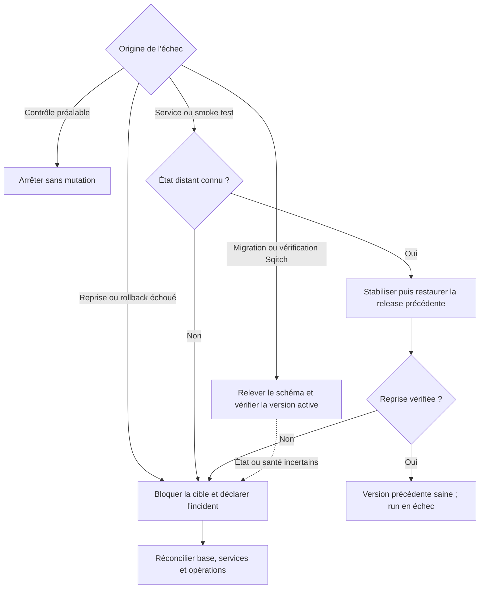

# 19. Livraison unifiée par promotion d'artefacts

Date : 2026-09-23

## Statut

Statut : Proposé

## Contexte

Les workflows `cd-app.yml`, `cd-backend.yml`, `cd-site.yml` et `cd-tools.yml` livrent les services séparément, reconstruisent les images à chaque déploiement et ne vérifient ni la CI du commit livré ni la santé de la version déployée. Ils n'exécutent pas les migrations Sqitch.

La migration de Koyeb vers Coolify hébergé sur Scaleway est prévue. La CD doit l'absorber sans réécrire la construction, les migrations ou l'orchestration.

Cette ADR complète les ADR [0010](./0010-ci.md) et [0017](./0017-optimisation-ci-par-scope-affecte-et-parallelisation-ciblee.md). GitHub Actions, GHCR et Sqitch sont conservés ; Koyeb devient un adaptateur remplaçable.

## Décision

Les sections suivantes décrivent la cible à implémenter. `cd.yml`, `ci-release-ready`, `release.json`, l'intégration de `semantic-release`, les attestations signées et les adaptateurs Koyeb/Coolify n'existent pas encore dans le dépôt.

**Une release versionnée contient les quatre images `backend`, `app`, `site`, `tools` et le paquet de migrations Sqitch. Ces artefacts sont construits une fois, puis promus par digest. Un seul workflow livre cette release sur un environnement.**

La publication d'une release et son déploiement sont deux opérations distinctes : `semantic-release` automatise le versionnement et la publication ; `cd.yml` contrôle la promotion, les migrations et la reprise.

### Schémas des processus de livraison

#### Publication et promotion

La publication est automatique après validation CI ; chaque livraison reste un déclenchement explicite de `cd.yml`. La flèche en pointillés représente une preuve requise, pas un déploiement automatique.

La release rassemble les quatre images, le paquet Sqitch et le manifeste dans GHCR, avec la version et les notes dans GitHub Releases. Preprod est indépendante du passage staging → prod. La production utilise exactement les mêmes digests que la release qualifiée ; aucun rebuild ni nouveau numéro de version.

#### Déploiement et rollback manuel

Les deux opérations utilisent le même contrôle d'accès et le même verrou. Toute erreur rejoint le traitement décrit dans le schéma suivant.

Les services sont traités successivement ; `tools` est omis en preprod. Les appels de déploiement passent par l'adaptateur Koyeb ou Coolify. Le rollback restaure les services modifiés dans l'ordre inverse des dépendances, sans exécuter l'ancien plan Sqitch. Le verrou reste détenu pendant les contrôles et toute reprise éventuelle.

#### Échecs et reprise automatique

Une reprise automatique n'est engagée que si la release précédente reste compatible avec le schéma atteint. Sinon, la cible est bloquée. Après un échec Sqitch, aucun service n'est mis à jour. Le schéma et les données ne sont pas restaurés pour compenser un échec applicatif. Une interruption du runner laissant une opération non réconciliée rejoint également le blocage, même si le verrou GitHub a été libéré.

### Workflow et environnements

`cd.yml` est le seul point d'entrée manuel de livraison.

| Input | Valeurs |
| --- | --- |
| `environment` | `staging` par défaut, `preprod`, `prod` |
| `version` | Version SemVer exacte d'une release complète publiée, par exemple `2.8.1` ; aucun alias `latest` ni branche |
| `operation` | `deploy` par défaut, `rollback` |

| Cible | Services | Condition |
| --- | --- | --- |
| preprod | backend, app, site | Release complète issue d'une CI validée |
| staging | backend, app, site, tools | Release complète issue d'une CI validée |
| prod | backend, app, site, tools | Même release qualifiée sur staging pour le fournisseur retenu + approbation |

Aucun choix de service, aucune option pour ignorer les migrations. Les anciens déclenchements manuels par service disparaissent. Actions et scripts restent réutilisables en interne. Extraire la création des aperçus, actuellement intégrée à `cd-app.yml` et `cd-backend.yml`, dans des workflows dédiés ; conserver le workflow de destruction des aperçus et ceux de maintenance.

La livraison constitue une **unité d'orchestration et de qualification**, sans atomicité distribuée : les services changent de version successivement, PostgreSQL n'est pas inclus dans une transaction avec eux et le trafic ne bascule pas simultanément. Les versions successives doivent coexister, y compris avec les anciens clients web et les messages déjà en file.

### Versionnement avec semantic-release

Une version [SemVer 2.0.0](https://semver.org/) est attribuée à l'ensemble applicatif, indépendamment des versions internes des packages. `semantic-release` s'exécute uniquement en CI sur `main`, avec `branches: ["main"]` et `tagFormat: "v${version}"`.

Les commits intégrés à `main` suivent [Conventional Commits](https://www.conventionalcommits.org/en/v1.0.0/). En cas de squash, le titre et le corps du commit final portent le type, le scope et l'éventuel `BREAKING CHANGE` ; leur conformité est vérifiée avant fusion.

| Changement | Version |
| --- | --- |
| Rupture déclarée par `!` ou `BREAKING CHANGE` | `major` |
| `feat` | `minor` |
| `fix`, `perf` | `patch` |
| Refactoring livré, image de base ou dépendance embarquée modifiée | `patch`, via des `releaseRules` explicites |
| Documentation hors produit, tests ou CI sans modification des artefacts livrés | Aucune release |

Un changement de migration, Dockerfile, contenu livré ou dépendance runtime doit porter un type/scope déclenchant une release. Une mise à jour de sécurité embarquée ne doit pas rester sans publication parce qu'elle est classée `chore`. Les règles personnalisées incluent explicitement la priorité des breaking changes.

La configuration utilise `@semantic-release/commit-analyzer` et `@semantic-release/release-notes-generator` avec le même preset `conventionalcommits`, un hook de publication OCI, puis `@semantic-release/github`. Elle ne crée ni commit de release ni publication npm. Les versions des outils et plugins sont verrouillées.

Trois identifiants restent distincts :

| Identifiant | Usage |
| --- | --- |
| SemVer, par exemple `2.8.1` | Version fonctionnelle de la release et notes de version |
| SHA Git complet | Sources exactes validées et construites |
| `run_id` + `run_attempt`, puis digests | Traçabilité des tentatives et identité du contenu produit |

Une nouvelle tentative ne constitue pas à elle seule une nouvelle version. Une version publiée ne change jamais de SHA, de manifeste ou de digests. Promotion et rollback ne créent ni version ni tag supplémentaires. Les environnements ne deviennent pas des branches ou suffixes SemVer.

Le versionnement est sérialisé dans un groupe `release-main`, sans annulation du run actif. Toute publication partielle est réconciliée avant d'en commencer une autre. L'historique Git et les tags nécessaires sont récupérés intégralement. Une seule invocation effective de `semantic-release` calcule et publie la version ; un `--dry-run` n'est pas une réservation de numéro.

Le numéro SemVer décrit les contrats publics exposés par le produit : API, formats échangés et comportements documentés. **Il ne prouve pas la compatibilité avec un schéma PostgreSQL ni la possibilité d'un rollback.**

### Construction et publication

La construction démarre après les contrôles CI réussis sur `main`. Build et attestation s'exécutent de préférence dans la continuité du même workflow, rattaché au SHA testé :

- vérifier le dépôt, le workflow autorisé, l'événement et le SHA complet ; si la publication est déclenchée par `workflow_run`, utiliser `workflow_run.head_sha`, pas le SHA du contexte du workflow de release ;
- construire exactement ce SHA, sans récupérer silencieusement le nouveau HEAD de `main` ;
- conserver les tests par scope affecté et ajouter un check agrégateur obligatoire `ci-release-ready`, exécuté même si des jobs sont exclus ; il exige le succès de tous les contrôles applicables et justifie les exclusions par le calcul des scopes ;
- un contrôle applicable absent, ignoré, annulé ou échoué bloque la release. Un commit documentaire reçoit lui aussi une décision CI explicite ;
- construire les quatre images sur des runners isolés, sans credentials de déploiement ni cache modifiable par du code non approuvé.

Les dépendances sont installées avec le lockfile figé ; les images de base sont référencées par digest et mises à jour par PR. Les images portent au minimum les annotations OCI `org.opencontainers.image.source` et `org.opencontainers.image.revision`. Les secrets de build utilisent les montages BuildKit, jamais `ARG` ou `ENV`.

Les builds peuvent s'exécuter en parallèle. Ils publient des artefacts techniques identifiés par tentative et digest, encore non promouvables. Une fois l'ensemble disponible, `semantic-release` détermine s'il existe une nouvelle release. La version peut être associée aux images existantes par des tags supplémentaires, sans les reconstruire ni modifier leurs métadonnées. La version servie est fournie au démarrage depuis le manifeste ; le SHA embarqué reste contrôlé indépendamment.

Sous le verrou de publication, un run devenu obsolète avant le lancement de `semantic-release` est abandonné au profit d'une CI validée sur le nouveau HEAD. Aucun commit non testé n'est ajouté à une release pour la faire correspondre à la branche.

Les hooks de publication consomment les digests produits : validation de l'ensemble, publication du manifeste et de ses preuves, puis publication de la GitHub Release avec son manifeste référencé par digest. **Un tag Git ou une image isolée ne rend pas une release déployable.** La CD exige une GitHub Release non brouillon et un manifeste complet dont toutes les références sont vérifiables.

Git, GHCR et GitHub Releases ne forment pas une transaction. Une publication interrompue reste non promouvable. Sa finalisation reprend explicitement les références déjà enregistrées, sans déplacer de tag ni remplacer de contenu ; relancer `semantic-release` n'est pas supposé réparer une publication partielle. Cette procédure est documentée et testée avant la bascule.

### Manifeste et chaîne de confiance

Un document `release.json`, validé par un JSON Schema versionné, est distribué comme artefact OCI dans GHCR. Le digest OCI est la référence utilisée par la CD.

| Contenu | Exigence |
| --- | --- |
| Identité | Version du format, version SemVer, dépôt, SHA Git complet |
| Construction | Identifiants et tentatives des runs CI/build/publication |
| Images | Quatre références `image@sha256:...`, avec plateforme `linux/amd64` |
| Sqitch | Référence immuable du paquet, empreinte du plan, dernier changement attendu, version de l'outillage |
| Configuration | Version du contrat de configuration runtime requis |
| Preuves | Références des attestations de provenance, SBOM et rapports de scan |

Le manifeste reste indépendant des environnements et fournisseurs. Les ressources Koyeb/Coolify, URLs et références de secrets appartiennent à une **configuration de cible versionnée séparément**, dont la révision exacte est enregistrée pour chaque livraison.

Les images, le paquet Sqitch et le manifeste possèdent une attestation signée via l'identité OIDC GitHub Actions, utilisant le format de provenance SLSA. La vérification contrôle le digest, le dépôt, le SHA source et l'identité du workflow autorisé ; vérifier uniquement la présence d'une signature est insuffisant. La provenance du manifeste distingue le SHA de son workflow de publication des sources des artefacts assemblés. Une attestation BuildKit non authentifiée ne remplace pas cette vérification.

Chaque image possède une SBOM SPDX JSON et un rapport de vulnérabilités. La politique versionnée bloque au minimum les vulnérabilités critiques avec correctif disponible, sauf exception documentée avec responsable et expiration. Un scan est réexécuté avant promotion en production sur les mêmes digests, sans rebuild.

Les tags `v*` sont protégés contre modification et suppression ; les tags GHCR servent à la découverte, jamais à identifier le contenu déployé. Les releases actives, candidates de rollback, configurations associées et preuves sont conservées tant qu'elles sont nécessaires ; les autres au moins 90 jours. Le nettoyage conserve aussi les objets OCI référencés, même non tagués.

### Hébergement remplaçable

`cd.yml` porte le plan, Sqitch, l'ordre des services, les smoke tests et la reprise. Les appels fournisseur sont isolés dans deux adaptateurs, `koyeb` puis `coolify`, avec le même contrat :

| Opération | Contrat |
| --- | --- |
| `get-state` | Lire les opérations en cours, l'identifiant du déploiement, le digest réellement actif, la révision de configuration et l'état |
| `deploy` | Appliquer un digest et une configuration ; corréler la demande à la livraison et retourner l'identifiant de l'opération |
| `wait` | Suivre cette opération avec timeout ; distinguer succès, échec et état inconnu |

Le rollback réutilise `deploy` avec les références précédentes. Les adaptateurs normalisent les réponses et erreurs ; aucune commande Koyeb/Coolify dans l'orchestration. Une demande déjà appliquée doit converger vers le même état. Une erreur réseau après un appel de mutation impose de rechercher l'opération distante avant toute nouvelle tentative.

La configuration de cible associe services logiques, ressources fournisseur, URLs, ports, contrôles de santé, délais et références de secrets. Le fournisseur n'est pas un input libre.

Inventorier la configuration runtime effective de Koyeb, y compris les paramètres absents des workflows, et la reprendre dans la configuration versionnée de cible. Pour `tools`, préserver `APP_URL`, injectée par le workflow, et vérifier la valeur effective de `AIRTABLE_CRM_DATABASE_COLLECTIVITES_TABLE_ID`, facultative et absente du workflow.

Sur Scaleway, Coolify utilise le mode [Docker Image](https://coolify.io/docs/applications/deployments/docker-image), par digest, sans build ni déploiement Git automatique. L'adaptateur traduit la référence OCI dans les champs/API de la version Coolify retenue et vérifie le digest effectif. Conserver `linux/amd64` permet de réutiliser les images actuelles.

La création des machines, réseaux, volumes et ressources Coolify relève d'un provisionnement séparé, versionné et réexécutable. Chaque serveur tirant des images privées dispose d'un accès GHCR en lecture seule, installé et renouvelé par ce provisionnement ; aucun login manuel récurrent n'est requis pour livrer.

Sqitch sera piloté par la CD depuis un runner ayant accès à PostgreSQL, sans hook propre à l'hébergeur. Les URLs PostgreSQL/Supabase, Redis et stockage restent de la configuration runtime. Leur migration est distincte du changement d'hébergement applicatif.

### Plan et exécution de deploy

Le plan immuable référence la release par digest, les changements depuis la version active, les migrations, la configuration de cible, le fournisseur et la release de retour arrière. Son empreinte lie l'approbation à cet ensemble précis.

La release de retour arrière doit être disponible et **testée avec le schéma cible**. Il s'agit de la version réellement active sur la cible, qui peut différer de la dernière release publiée. La qualification reproduit sur une base isolée la montée de schéma depuis l'état attendu et l'exécution de cette version après migration.

L'exécution suit cet ordre :

1. Vérifier le plan, les artefacts, leurs preuves, les accès et la qualification.
2. Obtenir l'approbation production pour le plan et sa reprise applicative éventuelle.
3. Prendre le verrou ; relire l'état actif, le schéma, les opérations distantes et la validité de la qualification. Refuser tout plan devenu obsolète.
4. Enregistrer la livraison " en cours ", puis exécuter et vérifier Sqitch.
5. Déployer et valider `backend`, puis `app`, `site` et `tools`, successivement ; `tools` est absent de preprod.
6. Exécuter les smoke tests entre services depuis le point d'entrée exposé aux utilisateurs.
7. Déclarer la release complète livrée uniquement après réussite de tous les contrôles.

Compléter les endpoints de version existants de `app`, `backend` et `tools` (SHA court), en ajouter un au site et implémenter les sondes liveness/readiness nécessaires. Chaque service doit atteindre sa readiness, présenter le digest attendu sur les instances actives et servir le SHA/version attendus. Un HTTP 200 sur une ancienne instance ou un cache n'est pas une preuve suffisante. Les contrôles distinguent liveness et readiness, utilisent des délais bornés et exigent une fenêtre de stabilité configurée par service.

Pendant les déploiements, les rollbacks et la bascule d'hébergeur, une seule instance `tools` par cible traite les webhooks Crisp : la déduplication actuelle est locale au processus. Le routage et le drainage empêchent le chevauchement des traitements entre anciennes et nouvelles instances.

Les smoke tests couvrent au minimum le chargement des frontends, l'appel authentifié au backend, un accès base représentatif et les traitements asynchrones livrés. Ils utilisent des données dédiées, des opérations réexécutables et un nettoyage explicite. Les logs et métriques identifient la release et le déploiement pour diagnostiquer une dégradation après livraison.

### Migrations Sqitch

**Sqitch fait partie du déploiement du backend, dans le même job protégé et sous le même verrou.**

- Le paquet immuable provient du même SHA que l'image backend : configuration sans secrets, plan, scripts deploy/verify/revert et dépendances.
- Contrôler l'identité de la base, l'état du registre Sqitch et la correspondance avec l'état initial du plan. Utiliser un rôle de migration distinct du rôle applicatif.
- Avant une migration prod, vérifier un point de récupération conforme à l'ADR [0016](./0016-strategie-backup-database.md), avec une sauvegarde de moins de 24 h ; sa simple existence ne remplace pas les tests de restauration prévus par cette ADR. Hors prod, prévoir un point de récupération adapté.
- Exécuter `sqitch deploy --mode change --verify` jusqu'à la fin du plan embarqué, puis **`sqitch verify` explicitement**, y compris sans nouveau SQL.
- Ne lancer aucune migration dans les builds, au démarrage des instances ou dans les étapes app/site/tools.

`deploy --verify` ne vérifie que les changements qu'il applique. `sqitch verify` contrôle aussi les changements déjà présents ; ses scripts doivent donc rester valides sur le schéma courant, sans dépendre de données de test. La CI exige un script de vérification effectif pour chaque nouveau changement : Sqitch ne considère pas son absence comme une erreur.

Avec `--mode change`, les changements réussis restent appliqués. Sqitch suppose chaque changement atomique : un script deploy échoué n'est pas automatiquement compensé ; un verify échoué entraîne le revert du changement concerné. Un échec du `sqitch verify` final ne déclenche pas de revert global.

Les scripts PostgreSQL utilisent des transactions lorsque les opérations le permettent et arrêtent l'exécution à la première erreur. Les opérations non transactionnelles, notamment `CREATE INDEX CONCURRENTLY`, exigent une détection d'état partiel et une procédure de reprise explicite. Définir des `lock_timeout` et `statement_timeout` adaptés aux migrations ; le verrou consultatif Sqitch ne protège pas contre les autres écritures applicatives.

Les migrations suivent **expand/contract** : ajout compatible, transition applicative, backfill éventuel, puis suppression différée. Les backfills volumineux sont découpés, réexécutables et suivis séparément des DDL bloquants. Une étape contract n'est autorisée qu'après retrait des anciennes versions dépendantes, y compris des candidates de rollback. Les compatibilités API, messages, jobs et schéma sont testées, pas déduites de SemVer.

### Échecs et rollback

| Échec | Comportement |
| --- | --- |
| Contrôle préalable | Aucune mutation |
| Migration ou vérification Sqitch | Aucun service mis à jour ; enregistrer le schéma atteint et vérifier la version restée active |
| Déploiement ou smoke test, état distant connu | Arrêter la suite, stabiliser les opérations en cours, puis rétablir automatiquement la release applicative précédente compatible |
| Reprise impossible, échouée ou état distant inconnu | Déclarer l'incident et bloquer la cible jusqu'à réconciliation |

La reprise restaure les digests et configurations précédents des services ayant changé, dans l'ordre inverse des dépendances, puis vérifie l'ensemble. Elle utilise le même verrou et l'autorisation accordée au plan initial. **Le run reste en échec même si la reprise réussit.**

Le schéma, les écritures et les effets externes ne sont pas annulés. Aucun restore ni `sqitch revert` n'est lancé pour compenser un échec applicatif. Les messages déjà émis doivent rester consommables par la version de retour arrière ; les traitements sensibles doivent tolérer les répétitions.

`operation=rollback` cible une release complète précédemment saine sur l'environnement. Il conserve l'approbation production et les contrôles de provenance, de disponibilité et de configuration. Sa compatibilité explicite avec le schéma courant remplace l'exécution de l'ancien plan Sqitch ; une ancienne preuve de santé seule ne suffit pas si le schéma a changé.

Les références de secrets sont vérifiées, sans restaurer automatiquement d'anciens credentials. Si aucune release compatible n'est disponible, la cible reste bloquée pour une correction ou une procédure d'incident ; aucun rollback forcé n'est proposé.

### Verrou et état de livraison

Le job de mutation utilise le groupe `database-maintenance-<cible>`, partagé avec sauvegardes et restaurations, avec `cancel-in-progress: false` et `queue: max`. Le verrou couvre Sqitch, tous les services, les contrôles et la reprise. Il reste identique pendant la coexistence Koyeb/Coolify. Si plusieurs cibles partagent une base, elles partagent aussi la même clé de verrou.

La concurrence GitHub Actions est limitée au dépôt : toutes les mutations concernées passent par celui-ci. `queue: max` limite la file à 100 attentes et n'assure pas l'ordre des déclenchements ; sous verrou, revalider systématiquement le plan et refuser une régression hors `rollback`. Redéployer la release déjà active ne relance pas les services si leurs digests et configurations correspondent, mais exécute les vérifications.

GitHub Deployments porte l'état global et référence un journal persistant : plan, fournisseur, révision de cible, opérations et états par service, schéma avant/après, preuves et éventuelle reprise. La création du Deployment utilise le SHA exact de la release et `auto_merge: false`. Le résumé du run n'est pas l'unique registre de livraison.

L'intention est enregistrée avant chaque mutation, puis complétée avec l'identifiant de l'opération distante. Les checkpoints et résultats sont conservés hors du runner avec les preuves dans GHCR. Distinguer la dernière release réussie de l'état actuellement observé, qui peut être partiel.

Un timeout ou l'arrêt du runner ne termine pas nécessairement l'opération distante. Un état " en cours " non réconcilié bloque les livraisons et maintenances mutantes suivantes, même après libération du verrou. La procédure de réconciliation reprend les identifiants connus, inspecte la base et les services, puis clôt explicitement la livraison ; elle ne remet pas l'état à zéro sur la seule base de son ancienneté.

### Accès et maintenance

- Exécuter `cd.yml` depuis `main` protégée ; enregistrer aussi le SHA de l'orchestrateur. Restreindre l'environnement `prod` à cette branche, exiger un reviewer distinct du déclencheur et désactiver le bypass.
- Protéger les workflows, scripts de livraison, adaptateurs et règles de release par revue obligatoire avec `CODEOWNERS`.
- Limiter les permissions par job : build/publication sans accès à la cible ; CD avec lecture des artefacts, écriture des Deployments et du journal dédié, et credentials de sa seule cible. Séparer les droits d'écriture du journal de ceux des packages applicatifs. Utiliser des identités temporaires lorsqu'elles sont supportées ; isoler les secrets persistants restants.
- Épingler les actions tierces par SHA complet, les CLI par version et intégrité ; valider les inputs et passer les arguments shell sans interpolation de contenu non fiable. Ne pas exécuter de code de PR avec les secrets du build de confiance ou de production.
- Séparer les runners de build des runners de déploiement ayant accès au réseau privé PostgreSQL. Utiliser TLS avec validation du serveur et des accès réseau limités.
- Déplacer backups/restores, actuellement rattachés à `prod`, vers des environnements de maintenance dédiés avant d'activer l'approbation. Les backups planifiés ne doivent pas attendre une approbation de livraison ; les restores destructifs conservent leur propre contrôle d'accès.

L'ADR [0016](./0016-strategie-backup-database.md) reste la référence. Les restores `--data-only` conservent le schéma : vérifier la compatibilité avant de tronquer, suspendre les traitements, restaurer, puis rejouer les smoke tests avant réouverture. Les transformations de données nécessaires après restore sont réexécutables ; le registre Sqitch ne les rejoue pas automatiquement.

La qualification staging est une preuve liée au digest du manifeste, au schéma vérifié, à la révision de configuration, au fournisseur et aux résultats des tests, dont ceux de la release de rollback. Un restore ou une modification de cet état l'invalide. La production exige une preuve encore valide au démarrage effectif. Les différences nécessaires entre configurations staging et prod sont explicites et contrôlées dans le plan ; leurs valeurs ne sont pas supposées identiques.

### Site, panier et aperçus

**Site.** La promotion exige une configuration runtime pour toutes les valeurs propres à un environnement. Les variables `NEXT_PUBLIC_*` sont intégrées au bundle lors du build : les changer au démarrage ne suffit pas. Les valeurs publiques variables passent par une configuration servie à l'exécution ; les secrets restent côté serveur. Aucun accès à des données ou secrets propres à staging/prod pendant la préconstruction. Pour le rendu statique et l'ISR, prévoir la génération dans la cible et l'isolation/invalidation des caches, y compris entre versions.

Vérifier les usages de `STRAPI_KEY`, actuellement transmis en `NEXT_PUBLIC_STRAPI_KEY` ; si ce credential est privé, le retirer du bundle et le remplacer après exposition. Appliquer le même contrôle aux autres frontends. Les seuls secrets encore nécessaires au build passent par BuildKit.

**Panier.** L'application a été retirée du dépôt et reste exclue du manifeste. Le domaine backend `plans/paniers`, les schémas partagés et les tables subsistent ; leur retrait est hors du périmètre de cette ADR. Conserver Actions à Impact, la provenance des fiches et `get_panier_data_from_directus`. Aucun drop de table dans cette refonte. Si des ressources subsistent chez l'hébergeur, confirmer le retrait en production avant leur arrêt, puis respecter la fenêtre de rollback avant suppression.

**Aperçus.** Artefacts non promouvables, credentials et données hors production. Aucun code non approuvé avec secrets. Les migrations propres à une branche exigent une base isolée ; sur une base partagée, seul le plan déjà appliqué est autorisé. Création et suppression partagent un verrou ; prévoir une durée de vie et un nettoyage des ressources orphelines.

## Migration vers Scaleway/Coolify

Valider sur staging les mêmes digests via les deux adaptateurs : version réellement servie, santé, reprise après échec, interruption, accès GHCR et accès Sqitch à la base. **Le passage à Coolify doit fonctionner sans modifier les Dockerfiles, le format du manifeste ni l'orchestration.**

Avant l'amorçage, implémenter et tester la désactivation et le drainage des consommateurs BullMQ de `backend` et `tools`. `ENABLE_CRON_JOBS` ne contrôle aujourd'hui que la programmation des cron de `tools`, pas ses consommateurs.

Amorcer Coolify via `cd.yml` avec la release courante de Koyeb, hors trafic et avec workers/cron désactivés. Pour ce premier déploiement sans historique local, la reprise laisse Koyeb actif et la nouvelle cible inactive. Le plan identifie explicitement ce cas ; après validation, enregistrer la release comme référence de rollback sur Coolify.

Avant la bascule production, vérifier réseau, secrets, volumes, domaines/TLS et capacité. Préparer le routage inverse et conserver Koyeb pendant la fenêtre de retour arrière. Suspendre et drainer les anciens workers/cron avant d'activer les nouveaux pour éviter les doubles traitements.

Une qualification Koyeb ne vaut pas pour Coolify. Le rollback applicatif reste sur le fournisseur actif ; revenir à Koyeb relève du plan de bascule, avec vérification du schéma et des données. Aucun changement de registre ou déplacement de base n'est requis par cette ADR.

## Mise en œuvre et critères de validation

1. Définir le contrat des adaptateurs et les configurations de cible ; extraire les appels Koyeb, enregistrer l'état initial et séparer les environnements de maintenance.
2. Définir la version initiale et la continuité des tags existants ; configurer Conventional Commits, les règles semantic-release et le check `ci-release-ready`.
3. Adapter la configuration runtime du site et conserver celle déjà en place dans l'app ; produire les images, le paquet Sqitch, le manifeste, les attestations et les SBOM. Vérifier qu'un même digest fonctionne dans deux environnements.
4. Implémenter `cd.yml` et l'adaptateur Coolify sur la version retenue ; valider staging avec les quatre services et preprod sans tools.
5. Tester les scénarios bloquants : publication partielle, deux publications concurrentes, artefact/provenance invalide, plan obsolète après approbation, base déjà à jour, échec de migration/vérification, service défaillant, reprise réussie/échouée, perte du runner et concurrence avec restore.
6. Tester la version réellement active en production sur le schéma cible et la reprise après livraison ; valider le provisionnement des accès GHCR sans intervention manuelle.
7. Activer la production et retirer simultanément les anciens déclenchements par service. Documenter dans `.github/README.md` la livraison, la finalisation d'une release partielle, la réconciliation et la bascule d'hébergeur.

## Conséquences

Une release applicative est livrée et restaurée comme un ensemble. Un échec du site ou de tools fait échouer toute la livraison. Le build complet, les preuves et les contrôles augmentent le coût ; le verrou par environnement réduit le parallélisme des mutations.

Les versions sont calculées automatiquement ; la décision de promouvoir reste explicite. Une publication incomplète ou une opération distante non réconciliée bloque la suite au lieu de produire un état présumé sain.

Les workflows manuels par service, les rebuilds par environnement et les migrations au démarrage sont écartés. L'adaptateur ajoute un contrat à tester, mais limite la migration d'hébergeur à son implémentation et à la configuration des cibles. Aucun framework de déploiement générique n'est introduit.

## Références techniques

- [semantic-release : configuration](https://semantic-release.org/usage/configuration/), [cycle de release](https://semantic-release.org/foundation/release-steps/) et [règles de commit-analyzer](https://github.com/semantic-release/commit-analyzer).
- [SemVer 2.0.0](https://semver.org/) et [Conventional Commits 1.0.0](https://www.conventionalcommits.org/en/v1.0.0/).
- [GitHub Actions : concurrence et file d'attente](https://docs.github.com/en/actions/how-tos/write-workflows/choose-when-workflows-run/control-workflow-concurrency).
- [GitHub : attestations d'artefacts](https://docs.github.com/en/actions/how-tos/secure-your-work/use-artifact-attestations/use-artifact-attestations) et [vérification avec `gh attestation verify`](https://cli.github.com/manual/gh_attestation_verify).
- [OCI : annotations d'images](https://github.com/opencontainers/image-spec/blob/main/annotations.md) et [Docker : attestations SBOM](https://docs.docker.com/build/metadata/attestations/sbom/).
- [Sqitch : deploy](https://sqitch.org/docs/manual/sqitch-deploy/) et [verify](https://sqitch.org/docs/manual/sqitch-verify/).
- [PostgreSQL : délais de session et de verrouillage](https://www.postgresql.org/docs/current/runtime-config-client.html).
- [Coolify : Docker Image](https://coolify.io/docs/applications/deployments/docker-image).
- [Next.js : variables d'environnement](https://nextjs.org/docs/app/guides/environment-variables) et [auto-hébergement](https://nextjs.org/docs/app/guides/self-hosting).
- [GitHub Deployments : création et `auto_merge`](https://docs.github.com/en/rest/deployments/deployments#create-a-deployment).
