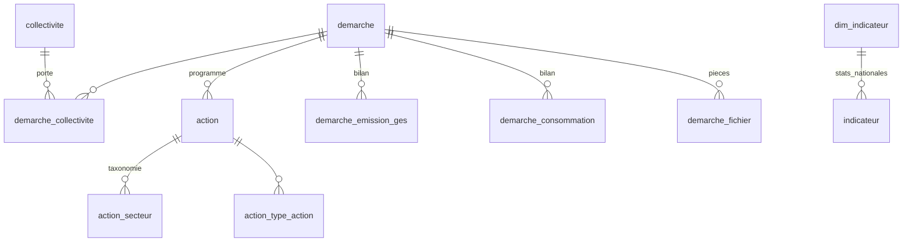
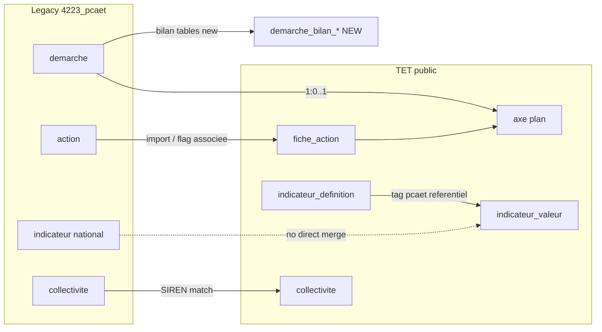
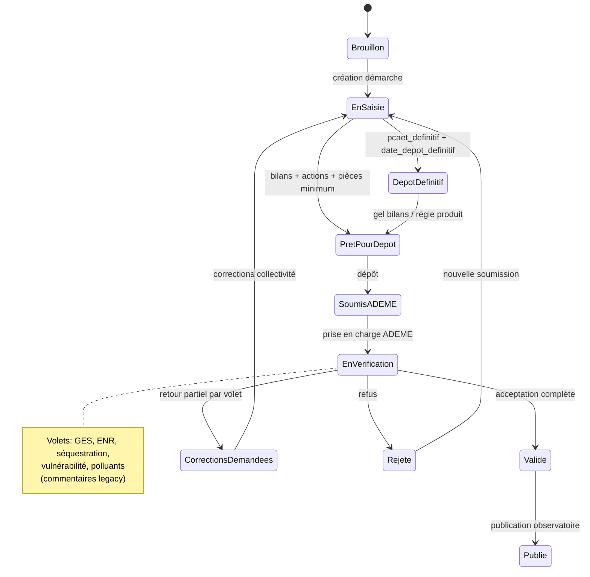

# feat: Migrer le workflow de dépôt PCAET Territoires en Climat vers Territoires en Transitions

## Summary

Ce plan cadre la migration du **workflow de dépôt et de suivi PCAET** aujourd’hui hébergé sur [Territoires en Climat (ressource 605-223)](https://www.territoires-climat.ademe.fr/ressource/605-223) vers la plateforme **Territoires en Transitions (TET)**. L’objectif produit n’est pas une copie technique de la base MySQL legacy, mais un **parcours équivalent** pour les collectivités : constituer un PCAET, renseigner les bilans réglementaires, déposer des actions, joindre des pièces, et suivre le statut ADEME — en **réutilisant au maximum** les objets TET existants (`collectivite`, `axe`/plan, `fiche_action`, `indicateur_*`) et en **créant uniquement** les entités qui n’ont pas d’équivalent (notamment la **démarche PCAET** et les **inventaires bilan**).

---

## Problem Frame

Les collectivités déposent aujourd’hui leur PCAET sur l’observatoire ADEME **Territoires en Climat**, avec un modèle centré sur la **démarche** (document réglementaire + bilans GES/ENR/séquestration/vulnérabilité/polluants) et des **actions publiées** dans l’observatoire. TET offre déjà un pilotage opérationnel riche (plans hiérarchiques, fiches action, indicateurs de suivi, référentiels CAE/ECI), mais **aucun workflow de dépôt PCAET** ni entité `demarche`. Une base Postgres migrée existe en staging (`schema 4223_pcaet` sur le projet Supabase PCAET, issue de `pcaet.load` / dump `4223_pcaet.sql.gz`) : elle sert de **référentiel d’analyse**, pas de schéma cible.

---

## Requirements

- R1. Documenter la structure legacy PCAET et la comparer aux objets TET (plans, fiches, indicateurs, collectivités).
- R2. Proposer une **cartographie explicite** : objets à **créer**, **étendre**, ou **réutiliser** tels quels.
- R3. Décrire le workflow cible de dépôt PCAET dans TET (étapes, rôles, statuts) aligné sur l’existant Territoires en Climat.
- R4. Définir une stratégie de **rapprochement collectivité** (SIREN / communes) et de **migration de données** idempotente.
- R5. Respecter les conventions TET : Sqitch + Drizzle, modules Nest/tRPC, `Result`, permissions collectivité-scopées (`doc/adr/0011`, `0012`, `comply-adr`).
- R6. Ne pas confondre les **indicateurs observatoire** (agrégats nationaux) avec le **suivi indicateur** TET par collectivité.

**Origin actors (inférés)** : collectivité (porteur), agent ADEME / vérificateur, utilisateur TET interne, lecteur public (publication).

**Origin flows (inférés)** : F1 création démarche PCAET, F2 saisie bilans, F3 saisie/import actions, F4 dépôt pièces, F5 circuit validation ADEME, F6 publication observatoire.

---

## Scope Boundaries

- Pas de reprise du **CMS** PCAET (`article`, `ressource`, `media__*`) dans TET.
- Pas de migration des **comptes utilisateurs** legacy (`utilisateur`, `profil`, `droit`) — auth reste Supabase TET.
- Pas de remplacement du **référentiel CAE/ECI** par le contenu PCAET ; les liens référentiel ↔ dépôt restent distincts.
- Pas d’import automatique des **indicateurs nationaux** (`4223_pcaet.indicateur`) dans `indicateur_valeur` sans modèle de source dédié.
- Climat’pratic, alertes, et tables temporaires de ref : hors périmètre v1.

### Deferred to Follow-Up Work

- Synchronisation bidirectionnelle temps réel avec territoires-climat.ademe.fr (si l’observatoire reste en parallèle).
- Portail public “observatoire” dans TET (équivalent pages publiées `publie=true`).
- Fusion complète des ~47k `collectivite` legacy avec le référentiel TET (hors collectivités actives TET).

---

## Analyse du schéma PCAET (`4223_pcaet`)

Source : projet Supabase PCAET (`user-supabase-pcaet`), schéma **`4223_pcaet`** (migration MySQL via `pcaet.load`). Le schéma `public` TET n’est pas concerné.

### Volumétrie indicative

| Table | ~Lignes | Rôle |
|-------|---------|------|
| `collectivite` | 47 595 | Entités territoriales (SIREN, `pcaet_obligation`, contact) |
| `demarche` | 1 779 | Plans climat déclarés (PCAET et autres) |
| `action` | 32 843 | Actions observatoire |
| `demarche_emission_ges` | 31 275 | Bilan GES par secteur/période |
| `demarche_consommation` | 30 964 | Bilan consommations |
| `indicateur` | 1 281 | **KPIs agrégés** région/département (dashboard) |
| `dim_indicateur` | 8 | Catalogue de ces KPIs |

### Modèle conceptuel legacy



### Entité centrale : `demarche`

Champs représentatifs : `nom`, `date_lancement`, `population_couverte`, `demarche_etat_code`, `elu_referent`, `publie`, `verifie_ademe`, dates DREAL/CR, commentaires par volet (GES, séquestration, ENR, vulnérabilité, polluants), `pcaet_definitif`, `version`, `date_depot_definitif`, `type_depot`.

**Tables satellites démarche** (inventaires réglementaires, pas des fiches) :

| Groupe | Tables |
|--------|--------|
| GES / énergie | `demarche_emission_ges`, `demarche_consommation`, `demarche_enr`, `demarche_enr_prod_et_conso`, `demarche_enr_reseaux` |
| Séquestration | `demarche_sequestration_estimation`, `_potentiel`, `_production`, `_renforcement` |
| Autres | `demarche_polluants`, `demarche_polluant_total`, `demarche_domaine_vulnerabilite`, `demarche_fichier`, `demarche_historique`, `demarche_version`, `demarche_type_demarche`, `demarche_utilisateur` |

### Entité : `action` (≠ `fiche_action` TET)

| PCAET | TET `fiche_action` |
|-------|-------------------|
| `intitule_action`, `description_action` | `titre`, `description`, `objectifs` |
| `demarche_id` | Liens via `fiche_action_axe` → `axe` |
| `publie`, `affichage_accueil` | `statut`, `restreint`, `deleted` |
| `fiche_action_associee` (~10 168 / 32 843) | Lien déclaratif vers TET **sans FK** dans le dump |
| Junctions secteur, volet, cible, type_action, porteur | Tags, thématiques, `cibles[]`, pilotes, budgets, étapes |

Statistiques utiles : ~32 493 actions liées à une démarche ; ~1 710 publiées ; ~10 168 avec `fiche_action_associee=true`.

### Entité : `indicateur` (observatoire)

- **`dim_indicateur`** : 8 codes (`act_territ`, `dem_territ`, `pop_dem`, `act_typ_dem`, `act_type_porteur`, `epci`, `contrib_inscrits`, `sup_dem`).
- **`indicateur`** : faits par `region_id` / `departement_id`, jamais par collectivité ni démarche.
- **≠** `indicateur_definition` + `indicateur_valeur` TET (suivi par collectivité, référentiel CAE, trajectoires SNBC).

Dans TET, le tag programme **`pcaet`** existe déjà sur des définitions CAE (`indicateur_programme`, ex. `cae_2.l_pcaet`) — c’est le **référentiel climat**, pas le dépôt observatoire.

### Référentiels et hors périmètre produit

~30 tables `ref_*` (secteurs, volets, types d’action, communes, etc.), CMS (`article`, `ressource`), auth legacy (`utilisateur`, `role`, `profil`). **Pas de contraintes FK** recréées après pgloader.

---

## Cartographie objets : créer / étendre / réutiliser

### Décision synthétique

| Besoin métier PCAET | Recommandation TET | Verdict |
|---------------------|-------------------|---------|
| Collectivité porteuse | `collectivite` | **Réutiliser** (+ matching SIREN) |
| Plan climat déclaré (PCAET) | Nouvelle entité **`demarche_pcaet`** (ou `demarche` générique) | **Créer** |
| Programme d’actions hiérarchique | `axe` (racine = plan) + `fiche_action_axe` | **Réutiliser** |
| Action opérationnelle | `fiche_action` | **Réutiliser** (import depuis `action`) |
| Bilans GES, conso, ENR, séquestration, polluants, vulnérabilité | Tables dédiées **`demarche_*_bilan`** ou module `pcaet/bilan` | **Créer** |
| Pièces jointes dépôt | Stockage TET + table liens (pattern preuves / fichiers) | **Créer** (liens) + infra existante |
| Statuts ADEME, dates DREAL/CR | Champs sur `demarche_pcaet` + historique | **Créer** |
| Stats nationales observatoire | Hors TET ou entrepôt analytics séparé | **Ne pas fusionner** dans `indicateur_valeur` |
| Suivi GES opérationnel (SNBC) | `indicateur_definition` tag `pcaet` + `indicateur_valeur` + trajectoires | **Réutiliser** (lien conceptuel, pas import direct) |
| Taxonomies action (secteur, volet, type) | Mapping vers `thematique` / tags / enums | **Étendre** (tables de correspondance) |
| Type de plan « PCAET » | `plan_action_type` | **Étendre** (nouvelle ligne seed) |
| Lien démarche ↔ plan pilotable | `axe` lié à `demarche_pcaet_id` (nullable FK) | **Étendre** `axe` |

### Pourquoi une entité `demarche` dédiée (et pas seulement `axe`)

- Une **`axe` TET** est un plan **pilotable** (hiérarchie, fiches, droits édition collectivité) ; une **`demarche` PCAET** est un **dossier réglementaire** (bilans structurés, circuit ADEME, version définitive, publication observatoire).
- Les tables `demarche_emission_ges` etc. n’ont **aucun équivalent** dans le modèle plan/fiche actuel.
- Le lien recommandé : **1 démarche PCAET → 0..1 axe racine** créé ou rattaché pour le pilotage des actions importées.

### Matrice de chevauchement détaillée



---

## Context & Research

### Relevant Code and Patterns

- Plans / fiches : `data_layer/sqitch/deploy/plan_action/plan_action@v2.1.0.sql`, `apps/backend/src/plans/fiches/shared/models/`
- Import plan Excel : `apps/backend/src/plans/plans/import-plan-aggregate/`
- Import collectivités relations : `apps/backend/src/collectivites/import-collectivite-relations/`
- Indicateurs : `apps/backend/src/indicateurs/definitions/`, `indicateur-valeur.table.ts`
- Permissions : `packages/domain/src/users/authorizations/permission-operation.enum.schema.ts`
- Pont données legacy : `pcaet.load` (non intégré CI)

### Institutional Learnings

- `doc/solutions/test-failures/parallel-e2e-test-isolation.md` — tests d’import globaux à isoler.
- `doc/solutions/architecture-patterns/supabase-to-trpc-with-computed-enrichment-2026-04-27.md` — privilégier tRPC/Drizzle pour nouvelles surfaces.
- `doc/adr/0016-strategie-backup-database.md` — restauration data-only ; schéma via Sqitch uniquement.
- `apps/tools/src/migrations/banatic2025/README.md` — modèle d’import CSV externe ordonné.

### External References

- [Ressource 605-223 — Territoires en Climat](https://www.territoires-climat.ademe.fr/ressource/605-223) (workflow métier à inventorier en U1).
- [Supabase MCP — ne pas brancher la prod](https://supabase.com/docs/guides/getting-started/mcp) — utiliser staging / `4223_pcaet` pour l’analyse uniquement.

---

## Key Technical Decisions

- **K1 — Entité `demarche_pcaet` (nouvelle)** plutôt que surcharge de `axe` : sépare dossier réglementaire et plan pilotable ; `axe.demarche_pcaet_id` optionnel pour lier les deux.
- **K2 — Bilans réglementaires en tables dédiées** normalisées (pas dans `fiche_action` ni `indicateur_valeur` générique) : reflète `demarche_emission_ges`, etc., avec migrations Sqitch explicites.
- **K3 — `fiche_action` comme cible des `action` legacy** : réutiliser `import-plan-aggregate` comme patron (parse → validate → transaction → `CreatePlanAggregateService`).
- **K4 — `external_id` + `source_system`** sur démarche et fiches importées pour idempotence et traçabilité (`territoires_climat`, id legacy).
- **K5 — Indicateurs observatoire** : dashboard admin séparé ou lecture read-only du schéma staging ; **pas** d’écriture dans `indicateur_valeur`.
- **K6 — Permissions** : nouvelles opérations dédiées (ex. `pcaet.demarche.edit`, `pcaet.demarche.submit`) plutôt que réutilisation aveugle de `plans.fiches.import`.
- **K7 — Phasage en trois phases** (voir section Phased Delivery) : **A** dépôt greenfield sans ETL masse ; **B** ETL pilotes idempotent ; **C** pont bilans → trajectoires / stats observatoire.
- **K8 — Accès données legacy** : pas de lecture `4223_pcaet` sur le chemin requête HTTP TET. Choisir entre export CSV, scripts `apps/tools` avec second `DATABASE_URL`, ou FDW sur **staging TET uniquement** (décision bloquante avant U4/U5).
- **K9 — `external_id` obligatoire** sur `demarche_pcaet`, `fiche_action` (import), et lignes de bilan — index unique `(collectivite_id, legacy_source, legacy_external_id)` ; le flag `fiche_action_associee` seul n’est pas une clé de jointure fiable.
- **K10 — Type de plan** : réutiliser la ligne existante `plan_action_type` « Plan Climat Air Énergie Territorial » (`data_layer/sqitch/deploy/plan_action/confidentialite.sql`) — ne pas créer un doublon « PCAET ».
- **K11 — Multi-collectivité** : `demarche_pcaet_collectivite` avec rôle `principale` / porteur / associée ; permissions et `fiche_action.collectivite_id` dérivés de la **principale** sauf règle produit contraire documentée en U1.

---

## Phased Delivery

### Phase A — Dépôt MVP (sans migration masse)

Objectif : parcours 605-223 dans TET pour les collectivités déjà sur la plateforme, saisie manuelle des bilans et actions.

Séquence : **U1 → U2 → U6 → U7** (U6 **bloqué** tant que la matrice workflow + règles `pcaet_definitif` / rejet ADEME ne sont pas signées produit).

### Phase B — ETL pilotes (données legacy)

Objectif : importer un échantillon de démarches/actions/bilans depuis `4223_pcaet` pour collectivités matchées.

Séquence : **U3 → U4 → U5** après décision K8 et colonnes `external_id` en U2.

Hors MVP si le produit valide Phase A seule en premier.

### Phase C — Indicateurs et observatoire

Objectif : stratégie U8 ; éventuel pont `demarche_emission_ges` → `indicateur_valeur` / trajectoires ; lecture admin des stats nationales legacy.

---

## High-Level Technical Design

> *Illustration de l’approche — guidance pour revue, pas spécification d’implémentation.*

### Workflow cible (aligné ressource 605-223 — à valider en U1)



**Cas limites à spécifier en U1** (non exhaustif) :

| Cas | Question produit |
|-----|------------------|
| Multi-collectivité (`demarche_collectivite`) | Qui édite ? quelle `collectiviteId` dans l’URL TET ? |
| `demarche_version` / `version` | Nouvelle ligne vs mutation ; archivage vN |
| `pcaet_definitif` | Irréversibilité ; lien avec gel du plan `axe` |
| `fiche_action_associee` | Merge vs skip vs doublon à l’import |
| Coexistence observatoire | Source de vérité pendant la transition (pas de sync v1) |
| Acteur ADEME | Permissions `PlatformRole.ADEME` ou rôle dédié — **hors MVP complet F5** si non décidé |

### Couches applicatives (pattern TET)

```text
apps/app          → parcours dépôt PCAET (wizard / onglets bilans)
apps/backend      → module pcaet/ (routers tRPC, services, Result)
data_layer/sqitch → demarche_pcaet, bilans, liens axe, external_id
packages/domain   → schémas Zod demarche, statuts, DTO bilans
```

---

## Implementation Units

- U1. **Inventaire workflow et champs métier (605-223)**

**Goal:** Produire la liste des écrans/étapes du dépôt PCAET et la matière champs ↔ tables legacy.

**Requirements:** R1, R3

**Dependencies:** None

**Files:**
- Create: `doc/pcaet/workflow-depot-inventaire.md`
- Create: `doc/pcaet/champs-demarche-mapping-draft.md`

**Approach:**
- Analyser la ressource 605-223, parcours manuel ou exports métier ADEME si disponibles.
- Croiser avec colonnes `demarche`, `demarche_*`, `action`, `demarche_fichier`.
- Livrables obligatoires :
  - **Matrice workflow** : lignes = statuts legacy (`ref_demarche_etat`, `demarche_etat_code`) ; colonnes = statuts TET ; cellules = transitions, acteurs, effets (verrouillage bilans/fiches).
  - **Annexe définitif / révisions** : `pcaet_definitif`, `version`, `demarche_version`, `type_depot`, `date_depot_definitif`.
  - **Spéc multi-collectivité** : rôles `principale` / porteur / associée ; matrice permissions ; règle `population_couverte`.
  - **Gates de soumission** : checklist par `type_depot` (bilans requis, types de `demarche_fichier`, nombre d’actions minimum).
  - **Rejet / retour ADEME** : états `CorrectionsDemandees` / `Rejete` ; mapping des commentaires par volet.

**Test scenarios:**
- Test expectation: none — documentation seulement.

**Verification:**
- Document approuvé par équipe produit ; chaque étape du workflow mappe à au moins une table ou un gap « à créer ».

---

- U2. **ADR et modèle de domaine `demarche_pcaet`**

**Goal:** Figurer la décision K1/K2 dans un ADR et un schéma relationnel cible dans `public`.

**Requirements:** R2, R5

**Dependencies:** U1

**Files:**
- Create: `doc/adr/00XX-entite-demarche-pcaet.md`
- Create: `data_layer/sqitch/deploy/pcaet/demarche_pcaet.sql` (ébauche)
- Create: `apps/backend/src/pcaet/models/demarche-pcaet.table.ts`

**Approach:**
- Tables proposées : `demarche_pcaet`, `demarche_pcaet_collectivite`, `demarche_pcaet_bilan_ges`, … (découpage par volet), `demarche_pcaet_fichier`, `demarche_pcaet_historique`.
- `axe.demarche_pcaet_id` nullable FK.
- Réutiliser `plan_action_type` existant « Plan Climat Air Énergie Territorial » (K10).
- Colonnes `legacy_source`, `legacy_external_id` sur `demarche_pcaet` et `fiche_action` (+ index unique).
- `sqitch.plan` : deploy / verify / revert ; **RLS** sur tables exposées API (`have_edition_acces` via `demarche_pcaet_collectivite.collectivite_id`).
- `PermissionOperations` : `pcaet.demarche.read`, `pcaet.demarche.mutate`, `pcaet.demarche.submit` ; extension `PlatformRole.ADEME` pour vérification (même si UI ADEME en phase ultérieure).
- Enregistrer `PcaetModule` + namespace tRPC dans `apps/backend/src/utils/trpc/trpc.router.ts`.
- Documenter décision **K8** (accès staging legacy).

**Patterns to follow:**
- `doc/adr/0011-architecture-service-ddd.md`
- `data_layer/sqitch/deploy/plan_action/confidentialite.sql` (RLS si exposé API)

**Test scenarios:**
- Test expectation: none — design ; tests au U3+.

**Verification:**
- ADR validé ; diagramme ERD `public` publié dans le doc ADR.

---

- U3. **Matching collectivités et table de correspondance**

**Goal:** Permettre de rattacher une `demarche` legacy à une `collectivite` TET.

**Requirements:** R4

**Dependencies:** U2

**Files:**
- Create: `apps/backend/src/pcaet/matching/collectivite-matching.service.ts`
- Create: `apps/backend/src/pcaet/matching/collectivite-matching.service.spec.ts`
- Modify: `apps/backend/src/collectivites/shared/models/collectivite.table.ts` (si colonne `siren` absente ou index)

**Approach:**
- Matcher via `demarche_collectivite` : priorité ligne `principale=true`, puis `collectivite.siren` ↔ TET.
- Persister `pcaet_collectivite_match` (`legacy_collectivite_id`, `tet_collectivite_id`, `status`, `reason`) pour résolution manuelle.
- Gérer SIREN null / doublons côté TET (`collectivite.siren` nullable).

**Test scenarios:**
- Happy path: SIREN identique → match unique.
- Edge case: SIREN inconnu TET → erreur structurée + suggestion création différée.
- Edge case: plusieurs candidats → liste pour arbitrage.

**Verification:**
- Spec couvre ≥90 % des `demarche_collectivite` sur échantillon staging.

---

- U4. **ETL actions → fiches (idempotent)**

**Goal:** Importer `4223_pcaet.action` vers `fiche_action` + `axe` pour collectivités cibles.

**Requirements:** R2, R4

**Dependencies:** U2, U3

**Files:**
- Create: `apps/backend/src/pcaet/import/import-pcaet-actions.service.ts`
- Create: `apps/backend/src/pcaet/import/import-pcaet-actions.router.ts`
- Test: `apps/backend/src/pcaet/import/import-pcaet-actions.service.spec.ts`
**Approach:**
- **Ne pas** réutiliser `ImportPlanApplicationService` / `parsePlanExcel`. Réutiliser : `TransactionManager`, `Result`, `CreateFicheService`, `UpsertPlanService`.
- Exécution recommandée : scripts **`apps/tools`** (modèle `banatic2025`) ou job batch, pas endpoint tRPC synchrone pour 32k lignes.
- Résolution fiche existante (ordre) : `legacy_external_id` → import précédent → heuristique `fiche_action_associee` (faible confiance) → création.
- `fiche_action.collectivite_id` = collectivité **principale** de la démarche (K11).
- Créer `axe` racine lié à `demarche_pcaet` ; mapper secteur/volet via `pcaet_taxonomie_mapping` (table à concevoir en U2).
- Respecter règles métier ADR 0011 (référent + compétence ENERGIE pour plans PCAET) — dérogation documentée pour import bulk.

**Execution note:** Characterization tests sur échantillon fixe avant migration masse.

**Test scenarios:**
- Happy path: import 1 action → 1 fiche liée à axe PCAET.
- Happy path: ré-import même `external_id` → pas de doublon.
- Edge case: `demarche_id` null → file d’attente ou skip documenté.
- Integration: transaction rollback si validation échoue.

**Verification:**
- Import pilote 10 démarches ; comptage fiches = actions éligibles ± règles documentées.

---

- U5. **ETL bilans réglementaires**

**Goal:** Porter `demarche_emission_ges`, `demarche_consommation`, etc. vers tables U2.

**Requirements:** R2, R4

**Dependencies:** U2, U3

**Files:**
- Create: `apps/backend/src/pcaet/import/import-pcaet-bilans.service.ts`
- Test: `apps/backend/src/pcaet/import/import-pcaet-bilans.service.spec.ts`

**Approach:**
- Lecture read-only depuis `4223_pcaet` (staging) via service role ou FDW à décider en implémentation.
- Une ligne bilan → une ligne normalisée ; conserver `periode_id` / secteur via FK vers refs importées ou enum TET.

**Test scenarios:**
- Happy path: démarche avec GES → N lignes bilan reproductibles.
- Edge case: démarche sans bilan → état vide explicite dans API.

**Verification:**
- Totaux GES importés = somme source pour 3 démarches témoin.

---

- U6. **API et permissions — parcours dépôt MVP**

**Goal:** Exposer CRUD démarche + soumission + pièces jointes côté TET (sans UI complète observatoire).

**Requirements:** R3, R5

**Dependencies:** U1 (sign-off workflow), U2 — **ne pas démarrer avant validation produit de U1**

**Files:**
- Create: `apps/backend/src/pcaet/demarche/` (router, services create/update/submit)
- Modify: `packages/domain/src/users/authorizations/permission-operation.enum.schema.ts`
- Create: `apps/app/app/(authed)/collectivite/[collectiviteId]/pcaet/` (structure à affiner)

**Approach:**
- tRPC + `PermissionService` ; statuts alignés machine d’état U1.
- Upload fichiers : réutiliser patterns preuves/storage existants.

**Test scenarios:**
- Happy path: utilisateur autorisé crée brouillon démarche.
- Error path: soumission sans bilan minimum → erreur métier.
- Error path: utilisateur sans permission → 403.

**Verification:**
- e2e minimal : création → ajout bilan → soumission (statut `SoumisADEME`).

---

- U7. **Lien démarche ↔ plan pilotable (axe)**

**Goal:** Depuis une démarche, créer ou ouvrir le plan d’action TET associé.

**Requirements:** R2, R3

**Dependencies:** U2, U6

**Files:**
- Modify: `apps/backend/src/plans/fiches/shared/models/axe.table.ts`
- Create: `apps/backend/src/pcaet/lier-plan-pcaet/lier-plan-pcaet.service.ts`

**Approach:**
- Bouton « Piloter les actions dans mon plan » → crée `axe` racine type PCAET si `demarche_pcaet_id` sans axe.

**Test scenarios:**
- Happy path: lien 1:1 démarche → axe.
- Edge case: axe existant → pas de second racine.

**Verification:**
- Navigation app : démarche ouvre plan filtré sur collectivité.

---

- U8. **Stratégie indicateurs : référentiel vs observatoire**

**Goal:** Documenter et implémenter la séparation R6 ; éventuellement alimenter trajectoires depuis bilans importés (phase 2).

**Requirements:** R6

**Dependencies:** U5

**Files:**
- Create: `doc/pcaet/indicateurs-strategie.md`
- Optional: `apps/backend/src/pcaet/bilan-to-indicateur/` (phase 2)

**Approach:**
- Mapping conceptuel `demarche_emission_ges` → indicateurs `cae_2.*` / `cae_2.l_pcaet` **proposé**, pas automatique en v1.
- Dashboard stats nationales : lecture `4223_pcaet.indicateur` en admin seulement.

**Test scenarios:**
- Test expectation: none pour v1 doc ; si phase 2, tests unitaires mapping GES → `indicateur_valeur` sur année référence.

**Verification:**
- Doc validé ; aucune écriture `indicateur_valeur` depuis `4223_pcaet.indicateur` en v1.

---

- U9. **Cutover et coexistence observatoire / TET**

**Goal:** Définir la transition sans synchronisation bidirectionnelle (v1).

**Requirements:** R3, R4

**Dependencies:** U1

**Files:**
- Create: `doc/pcaet/cutover-coexistence.md`

**Approach:**
- Périmètre : démarches en cours sur Territoires en Climat au go-live TET ; gel des modifications legacy ; communication collectivités ; critères de rollback.
- Source de vérité par phase (observatoire vs TET).

**Test scenarios:**
- Test expectation: none — runbook.

**Verification:**
- Runbook validé ops + produit ; critères d’acceptation de fin de coexistence documentés.

---

## System-Wide Impact

- **Interaction graph:** Nouveau module `pcaet` aux côtés de `plans`, `indicateurs`, `collectivites` ; pas de modification des triggers legacy `plan_action/import.sql` pour le flux PCAET.
- **Error propagation:** Imports retournent `Result` agrégé (ADR 0012) ; erreurs par ligne action/bilan.
- **State lifecycle:** Statuts démarche ; version `pcaet_definitif` ; ne pas supprimer axes liés sans cascade explicite.
- **API surface parity:** Nouveaux endpoints tRPC ; pas d’exposition PostgREST directe sans RLS revue.
- **Unchanged invariants:** Référentiels CAE/ECI, scoring, labellisation, CRM inchangés en v1.

---

## Risks & Dependencies

| Risk | Mitigation |
|------|------------|
| Modèle `demarche` sous-spécifié vs réglementation | U1 inventaire 605-223 + revue métier ADEME |
| Doublons collectivité / SIREN | U3 matching + rapport manuel |
| Confusion indicateurs observatoire / suivi | U8 + K5 explicites |
| pgloader sans FK | Validation applicative stricte à l’import |
| Perte lien `fiche_action_associee` sans ID TET | `external_id` + recherche titre/collectivité en secours |
| Charge migration 32k actions | Import par batch collectivités pilotes ; scripts `apps/tools` |
| MCP / prod Supabase | Staging `4223_pcaet` only ; pas de MCP sur prod TET |
| Coexistence observatoire + TET sans sync | Playbook cutover ; risque double saisie |
| Sémantique `pcaet_definitif` / conformité | U1 annexe + validation juridique/métier |
| Acteur ADEME non modélisé | F5 partiel en MVP ; permissions ADEME à étendre |
| Collision `fiche_action_associee` | Politique merge/skip en U4 ; pas de fallback titre seul à l’échelle |
| Divergence plan `axe` vs dossier soumis | U7 : avertissement ou snapshot réglementaire |

---

## Documentation / Operational Notes

- **`pcaet.load`** : retirer les credentials du fichier versionné ; template avec variables d’environnement ; rotation des secrets exposés.
- Documenter procédure refresh staging `4223_pcaet` pour rejouer ETL.
- Après U2 : mettre à jour `data_layer/README.md` (section PCAET).

---

## Sources & References

- **Analyse conversation:** schéma `4223_pcaet` via MCP `user-supabase-pcaet`
- **Données locales:** `pcaet.load`, `4223_pcaet.sql.gz`
- **Ressource métier:** https://www.territoires-climat.ademe.fr/ressource/605-223
- **Code TET:** `apps/backend/src/plans/`, `apps/backend/src/indicateurs/`, `data_layer/sqitch/deploy/plan_action/`
- **ADRs:** `doc/adr/0011-architecture-service-ddd.md`, `doc/adr/0012-pattern-result.md`
- **Learnings:** `doc/solutions/test-failures/parallel-e2e-test-isolation.md`
