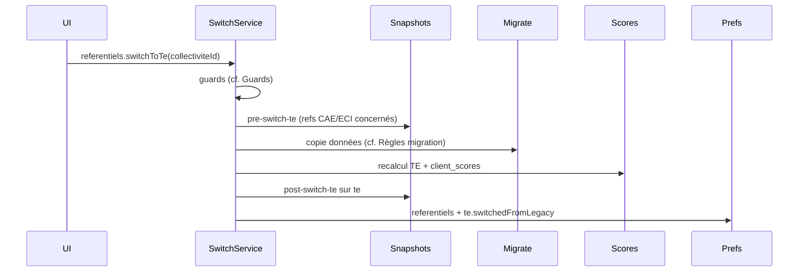

# feat: Bascule des référentiels CAE/ECI vers TE

## Résumé

### Problématique

Le référentiel TE existe côté plateforme (import, scoring, feature flag `is-referentiel-te-enabled`), mais **aucune bascule collectivité** n'est implémentée. `collectivite.preferences.referentiels` ne porte qu'un booléen `display` par référentiel, sans `mode` ni possibilité de tracer la bascule (`te.switchedFromLegacy`). Les données collectivité sont indexées par `action_id` préfixé (`cae_*`, `eci_*`, `te_*`) ; seule `action_origine` porte les correspondances TE → actions d'origine. La projection origine (`avecReferentielsOrigine`) utilisée dans le bac à sable permet un calcul TE à la volée, mais ne remplace pas une copie des données ni un état « basculé » explicite.

Sans bascule structurée, les CT existantes devraient tout ressaisir sur TE, ou resteraient dans une coexistence ambiguë (double saisie, personnalisations incohérentes, exports fragiles).

### Solution

À l'ouverture de TE, les CT engagées sur CAE/ECI conservent leurs référentiels historiques en écriture ; TE est proposé en **lecture seule**. Chaque CT peut ensuite déclencher, **une fois pour toutes et sans retour en arrière**, une bascule manuelle qui fige les anciens référentiels, copie les données vers `te_<id>` via `action_origine`, recalcule les scores et crée des snapshots `pre-switch-te` / `post-switch-te`.

Les CT **sans engagement significatif** sur CAE/ECI démarrent directement sur TE en écriture, sans bouton de bascule (cf. [Profils CT](#profils-ct)). Les référentiels CAE et/ou ECI dont le remplissage est insuffisant sont masqués (`display: false`, `mode: archived`) à l'ouverture publique ; les données saisies restent en base mais ne sont pas reprises automatiquement vers TE.

### Découpage

24 PRs (+ 1 optionnelle reportée) — ~400–600 LOC par PR, **~200–300 LOC pour les merge rules pures**, **~650 LOC toléré pour `mergeStatuts` et la bascule transactionnelle** (PR12, PR18). **Bascule utilisateur impossible avant merge de PR18** — détail dans [Plan de livraison](#plan-de-livraison).

---

## Modèle métier

### Terminologie

- **TE** (identifiant interne `te`) — nommage historique du nouveau référentiel (aussi parfois appelé « référentiel commun » ou « référentiel unique »). L'identifiant interne `te` ne changera pas. Au niveau app/UI, TE est actuellement nommé « Référentiel Transition Ecologique » mais devra être renommé « Climat Ressources ».

- Dans ce document, le terme historique **action** désigne une entrée du référentiel, quel que soit son niveau hiérarchique (mesure, sous-mesure, tâche). Les précisions de granularité sont indiquées explicitement lorsque le niveau importe.

  NB : le type `ActionTypeEnum.ACTION` (colonne `action_type = 'action'` en BDD) désigne spécifiquement une **mesure** — ne pas confondre avec le sens générique ci-dessus.

- **Explication** : `action_commentaire`, libellé UI `explication` — **migrée** via `mergeCommentaires`.
- **Discussions** : `discussion` + `discussion_message`, « commentaires » dans l'UI — **non migrées** (PR24 optionnelle).
- **Justification** : texte optionnel sur une réponse de personnalisation — **non migrée**.

- **Projection origine** — calcul TE à la volée depuis CAE/ECI (`avecReferentielsOrigine`), sans écriture. Usage bac à sable / lecture seule pré-bascule. **N'est pas** le mécanisme de bascule production.
- **Correspondance d'origine** — relation dans `action_origine` entre action TE (`action_id`) et action d'origine CAE/ECI (`origine_action_id`), avec **pondération d'origine** (`ponderation`, défaut `1`).
- **Action d'origine** — action source CAE ou ECI référencée par `origine_action_id`. Ne pas confondre avec la correspondance ni avec une action TE.
- **Points référentiel** — poids structurel (`point_referentiel`), indépendant de la réduction de potentiel personnalisée. Ne pas confondre avec la pondération d'origine.

### Préférences référentiels

Extension de `collectivite.preferences.referentiels` :

```typescript
type ReferentielPreference = {
  display: boolean;
  mode: 'write' | 'readonly' | 'archived';
};

type ReferentielPreferenceTE = ReferentielPreference & {
  switchedFromLegacy?: { switchedAt: string; switchedBy: string }; // absent avant bascule depuis CAE/ECI
};

referentiels: {
  cae: ReferentielPreference;
  eci: ReferentielPreference;
  te: ReferentielPreferenceTE;
}
```

Invariants Zod : `mode === 'archived'` implique `display === false`.

| Mode | Saisie | Navigation | Usage typique |
|---|---|---|---|
| `write` | autorisée | `display: true` | CAE/ECI pré-bascule (engagé) ; TE post-bascule |
| `readonly` | interdite | `display: true` | TE pré-bascule (CT engagée sur CAE/ECI) |
| `archived` | interdite | `display: false` | CAE/ECI post-bascule ou jamais engagés ; consultable via lien TdB EDL ou URL directe |

Les modes non-`write` passent par `ReferentielModeGuard` (backend) — statuts, explications, discussions, pilotes, preuves complémentaires, etc. Seul `archived` déclenche la logique snapshots spécifique (cf. [Snapshots](#snapshots)).

**Nouvelles CT** : même règle que l'initialisation — sans engagement CAE/ECI → `te: { mode: write, display: true }` (sans `switchedFromLegacy`), `cae/eci: { mode: archived, display: false }`.

### Profils CT

Règle existante (`shouldDisplayReferentielByCriteria`) : un référentiel CAE ou ECI est **engagé** si **≥ 2 critères sur 5** remplis :

| # | Critère |
|---|---|
| 1 | ≥ 50 statuts d'actions |
| 2 | ≥ 150 statuts d'actions |
| 3 | ≥ 50 explications (`action_commentaire`) |
| 4 | ≥ 150 explications |
| 5 | dernière activité (statut ou explication) < 1 an |

Les seuils **50** et **150** sur une même métrique sont **deux critères indépendants** (150 compte pour 2).

| Profil collectivité | Critères remplis | Engagé ? |
|---|---|---|
| 50 statuts seuls | 1 | Non |
| 50 explications seules | 1 | Non |
| activité < 1 an seule | 1 | Non |
| 50 statuts + activité < 1 an | 2 | Oui |
| 50 explications + activité < 1 an | 2 | Oui |
| 50 statuts + 50 explications | 2 | Oui |
| 150 statuts seuls | 2 (≥ 50 + ≥ 150) | Oui |
| 150 explications seules | 2 (≥ 50 + ≥ 150) | Oui |
| 75 statuts + 50 explications | 2 | Oui |

**Profil CT** = au moins un référentiel CAE **ou** ECI engagé.

#### Masquage CAE/ECI à l'ouverture publique de TE

À l'ouverture publique de TE, le batch `resetAllCollectivitesDisplayPreferences` (cf. [Déploiement](#déploiement-initialisation-en-deux-temps)) évalue **chaque** référentiel CAE et ECI **indépendamment** via `shouldDisplayReferentielByCriteria`. Un référentiel dont le niveau de remplissage est **insuffisant** (< 2 critères sur 5, donc non engagé) est positionné en `mode: archived`, `display: false` :

- il disparaît de la navigation EDL ;
- les données déjà saisies **restent en base** (consultables via URL directe ou lien TdB EDL) ;
- elles ne sont **pas reprises sur TE via la bascule** pour ce référentiel, faute d'engagement suffisant pour justifier un parcours de bascule sur ce ref.

Exemples : une CT avec CAE engagé et ECI peu rempli → CAE visible en `write`, ECI masqué ; une CT avec CAE et ECI tous deux sous le seuil → les deux masqués.

| Profil CT | `te` | `cae` / `eci` (par réf.) | Bouton bascule |
|---|---|---|---|
| Au moins un ref. engagé | `mode: readonly`, `display: true` | engagé → `write` + `display: true` ; non engagé → `archived` + `display: false` | Visible (si éligible) |
| Aucun ref. engagé | `mode: write`, `display: true`, sans `switchedFromLegacy` | `archived`, `display: false` | Masqué |

> **Conséquence produit assumée** : une CT avec un seul critère rempli (ex. 50 statuts CAE seuls) est « non engagée » → démarrage TE direct en `write`, CAE/ECI `archived` masqués, **sans bouton de bascule** ni reprise automatique des données legacy vers TE. Seuil conservé tel quel (règle initialement conçue pour masquer ECI vide dans la nav).

> **Nuance bascule partielle** : si la CT a au moins un ref. engagé, la bascule reste disponible et migre les données des référentiels en `mode: write`. Un ref. CAE/ECI masqué (non engagé) n'est pas source principale de la bascule, mais peut encore contribuer passivement à une fusion `action_origine` lors de la migration depuis l'autre ref. engagé (cf. [Snapshots](#snapshots) — création `pre-switch-te`).

TE est toujours affiché (`display: true`, modulo feature flag). La règle ne se recalcule pas en continu : uniquement sur reset manuel super-admin ou batch `resetAllCollectivitesDisplayPreferences`. **Guard** : ne pas recalculer si `te.switchedFromLegacy` est renseigné.

**Après bascule** (`te.switchedFromLegacy` renseigné) :

| Référentiel | `mode` | `display` | `switchedFromLegacy` |
|---|---|---|---|
| `te` | `write` | `true` | renseigné (`switchedAt`, `switchedBy`) |
| `cae` / `eci` basculés | `archived` | `false` | — |

### Déploiement (initialisation en deux temps)

1. **Migration Sqitch** (PR1) : restructuration JSONB uniquement — mapping **conservateur** depuis l'ancien `referentiels.display` plat ; ne calcule pas la règle de remplissage. `te.mode: readonly` par défaut jusqu'au batch reset.
2. **Batch service-role** (au lancement TE) : `resetAllCollectivitesDisplayPreferences` applique la règle de remplissage et écrit `{ display, mode }` selon le profil CT, avant ou lors de la levée progressive du feature flag.

**Checklist ops (liée PR3)** — ordre strict :

1. Merge PR3 en prod (service `resetAllCollectivitesDisplayPreferences` disponible).
2. Exécuter le batch sur **100 %** des collectivités ; vérifier critères de succès (échantillon CT engagée → `te: readonly`, CT non engagée → `te: write`).
3. **Seulement ensuite** lever le feature flag `is-referentiel-te-enabled` (progressivement ou 100 %).
4. En cas d'échec batch : ne pas lever le flag ; rollback = réexécution batch (idempotent grâce au garde `switchedFromLegacy`).

Mapping Sqitch conservateur :
- `cae` / `eci` : conserver `display` ; `mode: write` si `display: true`, sinon `archived`.
- `te` : conserver `display` (défaut `true`) ; `mode: readonly` — le batch dérivera `write` ou `readonly`.

`ResetDisplayPreferencesService` est temporaire (retiré en PR25). La migration Sqitch ne duplique pas la logique métier.

### Flux de bascule



**Ordre transactionnel** — une seule transaction DB, étapes strictes :

1. Snapshots `pre-switch-te` (chaque ref. CAE/ECI concerné).
2. Migration données collectivité.
3. Recalcul scores TE + `client_scores`.
4. Snapshot `post-switch-te` sur TE.
5. **En dernier** : `preferences.referentiels` + `te.switchedFromLegacy`.

Guards **avant** la transaction. Échec ou timeout → **rollback total** ; `te.switchedFromLegacy` ne doit **jamais** être écrit partiellement (seul garde-fou d'idempotence).

**Modèle de migration** : copie des données vers les actions `te_<id>` à la bascule (pas de projection origine en production).

### Guards

| Garde | Règle |
|---|---|
| Permissions | `referentiels.mutate` requis (éditeur ou admin référentiel) |
| Idempotence | `te.switchedFromLegacy` absent |
| Mode | `ReferentielModeGuard` : mutation refusée si `mode !== 'write'` (statuts, explications, discussions, pilotes, preuves… ; y compris URL directe) |
| COT/demande/audit | Pour chaque ref. CAE/ECI en `mode: write` au moment de la bascule : bloquer si la collectivité a un COT actif ou si une demande d'audit ou un audit est en cours |

`SwitchToTeService` et guards exposent des `Result<…, erreur typée>` (ADR 0012), conversion tRPC au routeur.

### Règles de migration

| Entité | Règle | Détail |
|---|---|---|
| `action_statut` | Pipeline `ScoresService` + dérivation triplet + arrondi 5 % TE | [Annexe A — mergeStatuts](#a--algorithmes-de-fusion) |
| `action_commentaire` | Blocs source concaténés, sources `non concerne` exclues | [Annexe A — mergeCommentaires](#a--algorithmes-de-fusion) |
| `action_pilote` / `action_service` | Union dédupliquée des mesures ancêtres sources, cible = mesure TE | [Annexe A — pilotes/services](#a--algorithmes-de-fusion) |
| `fiche_action_action` | Mesure→mesure, sous-mesure→sous-mesure si direct, sinon remontée mesure parente | [Annexe A — liens FA](#a--algorithmes-de-fusion) |
| `reponse_*`, `justification` | **Non migrées** ; capturées dans snapshot `pre-switch-te` (`personnalisation_reponses`) ; consultables via archive lecture seule ou export | — |
| `preuve_reglementaire`, `preuve_complementaire` | Liens conservés sur CAE/ECI ; fichiers en bibliothèque | — |
| `discussion*` | **Non migrées** (PR24 optionnelle) | — |

Règle transversale : sources `concerne = false` (non concerné explicite ou désactivées par personnalisation) ignorées avant toute fusion.

### Snapshots

| Snapshot | `ref` | `jalon` | `nom` | Comportement |
|---|---|---|---|---|
| Pré-bascule | `pre-switch-te` | `pre_switch_te` | État pré-bascule TE | Figé à la bascule ; jalon système non éditable (comme `pre_audit`) |
| Post-bascule TE | `post-switch-te` | `post_switch_te` | État initial TE | Figé à la bascule ; jalon système non éditable |
| Score courant | `score-courant` | `score_courant` | Score courant | Vivant sur TE post-bascule ; **masqué** sur CAE/ECI archivés (ligne conservée en BDD) |

> **Convention `ref` / `jalon`** — `ref` (kebab-case) pour API/UI/exports ; `jalon` (snake_case) pour enum BDD `SnapshotJalonEnum`. Ne pas unifier.

**Création `pre-switch-te`** : un snapshot par ref. CAE/ECI en `mode: write` **ou** dont au moins une action d'origine participe à la fusion — y compris ref `archived` dans ce cas (ex. CAE engagé + ECI archived mais sources ECI fusionnées).

**Consommation sur ref archivée** :
- `list` : exclure `score-courant` si `mode === 'archived'`.
- `getCurrent` : retourner `pre-switch-te` (si créé), **sans recalcul** même si versions obsolètes ; ref sans snapshot (jamais engagé, aucune donnée fusionnée) → pas de cas pertinent.
- Export score-comparaison : exclure `score-courant` ; proposer `pre-switch-te`.

**TE post-bascule** : coexistence `post-switch-te` (figé à la bascule) + `score-courant` (vivant, recalculé à chaque saisie ou changement de personnalisation TE). Graphiques d'évolution : afficher les deux jalons.

Recalcul service-role de `pre-switch-te` : capacité ops optionnelle, **hors scope produit**.

---

## Parcours utilisateur

### P1 — Exploration TE (CT engagée)

En tant que membre d'une CT avec au moins un référentiel CAE/ECI engagé, je veux explorer la structure TE en lecture seule (CTA personnalisation autorisés, pas de score projeté post-bascule), tout en continuant à modifier mes référentiels historiques engagés jusqu'à la bascule.

→ Règles : [Profils CT](#profils-ct), modes `readonly` / `write`.

### P2 — Démarrage direct TE (CT non engagée)

En tant que membre d'une CT sans engagement significatif sur CAE/ECI, je veux démarrer directement sur TE en écriture comme seul référentiel visible, sans étape de bascule inutile.

→ Règles : [Profils CT](#profils-ct) (conséquence produit assumée).

### P3 — Navigation et archives

En tant qu'utilisateur, je veux comprendre pourquoi un référentiel n'est pas éditable (bandeau), et après bascule accéder à mes anciens CAE/ECI via un lien TdB EDL sans encombrer le menu EDL.

→ Règles : [Préférences référentiels](#préférences-référentiels), accès archives.

### P4 — Déclenchement de la bascule

En tant qu'éditeur/admin (`referentiels.mutate`), je veux déclencher la bascule via un bouton explicite avec modale d'avertissement (migré / non migré), action irréversible et impossible une seconde fois. Le bouton est désactivé avec message explicite si COT actif ou demande/audit en cours.

**États UI de la requête `switchToTe`** :

- **Soumission** : spinner, bouton et modale désactivés, durée estimée affichée si possible.
- **Succès** : message de confirmation, refetch prefs, bandeaux/nav mis à jour.
- **Erreur réseau** : message + possibilité de réessayer (idempotence côté serveur).
- **Erreur métier** (COT actif, demande ou audit en cours, permissions) : message typé depuis le `Result` tRPC.
- **Timeout** : message explicite (« la bascule peut prendre plusieurs minutes ») + consigne de ne pas relancer sans vérifier l'état côté support.

→ Règles : [Guards](#guards), [Flux de bascule](#flux-de-bascule). Emplacement CTA : **à trancher** (TdB EDL vs page TE).

### P5 — Continuité des données migrées

En tant que CT ayant basculé, je veux retrouver sur TE mes statuts, explications (avec traçabilité source), pilotes, services et liens fiches plan d'action, avec des scores TE recalculés immédiatement cohérents.

→ Règles : [Règles de migration](#règles-de-migration), [Annexe A](#a--algorithmes-de-fusion).

### P6 — Post-bascule, snapshots et export

En tant que CT ayant basculé, je veux un parcours TE simplifié (personnalisations TE seules, questions legacy masquées), consulter des états figés sur les archives (`pre-switch-te`) et suivre ma progression TE (`post-switch-te` + score courant), et exporter l'historique de personnalisation via score-comparaison.

→ Règles : [Snapshots](#snapshots), [Règles de migration](#règles-de-migration) (données non migrées).

---

## Architecture

```
collectivite.preferences.referentiels ({cae, eci}: ReferentielPreference ; te: ReferentielPreferenceTE)
        │
        ▼
CollectiviteReferentielModeService — lecture / mise à jour atomique des modes
        │
        ▼
ReferentielModeGuard — refuse toute mutation si mode ≠ write (backend)
        │
        ▼
SwitchToTeService — orchestration transactionnelle (Result ADR 0012)
        ├── guards COT/demande/audit + permissions + idempotence
        ├── SnapshotsService (pre/post bascule)
        ├── MigrateCollectiviteDataService (copie via action_origine)
        └── ScoresService (recalcul TE)
        │
        ▼
merge-rules (fonctions pures) — pipeline ScoresService pour statuts, concat explications, dédup pilotes/services/fiches
```

---

## Plan de livraison

Objectif de découpage : **PRs reviewables en une session**. Règle générale ~400–600 LOC (tests inclus) ; **~200–300 LOC** pour chaque merge rule pure ; **~650 LOC toléré** pour `mergeStatuts` (PR12) et la bascule transactionnelle (PR18).

### Vue d'ensemble

| PR | Livrable | Dépend de | ~ LOC | Prod |
|---|---|---|---|---|
| PR1 | Schéma Zod preferences + migration Sqitch | — | ~450 | Oui |
| PR2 | Jalons snapshot `pre_switch_te` / `post_switch_te` | PR1 | ~150 | Oui |
| PR3 | `deriveReferentielPreferences` + extension ResetDisplayPreferencesService | PR1 | ~400 | Oui |
| PR4 | CollectiviteReferentielModeService + ReferentielModeGuard | PR1, PR3 | ~500 | Oui |
| PR5 | UI bandeaux readonly / archived | PR4 | ~300 | Oui |
| PR6 | Nav EDL + masquage archived + lien archives TdB | PR4 | ~350 | Oui |
| PR7 | Désactivation contrôles d'édition côté app | PR4 | ~350 | Oui |
| PR8 | SwitchToTeService squelette + guards permissions / idempotence | PR4 | ~500 | Non (endpoint) |
| PR9 | Guards COT/demande/audit | PR8 | ~350 | Non (endpoint) |
| PR10 | Snapshots `pre-switch-te` | PR2, PR8 | ~400 | Non (endpoint) |
| PR11 | `list` / `getCurrent` sur refs archivées | PR2, PR4 | ~300 | Oui |
| PR12 | `mergeStatuts` + tests | PR8 | ~650 | Non (endpoint) |
| PR13 | `mergeCommentaires` + tests | PR12 | ~250 | Non (endpoint) |
| PR14 | `mergePilotes` + tests | PR12 | ~200 | Non (endpoint) |
| PR15 | `mergeServices` + correctif Drizzle PK + tests | PR12 | ~250 | Non (endpoint) |
| PR16 | `mergeFicheActionLinks` + tests | PR12 | ~250 | Non (endpoint) |
| PR17 | MigrateCollectiviteDataService | PR13–PR16 | ~300 | Non (endpoint) |
| PR18 | Recalcul scores + snapshot post-switch-te + transaction + prefs + **exposition prod** | PR9, PR10, PR17 | ~550 | **Oui (endpoint)** |
| PR19 | UI bascule — CTA + états disabled (COT/demande/audit) | PR18 | ~350 | Oui |
| PR20 | UI bascule — modale irréversible (migré / non migré) | PR19 | ~350 | Oui |
| PR21 | Masquage questions / personnalisations legacy | PR18 | ~400 | Oui |
| PR22 | UI snapshots post-bascule + masquage CTA « Figer l'état des lieux » | PR11, PR18 | ~350 | Oui |
| PR23 | Export score-comparaison : feuille personnalisations | PR18 | ~500 | Oui |
| PR24 | (optionnelle) Migration discussions ouvertes | PR17 | ~600 | — |
| PR25 | Nettoyage post-lancement | prod stable | ~250 | Oui |

> **Colonne Prod** : `Oui` = déployable en prod sans risque utilisateur sur la bascule. `Non (endpoint)` = déployable en prod, mais l'endpoint `referentiels.switchToTe` reste **non exposé** — la bascule utilisateur est impossible avant PR18 (`Oui (endpoint)`).

> **Estimation ~ LOC** : lignes ajoutées + modifiées + supprimées par PR (code prod, migrations Sqitch et tests inclus). Ordre de grandeur pour le découpage et la revue, pas un engagement de charge.

Ordre de merge : `PR1 → PR2 → PR3 → PR4 → PR5–PR7 (parallélisables) → PR8 → PR9 → PR10 → PR11 → PR12 → PR13–PR16 (parallélisables) → PR17 → PR18 → PR19 → PR20 → PR21–PR23 (parallélisables) → PR24 (si décidé) → PR25`.

Feedback rapide possible après PR5–PR7 (lecture seule visible).

> **État transitoire PR5–PR7 (pré-batch)** : entre merge PR5–PR7 et exécution du batch reset, toutes les CT ont `te.mode: readonly` (migration Sqitch conservatrice). P1 (exploration TE readonly + saisie CAE/ECI) s'applique aux CT engagées ; P2 (démarrage TE en write) **ne s'applique qu'après le batch** pour les CT non engagées. Ne pas lever le feature flag avant le batch (cf. [checklist ops](#déploiement-initialisation-en-deux-temps)).

### PR1 — Schéma preferences + migration

- Schéma Zod `ReferentielPreference` / `ReferentielPreferenceTE` (`collectivite-preferences.schema.ts`).
- Migration Sqitch (mapping conservateur, cf. [Déploiement](#déploiement-initialisation-en-deux-temps)).

### PR2 — Jalons snapshot

- Jalons `pre_switch_te` / `post_switch_te` dans `SnapshotJalonEnum` + `LIST_DEFAULT_JALONS`.

### PR3 — Dérivation des préférences

- `deriveReferentielPreferences(criteria)` pure + extension `ResetDisplayPreferencesService`.
- Tests unitaires dérivation.

### PR4 — Mode référentiel + guard backend

- `CollectiviteReferentielModeService` + `ReferentielModeGuard`.
- Tests e2e guard minimal.

### PR5 — UI bandeaux

- Bandeau si `mode !== 'write'`.
- Feature flag `is-referentiel-te-enabled`.

### PR6 — Nav EDL + archives

- Nav EDL selon `display` ; masquer `archived`.
- Lien « Consulter mes anciens référentiels » sur TdB EDL.

### PR7 — UI lecture seule (édition)

- Désactiver contrôles d'édition côté app.

### PR8 — Service de bascule (squelette)

- `SwitchToTeService` (Result ADR 0012) ; endpoint `referentiels.switchToTe` implémenté, **non exposé prod**.
- Guards permissions + idempotence : cf. [Guards](#guards).

### PR9 — Guards COT/demande/audit

- Guards COT actif et demande/audit en cours : cf. [Guards](#guards).

### PR10 — Snapshots pré-bascule

- Création snapshots `pre-switch-te` : cf. [Snapshots](#snapshots).

### PR11 — Snapshots sur refs archivées

- Logique `list` / `getCurrent` archivés : cf. [Snapshots](#snapshots).

### PR12 — Fusion statuts

- `mergeStatuts` + tests (cf. [Annexe A — mergeStatuts](#a--algorithmes-de-fusion)). PR la plus volumineuse du lot migration — ne pas fragmenter.

### PR13 — Fusion explications

- `mergeCommentaires` + tests (cf. [Annexe A — mergeCommentaires](#a--algorithmes-de-fusion)).

### PR14 — Fusion pilotes

- `mergePilotes` + tests (cf. [Annexe A — pilotes/services](#a--algorithmes-de-fusion)).

### PR15 — Fusion services

- Correctif Drizzle `action-service.table.ts` : PK `(collectivite_id, action_id, service_tag_id)` (aujourd'hui PK 2 colonnes en Drizzle vs 3 en SQL) — prérequis aux inserts multi-services.
- `mergeServices` + tests (cf. [Annexe A — pilotes/services](#a--algorithmes-de-fusion)).

### PR16 — Fusion liens fiches plan d'action

- `mergeFicheActionLinks` + tests (cf. [Annexe A — liens FA](#a--algorithmes-de-fusion)).

### PR17 — Orchestration migration données

- `MigrateCollectiviteDataService` — branche les merge rules PR13–PR16.

### PR18 — Bascule bout-en-bout

- Recalcul scores TE : après migration des statuts, déclencher le recalcul et la persistance via `SnapshotsService.forceRecompute` (sur `score-courant` TE, puis snapshot `post-switch-te`) — pas d'écriture directe `client_scores` depuis `ScoresService`.
- Snapshot `post-switch-te` sur TE.
- Intégration transactionnelle complète : cf. [Flux de bascule](#flux-de-bascule).
- Mise à jour prefs + `te.switchedFromLegacy`.
- **Exposition prod** de `referentiels.switchToTe`.

### PR19 — UI bascule (CTA)

- CTA si `te.mode === 'readonly'` et CT éligible ; masqué si non engagée.
- CTA disabled + message explicite si COT actif ou demande d'audit en cours ou audit en cours :
  - **COT ouvert** : « Un COT est en actif sur {ref}. Clôturez-le avant de basculer. ».
  - **Demande d'audit en cours** : « Un demande d'audit est en cours sur {ref}. Attendez la fin de l'audit avant de basculer. » + lien vers la page labellisation concernée
  - **Audit en cours** : « Un cycle d'audit est ouvert sur {ref}. Terminez-le avant de basculer. » + lien vers l'audit.
- Format : message inline sous le CTA (ou bandeau si CTA masqué) ; `aria-describedby` pour accessibilité.

### PR20 — UI bascule (modale)

- Modale irréversible structurée en deux sections :
  - **Seront migrés vers TE** : statuts, explications (avec traçabilité source), pilotes, services, liens fiches plan d'action.
  - **Ne seront pas migrés** : fils de discussion, preuves (fichiers conservés en bibliothèque — réaffectation manuelle aux mesures TE).
- Liens contextuels : export snapshot `pre-switch-te` (personnalisations), bibliothèque de preuves.

### PR21 — Post-bascule personnalisations

- Exclure réf. `archived` de `list-personnalisation-questions` ; retirer boutons questions archivés ; page Personnalisation TE seule.

### PR22 — Post-bascule snapshots UI

- UI snapshots archivés et évolution TE : cf. [Snapshots](#snapshots).
- Masquer le CTA « Figer l'état des lieux » sur refs archivées.

### PR23 — Export personnalisations

- Feuille `personnalisation_reponses` du snapshot ; mode comparaison 2 colonnes par jalon.

### PR24 (optionnelle) — Discussions

- Migrer `discussion` + `discussion_message` ouvertes vers mesure TE. Décision reportée.

### PR25 — Nettoyage

- Supprimer `ResetDisplayPreferencesService` ; retirer `affichage-referentiels.page.tsx` si obsolète.

**Critères de done PR25** (tous requis) :

- Batch `resetAllCollectivitesDisplayPreferences` exécuté sur 100 % des CT.
- Feature flag `is-referentiel-te-enabled` à 100 %.
- ≥ 14 jours sans incident bloquant sur la bascule en prod.
- Logique `deriveReferentielPreferences` conservée pour l'initialisation des nouvelles CT (hors service batch supprimé).

**Dépendances externes** : feature flag `is-referentiel-te-enabled` ; table `action_origine` à jour (import référentiel TE).

---

## Annexes

### A — Algorithmes de fusion

#### `mergeStatuts`

La bascule produit des statuts TE **cohérents avec le pipeline de scoring**, en tenant compte de la personnalisation CAE/ECI au moment T.

**Principe** : déléguer à `ScoresService` (`getRatioFromOrigineActions`, `getScoreFromOrigineActionsAndRatio`) ; le filtrage `non concerne` reste dans `mergeStatuts` (pas de logique migration dans `ScoresService`).

**Orchestration amont (PR12)** — avant d'appeler `getRatioFromOrigineActions` / `getScoreFromOrigineActionsAndRatio`, construire pour chaque action TE la **liste de ses actions sources CAE/ECI avec score** (`CorrelatedActionWithScore[]`) :

Chaque entrée = une ligne `action_origine` (identifiant source, référentiel, pondération, nom) + le **score déjà calculé** sur cette action dans son référentiel d'origine (`pointReferentiel`, avancement fait/programme/pas fait, etc.).

1. Appeler `computeScoreForCollectivite` pour chaque réf. CAE/ECI concerné (personnalisation courante au moment T).
2. Pour chaque action TE, récupérer ses correspondances d'origine et y attacher le score de l'action source correspondante (étape 1).
3. Passer cette liste à `getRatioFromOrigineActions` puis `getScoreFromOrigineActionsAndRatio`.

> Ne pas réutiliser directement `computeScoreFromReferentielsOrigine` (privée, pipeline projection lecture seule) — la bascule persiste des statuts, pas une projection à la volée.

Pour chaque action TE avec correspondance d'origine :

1. Recalculer scores CAE/ECI avec personnalisation courante ; filtrer sources `concerne = false` ; appliquer arbre TE avec **personnalisation courante** ; projeter via pondération d'origine.
2. Dériver triplet `[fait, programme, pas_fait]` depuis points projetés.
3. **Post-traitement TE** : arrondi à l'inférieur au pas de 5 % pour triplets mixtes (`fait` et `programme` → multiple de 5 % immédiatement inférieur ; ex. 74 % → 70 %) ; `pas_fait = 1 - fait - programme` ; triplet pur → statut discret.
4. Persister : triplet pur → `fait`/`programme`/`pas_fait` ; mixte → `detaille` ; aucune source concernée → `non_renseigne` + `concerne = false` ; sources concernées sans avancement → `non_renseigne` + `concerne = true`.

> Statut UI « non concerné » = `avancement = non_renseigne` + `concerne = false` (cf. `actionStatutCreateToActionStatutInDatabase`).

| Cas | Résultat |
|---|---|
| 1→1 discret, `ponderation = 1` | Copie directe si triplet pur |
| 1→1 `detaille` | Projection + arrondi inférieur pas 5 % |
| N→1 pondérations hétérogènes | Pipeline + arrondi si mixte |
| Source(s) `non concerne` | Ignorées ; projection sur `concerne = true` uniquement |
| 1 source `fait` + 1 `non concerne` | Équivalent 1→1 sur la source concernée |
| Fusion CAE + ECI → même TE | Toutes sources concernées via `action_origine` |
| Toutes sources `non concerne` | `non_renseigne` + `concerne = false` |
| Action TE native | Pas de statut migré |
| `detaille_a_la_tache` source | Conversion proportion tâches → arrondi ou discret |

#### `mergeCommentaires`

Format par bloc : `{origine_action_id} - {titre} - {score} {explication}`

- Un bloc par source concernée, ordre CAE puis ECI ; sources `non concerne` ignorées.
- 1→1 sans texte source : pas de ligne TE.
- Préfixe explicatif + blocs concaténés.

Exemple :

```
Les textes ci-après et les statuts associés sont issus de la bascule depuis les anciens référentiels CAE et/ou ECi. Ils sont à actualiser pour répondre à l'actuelle sous-mesure.

cae_1.2.3 - Définir et mettre en oeuvre la stratégie de prévention et de gestion des déchets - 42 % FAIT
<texte associé à cae_1.2.3>

eci_4.1 -  Connaître les coûts de la gestion des déchets pour maîtriser les dépenses publiques - FAIT
<texte associé à eci_4.1>
```

#### Pilotes et services

Saisie uniquement au niveau mesure (`ActionTypeEnum.ACTION`). Correspondances d'origine à granularité variable → consolidation sur la **mesure TE** parente.

Pour chaque mesure TE `te_m` : lister correspondances sur `te_m` et descendants ; exclure `non concerne` ; remonter à mesure ancêtre source ; collecter pilotes/services ; fusionner CAE+ECI ; dédupliquer (`user_id`/`tag_id`, `service_tag_id`) ; insérer sur `te_m` uniquement.

Fonctions pures : `mergePilotes`, `mergeServices`.

#### Liens fiches plan d'action

| Granularité source | Cible TE |
|---|---|
| Mesure | Mesure TE (correspondance mesure → mesure) |
| Sous-mesure + correspondance directe | Sous-mesure TE |
| Sous-mesure sans correspondance directe | Remontée mesure TE parente |

Dédupliquer sur `(fiche_id, te_action_id)`. Fonction pure : `mergeFicheActionLinks`.

### B — Stratégie de tests

Un bon test vérifie le **comportement externe** (entrée → sortie) sans se coupler aux détails d'implémentation.

| Module | Type | Cas clés |
|---|---|---|
| `deriveReferentielPreferences` | Unitaire | CT avec/sans ref. engagé ; post-bascule figée ; invariant archived → display false |
| `mergeStatuts` / `mergeCommentaires` | Unitaire | Cf. [Annexe A](#a--algorithmes-de-fusion) ; cohérence statut ↔ score PR18 |
| `mergePilotes` / `mergeServices` | Unitaire pur | Mapping hétérogène (`cae_6.1.3.4.3 + eci_3.3.1.3 → te_6.1.4.4`) ; dédup |
| `mergeFicheActionLinks` | Unitaire pur | Mesure→mesure ; sous-mesure direct ; fallback parente ; dédup |
| `ReferentielModeGuard` | e2e backend | Mutation refusée si `readonly` / `archived` |
| `SwitchToTeService` guards | e2e backend | COT, audit en cours, double bascule, permissions |
| Bascule complète | e2e backend | Snapshots pre/post, scores cohérents, prefs mises à jour ; **jeu de données** : CT max charge connue (1377 statuts CAE) — durée transaction < `statement_timeout` (30 s)
| `list` / `getCurrent` archivés | e2e backend | Cf. [Snapshots](#snapshots) |
| UI post-bascule | e2e Playwright | Archives sans score courant ; TE avec état initial + courant |
| Bandeaux + nav + modale | e2e Playwright | Modes, lien archives |
| Export personnalisations | e2e backend | Feuille snapshot, comparaison 2 colonnes |

**Références existantes** : `action-access-rights.spec.ts`, `snapshots.router.e2e-spec.ts`, `export-score-comparison.controller.e2e-spec.ts`, `request-labellisation-audit-cot.spec.ts`, `scores.service.spec.ts` (`computeScoreFromReferentielsOrigine`), `action-origine.table.ts`.

### C — Hors périmètre

- Affectation des preuves aux mesures TE — récupération manuelle via bibliothèque.
- Migration des réponses de personnalisation vers TE.
- Migration des fils de discussion (PR24 optionnelle).
- Bascule automatique ; retour arrière après bascule.
- Version de référentiel par collectivité.
- Suppression définitive des données CAE/ECI.

### D — Risques

| Risque | Impact | Mitigation |
|---|---|---|
| Transaction volumineuse (timeout DB) | Bascule partielle | **Risque accepté** (juin 2026) : benchmark snapshots — CT la plus chargée connue (1377 statuts CAE) → ~1,5 s sur instance test ≥ 2× plus petite que prod ; bascule ponctuelle (1 CT, pas de pic simultané). Mitigation : rollback total ; `switchedFromLegacy` écrit en dernier. **Validation PR18** : e2e bascule complète sur cette CT + mesure durée merge/écritures statuts TE.
| Fusion N→1 ambiguë | Statut ≠ score | Pipeline `ScoresService` + arrondi 5 % ; tests exhaustifs |
| Dédup liens fiches | Doublons / pertes | Tests fusion CAE+ECI, fallback sous-mesure |
| Correspondances hétérogènes (pilotes) | Manquants / doublons | Tests remontée mesure ancêtre |
| URL directe sur archivé | Édition malgré archivage | `ReferentielModeGuard` backend |
| Discussions non migrées | Perte fils ouverts | PR24 optionnelle ; message modale |

### E — Questions ouvertes

1. **Emplacement CTA bascule** : TdB EDL vs page TE.
2. **PR24 discussions** : migrer les ouvertes uniquement, ou aucune migration.
3. **COT** : en attente de confirmation de la manière de considérer les CT avec COT actif vs CT avec audit COT final validé.
4. **Conditions d'évaluation du remplissage** : faire éventuellement évoluer `shouldDisplayReferentielByCriteria` afin de pouvoir gérer des règles/paliers différents entre CAE et ECI afin d'alléger la navigation pour les collectivités qui ne sont engagées que dans l'un des référentiels.

### F — Références

**Origine** : ticket interne + cadrage session (juin 2026).

| Domaine | Fichiers |
|---|---|
| Préférences collectivité | `packages/domain/src/collectivites/collectivite-preferences.schema.ts` |
| Correspondances d'origine | `action_origine`, `import-referentiel.service.ts` (`parseActionsOrigine`) |
| Scoring projection origine | `scores.service.ts` (`computeScoreFromReferentielsOrigine`) |
| Snapshots | `snapshots.service.ts`, `snapshot-jalon.enum.ts` |
| COT / audit | `request-labellisation.rules.ts`, `start-new-audit-cycle.rules.ts` |
| Export comparaison | `export-score-comparison.service.ts`, `load-score-comparison.service.ts` |
| Feature flag TE | `packages/domain/src/utils/feature-flags.ts` |
| Règle remplissage | `compute-referentiel-display.rules.ts`, `reset-display-preferences.service.ts` |

**ADR** : `doc/adr/0012-pattern-result.md`
