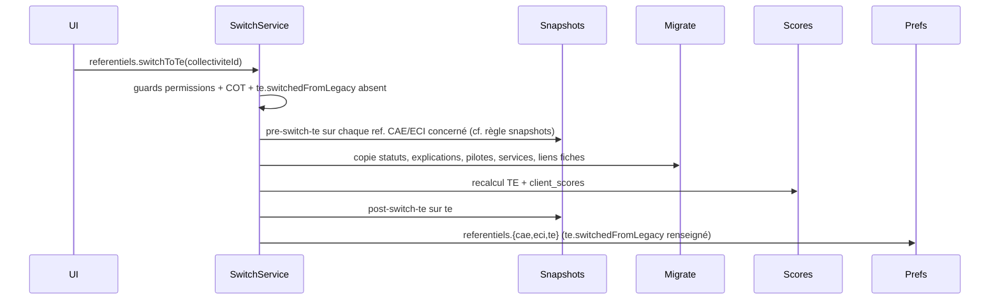

# feat: Bascule des référentiels CAE/ECI vers TE

## Terminologie

- Dans ce document, le terme historique **action** désigne une entrée du référentiel, quel que soit son niveau hiérarchique (mesure, sous-mesure, tâche).
Les précisions de granularité sont indiquées explicitement lorsque le niveau importe.

  NB : le type `ActionTypeEnum.ACTION` (colonne `action_type = 'action'` en BDD) désigne spécifiquement une **mesure** — ne pas confondre avec le sens générique ci-dessus.

- Textes sur les actions et la personnalisation
  - **Explication** : stockés dans `action_commentaire`, libellé dans l'UI `explication` (colonne « état d'avancement » de la vue tabulaire) — **migrée** via `mergeCommentaires`.
  - **Discussions** : `discussion` + `discussion_message`, appelées « commentaires » dans l'UI (panneau latéral) — **non migrées** (PR9 optionnelle).
  - **Justification** : texte optionnel sur une réponse de personnalisation (`justification`) — **non migrée**.

- Bascule TE / correspondances inter-référentiels
  - **Projection origine** — calcul TE à la volée depuis CAE/ECI (`avecReferentielsOrigine`), sans écriture de données vers les actions du nouveau référentiel. Usage bac à sable / lecture seule pré-bascule.
  - **Correspondance d'origine** — relation déclarée dans `action_origine` entre une action TE (`action_id`) et une action d'origine CAE/ECI (`origine_action_id`), avec une **pondération d'origine** (`ponderation`, défaut `1`). Sert à la projection origine (API actuelle pour le bac à sable) et à la copie des données lors de la bascule.
  - **Action d'origine** — action source CAE ou ECI référencée par `origine_action_id` dans une correspondance d'origine. Ne pas confondre avec la correspondance elle-même ni avec une action TE.
  - **Points référentiel** — poids structurel d'une action dans la définition du référentiel (`point_referentiel`), indépendant de la réduction de potentiel personnalisée d'une collectivité. Ne pas confondre avec la pondération d'origine.

## Vue d'ensemble

À l'ouverture du nouveau référentiel (`te`), les collectivités déjà actives sur CAE et/ou ECI conservent leurs référentiels historiques en écriture, tandis que TE est proposé en **lecture seule**. Chaque collectivité peut ensuite déclencher, **une fois pour toutes et sans retour en arrière**, une bascule manuelle qui :

- fige les anciens référentiels en lecture seule (archives consultables),
- copie les données pertinentes vers les actions `te_<id>` via les correspondances d'origine (`action_origine`),
- recalcule les scores TE et enregistre des snapshots `pre-switch-te` et `post-switch-te`.

Les collectivités **sans engagement significatif sur CAE/ECI** (cf. règle de remplissage ci-dessous) démarrent directement sur TE en écriture (CAE/ECI archivés et masqués), sans bouton de bascule.

Le travail est découpé en **10 PRs** (+ 1 optionnelle reportée), précédées par des décisions produit validées en session de cadrage.

## Problématique / Motivation

Aujourd'hui :

- Le référentiel TE existe côté plateforme (import, scoring, feature flag `is-referentiel-te-enabled`), mais **aucune bascule collectivité** n'est implémentée.
- `collectivite.preferences.referentiels` ne porte qu'un booléen `display` par référentiel (navigation), sans `mode` ni traçabilité de bascule (`te.switchedFromLegacy`).
- Les données collectivité sont indexées par `action_id` préfixé (`cae_*`, `eci_*`, `te_*`) ; seule la table `action_origine` porte les correspondances d'origine TE → actions d'origine (CAE/ECI).
- Le scoring TE peut être déduit des avancements CAE/ECI à la volée (`avecReferentielsOrigine`, projection origine), mais cela ne remplace pas une copie des données (statuts, explications, etc.) vers les actions du nouveau référentiel, ni un état « basculé » explicite.

Sans bascule structurée, les CT existantes devraient tout ressaisir sur TE, ou resteraient dans une coexistence ambiguë (double saisie, questions de personnalisation incohérentes, exports fragiles).

## Solution proposée

### États par référentiel et par collectivité

Extension de `collectivite.preferences.referentiels` :

```typescript
type ReferentielPreference = {
  display: boolean;
  mode: 'write' | 'readonly' | 'archived';
};

type ReferentielPreferenceTE = ReferentielPreference & {
  switchedFromLegacy?: { switchedAt: string; switchedBy: string }; // absent avant bascule depuis CAE/ECI
};

referentiels: {
  cae: ReferentielPreference;
  eci: ReferentielPreference;
  te: ReferentielPreferenceTE;
}
```

Invariants Zod : `mode === 'archived'` implique `display === false`.

> **Sémantique des modes**
>
> - **`write`** : saisie autorisée. 
> - **`readonly`** : visible dans la navigation (`display: true`) mais mutations interdites — typiquement TE pré-bascule (CT engagée sur CAE/ECI). 
> - **`archived`** : masqué du menu (`display: false`), consultable via lien TdB EDL ou URL directe, mutations interdites — typiquement CAE/ECI post-bascule ou jamais engagés.
>
> Les deux modes non-`write` passent par `ReferentielModeGuard` ; seul `archived` déclenche la logique snapshots spécifique (`score-courant` masqué, `getCurrent` → `pre-switch-te`).

**Règle de remplissage et profils CT (migration init + feature flag) :**

Une règle existante (`shouldDisplayReferentielByCriteria`, `reset-display-preferences.service.ts`) détermine si un référentiel CAE ou ECI est **engagé** : **au moins 2 critères sur 5** remplis :

| # | Critère |
|---|---|
| 1 | ≥ 50 statuts d'actions |
| 2 | ≥ 150 statuts d'actions |
| 3 | ≥ 50 explications (`action_commentaire`) |
| 4 | ≥ 150 explications |
| 5 | dernière activité (statut ou explication) < 1 an |

Les seuils **50** et **150** sur une même métrique sont **deux critères indépendants** (150 compte pour 2).

| Profil collectivité | Critères remplis | Engagé ? |
|---|---|---|
| 50 statuts seuls | 1 | Non |
| 50 explications seules | 1 | Non |
| activité < 1 an seule | 1 | Non |
| 50 statuts + activité < 1 an | 2 | Oui |
| 50 explications + activité < 1 an | 2 | Oui |
| 50 statuts + 50 explications | 2 | Oui |
| 150 statuts seuls | 2 (≥ 50 + ≥ 150) | Oui |
| 150 explications seules | 2 (≥ 50 + ≥ 150) | Oui |
| 75 statuts + 50 explications | 2 | Oui |

**Profil CT** = au moins un référentiel CAE **ou** ECI engagé. Initialisation des `mode` et `display` :

| Profil CT | `te` | `cae` / `eci` (par réf.) | Bouton bascule |
|---|---|---|---|
| Au moins un ref. engagé | `mode: readonly`, `display: true` | engagé → `mode: write`, `display: true` ; non engagé → `mode: archived`, `display: false` | Visible (si éligible) |
| Aucun ref. engagé | `mode: write`, `display: true`, sans `switchedFromLegacy` | `mode: archived`, `display: false` | Masqué |

> **Conséquence produit assumée** : une CT avec un seul critère rempli (ex. 50 statuts CAE seuls) est « non engagée » → démarrage TE direct en `write`, CAE/ECI `archived` masqués, **sans bouton de bascule** ni migration des données legacy. La règle était initialement conçue pour masquer ECI vide dans la nav (`shouldDisplayReferentielByCriteria`) ; ce seuil est **conservé tel quel** pour la bascule.

TE est toujours affiché (`display: true`, modulo le feature flag). La règle ne se recalcule pas en continu (pas à chaque saisie) : uniquement sur action explicite (reset manuel super-admin ou batch `resetAllCollectivitesDisplayPreferences`).

**Initialisation en deux temps (PR1 + lancement TE) :**

1. **Migration Sqitch** (déploiement PR1) : restructuration JSONB uniquement — mapping **conservateur** depuis l'ancien `referentiels.display` plat (cf. PR1) ; ne calcule pas la règle de remplissage. **`te.mode: readonly` par défaut** (pas `write`) jusqu'au batch reset — évite toute saisie TE avant initialisation métier.
2. **Batch service-role** (au lancement TE) : `resetAllCollectivitesDisplayPreferences` applique la règle de remplissage et écrit `{ display, mode }` selon le profil CT (tableaux ci-dessus), avant ou lors de la levée progressive du feature flag. Les CT existantes ne sont considérées correctement initialisées qu'après ce batch.

**Après bascule (`te.switchedFromLegacy` renseigné) :**

| Référentiel | `mode` | `display` | `switchedFromLegacy` |
|---|---|---|---|
| `te` | `write` | `true` | renseigné |
| `cae` / `eci` basculés | `archived` | `false` (hors menu principal) | — |

Les référentiels archivés restent accessibles via un **lien sur le TdB EDL** et par URL directe, en lecture seule.

### Flux de bascule (transactionnel)



**Ordre transactionnel et idempotence** — une seule transaction DB, étapes dans cet ordre strict :

1. Snapshots `pre-switch-te` (chaque ref. CAE/ECI concerné).
2. Migration données collectivité (statuts, explications, pilotes, services, liens fiches).
3. Recalcul scores TE + persistance `client_scores`.
4. Snapshot `post-switch-te` sur TE.
5. **En dernier** : mise à jour `preferences.referentiels` + `te.switchedFromLegacy`.

Les guards (permissions, COT, `te.switchedFromLegacy` absent) s'exécutent **avant** l'ouverture de la transaction. En cas d'échec ou de timeout : **rollback total** — `te.switchedFromLegacy` ne doit **jamais** être écrit partiellement ; c'est le seul garde-fou d'idempotence permettant un retry.

> **Exposition de l'endpoint** — `referentiels.switchToTe` n'est **pas appelable en production** tant que PR4 et PR5 ne sont pas mergées (bascule bout-en-bout). PR3 prépare le service, les snapshots pre-bascule et les guards ; l'intégration transactionnelle complète est livrée en PR5. PR6 n'ajoute que l'UI.

### Architecture en modules (deep modules)

```
collectivite.preferences.referentiels ({cae, eci}: ReferentielPreference ; te: ReferentielPreferenceTE)
        │
        ▼
CollectiviteReferentielModeService — lecture / mise à jour atomique des modes
        │
        ▼
ReferentielModeGuard — refuse toute mutation si mode ≠ write (backend)
        │
        ▼
SwitchToTeService — orchestration transactionnelle (Result ADR 0012)
        ├── guards COT + permissions + idempotence (`te.switchedFromLegacy` absent)
        ├── SnapshotsService (pre/post bascule)
        ├── MigrateCollectiviteDataService (copie via les correspondances d'origine)
        └── ScoresService (recalcul TE)
        │
        ▼
merge-rules (fonctions pures) — pipeline ScoresService pour statuts, concat explications, dédup pilotes/services/fiches
```

### Enchaînement des PRs

```
PR1 — Schéma preferences + jalons snapshot + migration init + guards backend
PR2 — UI lecture seule (bandeaux, nav EDL, lien archives TdB)
PR3 — SwitchToTeService (squelette + snapshots pre-bascule + list/getCurrent archivés + guards COT) — endpoint non exposé en prod
PR4 — Migration données collectivité (copie via les correspondances d'origine)
PR5 — Recalcul scores TE + snapshot post-switch-te + intégration transactionnelle complète (endpoint exposé)
PR6 — UI bascule (bouton + modale warning)
PR7 — Masquage questions / personnalisations + UI snapshots post-bascule (US 28–29)
PR8 — Export score-comparaison : feuille personnalisations
PR9 — (optionnelle, reportée) Migration discussions ouvertes
PR10 — Nettoyage post-lancement (ResetDisplayPreferencesService, etc.)
```

Ordre de merge : `PR1 → PR2 → PR3 → PR4 → PR5 → PR6 → PR7 → PR8` ; PR9 en parallèle après PR4 si décidé ; PR10 après mise en prod stable. **Bascule utilisateur** : impossible avant merge de PR5 (PR3+PR4 seuls ne suffisent pas — pas d'appel `switchToTe` en prod).

## User Stories

### Lecture seule et navigation

1. En tant que membre d'une CT avec au moins un référentiel CAE ou ECI engagé (règle de remplissage), je veux voir le référentiel TE en lecture seule (à part CTA vers les questions de personnalisation y compris les nouvelles), afin d'**explorer la structure TE** sans risquer d'y saisir des données isolées — pas d'affichage du score post-bascule projeté.
2. En tant que membre d'une CT avec au moins un référentiel engagé, je veux continuer à modifier CAE et/ou ECI (selon ceux qui sont engagés) jusqu'à la bascule, afin de finaliser mon état des lieux historique.
3. En tant que membre d'une CT sans aucun référentiel CAE/ECI engagé (données absentes, obsolètes ou insuffisantes selon la règle de remplissage), je veux démarrer directement sur TE en écriture comme seul référentiel visible, afin de ne pas passer par une étape de bascule inutile.
4. En tant que lecteur référentiel, je veux voir un bandeau explicite sur un référentiel en lecture seule ou archivé, afin de comprendre pourquoi je ne peux pas éditer.
5. En tant que membre d'une CT ayant basculé, je veux accéder à mes anciens référentiels CAE/ECI via un lien sur le TdB EDL, afin de consulter l'historique sans encombrer le menu principal.
6. En tant que membre d'une CT ayant basculé, je veux que les entrées CAE/ECI disparaissent du menu EDL, afin de me concentrer sur TE.

### Bascule

7. En tant qu'éditeur ou admin référentiel (`referentiels.mutate`), je veux déclencher la bascule TE via un bouton explicite, afin de migrer mon travail vers le nouveau référentiel quand je suis prêt.
8. En tant qu'éditeur, je veux une modale d'avertissement listant ce qui est migré et ce qui ne l'est pas, afin de valider en connaissance de cause une action irréversible.
9. En tant que CT, je veux que la bascule soit impossible une seconde fois, afin d'éviter toute corruption par double exécution.
10. En tant que CT avec un COT actif et sans audit COT validé, je veux voir le bouton de bascule désactivé avec un message explicite, afin de comprendre que je dois d'abord clôturer mon audit COT.
11. En tant que CT avec un COT actif et avec un audit en cours, je veux que la bascule soit bloquée, afin de ne pas perturber le cycle d'audit en cours.

### Données migrées

12. En tant que CT ayant basculé, je veux retrouver sur TE les statuts de mes actions (règle : projection `ScoresService` depuis les actions d'origine avec personnalisation CAE/ECI au moment T, pondération d'origine incluse en cas de fusion N→1), afin de ne pas tout ressaisir et d'obtenir un statut cohérent avec le score recalculé.
13. En tant que CT ayant basculé, je veux retrouver mes explications et statuts d'origine (`action_statut`, `action_commentaire`), concaténées par blocs source (`{origine_action_id1} - {titre1} - {score1} {explication1}, {origine_action_id2} - …`), afin de conserver la traçabilité.
14. En tant que CT ayant basculé, je veux retrouver mes pilotes (utilisateurs ou tags personne) et services sur les mesures TE, afin de poursuivre le pilotage sans reconfiguration.
15. En tant que CT ayant basculé, je veux que les liens entre fiches plan d'action et actions du référentiel (mesure ou sous-mesure) pointent vers les actions TE correspondantes, afin de garder la cohérence de mon plan d'action.
16. En tant que CT ayant basculé, je veux des scores TE recalculés à partir des statuts migrés, afin d'obtenir un état des lieux cohérent immédiatement après bascule.

### Données non migrées / figées

17. En tant que CT ayant basculé, je veux que mes réponses de personnalisation CAE/ECI (`reponse_*`) ne soient plus affichées dans le parcours courant, afin d'éviter la confusion avec les questions TE.
18. En tant que CT ayant basculé, je veux retrouver mes réponses et justifications de personnalisation historiques via le snapshot `pre-switch-te` (`personnalisation_reponses`) ou l'archive lecture seule, afin de conserver une trace auditable.
19. En tant que CT ayant basculé, je veux retrouver mes preuves réglementaires et complémentaires (`preuve_reglementaire`, `preuve_complementaire`) via la bibliothèque de documents, sachant que leurs liens vers les mesures ne sont pas recréés automatiquement sur TE.
20. En tant que CT, je veux qu'un snapshot `pre-switch-te` (jalon `pre_switch_te`, libellé « État pré-bascule TE ») soit créé pour **les anciens référentiels CAE/ECI**  afin de figer l'état pré-bascule et capturer les personnalisations associées.
21. En tant que CT, je veux qu'un snapshot `post-switch-te` (jalon `post_switch_te`, libellé « État initial TE ») soit créé sur TE après recalcul, afin de marquer l'état initial TE post-migration.

### Expérience utilisateur post-bascule

22. En tant que CT ayant basculé, je ne veux plus voir les boutons « voir / compléter les questions » des anciens référentiels sur les pages mesures, afin de ne traiter que les personnalisations TE.
23. En tant que CT ayant basculé, je veux que la page Personnalisation ne propose que les questions TE, afin de simplifier le parcours.

### Export

24. En tant que CT, je veux exporter un classeur score-comparaison incluant une feuille des questions et réponses de personnalisation issues du snapshot, afin d'archiver ou partager l'historique.
25. En tant que CT exportant en mode comparaison, je veux deux colonnes « réponses {jalon snapshot} », afin de comparer les réponses entre deux jalons.

### Exploitation / déploiement

26. En tant qu'équipe produit, je veux restructurer les préférences via migration Sqitch (mapping conservateur), lancer un reset batch selon la règle de remplissage CAE/ECI, puis activer progressivement le feature flag TE, afin de tester en interne avant ouverture générale.
27. En tant qu'équipe technique/produit, je veux que la bascule enregistre `te.switchedFromLegacy.switchedBy` et `switchedAt`, afin de tracer qui a basculé et quand.

### Snapshots post-bascule (consommation UI/API)

28. En tant que CT ayant basculé, sur mes référentiels CAE/ECI archivés, je veux voir « État pré-bascule TE » à la place du score courant dans les comparaisons, exports et en-têtes, afin de consulter un état figé sans ambiguïté.
29. En tant que CT ayant basculé, je veux voir « État initial TE » et mon score courant sur les graphiques d'évolution TE, afin de suivre ma progression depuis la bascule.

## Approche technique

### Décisions produit actées

| Sujet | Décision |
|---|---|
| Modèle de migration | Copie des données vers les actions `te_<id>` à la bascule |
| État par référentiel | `preferences.referentiels.{cae,eci,te}` (`display` + `mode`) ; traçabilité bascule sur `te.switchedFromLegacy` |
| Qui bascule | Editeur + admin (permission `referentiels.mutate` requise) |
| Profil CT initial | Si au moins un ref. CAE/ECI engagé (règle de remplissage) alors TE `readonly` + bascule requise ; sinon TE `write` seul, CAE/ECI `archived` |
| Nouvelles CT | Même règle : sans engagement CAE/ECI → `te: { mode: write, display: true }` (sans `switchedFromLegacy`), `cae/eci: { mode: archived, display: false }` |
| COT | Bascule bloquée si au moins un des ref. CAE/ECI est en `mode: write` avec un audit ouvert (`clos = false`) avec demande `sujet ∈ {cot, labellisation_cot}` non validée (`valide = false`) ; bloquer aussi tout audit en cours (`date_debut` renseigné et `valide = false`) sur ces référentiels |
| Fusion N→1 (CAE+ECI → TE) | Statut = pipeline `ScoresService` au moment T (scores CAE/ECI avec personnalisation courante + arbre TE avec personnalisation vide), **sources `non concerne` ignorées** avant projection, dérivation du triplet puis arrondi à l'inférieur au pas de 5 % obligatoire pour TE (`detaille` uniquement, pas de `detaille_a_la_tache`) ; explications concaténées par blocs `{origine_action_id1} - {titre1} - {score1} {explication1}, ...` (sources `non concerne` exclues) ; pilotes et services = union dédupliquée des mesures ancêtres sources concernées (via correspondances d'origine à granularité variable) sur la mesure TE ; liens FA = correspondance mesure→mesure, sous-mesure→sous-mesure si correspondance directe, sinon remontée à la mesure TE parente |
| Personnalisations | Non migrées vers TE — réponses courantes (`reponse_*`, `justification`) **capturées** dans le snapshot `pre-switch-te` (`personnalisation_reponses`) ; consultables via archive lecture seule / export |
| Preuves (`preuve_reglementaire`, `preuve_complementaire`) | Liens action → preuve non réaffectés aux mesures TE ; fichiers conservés en bibliothèque (`storage`) |
| Scores | Recalcul TE post-copie ; snapshots pre/post bascule |
| Snapshots pre-bascule | Un snapshot `pre-switch-te` par ref. CAE/ECI en `mode: write` **ou** dont au moins une action d'origine participe à la fusion (`action_origine`) — y compris ref `archived` dans ce cas (ex. CAE engagé + ECI archived mais sources ECI fusionnées) |
| Jalons snapshot bascule | Nouveaux enum `pre_switch_te` / `post_switch_te` dans `SnapshotJalonEnum` + `LIST_DEFAULT_JALONS` ; `ref` : `pre-switch-te` / `post-switch-te` ; `nom` : « État pré-bascule TE » / « État initial TE » |
| Score courant sur ref archivée | Ligne `score-courant` conservée en BDD ; exclue de `list` / graphiques / exports si `mode === 'archived'` ; `getCurrent` retourne `pre-switch-te` si snapshot existant (ref. basculé), sans recalcul |
| Score courant sur TE post-bascule | Coexistence normale : `post-switch-te` figé + `score-courant` vivant (recalculé à chaque saisie) |
| Discussions (`discussion*`) | **Reporté** — PR optionnelle ultérieure |
| Accès archives | Lien TdB EDL + URL directe |
| Déploiement | PR1 : migration Sqitch (`te.mode: readonly` par défaut + mapping conservateur CAE/ECI) ; batch `resetAllCollectivitesDisplayPreferences` au lancement TE (règle de remplissage → `{ display, mode }`) ; feature flag progressif |

### PR1 — Fondation : schéma preferences + guards backend

- Ajouter les jalons `pre_switch_te` et `post_switch_te` à `SnapshotJalonEnum` (`snapshot-jalon.enum.ts`) et à `LIST_DEFAULT_JALONS` (`list-snapshots.api-query.ts`).
- Étendre le schéma Zod domain (`collectivite-preferences.schema.ts`) : `ReferentielPreference`, `ReferentielPreferenceTE` (avec `switchedFromLegacy` optionnel) et persistance JSONB.
- **Migration Sqitch** (structure uniquement) : restructurer `referentiels.display` plat vers `{ cae, eci, te: { display, mode } }`. **Mapping conservateur** depuis l'ancien JSONB — sans interroger l'activité collectivité :
  - `cae` / `eci` : conserver le booléen `display` ; `mode: write` si `display: true`, sinon `mode: archived`.
  - `te` : conserver `display` (défaut `true`) ; **`mode: readonly`** (pas de `switchedFromLegacy`) — le batch reset au lancement TE dérivera `write` ou `readonly` selon le profil CT.
  - Objectif : ne pas casser la navigation existante au déploiement PR1 ; empêcher toute saisie TE avant le batch reset ; la règle de remplissage (profil CT, TE `readonly` vs `write`, etc.) est appliquée **uniquement** par le batch reset au lancement TE.
- **Étendre `ResetDisplayPreferencesService`** (`reset-display-preferences.service.ts`) : aujourd'hui il ne calcule que `display` ; PR1 doit aussi dériver `referentiels.{cae,eci,te}.mode` via `shouldDisplayReferentielByCriteria` et le profil CT (tableaux profils CT ci-dessus). Extraire une fonction pure `deriveReferentielPreferences(criteria)` partagée avec les tests unitaires. `resetCollectiviteDisplayPreferences` et `resetAllCollectivitesDisplayPreferences` écrivent `{ display, mode }` atomiquement. **Guard** : ne pas recalculer si `te.switchedFromLegacy` est renseigné (post-bascule figée).
- **Au lancement TE** : appeler `resetAllCollectivitesDisplayPreferences` (service role) en batch sur toutes les CT existantes — initialisation métier réelle (cf. « Initialisation en deux temps » ci-dessus).
- `CollectiviteReferentielModeService` : lecture et mise à jour atomique par référentiel.
- Guard sur les mutations référentiel (statuts, explications, discussions, pilotes, preuves complémentaires…) : `referentiels[referentielId].mode === 'write'`.
- Tests unitaires des règles de dérivation + e2e guard minimal.

### PR2 — UI lecture seule + bandeaux

- Bandeau informatif quand `referentiels[ref].mode !== 'write'`.
- Nav EDL : respecter `referentiels[ref].display` + masquer `archived`.
- Désactiver les contrôles d'édition côté app (complément du guard backend).
- Lien « Consulter mes anciens référentiels » sur le TdB EDL.
- Brancher le feature flag `is-referentiel-te-enabled`.

### PR3 — Service de bascule (squelette + snapshots pre-bascule)

- `SwitchToTeService` avec pattern `Result` (ADR 0012) — squelette d'orchestration, **sans exposition prod** de l'endpoint tant que PR5 n'est pas mergée.
- Endpoint tRPC `referentiels.switchToTe` : implémenté mais **non appelable en production** avant merge PR4+PR5 (tests e2e / dev uniquement).
- Guards : `te.switchedFromLegacy` absent, `referentiels.mutate`, garde COT (cf. ci-dessous).
- **Garde COT** — pour chaque ref. CAE/ECI en `mode: write` au moment de la bascule :
  - bloquer si audit ouvert (`clos = false`) sur ce ref. avec demande `sujet ∈ {cot, labellisation_cot}` et `valide = false` ;
  - bloquer aussi tout audit en cours sur ces refs (`date_debut` renseigné et `valide = false`).
- Snapshots `pre-switch-te` (`jalon: pre_switch_te`, `nom: « État pré-bascule TE »`) pour chaque ref. CAE/ECI.
- Logique snapshots archivés (backend, US 28) :
  - `list` : exclure le snapshot `jalon: score_courant` (`ref: score-courant`) si `referentiels[ref].mode === 'archived'`.
  - `getCurrent` : sur ref archivée post-bascule, retourner `pre-switch-te` (si créé) ; **pas de recalcul** même si `referentielVersion` ou `payloadVersion` obsolète.
  - Export score-comparaison : exclure `score-courant` sur ref archivée ; proposer `pre-switch-te` à la place.
- La mise à jour `preferences` + `te.switchedFromLegacy` est intégrée en **PR5** (dernière étape de la transaction — cf. ordre transactionnel).

### PR4 — Migration des données collectivité

Nouveau module `MigrateCollectiviteDataService` s'appuyant sur les correspondances d'origine (`action_origine`) :

| Entité | Règle |
|---|---|
| `action_statut` | Statuts migrés via pipeline `ScoresService` + dérivation triplet (voir `mergeStatuts` ci-dessous) |
| `action_commentaire` (explications) | Voir `mergeCommentaires` ci-dessous |
| `action_pilote` | Voir algorithme ci-dessous — cible = mesure TE uniquement |
| `action_service` | Voir algorithme ci-dessous — cible = mesure TE uniquement |
| `fiche_action_action` | Voir algorithme ci-dessous — rattachement à la mesure ou sous-mesure TE correspondante (via les correspondances d'origine) |

#### Statuts (`action_statut`) — `mergeStatuts`

La table `action_origine` enregistre les **correspondances d'origine** : chaque action TE vers une ou plusieurs **actions d'origine** (CAE/ECI), avec une **pondération d'origine** (`ponderation`, défaut `1`). La bascule doit produire des statuts TE **cohérents avec le pipeline de scoring existant**, en tenant compte de la **personnalisation CAE/ECI courante au moment T** et d'une **personnalisation TE potentiellement incomplète**.

**Principe** : déléguer au pipeline `ScoresService` (équivalent `computeScoreFromReferentielsOrigine`) plutôt qu'une agrégation parallèle sur `point_referentiel` seul. Après bascule, si l'utilisateur modifie la personnalisation TE, le `score-courant` est recalculé normalement ; le snapshot `post-switch-te` reste figé (état initial juste après bascule).

**Réutilisation de code (priorité) :** `mergeStatuts` orchestre la migration ; le calcul de projection repose sur `ScoresService` (`getRatioFromOrigineActions`, `getScoreFromOrigineActionsAndRatio`, chaîne personnalisation + scores origine). Le **filtrage des sources `non concerne`** reste dans `mergeStatuts` (avant appel au pipeline) — pas de dépendance du scoring vers la migration ; pas de logique métier migration dans `ScoresService`.

Pour chaque action TE `te_a` ayant au moins une correspondance d'origine :

1. **Pipeline scoring au moment T** (par action TE) :
   - recalculer les scores CAE/ECI avec la personnalisation courante de la collectivité ;
   - **filtrer les correspondances d'origine** : exclure les actions sources `concerne = false` (non concerné explicite ou désactivées par personnalisation) — elles ne participent ni au ratio ni au triplet ;
   - appliquer l'arbre TE avec la personnalisation TE courante ;
   - projeter via `getRatioFromOrigineActions` / `getScoreFromOrigineActionsAndRatio` sur les sources restantes (pondération d'origine incluse).
2. **Dériver le triplet** `[fait, programme, pas_fait]` depuis les points projetés (`pointFait`, `pointProgramme`, `pointPasFait` / `pointPotentiel` de l'action TE).
3. **Post-traitement TE (spécifique migration)** : TE ne conserve que le statut `detaille` (détaillé au %), contraint par l'UI à un pas de 5 % (`AvancementDetailleSlider`, `step={5}`). Le mode `detaille_a_la_tache` disparaît. Tout triplet mixte subit un **arrondi à l'inférieur au pas de 5 %** :
   - pour `fait` et `programme`, retenir le multiple de 5 % **immédiatement inférieur** (pas au plus proche — ex. 74 % → 70 %, 67 % → 65 %, 0,67 → 0,65) ;
   - déduire `pas_fait = 1 - fait - programme` (somme garantie à 1) ;
   - si l'arrondi produit un triplet pur (`[1,0,0]` / `[0,1,0]` / `[0,0,1]`), en déduire `fait` / `programme` / `pas_fait` plutôt que `detaille`.
   Ce post-traitement reste dans `mergeStatuts` — pas dans `ScoresService`.
4. **Déduire le statut TE** et persister `action_statut` :
   - triplet pur `[1,0,0]` / `[0,1,0]` / `[0,0,1]` → `fait` / `programme` / `pas_fait` ;
   - triplet mixte → `detaille` avec `avancement_detaille` = triplet arrondi à l'inférieur (étape 3) ;
   - aucune source concernée restante après filtrage → `avancement = non_renseigne`, `concerne = false` ;
   - sources concernées mais aucun avancement projeté → `avancement = non_renseigne`, `concerne = true`.

> **Note modèle de données** : le statut UI « non concerné » se persiste en base comme `avancement = non_renseigne` + `concerne = false` (cf. `actionStatutCreateToActionStatutInDatabase`).

**Cas limites :**

| Cas | Résultat |
|---|---|
| 1→1, `ponderation = 1`, statut discret source | Copie directe si triplet pur après projection |
| 1→1, `ponderation = 1`, `detaille` source | Projection puis arrondi à l'inférieur au pas de 5 % |
| N→1 avec pondérations hétérogènes | Pipeline `ScoresService` → arrondi inférieur pas 5 % si triplet mixte |
| Fusion N→1 avec source(s) `non concerne` | Sources `non concerne` ignorées ; projection sur les sources `concerne = true` uniquement |
| Fusion CAE + ECI vers une même action TE | Toutes les sources **concernées** participent via `action_origine` |
| Une source `fait` + une source `non concerne` | Équivalent 1→1 sur la source concernée |
| Toutes les sources `non concerne` | `non_renseigne` + `concerne = false` |
| Action TE native (sans correspondance d'origine) | Pas de statut migré (`non_renseigne`) |
| `detaille_a_la_tache` source | Conversion via proportion tâches (comme le scoring origine) → arrondi inférieur pas 5 % ou statut discret si triplet pur |

Orchestration dans `MigrateCollectiviteDataService.mergeStatuts`. Tests unitaires des cas métier ci-dessus ; réutiliser `scores.service.spec.ts` pour la partie pipeline ; tests dédiés `mergeStatuts` pour l'arrondi inférieur, la dérivation triplet → statut et la cohérence statut ↔ score PR5 sur les valeurs stockées.

#### Explications (`action_commentaire`) — `mergeCommentaires`

Format unifié par bloc source :

```
{origine_action_id} - {titre} - {score} {explication}
```

- `{score}` : avancement de l'action source au moment de la bascule (ex. `42 % FAIT`, `FAIT`, `programmé`, `non renseigné`)
- En fusion N→1 ou 1→1 avec texte : un bloc par source **concernée** (`concerne = true`), concaténés dans l'ordre CAE puis ECI — les sources `non concerne` sont ignorées (même règle que `mergeStatuts`)
- 1→1 sans texte source : pas de ligne `action_commentaire` TE

Les blocs concaténés sont précédés d'une phrase d'explication (cf exemple ci-dessous).

Exemples :

```
Les textes ci-après et les statuts associés sont issus de la bascule depuis les anciens référentiels CAE et/ou ECi. Ils sont à actualiser pour répondre à l'actuelle sous-mesure.

cae_1.2.3 - Définir et mettre en oeuvre la stratégie de prévention et de gestion des déchets - 42 % FAIT
<texte associé à cae_1.2.3>

eci_4.1 -  Connaître les coûts de la gestion des déchets pour maîtriser les dépenses publiques - FAIT
<texte associé à eci_4.1>
```

#### Pilotes et services (`action_pilote`, `action_service`)

La saisie n'est possible qu'au niveau **mesure** (`ActionTypeEnum.ACTION`) — dans la vue tabulaire `ReferentielTableWithData` et dans la page détail (`ActionView`). Les lignes `action_pilote` / `action_service` portent donc toujours un `action_id` de type mesure source.

En revanche, les correspondances d'origine peuvent relier CAE et/ou ECI vers TE à **différentes granularités** (mesure, sous-mesure, tâche…). Exemple : une tâche CAE + une sous-mesure ECI fusionnées en une tâche TE. La migration doit **consolider** les pilotes/services des mesures sources concernées sur la **mesure TE** parente.

Pour chaque mesure TE `te_m` :

1. Lister toutes les correspondances d'origine dont `action_id` est `te_m` **ou un descendant** de `te_m` dans l'arbre TE (sous-mesures, tâches…).
2. Pour chaque action d'origine (`origine_action_id`) ainsi trouvée, **exclure** les sources `concerne = false` (même règle que `mergeStatuts`), puis remonter dans l'arbre source (CAE ou ECI) jusqu'à la **mesure ancêtre** (`ActionTypeEnum.ACTION`).
3. Collecter les lignes `action_pilote` / `action_service` de ces mesures ancêtres concernées (une seule mesure par branche source).
4. Fusionner l'union de toutes les branches (CAE + ECI) sur `te_m`.
5. Dédupliquer :
   - pilotes : par `(user_id)` ou `(tag_id)` (contraintes uniques existantes) ;
   - services : par `service_tag_id` (PK `(collectivite_id, action_id, service_tag_id)`).
6. Insérer le résultat sur `action_id = te_m` uniquement — pas de copie vers les sous-mesures TE.

Fonctions pures : `mergePilotes`, `mergeServices` (même pattern que `mergeStatuts`).

#### Liens fiches plan d'action (`fiche_action_action`)

Les liens FA peuvent pointer vers une mesure ou une sous-mesure (`action_id` dans `fiche_action_action`). La migration distingue les deux granularités :

| Granularité source | Condition | Cible TE |
|---|---|---|
| Mesure | `action_id` est une mesure (`ActionTypeEnum.ACTION`) | Mesure TE via correspondance d'origine (mesure → mesure) |
| Sous-mesure | `action_id` est une sous-mesure **et** correspondance d'origine directe vers une sous-mesure TE | Sous-mesure TE correspondante |
| Sous-mesure | pas de correspondance d'origine directe sous-mesure → sous-mesure TE | Remontée à la **mesure TE parente** via correspondance d'origine mesure → mesure de la mesure ancêtre source |

Algorithme :

1. Pour chaque lien `(fiche_id, action_id)` de la collectivité sur `cae_*` / `eci_*` :
   - déterminer la granularité (mesure vs sous-mesure) via la hiérarchie du référentiel source ;
   - résoudre `te_action_id` via les correspondances d'origine au même niveau (mesure → mesure, sous-mesure → sous-mesure si correspondance directe) ;
   - **fallback sous-mesure** : si pas de correspondance d'origine directe sous-mesure → sous-mesure TE, remonter à la mesure ancêtre source puis appliquer la correspondance d'origine mesure → mesure TE.
2. Réécrire `action_id` → `te_action_id`.
3. Dédupliquer sur `(fiche_id, te_action_id)`.

Fonction pure : `mergeFicheActionLinks`.

**Non migré vers TE** (données courantes inchangées, non recopiées) :

| Entité | Comportement post-bascule |
|---|---|
| `reponse_*`, `justification` | Tables non modifiées ; valeurs courantes **capturées** dans le snapshot `pre-switch-te` (`personnalisation_reponses`) — seule source de vérité de l'état au moment de la bascule |
| `preuve_reglementaire`, `preuve_complementaire` | Liens action → preuve conservés sur CAE/ECI (non réaffectés à TE) ; fichiers accessibles via bibliothèque |
| `discussion*` | Non migrées (PR9 optionnelle) |

**Correctif schéma Drizzle embarqué** : `action-service.table.ts` déclare à tort une PK `(collectivite_id, action_id)` alors que le SQL autorise plusieurs services par mesure (`PRIMARY KEY (collectivite_id, action_id, service_tag_id)` — voir `data_layer/sqitch/deploy/referentiel/action_service.sql`). À corriger dans cette PR pour aligner Drizzle avec la BDD ; le service `HandleMesureServicesService` gère déjà un tableau de services.

Fonctions pures de fusion testables en isolation pour pilotes, services, explications (`mergeCommentaires`) et liens FA (`mergePilotes`, `mergeServices`, `mergeFicheActionLinks`, etc.). `mergeStatuts` délègue au pipeline `ScoresService` pour la projection, puis applique la dérivation triplet → statut et l'arrondi 5 % TE.

### PR5 — Scores post-bascule + snapshot `post-switch-te` + bascule bout-en-bout

- Recalcul via `ScoresService` sur `te`.
- Persistance `client_scores`.
- Snapshot `post-switch-te` (`jalon: post_switch_te`, `nom: « État initial TE »`) sur `te` ; le `score-courant` TE reste le snapshot vivant (recalculé à chaque saisie).
- **Intégration transactionnelle complète** dans `SwitchToTeService` : enchaînement PR3 (snapshots pre) → PR4 (migration) → PR5 (scores + snapshot post) → prefs/`te.switchedFromLegacy` en **dernier** ; rollback total si échec.
- **Exposition prod** de `referentiels.switchToTe` à partir de cette PR.

### PR6 — UI bascule (bouton + modale)

- CTA visible si `referentiels.te.mode === 'readonly'` et CT éligible.
- Modale indiquant que la migration est irréversible et listant ce qui sera migré / non migré (notamment : explications migrées ; discussions, justifications de la personnalisation et preuves réglementaires/complémentaires — liens non réaffectés à TE).
- CTA disabled + message COT.
- Masqué pour CT sans référentiel CAE/ECI engagé.
- Emplacement exact (TdB EDL vs page TE) : **à trancher en review UI**.

### PR7 — Post-bascule : personnalisations, questions et snapshots UI

- `list-personnalisation-questions` : exclure réf. `archived`.
- Pages mesures : retirer boutons questions pour archivés.
- Page personnalisation : TE seul après bascule.
- UI snapshots archivés (US 28) : graphiques d'évolution, dropdown, modale export et en-têtes référentiel sur CAE/ECI archivés — afficher « État pré-bascule TE » à la place du score courant ; masquer le CTA « Figer l'état des lieux ».
- UI évolution TE (US 29) : graphiques d'évolution TE affichent « État initial TE » (`post-switch-te`) et le score courant ; sélection par défaut incluant les deux jalons pertinents.

### PR8 — Export score-comparaison : feuille personnalisations

- Nouvelle feuille alimentée par `personnalisation_reponses` du snapshot.
- Mode comparaison : 2 colonnes réponses par jalon.
- Extension de `export-score-comparison` / `build-rows`.

### PR9 (optionnelle) — Discussions ouvertes

- Migrer `discussion` + `discussion_message` avec `status=ouvert` vers mesure TE.
- Décision produit reportée (options : ouvertes seules vs aucune migration).

### PR10 — Nettoyage post-lancement

- Supprimer `ResetDisplayPreferencesService` (temporaire, en attente sortie TE).
- Retirer `affichage-referentiels.page.tsx` si obsolète.

## Stratégie de tests

Un bon test vérifie le **comportement externe** (entrée → sortie) sans se coupler aux détails d'implémentation.

### Modules à tester en priorité

| Module | Type de test | Cas clés |
|---|---|---|
| Règles de dérivation `referentiels.{ref}` | Unitaire | CT avec/sans ref. engagé (règle remplissage, dont 50 statuts seuls → TE direct) ; ref. engagé vs non engagé par CAE/ECI ; post-bascule avec `te.switchedFromLegacy` ; invariant archived → display false |
| Fusion statuts (`mergeStatuts`) / explications (`mergeCommentaires`) | Unitaire | Statuts : pipeline ScoresService + perso CAE/ECI au moment T ; 1→1 discret ; 1→1 `detaille` hors grille → arrondi inférieur ; N→1 CAE+ECI ; sources `non concerne` ignorées (ex. CAE fait + ECI non concerne → fait) ; toutes sources non concernées → `concerne = false` ; `detaille_a_la_tache` ; cohérence statut ↔ score PR5. Explications : 1→1, N→1 blocs `{origine_action_id1} - {titre1} - {score1} {explication1}, ...` (sources non concernées exclues) |
| `mergePilotes` / `mergeServices` | Unitaire pur | Mapping hétérogène (exemple tâche CAE + sous-mesure ECI → tâche TE, `cae_6.1.3.4.3 + eci_3.3.1.3 → te_6.1.4.4`) ; remontée mesure ancêtre ; fusion CAE+ECI ; sources `non concerne` ignorées ; dédup user/tag/service |
| `mergeFicheActionLinks` | Unitaire pur | Lien mesure→mesure TE ; lien sous-mesure direct ; fallback remontée mesure parente ; dédup fusion CAE+ECI |
| `ReferentielModeGuard` | e2e backend | Mutation refusée si `readonly` / `archived` |
| `SwitchToTeService` guards | e2e backend | COT non validé (`cot` / `labellisation_cot`), audit en cours, double bascule, permissions |
| Bascule complète | e2e backend | Snapshots pre/post créés (dont ref archived si fusion), scores TE cohérents, preferences mises à jour |
| `list` / `getCurrent` archivés | e2e backend | `jalon: score_courant` absent de `list` ; `getCurrent` → `ref: pre-switch-te` sans recalcul ; export sans `ref: score-courant` (« état des lieux actuel ») |
| Graphiques snapshots post-bascule | e2e Playwright | US 28 : CAE/ECI archivés sans score courant ; US 29 : TE avec « État initial TE » + score courant |
| Bandeaux + nav | e2e Playwright | `readonly` / `archived`, lien archives TdB |
| Modale bascule | e2e Playwright | CTA disabled COT, succès bascule |
| Export personnalisations | e2e backend | Feuille snapshot, mode comparaison 2 colonnes |

### Références existantes

- Guards permissions : `action-access-rights.spec.ts`, routers e2e référentiels.
- Snapshots : `snapshots.router.e2e-spec.ts`, conventions `pre-audit`.
- Export : `export-score-comparison.controller.e2e-spec.ts`.
- COT : `request-labellisation-audit-cot.spec.ts`.
- Fusion scoring origine : `scores.service.ts` `computeScoreFromReferentielsOrigine`, `getRatioFromOrigineActions` / `getScoreFromOrigineActionsAndRatio` — **source de vérité pour `mergeStatuts`** (pipeline + perso au moment T) et recalcul PR5.
- Pondération d'origine : `action_origine.ponderation` (`action-origine.table.ts`), import `parseActionsOrigine` (`import-referentiel.service.ts`).

## Hors périmètre

- Affectation des preuves existantes (`preuve_reglementaire`, `preuve_complementaire`) aux mesures TE — récupération manuelle via bibliothèque.
- Migration des réponses de personnalisation vers TE.
- Migration des fils de discussion (PR9 optionnelle, décision reportée).
- Bascule automatique sans action utilisateur.
- Retour arrière (rollback) après bascule.
- Version de référentiel par collectivité (la version TE reste globale plateforme).
- Suppression définitive des données CAE/ECI (archivage logique via `referentiels[ref].mode = archived`).

## Dépendances et risques

### Dépendances

- PR2 dépend de PR1 (modes exposés).
- PR3 dépend de PR1 ; prépare le squelette sans exposer l'endpoint en prod.
- PR4 + PR5 complètent PR3 (bascule bout-en-bout) ; **endpoint prod** à partir de PR5 uniquement.
- PR6 dépend de PR5 (endpoint exposé) ; PR7–PR8 indépendants après bascule fonctionnelle.
- Feature flag `is-referentiel-te-enabled` pour rollout progressif.
- Table `action_origine` (correspondances d'origine) à jour (import référentiel TE).

### Risques

| Risque | Impact | Mitigation |
|---|---|---|
| Transaction volumineuse (timeout DB) | Bascule partielle | Transaction atomique bornée ; rollback total si échec ; `te.switchedFromLegacy` écrit **en dernier** uniquement (retry possible tant que flag absent) |
| Fusion N→1 ambiguë (statut pondéré, explication) | Données incohérentes ou statut ≠ score post-recalcul | Pipeline `ScoresService` avec perso CAE/ECI au moment T ; arrondi à l'inférieur au pas de 5 % dans `mergeStatuts` ; tests métier exhaustifs (dont CT mono-ref CAE engagé + ECI archived fusionné, `ponderation < 1`, `detaille_a_la_tache`) |
| Dédup liens fiches | Doublons ou liens perdus | Tests 1 fiche → CAE + ECI → 1 mesure TE ; lien sous-mesure direct → sous-mesure TE ; fallback sous-mesure sans correspondance d'origine directe → mesure TE parente |
| Correspondances d'origine hétérogènes (pilotes/services) | Pilotes manquants ou doublons | Tests fusion tâche CAE + sous-mesure ECI → tâche TE (ex. 6.1.4.4) ; remontée mesure ancêtre ; dédup CAE+ECI |
| URL directe sur réf. archivé | Édition malgré archivage | Guard backend `referentiels[ref].mode !== write` même si UI désactivée |
| Discussions non migrées | Perte de fils ouverts | PR9 optionnelle ; message explicite dans modale |

## Questions ouvertes

1. **Emplacement CTA bascule** : TdB EDL vs page TE.
2. **PR9 discussions** : migrer les ouvertes uniquement, ou aucune migration.

## Notes complémentaires

### Sémantique snapshots post-bascule

| Snapshot | `ref` | `jalon` | `nom` | Comportement |
|---|---|---|---|---|
| Pré-bascule | `pre-switch-te` | `pre_switch_te` | État pré-bascule TE | Figé à la bascule ; jalon système non éditable (comme `pre_audit`) |
| Post-bascule TE | `post-switch-te` | `post_switch_te` | État initial TE | Figé à la bascule ; jalon système non éditable |
| Score courant | `score-courant` | `score_courant` | Score courant | Vivant sur TE post-bascule ; **masqué** sur CAE/ECI archivés (ligne conservée en BDD) |

> **Convention `ref` / `jalon`** — Deux identifiants coexistent par snapshot : **`ref`** (kebab-case, API/UI/exports, ex. `score-courant`, `pre-switch-te`) et **`jalon`** (snake_case, enum BDD `SnapshotJalonEnum` / `type_jalon`, ex. `score_courant`, `pre_switch_te`). Ne pas unifier : chaque couche garde sa convention. Dans ce PRD, **`ref`** pour les comportements API/UI ; **`jalon`** pour les enum et filtres backend (`list`, guards internes).

- `getCurrent` sur ref `archived` post-bascule : retourne `pre-switch-te` (snapshot créé à la bascule si des données de ce ref ont participé à la fusion), jamais recalculé. Ref sans snapshot (jamais engagé, aucune donnée fusionnée) : pas de cas `getCurrent` pertinent.
- Recalcul service-role de `pre-switch-te` : capacité ops optionnelle, **hors scope produit**.
- ADR 0012 : `SwitchToTeService` et guards exposent des `Result<…, erreur typée>`, conversion tRPC au routeur.
- `ResetDisplayPreferencesService` est explicitement temporaire : réutilisé au lancement TE pour le batch `{ display, mode }` selon remplissage, puis retiré une fois le modèle `referentiels.{ref}` stabilisé (PR10). La migration Sqitch ne duplique pas cette logique — elle ne fait qu'un mapping conservateur depuis l'ancien `display` plat.
- Le scoring `avecReferentielsOrigine` (projection origine) reste utile en bac à sable mais n'est **pas** le mécanisme de bascule production (copie des données + recalcul standard).
- Feedback rapide possible après PR1+PR2 (lecture seule visible). La bascule utilisateur n'est testable qu'après merge PR5.

## Sources et références

### Origine

- Description fonctionnelle issue d'un ticket interne + cadrage approfondi en session (juin 2026).

### Références internes

- **Préférences collectivité** : `packages/domain/src/collectivites/collectivite-preferences.schema.ts`
- **Correspondances d'origine** : `action_origine` (`ponderation` incluse), `import-referentiel.service.ts` (`parseActionsOrigine`)
- **Scoring projection origine** : `scores.service.ts` (`computeScoreFromReferentielsOrigine`)
- **Snapshots** : `snapshots.service.ts`, `snapshot-jalon.enum.ts`
- **COT / audit** : `request-labellisation.rules.ts`, `start-new-audit-cycle.rules.ts`
- **Export comparaison** : `export-score-comparison.service.ts`, `load-score-comparison.service.ts`
- **Feature flag TE** : `packages/domain/src/utils/feature-flags.ts`
- **Règle d'affichage selon remplissage** : `compute-referentiel-display.rules.ts`, `reset-display-preferences.service.ts` (batch `{ display, mode }` au lancement TE, puis retrait en PR10 ; migration Sqitch = mapping conservateur structurel uniquement)

### ADRs

- `doc/adr/0012-pattern-result.md` — pattern Result pour services publics backend
