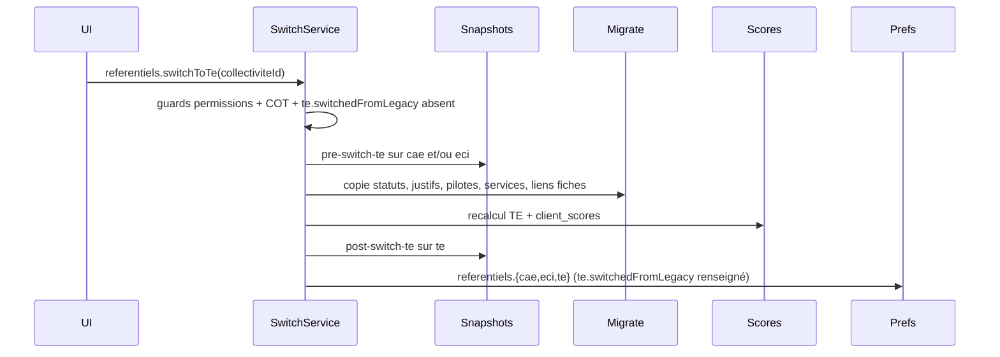

# feat: Bascule des référentiels CAE/ECI vers TE

## Overview

À l'ouverture du nouveau référentiel (`te`), les collectivités déjà actives sur CAE et/ou ECI conservent leurs référentiels historiques en écriture, tandis que TE est proposé en **lecture seule**. Chaque collectivité peut ensuite déclencher, **une fois pour toutes et sans retour en arrière**, une bascule manuelle qui :

- fige les anciens référentiels en lecture seule (archives consultables),
- copie physiquement les données pertinentes vers `te_*` via le mapping catalogue `action_origine`,
- recalcule les scores TE et enregistre des snapshots `pre-switch-te` et `post-switch-te`.

Les collectivités **sans aucune donnée CAE/ECI** démarrent directement sur TE en écriture (CAE/ECI masqués), sans bouton de bascule.

Le travail est découpé en **10 PRs** (+ 1 optionnelle reportée), précédées par des décisions produit validées en session de cadrage.

## Problem Statement / Motivation

Aujourd'hui :

- Le référentiel TE existe côté plateforme (import, scoring, feature flag `is-referentiel-te-enabled`), mais **aucune bascule collectivité** n'est implémentée.
- `collectivite.preferences.referentiels` ne porte qu'un booléen `display` par référentiel (navigation), sans `mode` ni traçabilité de bascule (`te.switchedFromLegacy`).
- Les données collectivité sont indexées par `action_id` préfixé (`cae_*`, `eci_*`, `te_*`) ; seul le catalogue porte la correspondance TE → sources via `action_origine`.
- Le scoring TE peut être déduit des avancements CAE/ECi à la volée (`avecReferentielsOrigine`), mais cela ne remplace pas une migration physique ni un état « basculé » explicite.

Sans bascule structurée, les CT existantes devraient tout ressaisir sur TE, ou resteraient dans une coexistence ambiguë (double saisie, questions de personnalisation incohérentes, exports fragiles).

## Proposed Solution

### États par référentiel et par collectivité

Extension de `collectivite.preferences.referentiels` :

```typescript
type ReferentielPreference = {
  display: boolean;
  mode: 'write' | 'readonly' | 'archived';
};

type ReferentielPreferenceTE = ReferentielPreference & {
  switchedFromLegacy?: { switchedAt: string; switchedBy: string }; // absent avant bascule depuis CAE/ECI
};

referentiels: {
  cae: ReferentielPreference;
  eci: ReferentielPreference;
  te: ReferentielPreferenceTE;
}
```

Invariants Zod : `mode === 'archived'` implique `display === false`.

**Règles initiales (migration + feature flag) :**

| Profil CT | `te` | `cae` / `eci` | Bouton bascule |
|---|---|---|---|
| Avec données CAE/ECI | `mode: readonly`, `display: true` | `mode: write`, `display: true` | Visible (si éligible) |
| Sans données CAE/ECI | `mode: write`, `display: true`, sans `switchedFromLegacy` | `mode: archived`, `display: false` | Masqué |

**Après bascule (`te.switchedFromLegacy` renseigné) :**

| Référentiel | `mode` | `display` | `switchedFromLegacy` |
|---|---|---|---|
| `te` | `write` | `true` | renseigné |
| `cae` / `eci` actifs | `archived` | `false` (hors menu principal) | — |

Les référentiels archivés restent accessibles via un **lien sur le TdB EDL** et par URL directe, en lecture seule.

### Flux de bascule (transactionnel)



### Architecture en modules (deep modules)

```
collectivite.preferences.referentiels ({cae, eci}: ReferentielPreference ; te: ReferentielPreferenceTE)
        │
        ▼
CollectiviteReferentielModeService — lecture / mise à jour atomique des modes
        │
        ▼
ReferentielModeGuard — refuse toute mutation si mode ≠ write (backend)
        │
        ▼
SwitchToTeService — orchestration transactionnelle (Result ADR 0012)
        ├── guards COT + permissions + idempotence (`te.switchedFromLegacy` absent)
        ├── SnapshotsService (pre/post bascule)
        ├── MigrateCollectiviteDataService (copie via action_origine)
        └── ScoresService (recalcul TE)
        │
        ▼
merge-rules (fonctions pures) — max statut, concat justifications, dédup pilotes/services/fiches
```

### Stack de PRs

```
PR1 — Schéma preferences + migration init + guards backend
PR2 — UI lecture seule (bandeaux, nav EDL, lien archives TdB)
PR3 — SwitchToTeService (orchestration + snapshots pre-bascule + guards COT)
PR4 — Migration données collectivité (copie physique via action_origine)
PR5 — Recalcul scores TE + snapshot post-switch-te
PR6 — UI bascule (bouton + modale warning)
PR7 — Masquage questions / personnalisations des réf. archivés
PR8 — Export score-comparaison : feuille personnalisations
PR9 — (optionnelle, reportée) Migration discussions ouvertes
PR10 — Nettoyage post-lancement (ResetDisplayPreferencesService, etc.)
```

Ordre de merge : `PR1 → PR2 → PR3 → PR4 → PR5 → PR6 → PR7 → PR8` ; PR9 en parallèle après PR4 si décidé ; PR10 après mise en prod stable.

## User Stories

### Lecture seule et navigation

1. En tant que membre d'une CT existante avec données CAE/ECI, je veux voir le référentiel TE en lecture seule, afin de découvrir la nouvelle structure sans risquer d'y saisir des données isolées.
2. En tant que membre d'une CT existante, je veux continuer à modifier CAE et/ou ECI jusqu'à la bascule, afin de finaliser mon état des lieux historique.
3. En tant que membre d'une CT sans donnée CAE/ECI, je veux démarrer directement sur TE en écriture comme seul référentiel visible, afin de ne pas passer par une étape de bascule inutile.
4. En tant que lecteur référentiel, je veux voir un bandeau explicite sur un référentiel en lecture seule ou archivé, afin de comprendre pourquoi je ne peux pas éditer.
5. En tant que membre d'une CT ayant basculé, je veux accéder à mes anciens référentiels CAE/ECI via un lien sur le TdB EDL, afin de consulter l'historique sans encombrer le menu principal.
6. En tant que membre d'une CT ayant basculé, je veux que les entrées CAE/ECI disparaissent du menu EDL, afin de me concentrer sur TE.

### Bascule

7. En tant qu'éditeur ou admin référentiel (`referentiels.mutate`), je veux déclencher la bascule TE via un bouton explicite, afin de migrer mon travail vers le nouveau référentiel quand je suis prêt.
8. En tant qu'éditeur, je veux une modale d'avertissement listant ce qui est migré et ce qui ne l'est pas, afin de valider en connaissance de cause une action irréversible.
9. En tant que CT, je veux que la bascule soit impossible une seconde fois, afin d'éviter toute corruption par double exécution.
10. En tant que CT COT sans audit COT validé, je veux voir le bouton de bascule désactivé avec un message explicite, afin de comprendre que je dois d'abord clôturer mon audit COT.
11. En tant que CT COT avec un audit en cours, je veux que la bascule soit bloquée, afin de ne pas perturber le cycle d'audit en cours.

### Données migrées

12. En tant que CT ayant basculé, je veux retrouver sur TE les statuts de mes mesures (règle : max des sources en cas de fusion CAE+ECI), afin de ne pas tout ressaisir.
13. En tant que CT ayant basculé, je veux retrouver mes justifications (`action_commentaire`), concaténées par blocs source (`[CAE <identifiant mesure>]`, `[ECI <identifiant mesure>]`), afin de conserver la traçabilité en cas de fusion 1→N.
14. En tant que CT ayant basculé, je veux retrouver mes personnes et services pilotes sur les mesures TE, afin de poursuivre le pilotage sans reconfiguration.
15. En tant que CT ayant basculé, je veux que les liens entre fiches plan d'action et mesures référentiel pointent vers les mesures TE, afin de garder la cohérence de mon plan d'action.
16. En tant que CT ayant basculé, je veux des scores TE recalculés à partir des statuts migrés, afin d'obtenir un état des lieux cohérent immédiatement après bascule.

### Données non migrées / figées

17. En tant que CT ayant basculé, je veux que mes réponses de personnalisation CAE/ECI ne soient plus affichées dans le parcours courant, afin d'éviter la confusion avec les questions TE.
18. En tant que CT ayant basculé, je veux pouvoir retrouver mes réponses de personnalisation historiques via le snapshot pre-bascule ou l'archive lecture seule, afin de conserver une trace auditable.
19. En tant que CT ayant basculé, je veux récupérer mes documents cadres / structurants via la bibliothèque de documents, sachant qu'ils ne sont pas re-liés automatiquement aux mesures TE.
20. En tant que CT, je veux qu'un snapshot `pre-switch-te` soit créé pour chaque référentiel CAE/ECI actif avant migration, afin de figer l'état pré-bascule.
21. En tant que CT, je veux qu'un snapshot `post-switch-te` soit créé sur TE après recalcul, afin de marquer l'état initial TE post-migration.

### Post-bascule UX

22. En tant que CT ayant basculé, je ne veux plus voir les boutons « voir / compléter les questions » des anciens référentiels sur les pages mesures, afin de ne traiter que les personnalisations TE.
23. En tant que CT ayant basculé, je veux que la page Personnalisation ne propose que les questions TE, afin de simplifier le parcours.

### Export

24. En tant que CT ayant basculé, je veux exporter un classeur score-comparaison incluant une feuille des questions et réponses de personnalisation issues du snapshot, afin d'archiver ou partager l'historique.
25. En tant que CT exportant en mode comparaison, je veux deux colonnes « réponses {jalon snapshot} », afin de comparer les réponses entre deux jalons.

### Exploitation / déploiement

26. En tant qu'équipe produit, je veux initialiser les modes via migration data et activer progressivement le feature flag TE, afin de tester en interne avant ouverture générale.
27. En tant qu'équipe technique/produit, je veux que la bascule enregistre `te.switchedFromLegacy.switchedBy` et `switchedAt`, afin de tracer qui a basculé et quand.

## Technical Approach

### Décisions produit actées

| Sujet | Décision |
|---|---|
| Modèle de migration | Copie physique vers `te_*` à la bascule |
| État par référentiel | `preferences.referentiels.{cae,eci,te}` (`display` + `mode`) ; traçabilité bascule sur `te.switchedFromLegacy` |
| Qui bascule | Permission `referentiels.mutate` (éditeur + admin) |
| Nouvelles CT | Sans donnée CAE/ECI → `te: { mode: write, display: true }` (sans `switchedFromLegacy`), `cae/eci: { mode: archived, display: false }` |
| COT | Bascule bloquée tant qu'audit COT (`sujet=cot`) non validé ; bloquer aussi si audit en cours |
| Fusion 1→N (CAE+ECI → TE) | Statut = max des sources ; justifications concaténées par blocs source ; pilotes et services = union dédupliquée |
| Personnalisations | Non migrées — figées dans snapshot pre-bascule |
| Documents (`preuve_*`) | Non migrés |
| Scores | Recalcul TE post-copie ; snapshots pre/post bascule |
| Discussions (`discussion*`) | **Reporté** — PR optionnelle ultérieure |
| Accès archives | Lien TdB EDL + URL directe |
| Déploiement | Migration init des `mode` + feature flag progressif |

### PR1 — Fondation : schéma preferences + guards backend

- Étendre le schéma Zod domain (`collectivite-preferences.schema.ts`) : `ReferentielPreference`, `ReferentielPreferenceTE` (avec `switchedFromLegacy` optionnel) et persistance JSONB.
- Migration Sqitch : restructurer `display` plat vers `{ cae, eci, te }` et initialiser `mode` selon la présence de données `cae_*` / `eci_*` (`action_statut` ou `action_commentaire`).
- `CollectiviteReferentielModeService` : lecture et mise à jour atomique par référentiel.
- Guard sur les mutations référentiel (statuts, commentaires, pilotes, preuves complémentaires…) : `referentiels[referentielId].mode === 'write'`.
- Tests unitaires des règles de dérivation + e2e guard minimal.

### PR2 — UI lecture seule + bandeaux

- Bandeau informatif quand `referentiels[ref].mode !== 'write'`.
- Nav EDL : respecter `referentiels[ref].display` + masquer `archived`.
- Désactiver les contrôles d'édition côté app (complément du guard backend).
- Lien « Consulter mes anciens référentiels » sur le TdB EDL.
- Brancher le feature flag `is-referentiel-te-enabled`.

### PR3 — Service de bascule (orchestration + snapshots pre-bascule)

- `SwitchToTeService` avec pattern `Result` (ADR 0012).
- Endpoint tRPC `referentiels.switchToTe`.
- Guards : `te.switchedFromLegacy` absent, `referentiels.mutate`, audit COT validé, pas d'audit en cours.
- Snapshots `pre-switch-te` par réf. CAE/ECI actif (payload incluant `personnalisation_reponses`).
- Mise à jour `preferences` : `referentiels.{cae,eci,te}` avec `te.switchedFromLegacy` renseigné.
- **Tracer bullet possible** : snapshots + flip preferences avant migration complète (PR4).

### PR4 — Migration des données collectivité

Nouveau module `MigrateCollectiviteDataService` s'appuyant sur `action_origine` :

| Entité | Règle |
|---|---|
| `action_statut` | Max des statuts sources par mesure TE |
| `action_commentaire` | Concat `[CAE identifiant] texte` / `[ECI identifiant] texte` |
| `action_pilote` | Union dédupliquée |
| `action_service` | Union dédupliquée des `service_tag_id` (plusieurs services par mesure, cf. PK SQL) |
| `fiche_action_action` | Réécriture `action_id` → `te_*`, dédup si fusion |

**Non migré** : `preuve_*`, `reponse_*`, `justification` (personnalisation), `discussion*`.

**Correctif schéma Drizzle embarqué** : `action-service.table.ts` déclare à tort une PK `(collectivite_id, action_id)` alors que le SQL autorise plusieurs services par mesure (`PRIMARY KEY (collectivite_id, action_id, service_tag_id)` — voir `data_layer/sqitch/deploy/referentiel/action_service.sql`). À corriger dans cette PR pour aligner Drizzle avec la BDD ; le service `HandleMesureServicesService` gère déjà un tableau de services.

Fonctions pures de fusion testables en isolation (`mergeStatuts`, `mergeJustifications`, etc.).

### PR5 — Scores post-bascule + snapshot `post-switch-te`

- Recalcul via `ScoresService` sur `te`.
- Persistance `client_scores`.
- Snapshot `post-switch-te` sur `te`.
- Intégration transactionnelle dans `SwitchToTeService`.

### PR6 — UI bascule (bouton + modale)

- CTA visible si `referentiels.te.mode === 'readonly'` et CT éligible.
- Modale indiquant que la migration est irréversible et listant ce qui sera migré / non migré.
- CTA disabled + message COT.
- Masqué pour CT sans données CAE/ECI.
- Emplacement exact (TdB EDL vs page TE) : **à trancher en review UI**.

### PR7 — Post-bascule : personnalisations et questions

- `list-personnalisation-questions` : exclure réf. `archived`.
- Pages mesures : retirer boutons questions pour archivés.
- Page personnalisation : TE seul après bascule.

### PR8 — Export score-comparaison : feuille personnalisations

- Nouvelle feuille alimentée par `personnalisation_reponses` du snapshot.
- Mode comparaison : 2 colonnes réponses par jalon.
- Extension de `export-score-comparison` / `build-rows`.

### PR9 (optionnelle) — Discussions ouvertes

- Migrer `discussion` + `discussion_message` avec `status=ouvert` vers mesure TE.
- Décision produit reportée (options : ouvertes seules vs aucune migration).

### PR10 — Nettoyage post-lancement

- Supprimer `ResetDisplayPreferencesService` (temporaire, en attente sortie TE).
- Retirer `affichage-referentiels.page.tsx` si obsolète.

## Testing Decisions

Un bon test vérifie le **comportement externe** (entrée → sortie) sans se coupler aux détails d'implémentation.

### Modules à tester en priorité

| Module | Type de test | Cas clés |
|---|---|---|
| Règles de dérivation `referentiels.{ref}` | Unitaire | CT avec/sans données CAE/ECI ; post-bascule avec `te.switchedFromLegacy` ; invariant archived → display false |
| `mergeStatuts` / `mergeJustifications` | Unitaire pur | 1→1, 1→N CAE+ECI, pondération, mesure `nouvelle` sans origine |
| `ReferentielModeGuard` | e2e backend | Mutation refusée si `readonly` / `archived` |
| `SwitchToTeService` guards | e2e backend | COT non validé, double bascule, permissions |
| Bascule complète | e2e backend | Snapshots pre/post créés, scores TE cohérents, preferences mises à jour |
| Bandeaux + nav | e2e Playwright | `readonly` / `archived`, lien archives TdB |
| Modale bascule | e2e Playwright | CTA disabled COT, succès bascule |
| Export personnalisations | e2e backend | Feuille snapshot, mode comparaison 2 colonnes |

### Prior art

- Guards permissions : `action-access-rights.spec.ts`, routers e2e référentiels.
- Snapshots : `snapshots.router.e2e-spec.ts`, conventions `pre-audit`.
- Export : `export-score-comparison.controller.e2e-spec.ts`.
- COT : `request-labellisation-audit-cot.spec.ts`.
- Fusion scoring origine : `scores.service.ts` `computeScoreFromReferentielsOrigine` (référence logique, pas le comportement final post-copie).

## Out of Scope

- Migration des documents / preuves (`preuve_reglementaire`, `preuve_complementaire`, etc.) — récupération manuelle via bibliothèque.
- Migration des réponses de personnalisation vers TE.
- Migration des fils de discussion (PR9 optionnelle, décision reportée).
- Bascule automatique sans action utilisateur.
- Retour arrière (rollback) après bascule.
- Version de référentiel par collectivité (la version TE reste globale plateforme).
- Suppression physique des données CAE/ECI (archivage logique via `referentiels[ref].mode = archived`).

## Dependencies & Risks

### Dépendances

- PR2 dépend de PR1 (modes exposés).
- PR3 dépend de PR1 ; peut précéder PR4 en tracer bullet.
- PR4 + PR5 complètent PR3 (bascule bout-en-bout).
- PR6 dépend de PR3 (endpoint) ; PR7–PR8 indépendants après bascule fonctionnelle.
- Feature flag `is-referentiel-te-enabled` pour rollout progressif.
- Table catalogue `action_origine` à jour (import référentiel TE).

### Risques

| Risque | Impact | Mitigation |
|---|---|---|
| Transaction volumineuse (timeout DB) | Bascule partielle | Transaction bornée, idempotence, logs `te.switchedFromLegacy` |
| Fusion 1→N ambiguë (statut, justification) | Données incohérentes | Règles pures testées exhaustivement |
| Dédup liens fiches | Doublons ou liens perdus | Tests 1 fiche → CAE + ECI → 1 mesure TE |
| URL directe sur réf. archivé | Édition malgré archivage | Guard backend `referentiels[ref].mode !== write` même si UI désactivée |
| Discussions non migrées | Perte de fils ouverts | PR9 optionnelle ; message explicite dans modale |

## Open Questions

1. **Emplacement CTA bascule** : TdB EDL vs page TE.
2. **PR9 discussions** : migrer les ouvertes uniquement, ou aucune migration.
3. **Jalons snapshot** : nouveaux enum `pre_switch_te` / `post_switch_te` vs `date_personnalisee` avec ref préfixée.

## Further Notes

- ADR 0012 : `SwitchToTeService` et guards exposent des `Result<…, erreur typée>`, conversion tRPC au routeur.
- `ResetDisplayPreferencesService` est explicitement temporaire en attendant la sortie TE — remplacé par le modèle `referentiels.{ref}` + migration init.
- Le scoring `avecReferentielsOrigine` reste utile en bac à sable mais n'est **pas** le mécanisme de bascule production (copie physique + recalcul standard).
- Feedback rapide possible après PR1+PR2 (lecture seule visible) ou PR3 (snapshots sans migration complète).

## Sources & References

### Origin

- Description fonctionnelle issue d'un ticket interne + cadrage approfondi en session (juin 2026).

### Internal References

- **Préférences collectivité** : `packages/domain/src/collectivites/collectivite-preferences.schema.ts`
- **Mapping catalogue** : `action_origine`, `import-referentiel.service.ts`
- **Scoring projection origine** : `scores.service.ts` (`computeScoreFromReferentielsOrigine`)
- **Snapshots** : `snapshots.service.ts`, `snapshot-jalon.enum.ts`
- **COT / audit** : `request-labellisation.rules.ts`, `start-new-audit-cycle.rules.ts`
- **Export comparaison** : `export-score-comparison.service.ts`, `load-score-comparison.service.ts`
- **Feature flag TE** : `packages/domain/src/utils/feature-flags.ts`
- **Temporaire à retirer** : `reset-display-preferences.service.ts`

### ADRs

- `doc/adr/0012-pattern-result.md` — pattern Result pour services publics backend
