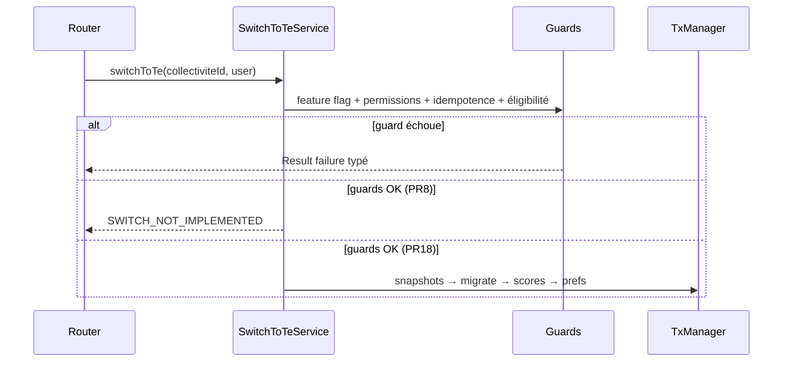

# PR8 — Service de bascule (squelette)

**Parent** : [doc/plans/2026-06-11-001-feat-bascule-referentiel-te-prd.md](doc/plans/2026-06-11-001-feat-bascule-referentiel-te-prd.md)

**Branche** : `TE-7303/switch-te-PR8` depuis `main` (PR4 mergé ; PR5–PR7 parallélisables, non bloquants)

**Estimation** : ~500 LOC (code + tests e2e)

---

## Contexte

PR4 a posé [`CollectiviteReferentielModeService`](apps/backend/src/collectivites/collectivite-referentiel-mode/collectivite-referentiel-mode.service.ts) et [`ReferentielModeGuard`](apps/backend/src/collectivites/collectivite-referentiel-mode/referentiel-mode-guard.service.ts). Le repository prefs accepte déjà `tx?` ([`collectivite-preferences.repository.ts`](apps/backend/src/collectivites/collectivite-preferences/collectivite-preferences.repository.ts) L33–L68) mais `updateReferentielPreferences` du mode service ne le propage pas encore (reporté en PR4).

PR8 crée l’orchestrateur vide que PR9–PR17 brancheront étape par étape ; PR18 complète la transaction et retire le garde squelette.



---

## Décisions actées

| Sujet | Décision |
|---|---|
| Verrouillage prod PR8–PR17 | Feature flag `is-referentiel-te-enabled` via `TrackingService.isFeatureEnabled` (même pattern que [`list-personnalisation-questions.service.ts`](apps/backend/src/collectivites/personnalisations/list-personnalisation-questions/list-personnalisation-questions.service.ts)) |
| Comportement squelette | Après guards OK → `failure(SWITCH_NOT_IMPLEMENTED)` ; PR18 remplace par l’orchestration réelle |
| Permission | `REFERENTIELS.MUTATE` sur la collectivité |
| Idempotence | `te.populatedFromCaeEci` absent |
| Éligibilité | `canSwitchToTe(prefs)` : TE `readonly` + pas encore basculé + **au moins un ref. CAE/ECI en `write`** (proxy du niveau de remplissage déjà encodé par `deriveReferentielPreferences`) |
| `ReferentielModeGuard` | **Non utilisé** — `switchToTe` est une exception explicite (cf. plan PR4) |
| `tx?` | Propager sur `CollectiviteReferentielModeService.updateReferentielPreferences` ; shell `TransactionManager.executeSingle` préparé mais vide en PR8 |

---

## 1. Règle domaine pure

**Fichier** : `packages/domain/src/collectivites/can-switch-to-te.rules.ts`

Le niveau de remplissage n'est **pas recalculé** à la bascule (pas d'I/O dans le domaine). Il est **encodé dans les prefs** par `deriveReferentielPreferences` / le batch reset : une CT engagée a au moins un ref. CAE ou ECI en `mode: write` ; une CT non engagée a `te: write` et CAE/ECI `archived`.

```typescript
export function canSwitchToTe(
  prefs: CollectiviteReferentielPreferences
): boolean {
  if (prefs.te.populatedFromCaeEci) return false;
  if (prefs.te.mode !== 'readonly') return false;
  // proxy engagement : au moins une source encore en écriture
  return prefs.cae.mode === 'write' || prefs.eci.mode === 'write';
}
```

**Cas limites** :

| État prefs | `canSwitchToTe` | Interprétation |
|---|---|---|
| `te: readonly`, `cae: write`, `eci: archived` | `true` | CAE engagé — bascule possible |
| `te: write`, `cae/eci: archived` | `false` | CT non engagée — démarrage TE direct |
| `te: readonly`, `cae/eci: archived` | `false` | Aucune source à migrer |
| `te.populatedFromCaeEci` renseigné | `false` | Déjà basculé |

> **État transitoire pré-batch** (PRD) : migration Sqitch met toutes les CT en `te: readonly` avant le batch reset. Une CT non engagée peut passer le guard prefs-proxy tant que CAE/ECI restent en `write`. Mitigation ops : batch reset avant levée du flag TE ; en PR8 le squelette retourne `SWITCH_NOT_IMPLEMENTED` de toute façon.

**Tests unitaires** (`can-switch-to-te.rules.spec.ts`) : couvrir le tableau ci-dessus.

- Export dans `packages/domain/src/collectivites/index.ts`
- Réutilisable en PR19 (CTA UI) sans duplication

---

## 2. Feature backend `switch-to-te/`

Emplacement : `apps/backend/src/referentiels/switch-to-te/` (convention ADR 0011)

| Fichier | Rôle |
|---|---|
| `switch-to-te.input.ts` | `{ collectiviteId: z.number() }` |
| `switch-to-te.output.ts` | Stub PR8 : `{ status: 'not_implemented' }` ; PR18 : `{ populatedAt, populatedBy }` |
| `switch-to-te.errors.ts` | Erreurs typées + config tRPC |
| `switch-to-te.service.ts` | Guards + squelette |
| `switch-to-te.router.ts` | `authedProcedure` + `createTrpcErrorHandler` |
| `switch-to-te.router.e2e-spec.ts` | Tests guards |

### Erreurs spécifiques

| Code | tRPC | Message (indicatif) |
|---|---|---|
| `REFERENTIEL_TE_DISABLED` | `FORBIDDEN` | Le référentiel TE n'est pas activé pour cette collectivité |
| `ALREADY_SWITCHED` | `CONFLICT` | La bascule vers TE a déjà été effectuée |
| `NOT_ELIGIBLE` | `BAD_REQUEST` | Cette collectivité n'est pas éligible à la bascule (TE non en lecture seule ou aucun référentiel CAE/ECI engagé) |
| `SWITCH_NOT_IMPLEMENTED` | `NOT_IMPLEMENTED` | La bascule n'est pas encore disponible (retiré en PR18) |
| `UNAUTHORIZED` | `FORBIDDEN` | (common) |

### `SwitchToTeService.switchToTe`

Ordre des guards (hors transaction, état commité — cf. plan PR4) :

1. `trackingService.isFeatureEnabled('is-referentiel-te-enabled', user.id, collectiviteId)`
2. `permissionService.isAllowed(user, REFERENTIELS.MUTATE, COLLECTIVITE, collectiviteId, true)`
3. `collectiviteReferentielModeService.getReferentielPreferences(collectiviteId)`
4. Si `te.populatedFromCaeEci` → `ALREADY_SWITCHED`
5. Si `!canSwitchToTe(prefs)` → `NOT_ELIGIBLE`
6. **PR8** : `failure(SWITCH_NOT_IMPLEMENTED)`
7. **PR18** (hors scope PR8) : `transactionManager.executeSingle(async (tx) => { … })`

Signature service : `switchToTe(collectiviteId, { user }: ServiceSecondArg)` — pas de `tx` exposé au routeur en PR8.

---

## 3. Propagation `tx?` sur le mode service

Modifier [`collectivite-referentiel-mode.service.ts`](apps/backend/src/collectivites/collectivite-referentiel-mode/collectivite-referentiel-mode.service.ts) :

```typescript
async updateReferentielPreferences(
  collectiviteId: number,
  referentiels: CollectiviteReferentielPreferences,
  tx?: Transaction
)
```

Déléguer à `repository.updatePreferences(collectiviteId, { referentiels }, tx)`.

---

## 4. Câblage module + routeur

### `ReferentielsRouter`

Ajouter via `mergeRouters` pour obtenir `referentiels.switchToTe` (pas de double nesting) :

```typescript
router = this.trpc.mergeRouters(
  this.trpc.router({ actions: ..., preferences: ..., ... }),
  this.switchToTeRouter.router  // { switchToTe: procedure }
);
```

### `ReferentielsModule`

- Providers : `SwitchToTeService`, `SwitchToTeRouter`
- Import `TrackingModule` si pas déjà transitif (vérifier via `CollectivitesModule` / `UtilsModule`)

---

## 5. Stratégie de tests

Fichier : `switch-to-te.router.e2e-spec.ts`

Setup : `addTestCollectiviteAndUser` + prefs via `collectivites.preferences.update` (super-admin), comme [`referentiel-mode-guard.router.e2e-spec.ts`](apps/backend/src/collectivites/collectivite-referentiel-mode/referentiel-mode-guard.router.e2e-spec.ts).

| Scénario | Prefs / rôle | Attendu |
|---|---|---|
| Succès guards (squelette) | `te: readonly`, CAE `write`, user admin | `SWITCH_NOT_IMPLEMENTED` |
| Déjà basculé | `te.populatedFromCaeEci` renseigné | `ALREADY_SWITCHED` |
| Non éligible — CT non engagée | `te: write`, CAE/ECI `archived` | `NOT_ELIGIBLE` |
| Non éligible — aucune source | `te: readonly`, CAE/ECI `archived` | `NOT_ELIGIBLE` |
| Sans permission | user lecture seule | `UNAUTHORIZED` |

Le **feature flag** (`REFERENTIEL_TE_DISABLED`) n'est pas testé : le flag `is-referentiel-te-enabled` est toujours `true` en dev/ci (non basculable en E2E) et le guard est trivial (`if (!enabled) return failure(...)`). Un test unitaire mocké n'apporterait qu'une couverture de câblage, à contre-courant de la préférence E2E du backend.

Commande : `pnpm test:backend switch-to-te`

---

## 6. Hors scope PR8 (PRs suivantes)

| PR | Ajout dans `SwitchToTeService` |
|---|---|
| PR9 | Guards COT / demande d'audit / audit en cours |
| PR10 | Snapshots `pre-switch-te` |
| PR12–PR17 | `mergeStatuts`, migration données |
| PR18 | Transaction complète, prefs + `populatedFromCaeEci`, retrait `SWITCH_NOT_IMPLEMENTED` |
| PR19–PR20 | UI CTA + modale (appelle `referentiels.switchToTe`) |

---

## 7. Ordre d'implémentation (tracer bullet)

1. Règle domaine `canSwitchToTe` + tests unitaires
2. `switch-to-te.errors.ts` + input/output
3. `SwitchToTeService` (guards + squelette)
4. `tx?` sur `CollectiviteReferentielModeService`
5. `SwitchToTeRouter` + merge dans `ReferentielsRouter` + module
6. E2E guards + `pnpm test:backend switch-to-te`

---

## Critères de done

- [ ] `canSwitchToTe` testée en unitaire
- [ ] Endpoint `referentiels.switchToTe` typé dans `AppRouter`
- [ ] Guards : feature flag, `REFERENTIELS.MUTATE`, idempotence, éligibilité `canSwitchToTe` (readonly + source CAE/ECI en write)
- [ ] Aucune écriture DB en PR8 (pas de prefs modifiées, pas de migration)
- [ ] `updateReferentielPreferences(..., tx?)` propagé jusqu'au repository
- [ ] E2E : 5 scénarios guards ci-dessus (squelette, idempotence, 2× éligibilité, permission)
- [ ] Feature flag non testé (flag toujours `true` en CI, guard trivial) — documenté
- [ ] Déployable en prod sans risque utilisateur (squelette + flag TE requis)
