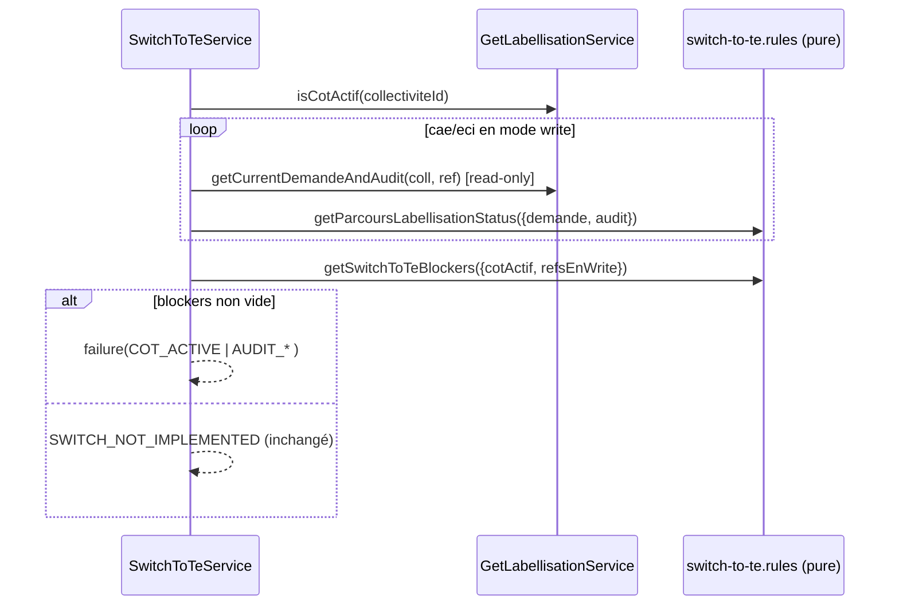

# PR9 — Guards COT / demande / audit

**Parent** : [doc/plans/2026-06-11-001-feat-bascule-referentiel-te-prd.md](doc/plans/2026-06-11-001-feat-bascule-referentiel-te-prd.md)
**Branche** : `TE-7303/switch-te-PR9` depuis `main` (PR8 mergé)
**Estimation** : ~350 LOC (code + tests) — endpoint toujours **non exposé prod** (SWITCH_NOT_IMPLEMENTED conservé jusqu'à PR18)

## Contexte

PR8 a posé `[SwitchToTeService](apps/backend/src/referentiels/switch-to-te/switch-to-te.service.ts)` avec les guards feature-flag / permission / idempotence / éligibilité, puis retourne `SWITCH_NOT_IMPLEMENTED`. PR9 insère un guard supplémentaire **entre `canSwitchToTe` et `SWITCH_NOT_IMPLEMENTED`** : blocage si COT actif ou si une demande/audit est en cours sur un référentiel CAE/ECI encore en `mode: write`.

Modèle d'état existant réutilisé :

- `cot.actif` — [cot.table.ts](apps/backend/src/referentiels/labellisations/cot.table.ts).
- Statut par référentiel dérivé par la fonction pure `getParcoursLabellisationStatus({demande, audit})` — [request-labellisation.rules.ts](packages/domain/src/referentiels/labellisations/request-labellisation/request-labellisation.rules.ts) : `demande_envoyee` = « demande d'audit en cours », `audit_en_cours` = « audit en cours ».

## Décisions actées

- **COT** : blocage **strict** sur `cot.actif === true` (littéral PRD ; désactivation COT = ops/support après audit final). Ne PAS réutiliser `isCot()` qui teste seulement l'existence de la ligne.
- **Détection audit/demande** : lectures **read-only légères** (pas `getOrCreateCurrentAuditAndDemande` qui crée des lignes) + fonction pure `getParcoursLabellisationStatus`.
- **Structure** : méthode réutilisable renvoyant des blocages structurés `{ type, referentiel? }` ; le guard convertit le 1er blocage en **3 erreurs typées** (`COT_ACTIVE`, `AUDIT_REQUEST_IN_PROGRESS`, `AUDIT_IN_PROGRESS`).
- **Placement** : logique pure dans `switch-to-te.rules.ts` **co-localisée avec le service** (`apps/backend/src/referentiels/switch-to-te/`) ; I/O dans `SwitchToTeService` ; extension de `GetLabellisationService`. Types `ParcoursLabellisationStatus` / `ReferentielId` importés de `@tet/domain`.
- **Portée refs** : uniquement `cae`/`eci` en `mode: write` (un ref `archived` avec un vieil audit n'est PAS bloquant).
- **Non bloquant** : `audit_valide`, `non_demandee`, audit `clos`.

## Flux du guard




## Implémentation

### 1. Règle pure — `apps/backend/src/referentiels/switch-to-te/switch-to-te.rules.ts`

```typescript
export type SwitchToTeBlocker =
  | { type: 'COT_ACTIVE' }
  | { type: 'AUDIT_IN_PROGRESS'; referentiel: ReferentielId }
  | { type: 'AUDIT_REQUEST_IN_PROGRESS'; referentiel: ReferentielId };

export function getSwitchToTeBlockers(input: {
  cotActif: boolean;
  referentielsEnWrite: {
    referentiel: ReferentielId;
    status: ParcoursLabellisationStatus;
  }[];
}): SwitchToTeBlocker[]
```

- COT poussé en premier (niveau collectivité), puis par ref (`cae` avant `eci`) : `audit_en_cours` → `AUDIT_IN_PROGRESS`, `demande_envoyee` → `AUDIT_REQUEST_IN_PROGRESS`.
- Le type `SwitchToTeBlocker` (avec `referentiel`) est exporté depuis le module `switch-to-te`. Les éléments devant être partagés côté front seront, si nécessaire, extraits dans `@tet/domain` dans le cadre de la PR19.

### 2. Lectures read-only — [get-labellisation.service.ts](apps/backend/src/referentiels/labellisations/get-labellisation.service.ts)

- `isCotActif(collectiviteId)` : `select cot where collectiviteId and actif = true` (ne pas modifier `isCot()`).
- `getCurrentDemandeAndAudit(collectiviteId, referentielId)` : read-only, **sans création** — audit non-`clos` le plus récent (réutiliser la requête de `getCurrentAudit`) ; demande = celle liée (`audit.demandeId`) sinon la dernière demande du couple (coll, ref) ; retourne `{ demande, audit }` (nullable) au format attendu par `getParcoursLabellisationStatus`.

### 3. `SwitchToTeService` — [switch-to-te.service.ts](apps/backend/src/referentiels/switch-to-te/switch-to-te.service.ts)

- Injecter `GetLabellisationService`.
- Méthode `getSwitchToTeBlockers(collectiviteId, prefs)` : `isCotActif` + itération sur `['cae','eci']` filtrée `mode==='write'` (statuts en parallèle via `Promise.all`), délègue à la règle pure.
- Dans `switchToTe`, **après** `canSwitchToTe` et **avant** `SWITCH_NOT_IMPLEMENTED` : si blockers non vide → `failure` mappé sur le type du 1er blocage.

### 4. Erreurs — [switch-to-te.errors.ts](apps/backend/src/referentiels/switch-to-te/switch-to-te.errors.ts)

Ajouter aux `specificErrors` + entries tRPC :

- `COT_ACTIVE` → `FORBIDDEN`
- `AUDIT_REQUEST_IN_PROGRESS` → `CONFLICT`
- `AUDIT_IN_PROGRESS` → `CONFLICT`

Messages génériques (sans `{ref}`) ; la PR19 (UI) construira les messages détaillés par référentiel + liens à partir de `SwitchToTeBlocker`.

### 5. Câblage module

Vérifier que `GetLabellisationService` est fourni/importable dans le contexte de `SwitchToTeService` — [referentiels.module.ts](apps/backend/src/referentiels/referentiels.module.ts) (même module).

## Tests

- **Unitaires purs** `switch-to-te.rules.spec.ts` : COT seul ; `audit_en_cours` cae ; `demande_envoyee` eci ; ref `write` non bloquant (`audit_valide`/`non_demandee`) ; multi-blocages (ordre COT d'abord) ; ref hors `write` ignoré.
- **e2e** [switch-to-te.router.e2e-spec.ts](apps/backend/src/referentiels/switch-to-te/switch-to-te.router.e2e-spec.ts) (compléter l'existant) via fixtures `setCollectiviteAsCOT` et `createAudit` ([labellisations.test-fixture.ts](apps/backend/src/referentiels/labellisations/labellisations.test-fixture.ts)) :
  - COT actif (cae write) → `COT_ACTIVE`.
  - `createAudit({dateDebut, valide:false, clos:false})` sur cae write → `AUDIT_IN_PROGRESS`.
  - demande envoyée (audit `dateDebut:null` + `withDemande:true`, ou demande `enCours:false` seule) sur cae write → `AUDIT_REQUEST_IN_PROGRESS`.
  - Non bloquant : `createAudit({valide:true})` → `SWITCH_NOT_IMPLEMENTED`.
  - Ref archived ignoré : audit_en_cours sur cae `archived` + eci `write` engagé → `SWITCH_NOT_IMPLEMENTED`.

Commande : `pnpm test:backend switch-to-te`.

## Critères de done

- [ ] `getSwitchToTeBlockers` pure testée (co-localisée `switch-to-te.rules.ts`).
- [ ] `isCotActif` + `getCurrentDemandeAndAudit` read-only (aucune écriture/création).
- [ ] Guard inséré entre éligibilité et `SWITCH_NOT_IMPLEMENTED` ; 3 erreurs typées.
- [ ] e2e : COT, audit en cours, demande en cours, cas non bloquants, ref archived ignoré.
- [ ] Endpoint toujours non exposé prod (squelette conservé).
