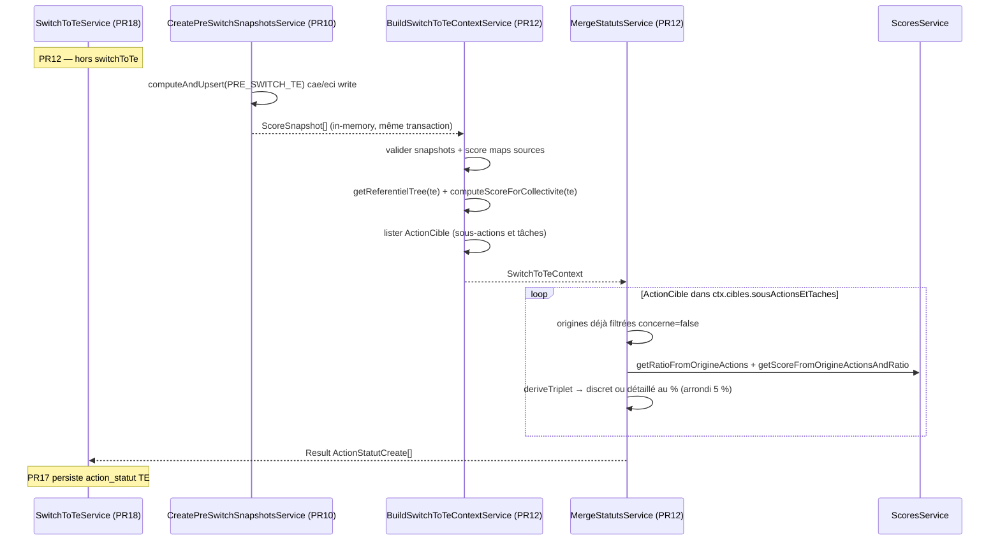

# PR12 — Fusion statuts (`mergeStatuts`)

**Parent** : [doc/plans/2026-06-11-001-feat-bascule-referentiel-te-prd.md](2026-06-11-001-feat-bascule-referentiel-te-prd.md)

**Branche** : `TE-7303/switch-te-PR12` depuis `main` (PR8 + PR10 mergés ; PR11 optionnelle)

**Estimation** : ~700 LOC (code + tests) — PR la plus volumineuse du lot migration ; **ne pas fragmenter**

**Prod** : Non (endpoint) — `switchToTe()` reste `SWITCH_NOT_IMPLEMENTED` jusqu'à PR18

> **Note — statut discret vs statut détaillé au %**  
> Après projection des points sources sur une action TE, on dérive un triplet `[fait, programme, pas_fait]` (fractions entre 0 et 1, somme = 1), puis on choisit le **type de statut** persisté — le même vocabulaire que dans l'app (`fait` / `programme` / `pas_fait` vs « Détaillé au % »).
>
> - **Statut discret** : un seul composant du triplet est « plein » (≥ `1 - ε`, les autres ≤ `ε`) — ex. `[1, 0, 0]`, ou résidu d'arrondi scoring `[0.999, 0, 0.001]`. On persiste `fait`, `programme` ou `pas_fait` — **pas d'arrondi 5 % TE**.
> - **Statut détaillé au %** (`detaille`) : au moins deux composants significatifs (> `ε`) — ex. `[0.74, 0, 0.26]` ou `[0.5, 0.5, 0]`. On applique l'arrondi inférieur au pas de 5 % sur `fait` et `programme`, puis `pas_fait = 1 - fait - programme`, et on persiste `detaille` + `statutDetailleAuPourcentage`.
>
> `ε` = `MERGE_STATUTS_STATUT_DISCRET_EPSILON` (`1e-3`), calibré sur l'arrondi à 3 décimales de `ScoresService` — **pas** `Number.EPSILON` (~`2e-16`), trop strict pour absorber les résidus `0.001` après `roundTo(3)`.
>
> Hors scope : `detaille_a_la_tache` (agrégation de tâches sur une sous-action) — le merge ne produit que discret ou `detaille` au %.

---

## Contexte

PR8 a posé `SwitchToTeService` (guards + idempotence). PR10 a introduit `CreatePreSwitchSnapshotsService` qui fige un snapshot `pre-switch-te` par ref. CAE/ECI en `mode: write` (score + `personnalisation_reponses` au moment T).

PR12 implémente la **règle de fusion des statuts** : pour chaque action **cible** (sous-action / tâche TE) ayant des correspondances `action_origine`, projeter les avancements sources vers un statut cohérent avec le pipeline de scoring, puis choisir **statut discret** ou **détaillé au %** (arrondi 5 % TE si détaillé).

PR12 pose aussi **`SwitchToTeContext`** — objet d'infrastructure partagé par tous les merges (PR13–PR16) : validation snapshots, score maps sources, arbre TE, score map TE, et **cibles** pré-résolues (`ActionCible`). Construit une fois via `BuildSwitchToTeContextService`, consommé par chaque `mergeXxx(ctx)`. Les types de bascule restent **dans le backend** (`switch-to-te/shared/`) — pas d'exposition dans `@tet/domain` (à distinguer de `ActionOrigine`, entité BDD du domaine).

Les tests e2e passent par un fixture commun.

PR17 branchera la persistance dans `MigrateCollectiviteDataService`. PR18 câblera l'orchestration transactionnelle complète.



---

## Décisions actées

| Sujet | Décision |
| ----- | -------- |
| Scores sources CAE/ECI | **Injection** des `ScoreSnapshot[]` retournés par `createPreSwitchSnapshots` (payload `scoresPayload` en mémoire) — **pas** de `SnapshotsService.get` ni de `computeScoreForCollectivite` sur les sources |
| Prérequis snapshots | **Strict** : `BuildSwitchToTeContextService` valide la présence d'un snapshot `pre-switch-te` par ref en `write` ; absent ou `collectiviteId` incohérent → `failure(PRE_SWITCH_SNAPSHOT_MISSING)` |
| Refs sources lues | Uniquement celles en `mode: write` (aligné PR10 — un `pre-switch-te` par ref engagée) |
| Potentiel TE | **Recalcul** `computeScoreForCollectivite('te', ...)` dans `BuildSwitchToTeContextService` — `teScoreMap` disponible pour tous les merges |
| Filtrage non concerné | Règle transverse PRD — factorisée dans `switch-to-te/shared/origine.rules.ts` ; appliquée à la construction des `ActionCible` |
| Cibles TE ↔ origines | `SwitchToTeContext.cibles.sousActionsEtTaches: ActionCible[]` — action **destination** + `actionsOrigine` (brutes) + `originesConcernees` (filtrées) + `concernee` ; évite duplication PR12/PR13 ; `cibles.mesures` en PR14–16 |
| Types bascule | **Backend only** (`apps/backend/.../switch-to-te/shared/`) — ne pas exporter dans `@tet/domain` ; `ActionCible` ≠ `ActionOrigine` (ligne BDD domaine) |
| Projection scoring | Déléguer à `ScoresService.getRatioFromOrigineActions` + `getScoreFromOrigineActionsAndRatio` — **pas** `computeScoreFromReferentielsOrigine` (privée, projection lecture seule) |
| Arrondi | **Uniquement si statut détaillé au %** : conversion en % entiers, `floor(ratio * 100 / 5) * 5` sur `fait` et `programme` ; `pas_fait% = 100 - fait% - programme%` |
| Discret vs détaillé | Détection **avant** arrondi, avec `MERGE_STATUTS_STATUT_DISCRET_EPSILON = 1e-3` : triplet compatible statut discret si un composant ≥ `1 - ε` et les autres ≤ `ε` → `fait`/`programme`/`pas_fait` **sans** arrondi ; sinon → arrondi 5 % → `detaille` |
| Statut final | `deriveStatutDiscret` ou `deriveStatutDetailleAuPourcentage` ; adapter BDD réservé à PR17 |
| Granularité cible | **Sous-actions + tâches** ayant au moins une ligne `action_origine` ; actions natives (sans origine) → absentes de `cibles` |
| `detaille_a_la_tache` source | Pas de chemin spécial : le snapshot `pre-switch-te` contient déjà `faitTachesAvancement` / `totalTachesCount` |
| Architecture | `SwitchToTeContext` + `ActionCible` + `BuildSwitchToTeContextService` (infra) ; `merge-statuts.rules.ts` (pures) ; `merge-statuts.service.ts` (métier, `merge(ctx)` sans I/O) |
| Persistance | **Calcul seulement** — retourne `ActionStatutCreate[]` ; PR17 fait adapter + upsert transactionnel |
| Câblage PR12 | Services isolés dans `switch-to-te/` ; **non branché** dans `switchToTe()` |
| Tests e2e | Setup via `switch-to-te-context.test-fixture.ts` (`createPreSwitchSnapshots` → `buildSwitchToTeContext`) — pattern réutilisable PR13+ |

---

## Implémentation

### 0) `SwitchToTeContext` — infrastructure + cibles

> Tous les fichiers ci-dessous dans `apps/backend/src/referentiels/switch-to-te/shared/` — **pas** dans `packages/domain`.

#### Primitives — `origine.rules.ts`

Fonctions pures réutilisées par le builder **et** par les merges à parcours custom (PR14–16) :

| Fonction | Rôle |
| -------- | ---- |
| `isOrigineConcernee` | `actionScore.concerne !== false` |
| `isCibleConcernee` | depuis `teScoreMap` — personnalisation TE prime sur les sources |
| `buildCorrelatedActionsWithScore` | `actionsOrigine` + score maps → `CorrelatedActionWithScore[]` |
| `filterOriginesConcernees` | filtre `isOrigineConcernee` |
| `getPointPotentiel` | `pointPotentiel` cible depuis `teScoreMap` |
| `actionScoreToCorrelatedActionScore` | `ActionScore` → points + avancement tâches |

> L'adapter `snapshot-to-correlated-action-with-score.adapter.ts` migre vers `origine.rules.ts` (`origine.rules.spec.ts`).

#### Action cible — `action-cible.ts`

```ts
/**
 * Action destination de la bascule + origines résolues depuis les snapshots pre-switch-te.
 * Artefact runtime backend — ne pas confondre avec ActionOrigine (entité BDD @tet/domain).
 */
export type ActionCible = {
  actionId: string;
  /** false si désactivée / non concernée par personnalisation TE */
  concernee: boolean;
  /** origines brutes (ordre arbre) — pour tri CAE puis ECI côté rules */
  actionsOrigine: CorrelatedAction[];
  /** origines avec score snapshot + filtre concerne !== false */
  originesConcernees: CorrelatedActionWithScore[];
};

export const listActionCiblesSousActionsEtTaches = (input: {
  referentielTe: ReferentielDefinition;
  scoreMapsByReferentiel: Map<ReferentielId, Map<string, ActionScore>>;
  teScoreMap: Map<string, ActionScore>;
}): ActionCible[]
```

Algorithme `listActionCiblesSousActionsEtTaches` :

1. `flatMapActionsEnfants(referentielTe.itemsTree)`.
2. Filtrer `SOUS_ACTION` / `TACHE` avec `actionsOrigine.length > 0`.
3. Pour chaque nœud : `originesConcernees = filterOriginesConcernees(buildCorrelatedActionsWithScore(...))`, `concernee = isCibleConcernee(teScoreMap, actionId)`.

> Le **niveau hiérarchique** est porté par la clé de collection (`sousActionsEtTaches`, puis `mesures`), pas par le nom du type `ActionCible`.

#### Type — `switch-to-te-context.ts`

```ts
export type SwitchToTeContext = {
  collectiviteId: number;
  /** refs sources en write au moment du build — dérivé des prefs, figé dans le contexte */
  sourceReferentiels: ReferentielId[];
  scoreMapsByReferentiel: Map<ReferentielId, Map<string, ActionScore>>;
  referentielTe: ReferentielDefinition;
  teScoreMap: Map<string, ActionScore>;
  cibles: {
    /** PR12, PR13 — origines directes sur sous-action / tâche */
    sousActionsEtTaches: ActionCible[];
    // PR14–16 : cibles.mesures: ActionCible[] — agrégation descendants + remontée ancêtre
  };
};
```

> `prefs` reste un **paramètre d'entrée** de `BuildSwitchToTeContextService.build(...)` (dérivation `sourceReferentiels` + validation snapshots), mais n'est **pas** stocké dans le contexte — les merges n'en ont pas besoin.

> **Pas dans le contexte PR12** : `cibles.mesures` (PR14–16), filtre « explication non vide » (rules PR13), données BDD pilotes/services/fiches.

#### Builder — `build-switch-to-te-context.service.ts`

```ts
@Injectable()
export class BuildSwitchToTeContextService {
  async build(
    collectiviteId: number,
    prefs: CollectiviteReferentielPreferences,
    preSwitchSnapshots: ScoreSnapshot[],
    { user }: ServiceSecondArg
  ): Promise<Result<SwitchToTeContext, SwitchToTeError>>
}
```

**Algorithme** :

1. Filtrer refs sources en `write` (`cae`, `eci`).
2. Indexer `preSwitchSnapshots` par `referentielId` (filtre `ref === PRE_SWITCH_TE_SNAPSHOT_REF`).
3. Pour chaque ref en `write`, valider snapshot présent + `collectiviteId` cohérent — sinon `PRE_SWITCH_SNAPSHOT_MISSING`.
4. Construire `scoreMapsByReferentiel` via `buildScoreMapByActionId(snapshot.scoresPayload.scores)`.
5. Charger l'arbre TE : `getReferentielService.getReferentielTree('te', true, true)`.
6. Recalculer score TE : `scoresService.computeScoreForCollectivite('te', collectiviteId, { avecReferentielsOrigine: false }, user)` → `teScoreMap`.
7. Construire `cibles.sousActionsEtTaches` via `listActionCiblesSousActionsEtTaches(...)`.
8. Retourner `success({ collectiviteId, sourceReferentiels, scoreMapsByReferentiel, referentielTe, teScoreMap, cibles })`.

**Injections** : `ScoresService`, `GetReferentielService`. Pas de `SnapshotsService`.

#### Fixture test — `switch-to-te-context.test-fixture.ts`

```ts
export async function buildSwitchToTeContextForTest(
  app: INestApplication,
  collectiviteId: number,
  prefs: CollectiviteReferentielPreferences,
  user: AuthenticatedUser,
  preSwitchSnapshots: ScoreSnapshot[]
): Promise<SwitchToTeContext>
```

Enchaîne `CreatePreSwitchSnapshotsService` (si snapshots non fournis) + `BuildSwitchToTeContextService.build(...)`.

### 1) Rules pures — `merge-statuts.rules.ts`

Fichier : `apps/backend/src/referentiels/switch-to-te/merge-statuts/merge-statuts.rules.ts`

Fonctions exportées (toutes pures, sans dépendance Nest/DB) :

| Fonction | Rôle |
| -------- | ---- |
| `MERGE_STATUTS_STATUT_DISCRET_EPSILON` | `1e-3` — aligné sur `ScoresService.DEFAULT_ROUNDING_DIGITS` |
| `deriveTripletFromProjectedPoints` | Calcule `[fait, programme, pas_fait]` en fractions depuis points projetés |
| `isTripletStatutDiscret` | `true` si triplet compatible statut discret (ε) |
| `deriveStatutDiscret` | Composant dominant → `fait` / `programme` / `pas_fait` |
| `arrondiTripletCinqPourcent` | Arrondi inférieur pas 5 % pour le chemin détaillé au % |
| `deriveStatutDetailleAuPourcentage` | `detaille` + `statutDetailleAuPourcentage` |
| `StatutProjectionInput` | Entrée rule : points projetés + `concernedSourceCount` (ex-`MergeStatutsProjectionContext`) |
| `deriveStatutFromProjection` | Orchestre le pipeline complet à partir de `StatutProjectionInput` |
| `toActionStatutCreate` | Mappe `DerivedMergeStatut` → `ActionStatutCreate` |

**Pipeline** `deriveStatutFromProjection` :

```
1. 0 source concernée        → NON_CONCERNE
2. points projetés tous à 0 → NON_RENSEIGNE
3. deriveTripletFromProjectedPoints
4. isTripletStatutDiscret ?
   oui → deriveStatutDiscret
   non → arrondiTripletCinqPourcent → deriveStatutDetailleAuPourcentage
```

### 2) Service — `merge-statuts.service.ts`

Fichier : `apps/backend/src/referentiels/switch-to-te/merge-statuts/merge-statuts.service.ts`

```ts
async merge(
  ctx: SwitchToTeContext
): Promise<Result<ActionStatutCreate[], SwitchToTeError>>
```

> **Pas d'I/O** dans ce service — tout est dans `ctx`. Injection : `ScoresService` uniquement (projection `getRatioFromOrigineActions` / `getScoreFromOrigineActionsAndRatio`).

**Algorithme** :

1. Itérer `ctx.cibles.sousActionsEtTaches` (pas de re-parcours arbre ni re-filtre concerne).
2. Pour chaque `cible` :
   - `pointPotentiel = getPointPotentiel(ctx.teScoreMap, cible.actionId)`.
   - Si `!cible.concernee` → `NON_CONCERNE`.
   - Sinon si `cible.originesConcernees.length === 0` → `deriveStatutFromProjection` (non concerné).
   - Sinon : projection via `ScoresService` sur `cible.originesConcernees` → `deriveStatutFromProjection`.
   - `toActionStatutCreate(ctx.collectiviteId, cible.actionId, derivedStatut)`.
3. Retourner `success(actionStatuts)`.

### 3) Erreurs

Fichier : `apps/backend/src/referentiels/switch-to-te/switch-to-te.errors.ts`

```ts
'PRE_SWITCH_SNAPSHOT_MISSING'
// code: PRECONDITION_FAILED
// message: "Snapshot pre-switch-te manquant — exécuter createPreSwitchSnapshots avant mergeStatuts"
```

Levée par `BuildSwitchToTeContextService` — réutilisable par tous les merges (PR13+).

### 4) Module

Fichier : `apps/backend/src/referentiels/referentiels.module.ts`

- Enregistrer `BuildSwitchToTeContextService` + `MergeStatutsService`.
- `SwitchToTeService` **inchangé** (`SWITCH_NOT_IMPLEMENTED`).

---

## Tests

### A. `merge-statuts.rules.spec.ts` (unitaire pur)

Couvrir la table [Annexe A — mergeStatuts](2026-06-11-001-feat-bascule-referentiel-te-prd.md#a--algorithmes-de-fusion) :

| Cas | Assertion |
| --- | --------- |
| 1→1 discret, pondération 1 | `fait` copié directement |
| 1→1 `detaille` | projection + arrondi inférieur 5 % (ex. 74 % → 70 %) |
| N→1 pondérations hétérogènes | pipeline + arrondi si détaillé au % |
| Source `non concerne` ignorée | projection sur sources concernées uniquement |
| 1 `fait` + 1 `non concerne` | équivalent 1→1 |
| Fusion CAE + ECI → même TE | toutes sources concernées agrégées |
| Toutes sources `non concerne` | `NON_CONCERNE` |
| Sources concernées sans avancement | `NON_RENSEIGNE` |
| Triplet discret (`[1,0,0]`) | `fait`, pas `detaille` |
| Résidu arrondi scoring (`[0.999, 0, 0.001]`) | statut discret `fait` (ε = `1e-3`) |
| Triplet détaillé (`[0.74, 0, 0.26]`) | `detaille` + triplet arrondi (`70/0/30`) |
| Bord détaillé (`[0.99, 0, 0.01]`) | `detaille` (`0.01` > ε) |

Les tests rules injectent des points projetés / triplets en entrée — **pas de DB**.

### B. `merge-statuts.service.e2e-spec.ts`

Setup (via `switch-to-te-context.test-fixture.ts`) :

1. `addTestCollectiviteAndUser` + prefs avec au moins `cae: write`.
2. Seed minimal : statuts CAE sur actions avec correspondance TE (`MERGE_STATUTS_FIXTURE`).
3. `createPreSwitchSnapshots(...)` → `result.data`.
4. `buildSwitchToTeContextForTest(...)` → `ctx`.
5. `MergeStatutsService.merge(ctx)`.

Scénarios :

| Scénario | Vérif |
| -------- | ----- |
| CAE seul, 1→1 `fait` | action cible reçoit `fait` |
| CAE + ECI write, fusion N→1 | statut cohérent avec projection pondérée |
| Source `non concerne` | ignorée ; cible = statut de la source restante |
| Toutes sources `non concerne` | `NON_CONCERNE` |
| Source concernée sans avancement | `NON_RENSEIGNE` |
| 1→1 `detaille` 74 % | arrondi inférieur 5 % → 70 % |
| Action cible non concernée (personnalisation) | `NON_CONCERNE` malgré origines concernées |
| Sans `pre-switch-te` (snapshots vides) | `failure` à `buildSwitchToTeContext` |
| Action native (sans origine) | absente de `cibles` et du résultat |

### C. `action-cible` + `build-switch-to-te-context` (spec dédié)

| Cas | Assertion |
| --- | --------- |
| Snapshots valides CAE + ECI write | `success` avec `scoreMapsByReferentiel` peuplé |
| Snapshot manquant pour ref en `write` | `PRE_SWITCH_SNAPSHOT_MISSING` |
| `collectiviteId` incohérent | `PRE_SWITCH_SNAPSHOT_MISSING` |
| `teScoreMap` peuplé | au moins une action avec `pointPotentiel` |
| `cibles.sousActionsEtTaches` | contient les actions fixture avec `originesConcernees` filtrées |
| Source `non_concerne` | absente de `originesConcernees`, toujours dans `actionsOrigine` |
| Action cible personnalisée non concernée | `concernee: false` |

### D. Références existantes

- `scores.service.spec.ts` — `getRatioFromOrigineActions` / `getScoreFromOrigineActionsAndRatio`
- `score-map.rules.ts` — `buildScoreMapByActionId`
- `create-pre-switch-snapshots.service.e2e-spec.ts` — setup snapshots
- `packages/domain/.../action-origine.schema.ts` — `ActionOrigine` BDD (≠ `ActionCible` runtime)

### Commandes

```bash
pnpm test:backend merge-statuts
pnpm test:backend merge-statuts.rules.spec
pnpm test:backend build-switch-to-te-context
pnpm test:backend action-cible
```

---

## Hors scope PR12

- Persistance `action_statut` (PR17)
- `mergeCommentaires`, `mergePilotes`, `mergeServices`, `mergeFicheActionLinks` (PR13–PR16) — consommeront `SwitchToTeContext`
- Câblage dans `switchToTe()` (PR18)
- Snapshot `post-switch-te` + recalcul scores TE persistés (PR18)
- Complément `pre-switch-te` pour ref `archived` participant à la fusion (PR17/PR18)
- Exposition prod de l'endpoint bascule
- `cibles.mesures` (agrégation descendants + remontée ancêtre — PR14–16)
- Filtre « explication non vide » dans le contexte (reste dans rules PR13)
- Export des types bascule dans `@tet/domain`

---

## PRD — réconciliation à faire

Mettre à jour [Annexe A — orchestration amont](2026-06-11-001-feat-bascule-referentiel-te-prd.md#a--algorithmes-de-fusion) :

**Remplacer** l'étape 1 « Appeler `computeScoreForCollectivite` pour chaque réf. CAE/ECI » par :

> 1. Créer les snapshots `pre-switch-te` via `CreatePreSwitchSnapshotsService` (un par ref. CAE/ECI en `mode: write`).
> 2. Construire un `SwitchToTeContext` via `BuildSwitchToTeContextService` (validation snapshots + score maps + arbre TE + `teScoreMap` + `cibles`).
> 3. Passer le contexte à `mergeStatuts(ctx)` (et aux autres merges PR13–PR16).

---

## Critères de done

- [ ] `origine.rules.ts` + `action-cible.ts` (`listActionCiblesSousActionsEtTaches`) + tests — **backend only**
- [ ] `SwitchToTeContext` avec `cibles.sousActionsEtTaches: ActionCible[]` + `BuildSwitchToTeContextService` + tests
- [ ] `switch-to-te-context.test-fixture.ts` — `buildSwitchToTeContextForTest` utilisable en e2e
- [ ] `merge-statuts.rules.ts` + tests unitaires (cas annexe A) ; `StatutProjectionInput` (renommage ex-`MergeStatutsProjectionContext`)
- [ ] `score-map.rules.ts` — `buildScoreMapByActionId` (extrait de `fillScoreMap`)
- [ ] `MergeStatutsService.merge(ctx)` itère `ctx.cibles.sousActionsEtTaches` — **sans I/O** ; retourne `Result<ActionStatutCreate[], SwitchToTeError>`
- [ ] Filtre `concerne=false` dans `originesConcernees` ; `concernee` sur action cible
- [ ] `MERGE_STATUTS_STATUT_DISCRET_EPSILON` (`1e-3`) ; discret vs détaillé au % **avant** arrondi ; arrondi 5 % **uniquement** si détaillé
- [ ] `BuildSwitchToTeContextService` + `MergeStatutsService` enregistrés dans `ReferentielsModule` ; `switchToTe()` inchangé
- [ ] Tests e2e verts (via fixture contexte)
- [ ] PRD annexe A mise à jour

---

## Suite (PR13+)

| PR | Suite |
| -- | ----- |
| PR13 | `mergeCommentaires` — `merge(ctx)` itère `ctx.cibles.sousActionsEtTaches` + filtre explication côté rules |
| PR14–PR16 | Étendre `ctx.cibles.mesures` (`ActionCible[]`) via `origine.rules` + parcours mesure/ancêtre |
| PR17 | `MigrateCollectiviteDataService` — `buildSwitchToTeContext` une fois → `mergeStatuts(ctx)` + `mergeCommentaires(ctx)` + persiste |
| PR18 | Transaction : `createPreSwitchSnapshots` → `buildSwitchToTeContext` → merges(ctx) → recalcul TE → `post-switch-te` |
