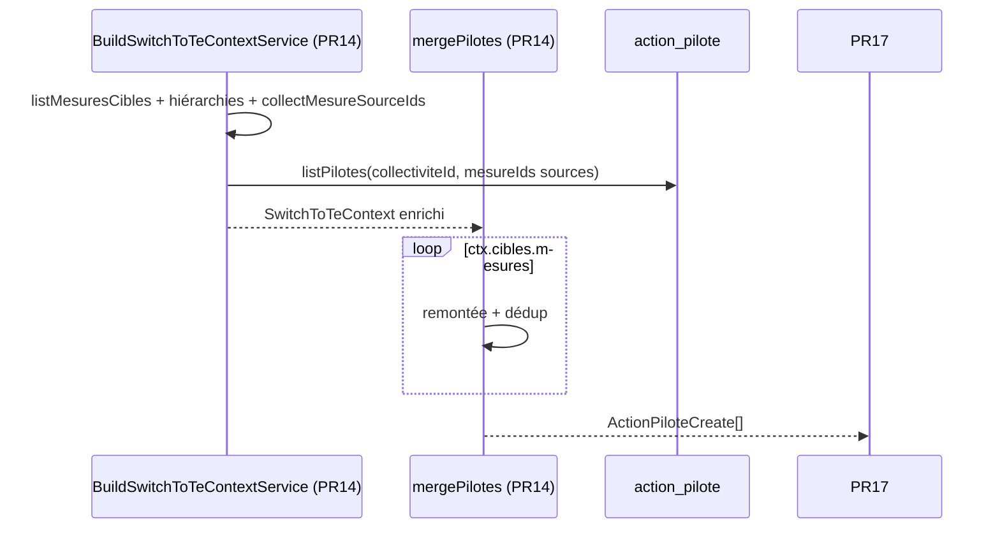

# PR14 — Fusion pilotes (`mergePilotes`)

**Parent** : [doc/plans/2026-06-11-001-feat-bascule-referentiel-te-prd.md](2026-06-11-001-feat-bascule-referentiel-te-prd.md)

**Branche** : `TE-7303/switch-te-PR14` depuis `main` (PR12 + PR13 mergées)

**Estimation** : ~350–450 LOC (code + tests). *Révisé post-PR12* — le PRD parent indique ~200 LOC.

**Prod** : Non — `switchToTe()` reste `SWITCH_NOT_IMPLEMENTED` jusqu'à PR18.

---

## Contexte

Étend [PR12](2026-06-11-007-feat-bascule-referentiel-te-pr12-plan.md) : introduit `ctx.cibles.mesures` (réutilisé PR15–16) et charge les pilotes sources depuis `action_pilote`.

Règle métier ([Annexe A — pilotes/services](2026-06-11-001-feat-bascule-referentiel-te-prd.md#a--algorithmes-de-fusion)) :

- saisie pilotes **uniquement au niveau mesure** (`ActionTypeEnum.ACTION`) côté CAE/ECI ;
- pour chaque **mesure TE** : agréger les correspondances sur la mesure **et ses descendants** ;
- exclure les sources `concerne = false` ;
- **remonter** chaque origine à la mesure ancêtre source (`rollUpActionIdToActionLevel`) ;
- collecter les pilotes, fusionner CAE + ECI, **dédupliquer** (`user_id` / `tag_id`) ;
- produire des lignes pour insertion sur la mesure TE cible uniquement.

Delta vs PR12/13 : granularité **mesure**, pilotes lus en BDD (pas dans le snapshot), remontée hiérarchique.



PR17 persiste ; PR18 orchestre.

---

## Décisions actées

**Hérite PR12/PR13** : snapshots (`PRE_SWITCH_SNAPSHOT_MISSING`), `originesConcernees`, persistance PR17, câblage hors `switchToTe()`. Détail : [PR12 § Décisions](2026-06-11-007-feat-bascule-referentiel-te-pr12-plan.md#décisions-actées).

| Sujet | Décision |
| ----- | -------- |
| Cibles | `ctx.cibles.mesures: ActionCible[]` — mesures TE ; origines agrégées mesure + descendants (`flatMapActionsEnfants` inclut la racine, `dedupeOrigines`) ; **exclues** si `actionsOrigine` vide ; **conservées** si `originesConcernees` vide (toutes sources `non_concerne`) → merge sans ligne |
| Remontée | `shared/resolve-mesures-sources.ts` (`OrigineActionRef`, `resolveMesureActionIdFromOrigine`, `collectMesureSourceIdsFromOrigines`) — encapsule `rollUpActionIdToActionLevel` ; hiérarchie absente → `resolveMesureActionIdFromOrigine` retourne `origine.actionId` (pas d'erreur, pas de remontée) |
| Pilotes sources | `action_pilote` via `listPilotes` — uniquement mesures ancêtres remontées ; pilotes sur tâche/sous-action ignorés ; hiérarchie absente → lookup sur `origine.actionId` (souvent tâche/sous-action) ne matche pas `pilotesByMesureActionId` → aucun pilote pour cette origine ; refs `archived` hors `sourceReferentiels` non chargées |
| Hiérarchies | `getHierarchiesByReferentielIds(sourceReferentiels)` — TE hors scope PR14 (PR16 si rollUp côté TE) |
| Résultat merge | Une ligne par pilote à migrer (pas d'entrée par cible vide, contrairement PR12 statuts) ; skip si `!cible.concernee` |
| Dédup | Sur `userId` / `tagId` (`PersonneId`) ; origine CAE/ECI sans incidence sur le résultat ; ordre CAE puis ECI = accumulation stable ; dédup inter-origines via `dedupePilotes` en fin de pipeline ; `userId` CAE + `tagId` ECI → deux lignes |
| TE à la bascule | Référentiel TE **vierge** — PR17 insère directement (pas de replace/upsert) |
| Refactor PR12 | `buildActionCible` partagé ; rename `listActionCiblesSousActionsEtTaches` → `listSousActionsEtTachesCibles` ; `cibles.mesures` réutilisé tel quel PR15/16 |
| I/O | Uniquement dans le builder ; `mergePilotes(ctx)` sans I/O ; pas de code d'erreur dédié PR14 |
| Module | Aucun service merge pilotes — fonction pure `mergePilotes` dans `merge-pilotes.rules.ts` ; injections builder via `ReferentielsCoreModule` (déjà importé) ; `SwitchToTeService` inchangé |
| Tests e2e | 1 collectivité/test (`addTestCollectiviteAndUser` + `onTestFinished(fixture.cleanup())`, pattern `switch-to-te.router`) ; `action_pilote` dans teardown `collectivites.test-fixture` (FK sans CASCADE) |

**Skip si mesure TE non concernée** : personnalisation TE prime — pas de pilotes migrés sur une mesure désactivée. Écart vs PR12 (`NON_CONCERNE` persisté) et PR13 (explications migrées si texte source) : un pilote sur mesure volontairement désactivée n'a pas de sens produit.

---

## Ordre d'implémentation

1. `dedupeOrigines` + spec
2. `resolve-mesures-sources` + spec (`OrigineActionRef`)
3. Refactor `action-cible` + `listMesuresCibles` + spec — **checkpoint : e2e `merge-statuts` + `merge-commentaires` verts**
4. `SwitchToTeContext` + `BuildSwitchToTeContextService`
5. `merge-pilotes.rules` + spec
6. `mergePilotes(ctx)` dans `merge-pilotes.rules.ts`
7. Teardown `action_pilote` + e2e builder + e2e merge

---

## Implémentation

### 0) Primitives partagées

#### `origine.rules.ts`

| Fonction | Rôle |
| -------- | ---- |
| `dedupeOrigines` | Clé `actionId` — première occurrence conservée (`actionId` encode déjà le référentiel : `cae_1.1.1` ≠ `eci_1.1.1`, cf. `getReferentielIdFromActionId`) |

> `sortByReferentielOrder` déjà livré PR13.

Tests : `origine.rules.spec.ts`.

#### `resolve-mesures-sources.ts` (réutilisé PR15)

```ts
export type OrigineActionRef = { referentielId: ReferentielId; actionId: string };
```

| Fonction | Rôle |
| -------- | ---- |
| `resolveMesureActionIdFromOrigine` | `rollUpActionIdToActionLevel` encapsulé ; entrée `OrigineActionRef` ; hiérarchie absente → fallback `origine.actionId` |
| `collectMesureSourceIdsFromOrigines` | `Set<mesureActionId>` depuis `OrigineActionRef[]` |

Tests : `resolve-mesures-sources.spec.ts` (fallback `origine.actionId` si hiérarchie absente) ; `merge-pilotes.rules.spec.ts` (aucun pilote pour cette origine car lookup sur id non remonté).

---

### 1) Contexte — `cibles.mesures` + builder

#### `action-cible.ts`

```ts
const buildActionCible = (
  actionId: string,
  actionsOrigine: CorrelatedAction[],
  scoreMapsByReferentiel: Map<ReferentielId, Map<string, ActionScore>>,
  teScoreMap: Map<string, ActionScore>
): ActionCible => { /* buildCorrelatedActionsWithScore + filterOriginesConcernees + isCibleConcernee */ };

export const listMesuresCibles = (input: {
  referentielTe: ReferentielResponse;
  scoreMapsByReferentiel: Map<ReferentielId, Map<string, ActionScore>>;
  teScoreMap: Map<string, ActionScore>;
}): ActionCible[]
```

**Algorithme `listMesuresCibles`** :

1. `flatMapActionsEnfants(referentielTe.itemsTree)` → filtrer `ActionTypeEnum.ACTION`.
2. Par mesure : `subtree = flatMapActionsEnfants(mesure)` ; `actionsOrigine = dedupeOrigines(subtree.flatMap(…))`.
3. Exclure si `actionsOrigine` vide ; sinon `buildActionCible`.
4. Retourner y compris mesures avec `originesConcernees: []` (toutes sources `non_concerne`).

Refactorer `listSousActionsEtTachesCibles` (rename depuis `listActionCiblesSousActionsEtTaches`) pour utiliser `buildActionCible`.

#### `switch-to-te-context.ts`

```ts
export type SwitchToTeContext = {
  // … champs existants PR12
  hierarchiesByReferentielId: ReadonlyMap<ReferentielId, ActionType[]>;
  pilotesByMesureActionId: Map<string, PersonneId[]>;
  cibles: {
    sousActionsEtTaches: ActionCible[];
    mesures: ActionCible[]; // PR14+ — origines agrégées au niveau mesure TE
  };
};
```

#### `build-switch-to-te-context.service.ts`

Injecter `GetReferentielDefinitionService`, `HandleMesurePilotesService`. Après `cibles.sousActionsEtTaches` :

1. `hierarchiesByReferentielId = await getHierarchiesByReferentielIds([...sourceReferentiels])`.
2. `cibles.mesures = listMesuresCibles({ referentielTe, scoreMapsByReferentiel, teScoreMap })`.
3. `mesureSourceIds = collectMesureSourceIdsFromOrigines(cibles.mesures.filter(c => c.concernee).flatMap(c => c.originesConcernees), hierarchiesByReferentielId)`.
4. Si `mesureSourceIds.size === 0` → `pilotesByMesureActionId = new Map()` ; sinon `listPilotes(collectiviteId, [...mesureSourceIds])`.
5. Mapper via `toPersonneIds` privée : filtre `userId != null || tagId != null`, pick `userId` / `tagId`.

`switch-to-te-context.test-fixture.ts` : signature inchangée.

---

### 2) Rules — `merge-pilotes/merge-pilotes.rules.ts`

```ts
export type ActionPiloteCreate = Pick<
  typeof actionPiloteTable.$inferInsert,
  'collectiviteId' | 'actionId' | 'userId' | 'tagId'
>;

export type MergePilotesForCibleInput = {
  originesConcernees: CorrelatedActionWithScore[];
  hierarchiesByReferentielId: ReadonlyMap<ReferentielId, ActionType[]>;
  pilotesByMesureActionId: Map<string, PersonneId[]>;
};
```

| Fonction | Rôle |
| -------- | ---- |
| `piloteDedupKey` | `userId ?? \`tag:${tagId}\`` |
| `dedupePilotes` | Dédup stable ; filtrer `{ userId: null, tagId: null }` (pas `isPersonneId` — `undefined !== null`) |
| `mergePilotesForCible` | `sortByReferentielOrder` → remontée par origine → `dedupePilotes` |
| `mergePilotes` | Itère `ctx.cibles.mesures` ; skip `!concernee` ; `mergePilotesForCible` ; mappe `{ collectiviteId, actionId, userId, tagId }` |

> Remontée via `resolveMesureActionIdFromOrigine` — pas redéclarée ici. Origine mesure (`cae_6.1.3`) = origine tâche remontée (`cae_6.1.3.4.3`).

---

### 3) Fonction pure — `mergePilotes(ctx)` dans `merge-pilotes.rules.ts`

```ts
export const mergePilotes = (ctx: SwitchToTeContext): ActionPiloteCreate[]
```

1. Itérer `ctx.cibles.mesures`.
2. Par cible : skip si `!concernee` ; `mergePilotesForCible(…)` ; skip si pilotes vides ; mapper `{ collectiviteId, actionId, userId, tagId }`.
3. Retourner `rows`. Aucune I/O, pas de service NestJS dédié — PR17 importe la règle directement.

---

## Tests

**E2e** : 1 collectivité/test, `buildSwitchToTeContextForTest`. Prérequis : teardown `action_pilote` dans `collectivites.test-fixture`.

### A. Unitaire — `action-cible.spec.ts`

| Cas | Assertion |
| --- | --------- |
| Mesure TE avec origine directe | présente dans `cibles.mesures` |
| Mesure TE sans origine, descendant avec origine | présente ; `actionsOrigine` agrégées |
| Mesure TE sans aucune correspondance | absente |
| Source `non_concerne` | absente de `originesConcernees`, présente dans `actionsOrigine` ; mesure présente |
| Mesure TE personnalisée non concernée | `concernee: false` |
| Dédup origines identiques sur plusieurs descendants | une seule entrée dans `actionsOrigine` |
| `listSousActionsEtTachesCibles` (régression) | 1–2 cas sous-action/tâche → `ActionCible` attendu |

Entrées : arbre TE minimal mocké (ou sous-ensemble fixture CSV).

### B. Unitaire — `merge-pilotes.rules.spec.ts`

| Cas | Assertion |
| --- | --------- |
| Remontée tâche → mesure source | pilotes lus sur mesure ancêtre |
| Remontée sous-action → mesure source | idem |
| Origine déjà au niveau mesure | pas de changement d'id |
| Fusion CAE + ECI → même mesure TE | union des deux refs |
| Dédup même `userId` (CAE + ECI) | une seule ligne |
| Dédup même `tagId` | une seule ligne |
| Deux origines → même mesure source | dédup inter-origines |
| `userId` et `tagId` distincts | deux lignes |
| Même personne `userId` CAE + `tagId` ECI | deux lignes (clés distinctes) |
| Ligne `{ userId: null, tagId: null }` | filtrée |
| Origine `non concerne` | ignorée (`originesConcernees` vide côté service) |
| Aucun pilote sur mesures sources | `[]` |
| Mapping hétérogène (`cae_6.1.3.4.3 + eci_3.3.1.3 → te_6.1.4.4` sous-action CSV ; cible pilote `te_6.1.4`) | pilotes `cae_6.1.3` + `eci_3.3` fusionnés |
| Hiérarchie absente | `resolveMesureActionIdFromOrigine` → fallback `origine.actionId` ; lookup `pilotesByMesureActionId` échoue → aucun pilote pour cette origine |

Entrées fabriquées — pas de DB.

### C. E2e — `merge-pilotes.rules.e2e-spec.ts`

Fixture `MERGE_PILOTES_FIXTURE` (CSV TE + `action_origine`) — seed pilotes sur `*MesureSourceId` **uniquement** via `upsertPilotes`, jamais sur `*OrigineTacheId`. Ids validés vs `import-referentiel/samples/referentiel-te-structure.csv` :

```ts
const MERGE_PILOTES_FIXTURE = {
  teMesureCae1to1: {
    teMesureId: 'te_1.1.1', // coremeasure CSV 1.1.1
    caeOrigineActionId: 'cae_1.1.2.2.1', // sous-action CSV 1.1.1.2 → Cae_1.1.2.2.1
    caeMesureSourceId: 'cae_1.1.2',
  },
  teMesureCaeAndEci: {
    teMesureId: 'te_6.1.4', // mesure ; origines hétérogènes sur sous-action CSV 6.1.4.4
    caeOrigineTacheId: 'cae_6.1.3.4.3', caeMesureSourceId: 'cae_6.1.3',
    eciOrigineTacheId: 'eci_3.3.1.3', eciMesureSourceId: 'eci_3.3', // pas eci_3.3.1
  },
  /** sous-action native — absente de cibles.mesures */
  teMesureNative: 'te_1.1.1.3', // CSV « Nouvelle action »
} as const;
```

| Scénario | Vérif |
| -------- | ----- |
| CAE seul, `userId` sur mesure source | pilote sur mesure TE |
| CAE + ECI, `userId` CAE + `tagId` ECI | union |
| CAE + ECI, même `userId` | dédup |
| Origine tâche, pilote sur mesure source | remontée OK |
| Source `non_concerne` | ignorée |
| Mesure TE non concernée | absente du résultat |
| Mesure sans pilote source | aucune ligne |
| Sans `pre-switch-te` | `PRE_SWITCH_SNAPSHOT_MISSING` |

### D. E2e — `build-switch-to-te-context.service.e2e-spec.ts`

| Cas | Assertion |
| --- | --------- |
| CAE seul | `hierarchiesByReferentielId` contient CAE ; pas ECI si archivé |
| Origine tâche dans `cibles.mesures` | `pilotesByMesureActionId` peuplé pour mesure remontée (pas de spy sur `listPilotes`) |
| Aucune origine concernée | `pilotesByMesureActionId` vide |
| `teMesureNative` | absente de `cibles.mesures` |
| Régression PR12/13 | `cibles.sousActionsEtTaches` inchangé |

### Commandes

```bash
pnpm test:backend merge-pilotes merge-pilotes.rules action-cible
pnpm test:backend origine.rules resolve-mesures-sources
pnpm test:backend build-switch-to-te-context
pnpm test:backend merge-statuts merge-commentaires
```

### Références

- `PersonneId` — `packages/domain/src/collectivites/personne-tag-or-user.schema.ts`
- `rollUpActionIdToActionLevel` — `packages/domain/src/referentiels/referentiel.utils.ts`
- `HandleMesurePilotesService` / `upsertPilotes` — seed e2e
- `action-pilote.table.ts` — `one_user_per_action` / `one_tag_per_action` / `either_user_or_tag_not_null`
- `switch-to-te-context.test-fixture.ts`, `switch-to-te.router.e2e-spec.ts`, `collectivites.test-fixture.ts`

---

## Hors scope

Cf. [PR12 § Hors scope](2026-06-11-007-feat-bascule-referentiel-te-pr12-plan.md). Spécifique : `mergeServices` (PR15), correctif PK Drizzle `action-service` (PR15), `mergeFicheActionLinks` (PR16), persistance (PR17), suppression pilotes CAE/ECI archivés.

---

## Critères de done

- [x] `dedupeOrigines` + `resolve-mesures-sources` (`OrigineActionRef`) + specs
- [x] `action-cible` refactor + `listMesuresCibles` + spec — checkpoint e2e PR12/13
- [x] Contexte + builder (`toPersonneIds`, hiérarchies, pilotes, filtre `concernee`) ; `SwitchToTeService` inchangé
- [x] `merge-pilotes.rules` (`mergePilotes`) — pas de service NestJS
- [x] Teardown `action_pilote` dans `collectivites.test-fixture`
- [x] E2e builder (section D) + e2e merge (section C, `userId`+`tagId` en scénario CAE+ECI)
- [x] Aucune régression PR12/13

---

## Suite (PR15+)

| PR | Suite |
| -- | ----- |
| PR15 | `mergeServices` — `cibles.mesures` + `resolve-mesures-sources` ; `servicesByMesureActionId` ; correctif PK Drizzle |
| PR16 | `mergeFicheActionLinks` — `cibles.mesures` ; hiérarchies TE si rollUp côté TE |
| PR17 | `MigrateCollectiviteDataService` — tous les `mergeXxx(ctx)` + insert direct (TE vierge) |
| PR18 | Transaction + exposition prod |
