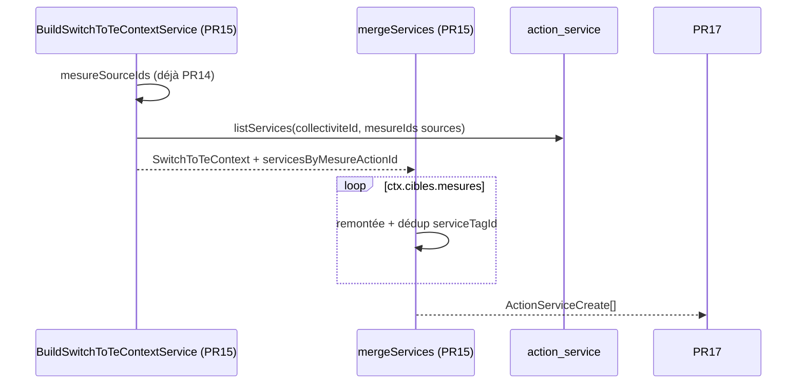

# PR15 — Fusion services (`mergeServices`)

**Parent** : [doc/plans/2026-06-11-001-feat-bascule-referentiel-te-prd.md](2026-06-11-001-feat-bascule-referentiel-te-prd.md)

**Branche** : `TE-7303/switch-te-PR15` depuis `main` (PR14 mergée)

**Estimation** : ~250–350 LOC (code + tests). *Aligné PRD parent* (~250 LOC).

**Prod** : Non — `switchToTe()` reste `SWITCH_NOT_IMPLEMENTED` jusqu'à PR18.

---

## Contexte

Étend [PR14](2026-06-11-009-feat-bascule-referentiel-te-pr14-plan.md) : réutilise `ctx.cibles.mesures`, `hierarchiesByReferentielId`, `resolve-mesures-sources` et le pattern builder / fonction pure merge sans I/O.

Règle métier ([Annexe A — pilotes/services](2026-06-11-001-feat-bascule-referentiel-te-prd.md#a--algorithmes-de-fusion)) — **même algorithme que pilotes**, clé de dédup `service_tag_id` :

- saisie services **uniquement au niveau mesure** (`ActionTypeEnum.ACTION`) côté CAE/ECI ;
- pour chaque **mesure TE** : agréger les correspondances sur la mesure **et ses descendants** ;
- exclure les sources `concerne = false` ;
- **remonter** chaque origine à la mesure ancêtre source (`resolveMesureActionIdFromOrigine`) ;
- collecter les services, fusionner CAE + ECI, **dédupliquer** (`service_tag_id`) ;
- produire des lignes pour insertion sur la mesure TE cible uniquement.

Delta vs PR14 : attribut = `serviceTagId` (pas `userId`/`tagId`) ; correctif schéma Drizzle prérequis aux inserts multi-services (PR17).



PR17 persiste ; PR18 orchestre.

---

## Décisions actées

**Hérite PR12/13/14** : snapshots (`PRE_SWITCH_SNAPSHOT_MISSING`), `originesConcernees`, `cibles.mesures`, persistance PR17, câblage hors `switchToTe()`. Détail : [PR12 § Décisions](2026-06-11-007-feat-bascule-referentiel-te-pr12-plan.md#décisions-actées), [PR14 § Décisions](2026-06-11-009-feat-bascule-referentiel-te-pr14-plan.md#décisions-actées).

| Sujet | Décision |
| ----- | -------- |
| Cibles | `ctx.cibles.mesures` — **inchangé PR14** ; même skip si `!concernee` |
| Remontée | `shared/resolve-mesures-sources.ts` (`OrigineActionRef`) — **aucune modification** ; hiérarchie absente → fallback `origine.actionId` ; lookup `servicesByMesureActionId` échoue → aucun service pour cette origine |
| Services sources | `action_service` via `HandleMesureServicesService.listServices` — uniquement mesures ancêtres remontées ; services sur tâche/sous-action ignorés |
| Contexte | `servicesByMesureActionId: Map<string, number[]>` — `serviceTagId` uniquement (pas besoin du nom tag en rules) |
| Résultat merge | Une ligne par `(collectiviteId, teMesureId, serviceTagId)` ; skip si `!cible.concernee` ; skip cible sans service |
| Dédup | Sur `serviceTagId` ; ordre CAE puis ECI = accumulation stable ; dédup inter-origines en fin de pipeline |
| TE à la bascule | Référentiel TE **vierge** — PR17 insère directement |
| PK Drizzle | `primaryKey({ columns: [collectiviteId, actionId, serviceTagId] })` — aligne sur SQL `PRIMARY KEY (collectivite_id, action_id, service_tag_id)` ; **pas de migration Sqitch** (BDD déjà correcte) |
| I/O | Uniquement dans le builder ; `mergeServices(ctx)` sans I/O ; pas de code d'erreur dédié PR15 |
| Module | Aucun service merge services — fonction pure `mergeServices` dans `merge-services.rules.ts` ; injecter `HandleMesureServicesService` dans le builder via `ReferentielsCoreModule` (déjà importé) ; `SwitchToTeService` inchangé |
| Tests e2e | 1 collectivité/test (`addTestCollectiviteAndUser` + `onTestFinished(fixture.cleanup())`) ; seed services sur `*MesureSourceId` via `upsertServices`, jamais sur `*OrigineTacheId` ; fixture IDs réutiliser `MERGE_PILOTES_FIXTURE` (mêmes correspondances TE) |
| Teardown | `action_service` dans `collectivites.test-fixture` (FK `service_tag_id` ON DELETE CASCADE — supprimer `action_service` avant `service_tag` si ce dernier est ajouté au teardown) |

**Skip si mesure TE non concernée** : identique PR14 — personnalisation TE prime.

**Pas de factorisation pilotes/services** : deux modules `merge-pilotes` / `merge-services` parallèles — lisibilité et revue indépendante (YAGNI).

---

## Ordre d'implémentation

1. Correctif PK Drizzle `action-service.table.ts` — **checkpoint : e2e `handle-mesure-services.router` vert** (insert multi-services collectivité 1)
2. `SwitchToTeContext` + `BuildSwitchToTeContextService` (`loadServicesByMesureActionId`)
3. `merge-services.rules` + spec
4. `mergeServices(ctx)` dans `merge-services.rules.ts`
5. Teardown `action_service` + e2e builder (extension) + e2e merge

---

## Implémentation

### 0) Correctif Drizzle — `action-service.table.ts`

**Problème** : Drizzle déclarait une PK 2 colonnes `(collectivite_id, action_id)` alors que PostgreSQL a une PK 3 colonnes incluant `service_tag_id` (`data_layer/sqitch/deploy/referentiel/action_service.sql`). Conséquence : modèle Drizzle incorrect pour plusieurs services par mesure (insert PR17).

```ts
primaryKey({
  columns: [table.collectiviteId, table.actionId, table.serviceTagId],
}),
```

**Vérification** : `pnpm test:backend handle-mesure-services.router` — le scénario « Insert, update and delete services » avec 2 `serviceTagId` sur une mesure doit rester vert.

---

### 1) Contexte — extension builder

#### `switch-to-te-context.ts`

```ts
export type SwitchToTeContext = {
  // … champs existants PR12–PR14
  servicesByMesureActionId: Map<string, number[]>; // serviceTagId par mesure source
};
```

#### `build-switch-to-te-context.service.ts`

Injecter `HandleMesureServicesService`. Après `loadPilotesByMesureActionId` (réutiliser le même `mesureSourceIds`) :

```ts
const servicesByMesureActionId = await this.loadServicesByMesureActionId(
  collectiviteId,
  mesureSourceIds
);
```

```ts
private async loadServicesByMesureActionId(
  collectiviteId: number,
  mesureSourceIds: Set<string>
): Promise<Map<string, number[]>> {
  if (mesureSourceIds.size === 0) {
    return new Map();
  }

  const servicesRecord = await this.handleMesureServicesService.listServices(
    collectiviteId,
    [...mesureSourceIds]
  );

  return new Map(
    Object.entries(servicesRecord).map(([actionId, services]) => [
      actionId,
      this.toServiceTagIds(services),
    ])
  );
}

private toServiceTagIds(services: TagWithCollectiviteId[]): number[] {
  return services.map((service) => service.id);
}
```

`switch-to-te-context.test-fixture.ts` : signature inchangée (builder enrichi automatiquement).

---

### 2) Rules — `merge-services/merge-services.rules.ts`

```ts
export type ActionServiceCreate = Pick<
  typeof actionServiceTable.$inferInsert,
  'collectiviteId' | 'actionId' | 'serviceTagId'
>;

export type MergeServicesForCibleInput = {
  originesConcernees: CorrelatedActionWithScore[];
  hierarchiesByReferentielId: ReadonlyMap<ReferentielId, ActionType[]>;
  servicesByMesureActionId: Map<string, number[]>;
};
```

| Fonction | Rôle |
| -------- | ---- |
| `dedupeServiceTagIds` | `uniqBy` sur `serviceTagId` ; filtrer `null`/`undefined` si présents |
| `mergeServicesForCible` | `sortByReferentielOrder` → remontée par origine → `dedupeServiceTagIds` |
| `mergeServices` | Itère `ctx.cibles.mesures` ; skip `!concernee` ; `mergeServicesForCible` ; mappe `{ collectiviteId, actionId, serviceTagId }` |

> Remontée via `resolveMesureActionIdFromOrigine` — pas redéclarée ici. Origine mesure (`cae_6.1.3`) = origine tâche remontée (`cae_6.1.3.4.3`).

---

### 3) Fonction pure — `mergeServices(ctx)` dans `merge-services.rules.ts`

```ts
export const mergeServices = (ctx: SwitchToTeContext): ActionServiceCreate[]
```

1. Itérer `ctx.cibles.mesures`.
2. Par cible : skip si `!concernee` ; `mergeServicesForCible(…)` ; skip si `serviceTagIds` vides ; mapper `{ collectiviteId, actionId, serviceTagId }`.
3. Retourner `rows`. Aucune I/O, pas de service NestJS dédié — PR17 importe la règle directement.

---

## Tests

**E2e** : 1 collectivité/test, `buildSwitchToTeContextForTest`. Prérequis : teardown `action_service` dans `collectivites.test-fixture`.

### A. Unitaire — `merge-services.rules.spec.ts`

| Cas | Assertion |
| --- | --------- |
| Remontée tâche → mesure source | services lus sur mesure ancêtre |
| Remontée sous-action → mesure source | idem |
| Origine déjà au niveau mesure | pas de changement d'id |
| Fusion CAE + ECI → même mesure TE | union des deux refs |
| Dédup même `serviceTagId` (CAE + ECI) | une seule entrée |
| Deux origines → même mesure source | dédup inter-origines |
| Deux `serviceTagId` distincts | deux lignes |
| Origine `non concerne` | ignorée (`originesConcernees` vide côté service) |
| Aucun service sur mesures sources | `[]` |
| Mapping hétérogène (`cae_6.1.3.4.3 + eci_3.3.1.3 → te_6.1.4.4` sous-action CSV ; cible service `te_6.1.4`) | services `cae_6.1.3` + `eci_3.3.1` fusionnés |
| Hiérarchie absente | `resolveMesureActionIdFromOrigine` → fallback `origine.actionId` ; lookup `servicesByMesureActionId` échoue → aucun service pour cette origine |

Entrées fabriquées — pas de DB. Structure calquée sur `merge-pilotes.rules.spec.ts`.

### B. E2e — `merge-services.rules.e2e-spec.ts`

Réutiliser les IDs de `MERGE_PILOTES_FIXTURE` (PR14) — mêmes correspondances `action_origine` :

```ts
const MERGE_SERVICES_FIXTURE = {
  teMesureCae1to1: {
    teMesureId: 'te_1.1.1',
    caeMesureSourceId: 'cae_1.1.2',
  },
  teMesureCaeAndEci: {
    teMesureId: 'te_6.1.4',
    caeOrigineTacheId: 'cae_6.1.3.4.3',
    caeMesureSourceId: 'cae_6.1.3',
    eciOrigineTacheId: 'eci_3.3.1.3',
    eciMesureSourceId: 'eci_3.3',
  },
  teMesureNative: 'te_1.1.1.3',
} as const;
```

Seed : `createServiceTag` + `upsertServices` sur `*MesureSourceId` uniquement.

| Scénario | Vérif |
| -------- | ----- |
| CAE seul, 1 service sur mesure source | 1 ligne sur mesure TE |
| CAE + ECI, service distinct par ref | union (2 lignes) |
| CAE + ECI, même `serviceTagId` | dédup (1 ligne) |
| Origine tâche, services sur mesure source | remontée OK |
| Source `non_concerne` | ignorée |
| Mesure TE non concernée | absente du résultat |
| Mesure sans service source | aucune ligne |
| Sans `pre-switch-te` | `PRE_SWITCH_SNAPSHOT_MISSING` |

### C. E2e — extension `build-switch-to-te-context.service.e2e-spec.ts`

| Cas | Assertion |
| --- | --------- |
| CAE seul, service sur mesure source | `servicesByMesureActionId` peuplé pour mesure remontée |
| Origine tâche dans `cibles.mesures` | services sur mesure ancêtre (pas sur tâche) |
| Aucune origine concernée | `servicesByMesureActionId` vide |
| `teMesureNative` | absente de `cibles.mesures` |
| Régression PR14 | `pilotesByMesureActionId` + `cibles` inchangés |

### Commandes

```bash
pnpm test:backend handle-mesure-services
pnpm test:backend merge-services merge-services.rules
pnpm test:backend build-switch-to-te-context
pnpm test:backend merge-pilotes merge-statuts merge-commentaires
```

### Références

- `HandleMesureServicesService.listServices` / `upsertServices` — seed e2e
- `createServiceTag` — `collectivites/tags/service-tag.fixture.ts`
- `action-service.table.ts` — PK 3 colonnes
- `merge-pilotes/` — template structure fichiers et pattern fonction pure
- `resolve-mesures-sources.ts`, `origine.rules.ts`
- `switch-to-te-context.test-fixture.ts`, `collectivites.test-fixture.ts`

---

## Hors scope

Cf. [PR12 § Hors scope](2026-06-11-007-feat-bascule-referentiel-te-pr12-plan.md). Spécifique : `mergeFicheActionLinks` (PR16), persistance (PR17), suppression services CAE/ECI archivés, migration Sqitch (schéma BDD déjà correct).

---

## Critères de done

- [x] PK Drizzle `action_service` alignée SQL ; e2e router services vert
- [x] `servicesByMesureActionId` dans contexte + builder (`HandleMesureServicesService`)
- [x] `merge-services.rules` (`mergeServices`) — pas de service NestJS
- [x] Teardown `action_service` dans `collectivites.test-fixture`
- [x] E2e builder (section C) + e2e merge (section B)
- [x] Aucune régression PR12–PR14

---

## Suite (PR16+)

| PR | Suite |
| -- | ----- |
| PR16 | `mergeFicheActionLinks` — `cibles.mesures` ; hiérarchies TE si rollUp côté TE |
| PR17 | `MigrateCollectiviteDataService` — tous les `mergeXxx(ctx)` + insert direct (TE vierge) |
| PR18 | Transaction + exposition prod |
