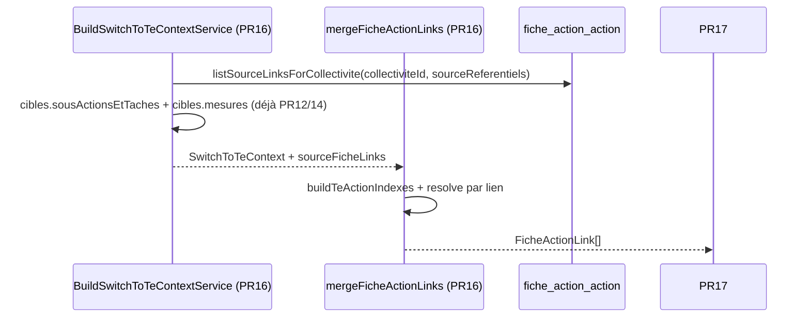

# PR16 — Fusion liens fiches plan d'action (`mergeFicheActionLinks`)

**Parent** : [doc/plans/2026-06-11-001-feat-bascule-referentiel-te-prd.md](2026-06-11-001-feat-bascule-referentiel-te-prd.md)

**Branche** : `TE-7303/switch-te-PR16` depuis `main` (PR15 mergée)

**Estimation** : ~350–450 LOC (code + tests). *Aligné PRD parent* (~250 LOC, révisé — flux inversé + résolution multi-granularité + extraction fixture partagée).

**Prod** : Non — `switchToTe()` reste `SWITCH_NOT_IMPLEMENTED` jusqu'à PR18.

---

## Contexte

Étend [PR12](2026-06-11-007-feat-bascule-referentiel-te-pr12-plan.md)–[PR15](2026-06-11-010-feat-bascule-referentiel-te-pr15-plan.md) : réutilise `ctx.cibles.sousActionsEtTaches`, `ctx.cibles.mesures`, `hierarchiesByReferentielId`, `scoreMapsByReferentiel`, `teScoreMap`.

Règle métier ([Annexe A — liens FA](2026-06-11-001-feat-bascule-referentiel-te-prd.md#a--algorithmes-de-fusion)) :

| Granularité source (lien existant) | Cible TE |
| --- | --- |
| Mesure (`ActionTypeEnum.ACTION`) | Mesure TE (correspondance mesure → mesure) |
| Sous-mesure + correspondance directe sur une sous-action TE | Sous-mesure TE |
| Sous-mesure sans correspondance directe | Mesure TE parente (agrégation descendants, via `cibles.mesures`) |

- sources `concerne = false` ignorées (règle transversale PRD) ;
- cible TE non concernée par personnalisation → lien ignoré (aligné PR14 pilotes / PR15 services) ;
- dédup sur `(fiche_id, te_action_id)` ;
- l'UI ne permet que mesure et sous-mesure CAE/ECI (`MesuresReferentielsDropdown` — pas de tâche).

**Delta vs PR14/PR15** : flux **inversé** — on part des liens sources (`fiche_action_action`) et on résout la cible TE, au lieu d'itérer `ctx.cibles.mesures`. Pas de remontée mesure ancêtre côté source (contrairement pilotes/services) : le lien est déjà au bon niveau source.

**Delta vs PR14/PR15 (implémentation)** : même pattern qu'[PR15](2026-06-11-010-feat-bascule-referentiel-te-pr15-plan.md) — **fonction pure** `mergeFicheActionLinks(ctx)` dans `merge-fiche-action-links.rules.ts`, pas de service NestJS dédié. PR17 importe la règle directement.



PR17 persiste ; PR18 orchestre.

---

## Décisions actées

**Hérite PR12/13/14/15** : snapshots (`PRE_SWITCH_SNAPSHOT_MISSING`), persistance PR17, câblage hors `switchToTe()`. Détail : [PR12 § Décisions](2026-06-11-007-feat-bascule-referentiel-te-pr12-plan.md#décisions-actées), [PR14 § Décisions](2026-06-11-009-feat-bascule-referentiel-te-pr14-plan.md#décisions-actées), [PR15 § Décisions](2026-06-11-010-feat-bascule-referentiel-te-pr15-plan.md#décisions-actées).

| Sujet | Décision |
| ----- | -------- |
| Entrées merge | `ctx.sourceFicheLinks: SourceFicheLink[]` — `{ ficheId, sourceActionId }` ; une entrée par ligne `fiche_action_action` |
| Périmètre chargement | Liens dont `action_id` appartient à un `sourceReferentiels` en `mode: write` ; fiches filtrées par `fiche_action.collectivite_id` ; refs `archived` hors `sourceReferentiels` non chargées |
| Résolution TE | Index construits depuis `ctx.cibles` (pas de requête `action_origine`) — `directSousActionByOrigineId` depuis `sousActionsEtTaches`, `mesureByOrigineId` depuis `mesures` |
| Ordre de résolution sous-mesure | 1) correspondance directe (`directSousActionByOrigineId`) si cible `concernee` ; 2) sinon `mesureByOrigineId` |
| Résolution mesure source | `mesureByOrigineId` uniquement |
| Source `non_concerne` | Ignorée via `isSourceActionConcernee` (`getReferentielIdFromActionId` + `isOrigineConcernee` depuis `origine.rules`) |
| Cible TE non concernée | Skip — `isCibleConcernee(teScoreMap, teActionId)` (déjà dans `origine.rules`) |
| Granularité source | `getActionTypeFromActionId(sourceActionId, hierarchie)` quand hiérarchie présente ; hiérarchie absente (cas limite) → heuristique niveau identifiant (mesure vs sous-mesure), pas de remontée source |
| Hiérarchie TE | **Non requise** — le fallback sous-mesure → mesure TE passe par `cibles.mesures` (agrégation descendants PR14), pas par `rollUpActionIdToActionLevel` côté TE |
| Résultat merge | `FicheActionLink[]` — une ligne par `(ficheId, teActionId)` après dédup ; pas de ligne si résolution `null` |
| Dédup | Clé `` `${ficheId}:${teActionId}` `` ; ordre stable : itération liens tels que retournés par le repo (tri `sourceActionId`, `ficheId` côté repo pour reproductibilité) |
| TE à la bascule | Référentiel TE **vierge** côté liens — PR17 insère directement (`onConflictDoNothing`) |
| I/O | Uniquement dans le builder (`FicheActionLinkRepository`) ; `mergeFicheActionLinks(ctx)` sans I/O ; pas de code d'erreur dédié PR16 (`PRE_SWITCH_SNAPSHOT_MISSING` = builder, testé via `buildSwitchToTeContextForTest` comme PR14/15) |
| Module | Aucun service merge liens fiches — fonction pure dans `merge-fiche-action-links.rules.ts` ; injecter `FicheActionLinkRepository` dans `BuildSwitchToTeContextService` via `FichesModule` (déjà importé dans `ReferentielsModule`, repo exporté) ; `SwitchToTeService` inchangé |
| Tests e2e | 1 collectivité/test (`addTestCollectiviteAndUser` + `onTestFinished(fixture.cleanup())`) ; seed liens via `insert(ficheActionActionTable)` ; fiches via `ficheActionTable` ; cleanup `onTestFinished` par scénario (pattern `update-action-fiches.router.e2e-spec.ts`) — **pas** de teardown global `collectivites.test-fixture` (contrairement `action_pilote` / `action_service`) |
| Fixtures e2e | Source unique `shared/switch-to-te-correspondances.fixture.ts` — remplace les `MERGE_*_FIXTURE` locales dupliquées (PR14/15/builder) ; inclut les cas liens fiches (`teSousActionDirect`, `teMesureFallback`) ; **étape 0** de la PR avec refacto des e2e existants |
| Liens legacy inchangés | PR16 **ajoute** des liens TE ; ne supprime pas les liens CAE/ECI (archivage refs PR18 — hors scope PR16) |

**Pas de factorisation avec pilotes/services** : module dédié `merge-fiche-action-links/` — logique de résolution distincte (flux lien → TE vs cible TE → attributs sources).

---

## Ordre d'implémentation

1. **`shared/switch-to-te-correspondances.fixture.ts`** + refacto e2e PR14/15/builder — **checkpoint : `merge-pilotes`, `merge-services`, `build-switch-to-te-context` verts**
2. `FicheActionLinkRepository.listSourceLinksForCollectivite` — **checkpoint : e2e `update-action-fiches` vert**
3. `shared/te-action-from-origine-resolution.ts` + spec
4. `SwitchToTeContext` + `BuildSwitchToTeContextService`
5. `merge-fiche-action-links.rules` + spec + `mergeFicheActionLinks(ctx)`
6. E2e builder (extension liens fiches) + e2e merge (`merge-fiche-action-links.rules.e2e-spec.ts`)

---

## Implémentation

### 0) Fixture partagée — `shared/switch-to-te-correspondances.fixture.ts`

**Problème** : les IDs TE ↔ CAE/ECI sont dupliqués (avec dérive) dans `merge-pilotes.rules.e2e-spec.ts`, `merge-services.rules.e2e-spec.ts` et `build-switch-to-te-context.service.e2e-spec.ts` (sous-ensemble incomplet + `teSousActionRegression` local).

**Objectif** : une source unique pour tous les merges bascule TE (pilotes, services, liens fiches, builder).

```ts
/**
 * Correspondances figées depuis import-referentiel/samples/referentiel-te-structure.csv
 * + action_origine. À mettre à jour si le CSV TE change.
 */
export const SWITCH_TE_CORRESPONDANCES_FIXTURE = {
  teMesureCae1to1: {
    teMesureId: 'te_1.1.1',
    caeMesureSourceId: 'cae_1.1.2',
    caeOrigineActionId: 'cae_1.1.2.2.1', // remontée pilotes
  },
  teMesureCaeAndEci: {
    teMesureId: 'te_6.1.4',
    caeMesureSourceId: 'cae_6.1.3',
    caeOrigineTacheId: 'cae_6.1.3.4.3',
    eciMesureSourceId: 'eci_3.3',
    eciOrigineTacheId: 'eci_3.3.1.3',
  },
  /** sous-action native — absente de cibles.mesures */
  teMesureNative: 'te_1.1.1.3',
  /** régression builder PR12/13 */
  teSousActionRegression: 'te_1.1.1.2',
  /** liens fiches — correspondance directe sous-mesure → sous-action TE */
  teSousActionDirect: {
    teSousActionId: 'te_2.2.2.1',
    caeSousMesureSourceId: 'cae_2.2.2.1',
  },
  /** liens fiches — sous-mesure sans direct → fallback mesure TE */
  teMesureFallback: {
    teMesureId: 'te_6.1.4',
    caeSousMesureSourceId: 'cae_6.1.3.4',
    caeMesureSourceId: 'cae_6.1.3',
  },
} as const;
```

**Refacto e2e existants** (même PR, avant le code merge liens fiches) :

| Fichier | Action |
| ------- | ------ |
| `merge-pilotes.rules.e2e-spec.ts` | Supprimer `MERGE_PILOTES_FIXTURE` local ; importer `SWITCH_TE_CORRESPONDANCES_FIXTURE` |
| `merge-services.rules.e2e-spec.ts` | Supprimer `MERGE_SERVICES_FIXTURE` local ; importer la fixture partagée |
| `build-switch-to-te-context.service.e2e-spec.ts` | Supprimer `MERGE_PILOTES_FIXTURE` tronqué ; importer la fixture partagée (aligne `caeOrigineTacheId` manquant) |

Chaque test importe uniquement les clés dont il a besoin — pas de renommage des scénarios.

**Checkpoint** :

```bash
pnpm test:backend merge-pilotes merge-services build-switch-to-te-context
```

---

### 1) Repository — `fiche-action-link.repository.ts`

Ajouter une méthode de lecture (pas de mutation) :

```ts
export type SourceFicheLink = {
  ficheId: number;
  sourceActionId: string;
};

async listSourceLinksForCollectivite(
  collectiviteId: number,
  sourceReferentielIds: ReferentielId[]
): Promise<SourceFicheLink[]>
```

**Requête** : `fiche_action_action` ⋈ `fiche_action` sur `fiche_id`, `WHERE fiche_action.collectivite_id = ?`, filtre `action_id` par préfixe référentiel (`cae_` / `eci_` selon `sourceReferentielIds`). Tri `sourceActionId`, `ficheId` pour tests déterministes.

Retourne `[]` si `sourceReferentielIds` vide.

---

### 2) Résolution TE — `shared/te-action-from-origine-resolution.ts`

```ts
export type TeActionIndexes = {
  /** origine source → sous-action TE (correspondance directe 1→1 sur sousActionsEtTaches) */
  directSousActionByOrigineId: ReadonlyMap<string, string>;
  /** origine source → mesure TE (agrégation mesure + descendants) */
  mesureByOrigineId: ReadonlyMap<string, string>;
};

export const buildTeActionIndexesFromCibles = (input: {
  sousActionsEtTaches: ActionCible[];
  mesures: ActionCible[];
}): TeActionIndexes;

export const resolveTeActionIdForSourceLink = (input: {
  sourceActionId: string;
  indexes: TeActionIndexes;
  hierarchiesByReferentielId: ReadonlyMap<ReferentielId, ActionType[]>;
  teScoreMap: Map<string, ActionScore>;
}): string | null;
```

**Algorithme `buildTeActionIndexesFromCibles`** :

1. Pour chaque `cible` dans `sousActionsEtTaches` avec `concernee` : pour chaque `origine` dans `originesConcernees`, `directSousActionByOrigineId.set(origine.actionId, cible.actionId)` (première occurrence conservée).
2. Pour chaque `cible` dans `mesures` avec `concernee` : pour chaque `origine` dans `originesConcernees`, `mesureByOrigineId.set(origine.actionId, cible.actionId)`.

**Algorithme `resolveTeActionIdForSourceLink`** :

1. `referentielId = getReferentielIdFromActionId(sourceActionId)` ; `hierarchie = hierarchiesByReferentielId.get(referentielId)`.
2. Déterminer si le lien source est une mesure ou une sous-mesure :
   - si `hierarchie` présente : `actionType = getActionTypeFromActionId(sourceActionId, hierarchie)` ;
   - sinon : heuristique niveau (pas de remontée — id inchangé).
3. Si `actionType === SOUS_ACTION` :
   - `teId = directSousActionByOrigineId.get(sourceActionId) ?? mesureByOrigineId.get(sourceActionId)`.
4. Sinon (mesure) :
   - `teId = mesureByOrigineId.get(sourceActionId)`.
5. Si `teId` absent ou `!isCibleConcernee(teScoreMap, teId)` → `null`.
6. Sinon retourner `teId`.

> Ne pas utiliser `resolve-mesures-sources` (remontée mesure **source**) — le lien fiche est déjà positionné sur la mesure ou sous-mesure source.

Tests : `te-action-from-origine-resolution.spec.ts`.

---

### 3) Contexte — extension builder

#### `switch-to-te-context.ts`

```ts
import { type SourceFicheLink } from '@tet/backend/plans/fiches/update-fiche/fiche-action-link.repository';

export type SwitchToTeContext = {
  // … champs existants PR12–PR15
  sourceFicheLinks: SourceFicheLink[];
};
```

#### `build-switch-to-te-context.service.ts`

Injecter `FicheActionLinkRepository`. Après chargement services :

```ts
const sourceFicheLinks =
  await this.ficheActionLinkRepository.listSourceLinksForCollectivite(
    collectiviteId,
    sourceReferentiels
  );
```

`switch-to-te-context.test-fixture.ts` : signature inchangée (builder enrichi automatiquement).

---

### 4) Rules — `merge-fiche-action-links/merge-fiche-action-links.rules.ts`

```ts
export const ficheActionLinkDedupKey = (row: {
  ficheId: number;
  actionId: string;
}): string => `${row.ficheId}:${row.actionId}`;

export const dedupeFicheActionLinks = (
  rows: FicheActionLink[]
): FicheActionLink[];

export const isSourceActionConcernee = (
  sourceActionId: string,
  scoreMapsByReferentiel: Map<ReferentielId, Map<string, ActionScore>>
): boolean;
```

| Fonction | Rôle |
| -------- | ---- |
| `isSourceActionConcernee` | `getReferentielIdFromActionId` → score snapshot source ; `false` si absent ou `!isOrigineConcernee(actionScore)` |
| `dedupeFicheActionLinks` | `uniqBy` sur `ficheActionLinkDedupKey` |

---

### 5) Fonction pure — `mergeFicheActionLinks(ctx)` dans `merge-fiche-action-links.rules.ts`

```ts
export const mergeFicheActionLinks = (
  ctx: SwitchToTeContext
): FicheActionLink[]
```

1. `indexes = buildTeActionIndexesFromCibles(ctx.cibles)`.
2. Pour chaque `link` dans `ctx.sourceFicheLinks` :
   - skip si `!isSourceActionConcernee(link.sourceActionId, ctx.scoreMapsByReferentiel)` ;
   - `teActionId = resolveTeActionIdForSourceLink({ … })` ;
   - skip si `null` ;
   - push `{ ficheId: link.ficheId, actionId: teActionId }`.
3. Retourner `dedupeFicheActionLinks(rows)`. Aucune I/O — PR17 importe la règle directement (pattern `mergePilotes` / `mergeServices`).

---

## Tests

**E2e** : 1 collectivité/test, `buildSwitchToTeContextForTest`. Helper local `createFicheWithLink(actionId)` → `{ ficheId }` + `onTestFinished` cleanup (pattern `update-action-fiches.router.e2e-spec.ts`).

Structure calquée sur `merge-services.rules.e2e-spec.ts` / `merge-pilotes.rules.e2e-spec.ts`.

### A. Unitaire — `te-action-from-origine-resolution.spec.ts`

| Cas | Assertion |
| --- | --------- |
| Index sous-action directe | `directSousActionByOrigineId` peuplé |
| Index mesure (origine tâche agrégée) | `mesureByOrigineId` peuplé, pas dans direct |
| Cible TE `concernee: false` | absente des index |
| Sous-mesure source, correspondance directe | `resolve` → sous-action TE |
| Sous-mesure source, pas de direct | `resolve` → mesure TE |
| Mesure source | `resolve` → mesure TE |
| Cible TE non concernée | `null` |
| Origine absente des index | `null` |

Entrées fabriquées — pas de DB.

### B. Unitaire — `merge-fiche-action-links.rules.spec.ts`

| Cas | Assertion |
| --- | --------- |
| Source `concerne: false` | `isSourceActionConcernee` → false |
| Source absente du snapshot | false |
| Dédup même `(ficheId, teActionId)` | une ligne |
| Deux fiches, même `teActionId` | deux lignes |

### C. E2e — `merge-fiche-action-links.rules.e2e-spec.ts`

Importer `SWITCH_TE_CORRESPONDANCES_FIXTURE` depuis `shared/switch-to-te-correspondances.fixture.ts` (étape 0) — pas de fixture locale.

Cas spécifiques liens fiches : `teSousActionDirect`, `teMesureFallback`. Cas partagés : `teMesureCae1to1`, `teMesureCaeAndEci`, `teMesureNative`.

| Scénario | Vérif |
| -------- | ----- |
| Lien sur mesure CAE 1→1 | `{ ficheId, actionId: teMesureId }` |
| Lien sur sous-mesure CAE, correspondance directe TE | `actionId: teSousActionId` |
| Lien sur sous-mesure CAE, fallback mesure TE | `actionId: teMesureId` (pas sous-action) |
| CAE + ECI, deux liens même fiche → même mesure TE | dédup (1 ligne) |
| CAE + ECI, deux liens même fiche → mesures TE distinctes | 2 lignes |
| Source `non_concerne` | absente du résultat |
| Mesure TE cible non concernée (personnalisation) | absente du résultat |
| Fiche sans lien source | aucune ligne |
| Sans `pre-switch-te` | `PRE_SWITCH_SNAPSHOT_MISSING` (via `buildSwitchToTeContextForTest`) |

### D. E2e — extension `build-switch-to-te-context.service.e2e-spec.ts`

| Cas | Assertion |
| --- | --------- |
| Lien sur mesure CAE source | `sourceFicheLinks` contient l'entrée |
| ECI archivé (hors `sourceReferentiels`) | liens `eci_*` absents |
| Aucun lien en base | `sourceFicheLinks` vide |
| Régression PR14/15 | `pilotesByMesureActionId` + `servicesByMesureActionId` + `cibles` inchangés |

### Commandes

```bash
pnpm test:backend merge-fiche-action-links merge-fiche-action-links.rules
pnpm test:backend te-action-from-origine-resolution
pnpm test:backend build-switch-to-te-context
pnpm test:backend update-action-fiches
pnpm test:backend merge-pilotes merge-services merge-statuts merge-commentaires
```

### Références

- `fiche-action-action.table.ts` — PK `(fiche_id, action_id)`
- `FicheActionLinkRepository` — pattern lecture PR16 ; exporté par `FichesModule`
- `getActionTypeFromActionId` / `getReferentielIdFromActionId` — `@tet/domain/referentiels`
- `isOrigineConcernee` / `isCibleConcernee` — `origine.rules.ts`
- `action-cible.ts` — `listSousActionsEtTachesCibles`, `listMesuresCibles`
- `switch-to-te-correspondances.fixture.ts` — IDs partagés PR14–16
- `merge-pilotes/` / `merge-services/` — template fonction pure + e2e
- `update-action-fiches.router.e2e-spec.ts` — seed fiches + liens
- `switch-to-te-context.test-fixture.ts`

---

## Hors scope

Cf. [PR12 § Hors scope](2026-06-11-007-feat-bascule-referentiel-te-pr12-plan.md). Spécifique : `MigrateCollectiviteDataService` (PR17), suppression liens CAE/ECI archivés, liens sur tâches (non créables en UI), migration Sqitch, hiérarchie TE en contexte (non nécessaire).

---

## Critères de done

- [ ] `switch-to-te-correspondances.fixture.ts` + refacto e2e PR14/15/builder (aucune régression)
- [ ] `listSourceLinksForCollectivite` sur `FicheActionLinkRepository`
- [ ] `te-action-from-origine-resolution` + spec
- [ ] `sourceFicheLinks` dans contexte + builder
- [ ] `merge-fiche-action-links.rules` (`mergeFicheActionLinks`) — pas de service NestJS
- [ ] E2e builder (section D) + e2e merge (section C, cas direct + fallback + dédup CAE/ECI)
- [ ] Aucune régression PR12–PR15

---

## Suite (PR17+)

| PR | Suite |
| -- | ----- |
| PR17 | `MigrateCollectiviteDataService` — tous les `mergeXxx(ctx)` + insert direct (TE vierge) |
| PR18 | Transaction + exposition prod |
