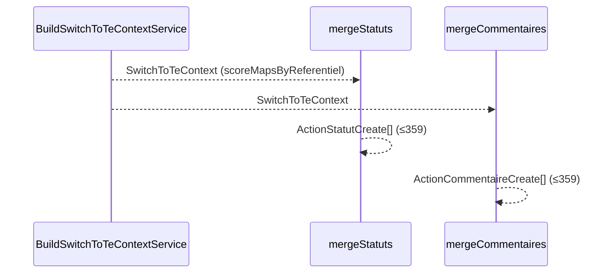

# PR17a — Merges statuts / commentaires purs

**Parent** : [doc/plans/2026-06-11-001-feat-bascule-referentiel-te-prd.md](2026-06-11-001-feat-bascule-referentiel-te-prd.md)

**Suite** : [PR17b — Orchestration migration données](2026-06-11-012-feat-bascule-referentiel-te-pr17b-plan.md)

**Branche** : `TE-7303/switch-te-PR17a` depuis `main` (PR16 mergée)

**Estimation** : ~150–250 LOC (code + tests). *Extraction scoring + 2 merges purs + retrait services Nest.*

**Prod** : Non — `switchToTe()` inchangé.

**Prérequis** (PR12–16, déjà livrés) : `BuildSwitchToTeContextService`, `SwitchToTeContext`, merges purs pilotes/services/liens fiches, fixtures e2e, `createPreSwitchSnapshots`.

---

## Contexte

PR12 et PR13 ont livré `MergeStatutsService` et `MergeCommentairesService` — `@Injectable()` sans I/O DB, mais hors du pattern PR14–16 où chaque merge est une **fonction pure** `mergeXxx(ctx)` dans un `.rules.ts`.

PR17a aligne statuts et commentaires sur ce pattern avant l'orchestration persistance de [PR17b](2026-06-11-012-feat-bascule-referentiel-te-pr17b-plan.md) :

- extraction de `getRatioFromOrigineActions` / `getScoreFromOrigineActionsAndRatio` depuis `ScoresService` (testables sans Nest) ;
- `mergeStatuts(ctx)` et `mergeCommentaires(ctx)` retournent directement `ActionStatutCreate[]` / `ActionCommentaireCreate[]` — **plus de `Result` côté merge** ;
- suppression des deux services Nest et de leurs providers.

**Source données** (inchangé vs PR12/PR13) : `ctx.scoreMapsByReferentiel` (snapshots `pre-switch-te`) — **pas de lecture** `action_statut` ni `action_commentaire` au runtime merge.



---

## Décisions actées

**Hérite PR12–PR16** : `SwitchToTeContext` construit une fois ; merges sans I/O ; snapshots stricts (`PRE_SWITCH_SNAPSHOT_MISSING`). Détail : [PR12 § Décisions](2026-06-11-007-feat-bascule-referentiel-te-pr12-plan.md#décisions-actées), [PR13 § Décisions](2026-06-11-008-feat-bascule-referentiel-te-pr13-plan.md#décisions-actées).

| Sujet | Décision PR17a |
| ----- | -------------- |
| Contrat merge | `mergeStatuts(ctx): ActionStatutCreate[]` ; `mergeCommentaires(ctx): ActionCommentaireCreate[]` — retour direct, pas de `Result` |
| Projection statuts | `score-from-origines.rules.ts` — fonctions pures extraites de `ScoresService` ; `ScoresService` délègue |
| Explications sources | `ActionScore.explication` dans `scoreMapsByReferentiel` — pas de requête `action_commentaire` |
| Services Nest | Supprimer `MergeStatutsService`, `MergeCommentairesService` + providers `referentiels.module.ts` |
| Persistance | **Hors scope** — PR17b |
| `switchToTe()` | Inchangé |

---

## Ordre d'implémentation

1. `score-from-origines.rules.ts` + spec (extraction depuis `ScoresService`)
2. `mergeStatuts(ctx)` dans `merge-statuts.rules.ts` — retirer service
3. `mergeCommentaires(ctx)` + `buildMergeCommentaireSourcesFromCible` dans `merge-commentaires.rules.ts` — retirer service
4. Retrait providers module + refacto e2e

---

## Implémentation

### 0a) Extraction projection — `compute-score/score-from-origines.rules.ts`

Extraire depuis `ScoresService` :

```ts
export const getRatioFromOrigineActions = (
  origineActions: CorrelatedActionWithScore[] | undefined,
  referentielPointsPotentiels: number | null
): number;

export const getScoreFromOrigineActionsAndRatio = (
  ratio: number,
  origineActions: CorrelatedActionWithScore[] | undefined,
  roundingDigits: number,
  referentielPointsPotentiels?: number | null
): /* même type retour qu'aujourd'hui */;
```

**Refacto `ScoresService`** : délégation aux fonctions exportées.

**Tests** : `score-from-origines.rules.spec.ts` — déplacer les cas `describe('getScoreFromOrigineActionsAndRatio')` depuis `scores.service.spec.ts`.

### 0b) `mergeStatuts(ctx)` — `merge-statuts/merge-statuts.rules.ts`

```ts
export const mergeStatuts = (ctx: SwitchToTeContext): ActionStatutCreate[]
```

- Déplacer la logique de `MergeStatutsService.merge` ici
- Boucle `ctx.cibles.sousActionsEtTaches` ; projection via `score-from-origines.rules.ts`
- Réutilise `deriveStatutFromProjection`, `toActionStatutCreate`, `getPointPotentiel`
- Supprimer `merge-statuts.service.ts` + provider module
- E2e : `merge-statuts.service.e2e-spec.ts` → `merge-statuts.rules.e2e-spec.ts`

### 0c) `mergeCommentaires(ctx)` — `merge-commentaires/merge-commentaires.rules.ts`

```ts
export const buildMergeCommentaireSourcesFromCible = (
  ctx: SwitchToTeContext,
  originesConcernees: ActionCible['originesConcernees']
): MergeCommentaireSource[];

export const mergeCommentaires = (ctx: SwitchToTeContext): ActionCommentaireCreate[]
```

- Extraire `buildSourcesFromCible` depuis `MergeCommentairesService` (explications via `ctx.scoreMapsByReferentiel`)
- Supprimer `merge-commentaires.service.ts` + provider module
- E2e : `merge-commentaires.service.e2e-spec.ts` → `merge-commentaires.rules.e2e-spec.ts`

---

## Tests

Conserver les scénarios e2e existants PR12/PR13 (fusion CAE+ECI, `non_concerne`, projection détaillée, explications concaténées) — appeler les fonctions pures au lieu des services.

```bash
pnpm test:backend score-from-origines merge-statuts merge-commentaires
```

---

## Hors scope

- `MigrateCollectiviteDataService`, repository, garde TE vide → [PR17b](2026-06-11-012-feat-bascule-referentiel-te-pr17b-plan.md)
- Transaction globale `switchToTe()` (PR18)
- Complément snapshots `pre-switch-te` pour refs `archived`

---

## Critères de done

- [ ] `score-from-origines.rules.ts` + spec ; `ScoresService` délègue
- [ ] `mergeStatuts(ctx)` et `mergeCommentaires(ctx)` purs ; retour direct sans `Result`
- [ ] `MergeStatutsService` + `MergeCommentairesService` supprimés ; module nettoyé
- [ ] E2e `merge-statuts.rules.e2e-spec.ts` + `merge-commentaires.rules.e2e-spec.ts` verts

---

## Suite

| PR | Suite |
| -- | ----- |
| PR17b | `MigrateCollectiviteDataService` — garde TE vide, orchestration 5 merges, persistance bulk |
| PR18 | Transaction complète + exposition prod |
