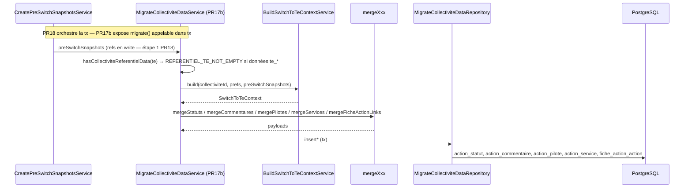

# PR17b — Orchestration migration données (`MigrateCollectiviteDataService`)

**Parent** : [doc/plans/2026-06-11-001-feat-bascule-referentiel-te-prd.md](2026-06-11-001-feat-bascule-referentiel-te-prd.md)

**Prérequis** : [PR17a — Merges statuts/commentaires purs](2026-06-11-012-feat-bascule-referentiel-te-pr17a-plan.md) (5 merges tous purs) ; PR12–16 livrés.

**Branche** : `TE-7303/switch-te-PR17b` depuis `main` (PR17a mergée)

**Estimation** : ~200–300 LOC (code + tests). *Repository + service migrate + garde TE vide + e2e persistance.*

**Prod** : Non (endpoint) — `switchToTe()` reste `SWITCH_NOT_IMPLEMENTED` jusqu'à PR18.

---

## Contexte

PR17b est la **première PR qui écrit les données TE** en base. Les 5 merge rules (PR12–16 + PR17a) produisent des payloads en mémoire ; PR17b les persiste via `MigrateCollectiviteDataService`.

**Delta vs PR12–PR17a** : I/O persistance ; garde `REFERENTIEL_TE_NOT_EMPTY` ; **pas** de complément snapshots `pre-switch-te` pour refs déjà `archived` en prefs.



PR18 orchestre la transaction complète (recalcul scores, `post-switch-te`, prefs).

---

## Décisions actées

**Hérite PR12–PR17a** : `SwitchToTeContext` construit une fois ; merges sans I/O ; TE **sans données collectivité** à la bascule (garde explicite avant persistance) ; insert direct (pas replace/upsert pilotes-services) ; `onConflictDoNothing` sur **toutes** les inserts (5 entités) ; `switchToTe()` inchangé ; pas de `ReferentielModeGuard` ni re-vérification permissions (orchestration interne post-guards). Détail : [PR12 § Décisions](2026-06-11-007-feat-bascule-referentiel-te-pr12-plan.md#décisions-actées), [PR16 § Décisions](2026-06-11-011-feat-bascule-referentiel-te-pr16-plan.md#décisions-actées).

| Sujet                    | Décision                                                                                                                                                                                                                                                                                                         |
| ------------------------ | ---------------------------------------------------------------------------------------------------------------------------------------------------------------------------------------------------------------------------------------------------------------------------------------------------------------- |
| Entrée service           | `migrate(collectiviteId, prefs, preSwitchSnapshots, { user, tx })` — `preSwitchSnapshots` **injectés par l'appelant** (`createPreSwitchSnapshots`, étape 1 PR18) ; PR17b ne crée ni ne complète de snapshots                                                                                                      |
| Snapshots pre-switch-te  | **Hors scope PR17b.** Fournis par `createPreSwitchSnapshots` (étape 1 PR18) pour les refs CAE/ECI en `write`. Cas nominal fusion N→1 : les deux sources en `write` → les deux snapshottées.                                                                                                                       |
| Orchestration merges     | Ordre fixe : statuts → commentaires → pilotes → services → liens fiches ; **5 fonctions pures** (`mergeXxx(ctx)` dans `.rules.ts`) ; retour direct `ActionXxxCreate[]` / `FicheActionLink[]` |
| Persistance statuts      | Insert bulk via `actionStatutCreateToActionStatutInDatabase` ; tri `actionId` asc ; **pas** `computeAndMergeParentCascadingStatuts` ni historique `action_statut` (parents → PR18)                                                                                                                               |
| Persistance commentaires | Insert bulk — lignes déjà filtrées par `mergeCommentaires`                                                                                                                                                                                                                                                       |
| TE vide                  | **Garde obligatoire** avant persistance : `hasCollectiviteReferentielData(collectiviteId, 'te')` → `false` (aucune ligne `te_*` dans les 5 tables de données collectivité) ; sinon `REFERENTIEL_TE_NOT_EMPTY` et **aucune** écriture. **≠ engagement** (prefs CAE/ECI en `write` — éligibilité bascule, cf. `canSwitchToTe`) |
| Conflits                 | `onConflictDoNothing` sur **toutes** les inserts (statuts, commentaires, pilotes, services, liens fiches) — filet défensif si garde contournée ; pas d'upsert ni replace                                                                                                                                         |
| Erreurs                  | Réutiliser `SwitchToTeError` ; ajouter `REFERENTIEL_TE_NOT_EMPTY` (`PRECONDITION_FAILED`, message : « Le référentiel TE contient déjà des données pour cette collectivité ») et `MIGRATION_FAILED` (`INTERNAL_SERVER_ERROR`, erreurs DB inattendues hors conflit)                                                            |
| Repository               | `MigrateCollectiviteDataRepository` — `hasCollectiviteReferentielData`, `insertStatuts`, `insertCommentaires`, `insertPilotes`, `insertServices`, `insertFicheLinks` ; `tx?` en dernier paramètre ; **pas de chunking PR17b** (réévaluer PR18 si timeout ou pic mémoire — cf. § Estimation mémoire)               |
| Liens CAE/ECI legacy     | **Non supprimés** — archivage refs en PR18                                                                                                                                                                                                                                                                       |
| Module                   | `MigrateCollectiviteDataService` + repository enregistrés ; pas exportés                                                                                                                                                                                                                                        |

---

## Estimation mémoire et cas stress prod

Les merge rules produisent des payloads **en RAM** avant persistance. Analyse prod (juillet 2026) pour dimensionner PR17b et le bench staging.

### Plafonds structurels TE (correspondances CSV)

Source : `apps/backend/src/referentiels/import-referentiel/samples/referentiel-te-structure.csv` (colonne `Origine` → `actionsOrigine` en BDD). **Toutes les actions TE n'ont pas d'origine CAE/ECI** — les merges ne traitent que les cibles filtrées par le code.

| Périmètre                              | Total TE | Avec origine CAE/ECI | Ratio  | Merge concerné                         |
| -------------------------------------- | -------- | -------------------- | ------ | -------------------------------------- |
| Sous-actions + tâches                  | 510      | **359**              | 70,4 % | `mergeStatuts`, `mergeCommentaires`    |
| Mesures                                | 127      | **114**              | 89,8 % | `mergePilotes`, `mergeServices`        |
| Références origine uniques             | —        | **322**              | —      | plafond théorique explications migrées |
| Mesures natives (sans origine agrégée) | 13       | —                    | 10,2 % | exclues pilotes/services               |

Filtre code (`listSousActionsEtTachesCibles` dans `action-cible.ts`) : `(SOUS_ACTION | TACHE) && actionsOrigine.length > 0` — les **151** sous-actions/tâches natives (~30 %) ne produisent **aucune** ligne merge statuts/commentaires.

**Source unique statuts / commentaires** : `mergeStatuts` et `mergeCommentaires` consomment uniquement `ctx.scoreMapsByReferentiel` (snapshots `pre-switch-te` figés en PR10) — **pas de lecture** `action_statut` ni `action_commentaire` au runtime migrate (cf. PR12, PR13). Les explications proviennent de `ActionScore.explication` dans le snapshot, pas d'une requête séparée sur la table.

**Non filtré par les correspondances** : les snapshots pre-switch (`referentiel_scores` JSONB complet CAE + ECI) sont chargés **en entier** dans `scoreMapsByReferentiel`, indépendamment du ratio TE. Les explications HTML sources y sont déjà incluses — ne pas additionner le volume table `action_commentaire` à l'estimation mémoire.

### Référence cas limite — collectivité `4935`

| Métrique                                            | Valeur        | Lecture                                                                                                      |
| --------------------------------------------------- | ------------- | ------------------------------------------------------------------------------------------------------------ |
| Snapshot CAE (`pg_column_size(referentiel_scores)`) | **~1 217 kB** | Snapshot **complet** parsé en JS (~×3–5) — driver principal `mergeStatuts` / `mergeCommentaires`             |
| Snapshot ECI                                        | **~269 kB**   | idem                                                                                                         |
| Output `mergeStatuts`                               | ≤ **359**     | une ligne par sous-action/tâche TE avec origine — projection depuis scores snapshot, pas depuis `action_statut` |
| Output `mergeCommentaires`                          | ≤ **359**     | une ligne si explication non vide dans snapshot — pas depuis `action_commentaire`                          |
| Pilotes / services (sources)                        | **390 / 117** | Roll-up vers ≤ **114** mesures TE — **lecture BDD** `action_pilote` / `action_service`                     |
| Liens fiches (sources)                              | **336**       | `mergeFicheActionLinks` — filtrés par actions source `concerne` (snapshot)                                   |

**Estimation delta heap pendant `migrate()`** : **6–10 Mo** typique, **12–18 Mo** pic (CT moyenne : **1–3 Mo**). Dominé par le parsing des snapshots + arbre TE ; payloads merge output modestes (≤359 lignes statuts/commentaires). Si la bascule tient pour **4935**, marge confortable pour ~99 % des collectivités.

### Bench staging (optionnel, post-implémentation)

Sur collectivité **4935** : `build` + 5 merges → logger taille payloads + `heapUsed`. Seuil indicatif : payloads merge totaux **< 20 Mo**.

---

## Ordre d'implémentation

1. **`migrate-collectivite-data.repository.ts`** — garde TE vide + 5 `insert*`
2. **`migrate-collectivite-data.service.ts`** — orchestration
3. Provider `ReferentielsModule`
4. E2e `migrate-collectivite-data.service.e2e-spec.ts`

---

## Implémentation

### 1) Repository — `migrate-collectivite-data/migrate-collectivite-data.repository.ts`

```ts
@Injectable()
export class MigrateCollectiviteDataRepository {
  async hasCollectiviteReferentielData(
    collectiviteId: number,
    referentielId: ReferentielId,
    tx?: Transaction
  ): Promise<boolean>;

  async insertStatuts(rows: ActionStatutInsertRow[], tx?: Transaction): Promise<void>;
  async insertCommentaires(rows: ActionCommentaireInsertRow[], tx?: Transaction): Promise<void>;
  async insertPilotes(rows: ActionPiloteInsertRow[], tx?: Transaction): Promise<void>;
  async insertServices(rows: ActionServiceInsertRow[], tx?: Transaction): Promise<void>;
  async insertFicheLinks(rows: FicheActionLink[], tx?: Transaction): Promise<void>;
}
```

**Garde TE vide** — `EXISTS` / `LIMIT 1` sur les 5 tables, filtre `action_id LIKE 'te_%'` ; pour `fiche_action_action`, joindre `fiche_action` sur `collectivite_id`.

**Inserts** :

```ts
await (tx ?? this.db).insert(table).values(rows).onConflictDoNothing();
```

Patterns : `update-action-statut.service.ts` (tri `actionId` avant insert statuts), `fiche-action-link.repository.ts`.

### 2) Service — `migrate-collectivite-data/migrate-collectivite-data.service.ts`

```ts
@Injectable()
export class MigrateCollectiviteDataService {
  async migrate(
    collectiviteId: number,
    prefs: CollectiviteReferentielPreferences,
    preSwitchSnapshots: ScoreSnapshot[],
    { user, tx }: ServiceSecondArg
  ): Promise<Result<void, SwitchToTeError>>
}
```

**Pipeline** :

1. `hasCollectiviteReferentielData(collectiviteId, TE, tx)` → si `true` : `failure(REFERENTIEL_TE_NOT_EMPTY)` **sans** merge ni insert
2. `buildSwitchToTeContextService.build(...)` — propager `failure` si échec (`PRE_SWITCH_SNAPSHOT_MISSING`, etc.)
3. 5 merges purs → payloads
4. Mappers + inserts repository (`tx` propagée)
5. Catch insert (hors conflit silencieux) → `failure(MIGRATION_FAILED, cause)`

**Mappers** : `actionStatutCreateToActionStatutInDatabase` + `modifiedBy`/`modifiedAt` ; pilotes — `PersonneId` → `{ userId, tagId }`.

Ajouter `REFERENTIEL_TE_NOT_EMPTY` et `MIGRATION_FAILED` dans `switch-to-te.errors.ts`.

---

## Tests

**E2e** : `migrate-collectivite-data.service.e2e-spec.ts` — réutiliser `buildSwitchToTeContextForTest`, `cleanupSwitchToTeCollectiviteData`, `prefsEligibleCaeAndEci`.

| Scénario                         | Seed                                                                                                    | Vérif DB                                                              |
| -------------------------------- | ------------------------------------------------------------------------------------------------------- | --------------------------------------------------------------------- |
| Migration minimale CAE 1→1       | 1 statut + 1 explication sur `cae_*` fixture                                                            | 1 `action_statut` TE, 1 `action_commentaire` TE cohérents avec merge  |
| Source `non_concerne`            | statut `non_concerne` sur origine                                                                       | pas de ligne TE pour cette cible (ou `concerne: false`)               |
| Pilotes + services               | pilotes/services sur mesure CAE fixture                                                                 | lignes `te_*` sur `action_pilote` / `action_service`                  |
| Lien fiche mesure CAE            | fiche liée à mesure CAE                                                                                 | lien `fiche_action_action` vers `te_*`                                |
| Fusion CAE+ECI (2 refs en write) | statuts CAE + ECI sur mesure `teMesureCaeAndEci` ; prefs `prefsEligibleCaeAndEci` ; snapshots CAE + ECI | statut TE reflète fusion N→1                                          |
| TE déjà partiellement peuplé     | insert manuel 1 statut TE avant migrate                                                                 | `REFERENTIEL_TE_NOT_EMPTY` **avant** persistance ; aucune ligne TE supplémentaire |
| `onConflictDoNothing` (filet)    | seed + migrate avec doublon volontaire sur une clé PK                                                   | pas d'exception ; ligne existante conservée                           |
| Sans snapshot write              | prefs sans pre-switch CAE                                                                               | `PRE_SWITCH_SNAPSHOT_MISSING` avant persistance                       |

```bash
pnpm test:backend migrate-collectivite-data
```

---

## Hors scope

Cf. [PR12 § Hors scope](2026-06-11-007-feat-bascule-referentiel-te-pr12-plan.md). Spécifique PR17b :

- Conversion merges statuts/commentaires en purs → [PR17a](2026-06-11-012-feat-bascule-referentiel-te-pr17a-plan.md)
- Complément snapshots `pre-switch-te` pour ref. déjà `archived` en prefs
- Refactor `createPreSwitchSnapshotForReferentiel` (optionnel PR10)
- Transaction globale `switchToTe()`, recalcul scores TE, `post-switch-te`, prefs, `te.populatedFromCaeEci` (PR18)
- Exposition prod endpoint bascule ; UI (PR19–PR20)
- Suppression liens / données CAE/ECI archivés (PR18)
- Historique `action_statut` / `action_commentaire`

---

## Critères de done

- [ ] Garde `hasCollectiviteReferentielData` + `REFERENTIEL_TE_NOT_EMPTY` ; repository + service migrate
- [ ] `onConflictDoNothing` sur les 5 inserts ; `MIGRATION_FAILED` ; providers enregistrés ; `SwitchToTeService` **inchangé**
- [ ] E2e migration (statuts, commentaires, pilotes, services, liens ; fusion CAE+ECI)
- [ ] Bench staging optionnel documenté (collectivité 4935)

---

## Suite (PR18+)

| PR        | Suite                                                                                                                                                   |
| --------- | ------------------------------------------------------------------------------------------------------------------------------------------------------- |
| PR18      | `transactionManager.executeSingle` : `createPreSwitchSnapshots` → `migrate` → recalcul TE → `post-switch-te` → prefs ; retrait `SWITCH_NOT_IMPLEMENTED` |
| PR19–PR20 | UI bascule                                                                                                                                              |
| PR22      | UI snapshots post-bascule                                                                                                                               |
