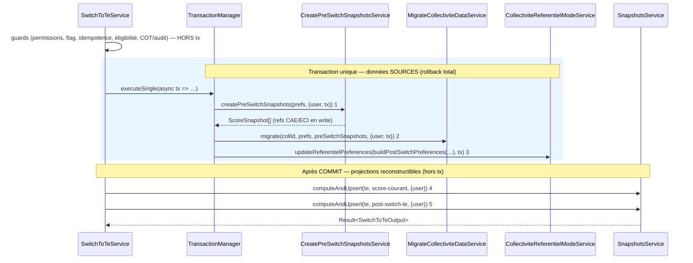

# PR18 — Bascule bout-en-bout (`switchToTe`)

**Parent** : [doc/plans/2026-06-11-001-feat-bascule-referentiel-te-prd.md](2026-06-11-001-feat-bascule-referentiel-te-prd.md)

**Prérequis** : PR8 (squelette + guards permissions/idempotence), PR9 (guards COT/demande/audit), PR10 (`CreatePreSwitchSnapshotsService`), PR17b ([`MigrateCollectiviteDataService`](2026-06-11-012-feat-bascule-referentiel-te-pr17b-plan.md)) — tous mergés.

**Branche** : `TE-7303/switch-te-PR18` depuis `main`

**Estimation** : ~500 LOC (code + tests). *Orchestration (tx données sources + recompute hors tx) + prefs + output + e2e.* Tolérance ~650 LOC (PRD — bascule transactionnelle).

**Prod** : **Oui (endpoint)** — première PR qui **expose `referentiels.switchToTe` en prod** et rend la bascule utilisateur possible.

---

## Contexte

Jusqu'à PR17b, tous les blocs de la bascule existent isolément mais `switchToTe()` retourne `SWITCH_NOT_IMPLEMENTED` après les guards. PR18 est la PR d'**assemblage** : elle branche les services, puis retire le garde `SWITCH_NOT_IMPLEMENTED` et expose l'endpoint.

**Décision d'architecture** (cf. § Point technique central) : la bascule sépare **écritures sources** (atomiques, en transaction) et **projections** (score-courant TE + `post-switch-te`, recomputées **hors tx** après commit). Ce découpage suit le **précédent établi** du codebase : `UpdateActionStatutService.upsertActionStatuts` écrit les statuts en tx, puis appelle `snapshotsService.computeAndUpsert` **hors tx** une fois committé.

**Delta vs PR17b** : orchestration ; recalcul du `score-courant` TE + snapshot `post-switch-te` ; mise à jour `preferences.referentiels` + `te.populatedFromCaeEci` ; archivage des refs CAE/ECI en `write` ; exposition prod + output de succès.



Échec des étapes 1→3 → `throw` du `Result` → rollback total Drizzle → `te.populatedFromCaeEci` **jamais** écrit partiellement, données `te_*` non persistées. Échec des étapes 4/5 (post-commit) → CT basculée (sources cohérentes) mais projections manquantes → **best-effort** : log + reconstruction à la 1re saisie TE ou via `forceRecompute` ops (cf. § Projections hors transaction).

---

## Décisions actées

**Hérite PR8–PR17b** : `Result<…, SwitchToTeError>` (ADR 0012) ; guards **avant** la transaction ; `preSwitchSnapshots` **injectés en mémoire** dans `migrate` (pas de re-read) ; garde TE vide dans `migrate` ; pas de suppression des données CAE/ECI (archivage via prefs).

| Sujet | Décision |
| --- | --- |
| Orchestration | **Transaction unique sur les données sources** via `transactionManager.executeSingle(async (tx) => { … })` (étapes 1→3), **puis recompute des projections hors tx** (étapes 4→5). Guards inchangés, **avant** la tx (lectures read-only). |
| Ordre | 1 `createPreSwitchSnapshots(tx)` → 2 `migrate(tx)` → 3 prefs + `populatedFromCaeEci` (`tx`, **en dernier de la tx**) → **commit** → 4 recalcul `score-courant` TE (hors tx) → 5 snapshot `post-switch-te` (hors tx). |
| Découpage tx / hors-tx | Suit le précédent `UpdateActionStatutService.upsertActionStatuts` : les statuts s'écrivent en tx, `computeAndUpsert` recompute **après commit**. Les projections (`score-courant`, `post-switch-te`) sont **reconstructibles** depuis `te_*` + personnalisation → pas besoin d'atomicité stricte. |
| Recalcul scores | `SnapshotsService.computeAndUpsert` **sans `tx`** (lit les données committées, comme le flux nominal). 4 `computeAndUpsert({ collectiviteId, referentielId: te }, { user })` (jalon `COURANT`) ; 5 `computeAndUpsert({ collectiviteId, referentielId: te, ref: POST_SWITCH_TE_REF, jalon: POST_SWITCH_TE, nom: POST_SWITCH_TE_NOM }, { user })`. **Aucune modification du scoring** (`computeScoreForCollectivite` inchangé). Pas d'écriture directe `client_scores` (PRD). |
| `post-switch-te` | `ref: 'post-switch-te'`, `jalon: post_switch_te`, `nom: 'État initial Climat Ressources'` — ajouter `POST_SWITCH_TE_REF` / `POST_SWITCH_TE_NOM` dans `snapshots.constants.ts` + case dédié dans `getDefaultSnapshotMetadata` (jalon système non éditable, comme `pre_audit`). |
| Archivage refs | `buildPostSwitchPreferences` (pure) : refs CAE/ECI en `mode: write` → `{ mode: archived, display: false }` ; refs déjà `archived` inchangées ; `te` → `{ mode: write, display: true, populatedFromCaeEci: { populatedAt, populatedBy: user.id } }`. Invariant Zod `archived ⇒ display: false` respecté. |
| Persistance prefs | `CollectiviteReferentielModeService.updateReferentielPreferences(collectiviteId, referentiels, tx)` — étape 3, `tx` propagé. |
| Idempotence | Garde `te.populatedFromCaeEci` (PR8) **avant** tx ; écrit **en dernier de la transaction source**. Un rollback des étapes 1→3 laisse la CT re-basculable. |
| Retrait squelette | Supprimer `return failure(SWITCH_NOT_IMPLEMENTED)` ; **supprimer** l'erreur `SWITCH_NOT_IMPLEMENTED` de `switch-to-te.errors.ts` (plus référencée) une fois les tests migrés. |
| Output | `switch-to-te.output.ts` : schéma succès `{ status: 'switched', populatedAt: string }` (remplace `not_implemented`). Router : passe le `Result` par `getResultDataOrThrowError` (inchangé). |
| Erreurs | Ajouter `POST_SWITCH_RECOMPUTE_FAILED` (`INTERNAL_SERVER_ERROR`, projections post-commit) dans `switch-to-te.errors.ts`. Réutiliser `PRE_SWITCH_SNAPSHOT_FAILED` / `MIGRATION_FAILED` existants. Pas d'erreur `PREFERENCES_UPDATE_FAILED` dédiée : `updateReferentielPreferences` renvoie déjà un `Result` typé propagé tel quel. |
| Timeout | **Réduit** vs « tout en tx » : la transaction ne contient que les écritures (pas le recompute). Risque **accepté** (PRD risque D) ; validé par e2e sur CT max charge (cf. Tests). |

---

## Point technique central — pourquoi le recompute est hors transaction

**Contrainte** : `SnapshotsService.computeAndUpsert` **écrit** avec `tx`, mais délègue le **calcul** à `ScoresService.computeScoreForCollectivite`, qui lit `action_statut` via `ListActionStatutsRepository.listByActionIds` sur `this.databaseService.db` (**pool, hors transaction**). Un recompute exécuté *dans* la tx de bascule ne verrait donc **pas** les statuts `te_*` migrés non commités (isolation PostgreSQL).

**Deux options envisagées :**

| Option | Description | Verdict |
| --- | --- | --- |
| **A — tx-aware ciblé** | Threader `tx?` dans `computeScoreForCollectivite` + `listByActionIds` (+ explications) pour tout exécuter en une seule tx | **Écartée** : touche le **cœur du scoring** (chemin partagé) ; allonge la tx → **risque timeout** accru sur CT max charge ; nécessite aussi de rendre les explications `tx`-aware pour un `post-switch-te` complet ; va **à contre-courant du pattern codebase** |
| **C — write atomique + projections hors tx** *(retenue)* | Écritures sources en tx ; `computeAndUpsert` (score-courant + post-switch) **après commit**, exactement comme `upsertActionStatuts` | **Retenue** : **zéro modification du scoring** ; **transaction courte** (timeout réduit) ; **cohérente** avec le précédent du codebase ; atomicité garantie sur les **données sources** |

**Justification du choix C** : le point clé est que `score-courant` TE et `post-switch-te` sont des **projections reconstructibles** (dérivées de `te_*` + personnalisation), pas des données sources. Le seul périmètre nécessitant l'atomicité — snapshots `pre-switch-te`, données `te_*`, `prefs + populatedFromCaeEci` — est protégé par la transaction. Reproduire le pattern `upsertActionStatuts` (recompute post-commit) est plus sûr (aucune régression scoring), plus rapide (tx courte) et cohérent avec l'existant.

**Compromis assumé** : si le recompute post-commit (4/5) échoue, la CT est **basculée** (données sources cohérentes) mais sans `score-courant`/`post-switch-te` — cf. § Projections hors transaction.

> **Divergence PRD** : le PRD ([Flux de bascule](2026-06-11-001-feat-bascule-referentiel-te-prd.md#flux-de-bascule)) place le recompute (étape 3) et `post-switch-te` (étape 4) *dans* la transaction unique. La Stratégie C impose d'**amender le PRD** pour distinguer « transaction atomique sur les données sources » et « recompute des projections hors tx (pattern `upsertActionStatuts`) ». Amendement à porter dans la même PR.

## Projections hors transaction — robustesse

- **Ordre** : le flag `populatedFromCaeEci` est écrit **dans la tx source** (étape 3), donc cohérent avec les données `te_*`. La bascule est considérée réussie dès le commit.
- **Échec 4/5** (post-commit) : renvoyer `failure(POST_SWITCH_RECOMPUTE_FAILED)` **n'annule pas** la bascule (le flag est déjà committé). Choix : logger l'erreur en `error` (Sentry) et **retourner tout de même un succès** à l'appelant, la projection étant reconstructible. *(À trancher : succès silencieux vs erreur explicite — cf. Questions ouvertes.)*
- **Reconstruction** : `score-courant` TE est recalculé à la **1re saisie** TE (`upsertActionStatuts`) ; `post-switch-te` peut être régénéré via `forceRecompute` (capacité ops, déjà envisagée par le PRD).
- **Micro-fenêtre** : entre le commit (TE devient `write`) et le figement de `post-switch-te`, une saisie TE concurrente pourrait polluer l'état figé. Fenêtre de l'ordre de la seconde, jugée **négligeable**. Si l'équipe la juge inacceptable → variante 3-phases (flag écrit *après* les projections, garde d'idempotence basée sur le flag) : cf. Questions ouvertes.

---

## Ordre d'implémentation

1. **`snapshots.constants.ts`** — `POST_SWITCH_TE_REF` / `POST_SWITCH_TE_NOM` + case `getDefaultSnapshotMetadata`.
2. **`switch-to-te.rules.ts`** — `buildPostSwitchPreferences` (pure) + tests `switch-to-te.rules.spec.ts`.
3. **`switch-to-te.errors.ts`** — `POST_SWITCH_RECOMPUTE_FAILED` ; retrait `SWITCH_NOT_IMPLEMENTED` (après migration des tests).
4. **`switch-to-te.output.ts`** — schéma succès.
5. **`switch-to-te.service.ts`** — orchestration (tx sources + recompute hors tx).
6. **`switch-to-te.router.ts`** — inchangé (vérifier type output).
7. **PRD** — amender [Flux de bascule](2026-06-11-001-feat-bascule-referentiel-te-prd.md#flux-de-bascule) (tx sources + projections hors tx).
8. **E2e** — bascule complète + mise à jour des tests squelette.

*Aucune modification de `ScoresService` / `ListActionStatutsRepository` (Stratégie C).*

---

## Implémentation

### 1) Constantes & métadonnées snapshot

```ts
// snapshots.constants.ts
POST_SWITCH_TE_REF: 'post-switch-te',
POST_SWITCH_TE_NOM: 'État initial Climat Ressources',
```

`getDefaultSnapshotMetadata` : ajouter le case `SnapshotJalonEnum.POST_SWITCH_TE` → `{ ref: POST_SWITCH_TE_REF, nom: POST_SWITCH_TE_NOM }` (miroir du case `PRE_SWITCH_TE` livré en PR10).

### 2) `buildPostSwitchPreferences` (pure — `switch-to-te.rules.ts`)

```ts
export function buildPostSwitchPreferences(
  prefs: CollectiviteReferentielPreferences,
  populated: { populatedAt: string; populatedBy: string }
): CollectiviteReferentielPreferences {
  const archiveIfWrite = (p: ReferentielPreference): ReferentielPreference =>
    p.mode === 'write' ? { mode: 'archived', display: false } : p;

  return {
    cae: archiveIfWrite(prefs.cae),
    eci: archiveIfWrite(prefs.eci),
    te: { mode: 'write', display: true, populatedFromCaeEci: populated },
  };
}
```

### 3) `SwitchToTeService.switchToTe` — orchestration

Après les guards existants (permissions, flag, `ALREADY_SWITCHED`, `canSwitchToTe`, blockers), remplacer le `failure(SWITCH_NOT_IMPLEMENTED)` par une **transaction sources** puis un **recompute post-commit** :

```ts
const populatedAt = new Date().toISOString();

// ── Transaction unique : données SOURCES (rollback total sur échec) ──
const txResult = await this.transactionManager.executeSingle<
  void,
  SwitchToTeError
>(async (tx) => {
  // étape 1 : snapshots pre-switch-te (refs CAE/ECI en write)
  const snapshotsResult =
    await this.createPreSwitchSnapshotsService.createPreSwitchSnapshots(
      collectiviteId, prefs, { user, tx });
  if (!snapshotsResult.success) return snapshotsResult;

  // étape 2 : migration données collectivité (te_*)
  const migrateResult = await this.migrateCollectiviteDataService.migrate(
    collectiviteId, prefs, snapshotsResult.data, { user, tx });
  if (!migrateResult.success) return migrateResult;

  // étape 3 : prefs + populatedFromCaeEci (en dernier de la tx)
  const prefsResult = await this.collectiviteReferentielModeService
    .updateReferentielPreferences(
      collectiviteId,
      buildPostSwitchPreferences(prefs, { populatedAt, populatedBy: user.id }),
      tx);
  if (!prefsResult.success) return prefsResult;

  return success(undefined);
});

if (!txResult.success) return txResult; // rollback déjà effectué

// ── Après COMMIT : projections reconstructibles (hors tx, best-effort) ──
// Lit les données te_* committées, comme UpdateActionStatutService.upsertActionStatuts.
const recomputeResult = await this.recomputeTeProjections(collectiviteId, user);
if (!recomputeResult.success) {
  // la bascule EST réussie (flag committé) ; projections régénérables → succès renvoyé
  this.logger.error(
    `Bascule TE ${collectiviteId} : recompute des projections échoué (réparable)`,
    recomputeResult.cause?.stack
  );
}

return success({ status: 'switched', populatedAt });
```

```ts
private async recomputeTeProjections(collectiviteId: number, user: AuthUser) {
  // étape 4 : score-courant TE
  const courant = await this.snapshotsService.computeAndUpsert(
    { collectiviteId, referentielId: ReferentielIdEnum.TE }, { user });
  if (!courant.success) return failure(POST_SWITCH_RECOMPUTE_FAILED, courant.cause);

  // étape 5 : snapshot post-switch-te
  const post = await this.snapshotsService.computeAndUpsert(
    { collectiviteId, referentielId: ReferentielIdEnum.TE,
      ref: SNAPSHOTS.POST_SWITCH_TE_REF, jalon: SnapshotJalonEnum.POST_SWITCH_TE,
      nom: SNAPSHOTS.POST_SWITCH_TE_NOM }, { user });
  if (!post.success) return failure(POST_SWITCH_RECOMPUTE_FAILED, post.cause);

  return success(undefined);
}
```

Injecter dans le constructeur : `TransactionManager`, `CreatePreSwitchSnapshotsService`, `MigrateCollectiviteDataService`, `SnapshotsService`, `CollectiviteReferentielModeService` (tous déjà providers de `ReferentielsModule`).

> **Note idempotence** : le recompute hors tx utilise `computeAndUpsert` **sans `tx`** → il lit l'état committé, comme le flux nominal. Aucun paramètre `tx` à ajouter au scoring.

### 4) Output & router

```ts
// switch-to-te.output.ts
export const switchToTeOutputSchema = z.object({
  status: z.literal('switched'),
  populatedAt: z.string(),
});
export type SwitchToTeOutput = z.infer<typeof switchToTeOutputSchema>;
```

Router inchangé (`getResultDataOrThrowError(result)`). Vérifier que le type de retour de `switchToTe` est bien `Result<SwitchToTeOutput, SwitchToTeError>`.

---

## Tests

### E2e bascule complète — `switch-to-te.router.e2e-spec.ts` (+ éventuel `switch-to-te.service.e2e-spec.ts`)

Réutiliser fixtures PR17b (`switch-to-te-context.test-fixture.ts` : `prefsEligibleCaeOnly`, `prefsEligibleCaeAndEci`, seeders statuts/commentaires/pilotes/services/liens fiches).

| Scénario | Seed | Vérif DB |
| --- | --- | --- |
| Bascule nominale CAE seul | CT `prefsEligibleCaeOnly` + statuts/explications/pilotes/services/lien fiche sur `cae_*` | snapshot `pre-switch-te` sur `cae` ; données `te_*` migrées ; snapshot `score-courant` TE recalculé ; snapshot `post-switch-te` TE ; prefs → `cae: archived/display false`, `te: write/display true` + `populatedFromCaeEci` |
| Fusion CAE+ECI | `prefsEligibleCaeAndEci` + statuts CAE+ECI sur mesure `teMesureCaeAndEci` | 2 snapshots `pre-switch-te` (cae+eci) ; statut TE fusionné N→1 ; `cae`+`eci` archivés |
| Cohérence statut ↔ score | statuts mixtes source | `post-switch-te` cohérent avec `mergeStatuts` (arrondi 5 %) |
| Idempotence | rejouer `switchToTe` après succès | `ALREADY_SWITCHED` ; aucune double écriture |
| Rollback (migration) | forcer TE déjà peuplé (insert `te_*` avant) | `REFERENTIEL_TE_NOT_EMPTY` ; **aucun** snapshot `pre-switch-te` ; prefs **inchangées** ; `populatedFromCaeEci` absent |
| Rollback (étape 3 prefs) | simuler échec `updateReferentielPreferences` | tout rollbacké (snapshots pre, données `te_*`) ; CT re-basculable |
| Projections best-effort | simuler échec `computeAndUpsert` post-commit | **succès** renvoyé ; flag committé ; log `error` ; données `te_*` + prefs présentes ; `post-switch-te` absent (régénérable) |
| Guards préservés | COT actif / audit en cours / lecture | erreurs PR8/PR9 inchangées, **hors** tx (aucun snapshot créé) |

### Mise à jour tests existants

Les 3 tests asseoyant `SWITCH_NOT_IMPLEMENTED` (« guards passent (squelette) », « audit validé et clos », « audit sur ref archived ») doivent désormais **asserter le succès** (`status: 'switched'` + effets DB), la bascule étant réellement exécutée.

### Non-régression scoring

Stratégie C = **aucune modification** de `ScoresService` / `ListActionStatutsRepository`. Le recompute réutilise `computeAndUpsert` tel quel (chemin déjà couvert par `upsertActionStatuts`). Pas de risque de régression scoring à couvrir spécifiquement.

### Risque D — CT max charge

E2e/bench sur la CT la plus chargée connue (1377 statuts CAE) : mesurer la durée `migrate` + recalculs + écritures ; **assert < `statement_timeout` (30 s)**. Documenter la durée observée dans la PR.

```bash
pnpm test:backend switch-to-te
```

---

## Hors scope

- UI bascule : CTA + états disabled (PR19), modale irréversible (PR20).
- Masquage questions/personnalisations legacy (PR21).
- UI snapshots post-bascule + masquage « Figer l'état des lieux » (PR22).
- Export score-comparaison personnalisations (PR23).
- Suppression des données CAE/ECI (hors périmètre PRD — archivage seul).
- Chunking des inserts (réévalué seulement si le bench risque D dépasse le timeout).
- Recalcul service-role de `pre-switch-te` (capacité ops, hors scope produit).

---

## Décisions tranchées (revue)

- **Échec du recompute post-commit → succès silencieux** *(tranché)*. `switchToTe` renvoie `{ status: 'switched' }` même si le recompute des projections échoue ; l'erreur est loggée en `error` (Sentry). Motif : la bascule est réussie (flag + données committés), les projections sont régénérables (1re saisie TE ou `forceRecompute`). Un champ optionnel `projectionsPending` pourra être ajouté sans casser le contrat si l'UX PR19 le justifie.
- **Micro-fenêtre `post-switch-te` → acceptée** *(tranché)*. Variante simple conservée (flag dans la tx, projections recomputées après commit). La fenêtre (~1 s, après une action de bascule volontaire) où une saisie TE pourrait précéder le figement de `post-switch-te` est jugée négligeable. Pas de variante 3-phases (éviterait la fenêtre au prix d'une double tx + garde d'idempotence basée sur le flag + chemin de reprise).
- **Amendement PRD → dans la PR18** *(tranché)*. La mise à jour du PRD ([Flux de bascule](2026-06-11-001-feat-bascule-referentiel-te-prd.md#flux-de-bascule) + section/table PR18) voyage avec le code, pour une revue conjointe décision + implémentation. Pas de PR de doc séparée.

## Critères de done

- [ ] `switchToTe` : transaction unique sur les **données sources** (1→3, `populatedFromCaeEci` en dernier de la tx) ; recompute des projections **hors tx** (4→5). Rollback total des sources validé en e2e.
- [ ] `score-courant` TE + `post-switch-te` créés post-commit ; échec best-effort validé en e2e (succès renvoyé, log).
- [ ] Prefs post-bascule correctes (`buildPostSwitchPreferences` + tests unitaires) ; invariant `archived ⇒ display false`.
- [ ] `SWITCH_NOT_IMPLEMENTED` retiré ; `POST_SWITCH_RECOMPUTE_FAILED` ajouté ; output succès ; endpoint **exposé prod**.
- [ ] E2e bascule complète (nominale, fusion, idempotence, rollback, projection best-effort) verts ; tests squelette migrés.
- [ ] **Aucune** modification de `ScoresService` / `ListActionStatutsRepository`.
- [ ] Bench CT max charge documenté (tx < `statement_timeout`).
- [ ] PRD amendé (Flux de bascule : tx sources + projections hors tx).

---

## Suite (PR19+)

| PR | Suite |
| --- | --- |
| PR19–PR20 | UI bascule (CTA + états disabled ; modale irréversible) |
| PR21 | Masquage questions / personnalisations legacy |
| PR22 | UI snapshots post-bascule |
| PR23 | Export score-comparaison : feuille personnalisations |
