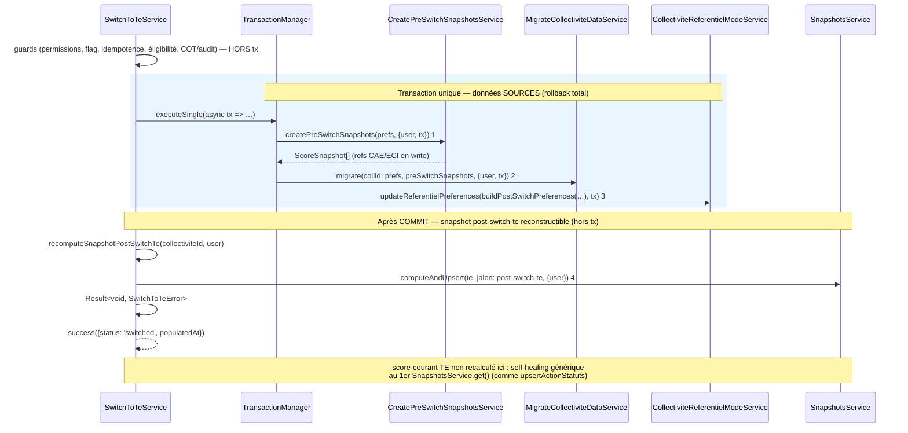

# PR18 — Bascule bout-en-bout (`switchToTe`)

**Parent** : [doc/plans/2026-06-11-001-feat-bascule-referentiel-te-prd.md](2026-06-11-001-feat-bascule-referentiel-te-prd.md)

**Prérequis** : PR8 (squelette + guards permissions/idempotence), PR9 (guards COT/demande/audit), PR10 (`CreatePreSwitchSnapshotsService`), PR17b ([`MigrateCollectiviteDataService`](2026-06-11-012-feat-bascule-referentiel-te-pr17b-plan.md)) — tous mergés.

**Branche** : `TE-7303/switch-te-PR18` depuis `main`

**Estimation** : ~500 LOC (code + tests). *Orchestration (tx données sources + recompute hors tx) + prefs + output + e2e.* Tolérance ~650 LOC (PRD — bascule transactionnelle).

**Prod** : **Oui (endpoint)** — première PR qui **expose `referentiels.switchToTe` en prod** et rend la bascule utilisateur possible.

---

## Contexte

Jusqu'à PR17b, tous les blocs de la bascule existent isolément mais `switchToTe()` retourne `SWITCH_NOT_IMPLEMENTED` après les guards. PR18 est la PR d'**assemblage** : elle branche les services, puis retire le garde `SWITCH_NOT_IMPLEMENTED` et expose l'endpoint.

**Décision d'architecture** (cf. § Point technique central) : la bascule sépare **écritures sources** (atomiques, en transaction) et **projection** (`post-switch-te`, recomputée **hors tx** après commit). Ce découpage suit le **précédent établi** du codebase : `UpdateActionStatutService.upsertActionStatuts` écrit les statuts en tx, puis appelle `snapshotsService.computeAndUpsert` **hors tx** une fois committé. Le score-courant TE n'entre pas dans ce recompute post-commit : il est régénéré par le **self-healing générique** de `SnapshotsService.get()` (déjà utilisé par `upsertActionStatuts` et `onPersonnalisationResponseSaved`) au premier accès en lecture, un calcul explicite ici serait redondant. *(Affiné post-implémentation — le plan initial prévoyait aussi un recalcul explicite du score-courant à cette étape ; cf. § Décisions tranchées.)*

**Delta vs PR17b** : orchestration ; snapshot `post-switch-te` recomputé hors tx (+ réparation retentée si un rappel de `switchToTe` le trouve manquant) ; mise à jour `preferences.referentiels` + `te.populatedFromCaeEci` ; archivage des refs CAE/ECI en `write` ; exposition prod + output de succès.



Si `switchToTe` est rappelé sur une CT où `populatedFromCaeEci` est déjà posé, le service ne renvoie pas `ALREADY_SWITCHED` à l'aveugle : il vérifie d'abord la présence du snapshot `post-switch-te` (`SnapshotsService.get(..., POST_SWITCH_TE_REF)`, sans effet de bord pour ce ref) — présent → `ALREADY_SWITCHED` ; absent (échec du recompute précédent) → **réparation** : retente `recomputeSnapshotPostSwitchTe` et renvoie `switched` si ça aboutit, ou `POST_SWITCH_RECOMPUTE_FAILED` (cette fois renvoyée à l'appelant) si ça échoue encore.

Échec des étapes 1→3 → la transaction retourne un `Result` en échec, propagé tel quel par `SwitchToTeService.switchToTe` (`if (!txResult.success) return txResult`) ; le rollback lui-même est assuré par le mécanisme existant de `TransactionManager.executeTransaction` (rollback total Drizzle) → `te.populatedFromCaeEci` **jamais** écrit partiellement, données `te_*` non persistées. Échec de l'étape 4 (post-commit, capté par `recomputeSnapshotPostSwitchTe` qui renvoie `Result<void, SwitchToTeError>`) → CT basculée (sources cohérentes) mais snapshot manquant → **best-effort au 1er appel** : `switchToTe` logge l'erreur et renvoie tout de même un succès ; réparation via un nouvel appel à `switchToTe` (cf. § Projections hors transaction).

---

## Décisions actées

**Hérite PR8–PR17b** : `Result<…, SwitchToTeError>` (ADR 0012) ; guards **avant** la transaction ; `preSwitchSnapshots` **injectés en mémoire** dans `migrate` (pas de re-read) ; garde TE vide dans `migrate` ; pas de suppression des données CAE/ECI (archivage via prefs).

| Sujet | Décision |
| --- | --- |
| Orchestration | **Transaction unique sur les données sources** via `transactionManager.executeSingle(async (tx) => { … })` (étapes 1→3), **puis recompute du snapshot post-switch-te hors tx** (étape 4). Guards de permission inchangés, **avant** la tx (lectures read-only) ; le guard d'idempotence (`populatedFromCaeEci`) est affiné pour déclencher une réparation plutôt qu'un simple refus (cf. ligne « Réparation »). |
| Ordre | 1 `createPreSwitchSnapshots(tx)` → 2 `migrate(tx)` → 3 prefs + `populatedFromCaeEci` (`tx`, **en dernier de la tx**) → **commit** → 4 snapshot `post-switch-te` (hors tx). Le score-courant TE n'est **pas** recalculé dans cette séquence — self-healing générique au 1er `SnapshotsService.get()`. |
| Découpage tx / hors-tx | Suit le précédent `UpdateActionStatutService.upsertActionStatuts` : les statuts s'écrivent en tx, `computeAndUpsert` recompute **après commit**. Le snapshot `post-switch-te` est **reconstructible** depuis `te_*` + personnalisation → pas besoin d'atomicité stricte. |
| Recalcul scores | `SnapshotsService.computeAndUpsert` **sans `tx`** (lit les données committées, comme le flux nominal), orchestré par `SwitchToTeService.recomputeSnapshotPostSwitchTe` qui renvoie `Result<void, SwitchToTeError>` : `computeAndUpsert({ collectiviteId, referentielId: te, jalon: POST_SWITCH_TE }, { user })` — **pas de `ref`/`nom`** : déduits du jalon par `getDefaultSnapshotMetadata`. **Aucune modification du scoring** (`computeScoreForCollectivite` inchangé). Pas d'écriture directe `client_scores` (PRD). Le score-courant TE (jalon `COURANT`) n'est **pas** recalculé ici : `SnapshotsService.get()` l'auto-crée au premier accès en lecture si absent — calcul explicite redondant, retiré post-implémentation (cf. § Décisions tranchées). |
| Réparation | Si `switchToTe` est rappelé sur une CT déjà `populatedFromCaeEci` mais dont le snapshot `post-switch-te` est absent (échec du recompute best-effort précédent), le recompute est **retenté** (upsert idempotent sur la PK `(collectivite_id, referentiel_id, ref)`) au lieu de renvoyer directement `ALREADY_SWITCHED`. Contrairement au 1er appel, un échec de ce retry est renvoyé à l'appelant (`POST_SWITCH_RECOMPUTE_FAILED`) plutôt que loggué en silence — rend concret le caractère « réparable » du best-effort. *(Ajouté post-implémentation.)* |
| `post-switch-te` | `ref: 'post-switch-te'`, `jalon: post_switch_te`, `nom: 'État initial Climat Ressources'` — ajouter `POST_SWITCH_TE_REF` / `POST_SWITCH_TE_NOM` dans `snapshots.constants.ts` + case dédié dans `getDefaultSnapshotMetadata` (jalon système non éditable, comme `pre_audit`). |
| Archivage refs | `buildPostSwitchPreferences` (pure) : refs CAE/ECI en `mode: write` → `{ mode: archived, display: false }` ; refs déjà `archived` inchangées ; `te` → `{ mode: write, display: true, populatedFromCaeEci: { populatedAt, populatedBy: user.id } }`. Invariant Zod `archived ⇒ display: false` respecté. |
| Persistance prefs | `CollectiviteReferentielModeService.updateReferentielPreferences(collectiviteId, referentiels, tx)` — étape 3, `tx` propagé. |
| Idempotence | Garde `te.populatedFromCaeEci` (PR8) **avant** tx ; écrit **en dernier de la transaction source**. Un rollback des étapes 1→3 laisse la CT re-basculable. Affinée post-implémentation : ne se contente plus de refuser (`ALREADY_SWITCHED`), voir ligne « Réparation ». |
| Retrait squelette | Supprimer `return failure(SWITCH_NOT_IMPLEMENTED)` ; **supprimer** l'erreur `SWITCH_NOT_IMPLEMENTED` de `switch-to-te.errors.ts` (plus référencée) une fois les tests migrés. |
| Output | `switch-to-te.output.ts` : schéma succès `{ status: 'switched', populatedAt: string }` (remplace `not_implemented`). Router : passe le `Result` par `getResultDataOrThrowError` (inchangé). |
| Erreurs | Ajouter `POST_SWITCH_RECOMPUTE_FAILED` (`INTERNAL_SERVER_ERROR`, échec du recompute post-commit — au 1er appel comme lors d'une réparation) dans `switch-to-te.errors.ts`. Réutiliser `PRE_SWITCH_SNAPSHOT_FAILED` / `MIGRATION_FAILED` existants. Pas d'erreur `PREFERENCES_UPDATE_FAILED` dédiée : `updateReferentielPreferences` renvoie déjà un `Result` typé propagé tel quel. |
| Timeout | **Réduit** vs « tout en tx » : la transaction ne contient que les écritures (pas le recompute). Risque **accepté** (PRD risque D) ; validé par e2e sur CT max charge (cf. Tests). |

---

## Point technique central — pourquoi le recompute est hors transaction

**Contrainte** : `SnapshotsService.computeAndUpsert` **écrit** avec `tx`, mais délègue le **calcul** à `ScoresService.computeScoreForCollectivite`, qui lit `action_statut` via `ListActionStatutsRepository.listByActionIds` sur `this.databaseService.db` (**pool, hors transaction**). Un recompute exécuté *dans* la tx de bascule ne verrait donc **pas** les statuts `te_*` migrés non commités (isolation PostgreSQL).

**Deux options envisagées :**

| Option | Description | Verdict |
| --- | --- | --- |
| **A — tx-aware ciblé** | Threader `tx?` dans `computeScoreForCollectivite` + `listByActionIds` (+ explications) pour tout exécuter en une seule tx | **Écartée** : touche le **cœur du scoring** (chemin partagé) ; allonge la tx → **risque timeout** accru sur CT max charge ; nécessite aussi de rendre les explications `tx`-aware pour un `post-switch-te` complet ; va **à contre-courant du pattern codebase** |
| **C — write atomique + projection hors tx** *(retenue)* | Écritures sources en tx ; `computeAndUpsert` (post-switch-te) **après commit**, exactement comme `upsertActionStatuts` | **Retenue** : **zéro modification du scoring** ; **transaction courte** (timeout réduit) ; **cohérente** avec le précédent du codebase ; atomicité garantie sur les **données sources** |

**Justification du choix C** : le point clé est que `post-switch-te` est une **projection reconstructible** (dérivée de `te_*` + personnalisation), pas une donnée source. Le seul périmètre nécessitant l'atomicité — snapshots `pre-switch-te`, données `te_*`, `prefs + populatedFromCaeEci` — est protégé par la transaction. Reproduire le pattern `upsertActionStatuts` (recompute post-commit) est plus sûr (aucune régression scoring), plus rapide (tx courte) et cohérent avec l'existant. Le score-courant TE, lui, n'est même plus recalculé à cette étape (self-healing, cf. plus haut) — il n'entre donc pas dans ce périmètre.

**Compromis assumé** : si le recompute post-commit (étape 4) échoue, la CT est **basculée** (données sources cohérentes) mais sans `post-switch-te` — cf. § Projections hors transaction pour le mécanisme de réparation.

> **Divergence PRD** : le PRD ([Flux de bascule](2026-06-11-001-feat-bascule-referentiel-te-prd.md#flux-de-bascule)) place le recompute (étape 3) et `post-switch-te` (étape 4) *dans* la transaction unique. La Stratégie C impose d'**amender le PRD** pour distinguer « transaction atomique sur les données sources » et « recompute du snapshot post-switch-te hors tx (pattern `upsertActionStatuts`) ». Amendement à porter dans la même PR.

## Projections hors transaction — robustesse

- **Ordre** : le flag `populatedFromCaeEci` est écrit **dans la tx source** (étape 3), donc cohérent avec les données `te_*`. La bascule est considérée réussie dès le commit.
- **Échec étape 4** (post-commit, 1er appel) : renvoyer `failure(POST_SWITCH_RECOMPUTE_FAILED)` **n'annule pas** la bascule (le flag est déjà committé). Choix tranché : logger l'erreur en `error` (Sentry) et **retourner tout de même un succès** à l'appelant, le snapshot étant reconstructible.
- **Reconstruction** :
  - `score-courant` TE : self-healing **générique**, indépendant de la bascule — `SnapshotsService.get()` le recrée automatiquement au 1er accès en lecture si absent (dashboard, `upsertActionStatuts`, etc.), sans effet de bord destructeur.
  - `post-switch-te` : pas d'équivalent self-healing (jalon historique figé, pas de branche dédiée dans `SnapshotsService.get()`). Sa réparation passe par un **nouvel appel à `switchToTe`** sur la même CT : le service détecte que `populatedFromCaeEci` est déjà posé, vérifie via `get(..., POST_SWITCH_TE_REF)` (sans effet de bord) que le snapshot manque, puis retente `recomputeSnapshotPostSwitchTe` — upsert idempotent, aucun risque de doublon. Si ce 2e essai échoue aussi, l'erreur est cette fois renvoyée à l'appelant. *(`forceRecompute` — capacité ops mentionnée dans une version antérieure de ce plan et dans le PRD — ne convient **pas** à ce cas : il exige que le snapshot existe déjà, `SNAPSHOT_NOT_FOUND` sinon ; il rafraîchit un snapshot existant, il n'en crée pas un manquant.)*
- **Micro-fenêtre** : entre le commit (TE devient `write`) et le figement de `post-switch-te`, une saisie TE concurrente pourrait polluer l'état figé. Fenêtre de l'ordre de la seconde, jugée **négligeable**. Pas de variante 3-phases retenue (flag écrit *après* le recompute) — cf. § Décisions tranchées.

---

## Ordre d'implémentation

1. **`snapshots.constants.ts`** — `POST_SWITCH_TE_REF` / `POST_SWITCH_TE_NOM` + case `getDefaultSnapshotMetadata`.
2. **`switch-to-te.rules.ts`** — `buildPostSwitchPreferences` (pure) + tests `switch-to-te.rules.spec.ts`.
3. **`switch-to-te.errors.ts`** — `POST_SWITCH_RECOMPUTE_FAILED` ; retrait `SWITCH_NOT_IMPLEMENTED` (après migration des tests).
4. **`switch-to-te.output.ts`** — schéma succès.
5. **`switch-to-te.service.ts`** — orchestration (tx sources + recompute hors tx).
6. **`switch-to-te.router.ts`** — inchangé (vérifier type output).
7. **PRD** — amender [Flux de bascule](2026-06-11-001-feat-bascule-referentiel-te-prd.md#flux-de-bascule) (tx sources + snapshot post-switch-te hors tx).
8. **E2e** — bascule complète + mise à jour des tests squelette.

*Aucune modification de `ScoresService` / `ListActionStatutsRepository` (Stratégie C).*

---

## Implémentation

### 1) Constantes & métadonnées snapshot

```ts
// snapshots.constants.ts
POST_SWITCH_TE_REF: 'post-switch-te',
POST_SWITCH_TE_NOM: 'État initial Climat Ressources',
```

`getDefaultSnapshotMetadata` : ajouter le case `SnapshotJalonEnum.POST_SWITCH_TE` → `{ ref: POST_SWITCH_TE_REF, nom: POST_SWITCH_TE_NOM }` (miroir du case `PRE_SWITCH_TE` livré en PR10).

### 2) `buildPostSwitchPreferences` (pure — `switch-to-te.rules.ts`)

```ts
export function buildPostSwitchPreferences(
  prefs: CollectiviteReferentielPreferences,
  populated: { populatedAt: string; populatedBy: string }
): CollectiviteReferentielPreferences {
  const archiveIfWrite = (p: ReferentielPreference): ReferentielPreference =>
    p.mode === 'write' ? { mode: 'archived', display: false } : p;

  return {
    cae: archiveIfWrite(prefs.cae),
    eci: archiveIfWrite(prefs.eci),
    te: { mode: 'write', display: true, populatedFromCaeEci: populated },
  };
}
```

### 3) `SwitchToTeService.switchToTe` — orchestration

*(Code ci-dessous conforme à l'implémentation finale — affiné post-implémentation, cf. § Décisions tranchées : suppression du recalcul explicite du score-courant, ajout de la réparation sur rappel.)*

Après les guards de permission, remplacer le `failure(SWITCH_NOT_IMPLEMENTED)` par le guard `populatedFromCaeEci` (idempotence **et** réparation), puis, si non basculée : `canSwitchToTe`, blockers, **transaction sources**, **recompute post-commit** :

```ts
if (prefs.te.populatedFromCaeEci) {
  // déjà basculé : le snapshot post-switch-te existe-t-il ? get() sans effet
  // de bord pour ce ref (pas de self-healing hors jalon COURANT). S'il manque
  // (échec précédent du recompute best-effort), on répare au lieu de bloquer
  // indéfiniment sur ALREADY_SWITCHED.
  const existingPostSwitch = await this.snapshotsService.get(
    collectiviteId, ReferentielIdEnum.TE, SNAPSHOTS.POST_SWITCH_TE_REF, { user });
  if (existingPostSwitch.success) {
    return failure(SwitchToTeErrorEnum.ALREADY_SWITCHED);
  }

  const repairResult = await this.recomputeSnapshotPostSwitchTe(collectiviteId, user);
  if (!repairResult.success) {
    // contrairement au best-effort du premier appel, on renvoie l'échec ici :
    // pas de raison de masquer un 2e échec à l'appelant.
    this.logger.error(
      `Bascule TE collectivite=${collectiviteId} : réparation du snapshot post-switch-te échouée`,
      repairResult.cause?.stack
    );
    return failure(SwitchToTeErrorEnum.POST_SWITCH_RECOMPUTE_FAILED, repairResult.cause);
  }

  return success({
    status: 'switched',
    populatedAt: prefs.te.populatedFromCaeEci.populatedAt,
  });
}

// … canSwitchToTe, blockers (inchangés) …

const populatedAt = new Date().toISOString();

// ── Transaction unique : données SOURCES (rollback total sur échec) ──
const txResult = await this.transactionManager.executeSingle<
  void,
  SwitchToTeError
>(async (tx) => {
  // étape 1 : snapshots pre-switch-te (refs CAE/ECI en write)
  const snapshotsResult =
    await this.createPreSwitchSnapshotsService.createPreSwitchSnapshots(
      collectiviteId, prefs, { user, tx });
  if (!snapshotsResult.success) return snapshotsResult;

  // étape 2 : migration données collectivité (te_*)
  const migrateResult = await this.migrateCollectiviteDataService.migrate(
    collectiviteId, prefs, snapshotsResult.data, { user, tx });
  if (!migrateResult.success) return migrateResult;

  // étape 3 : prefs + populatedFromCaeEci (en dernier de la tx)
  const prefsResult = await this.collectiviteReferentielModeService
    .updateReferentielPreferences(
      collectiviteId,
      buildPostSwitchPreferences(prefs, { populatedAt, populatedBy: user.id }),
      tx);
  if (!prefsResult.success) return prefsResult;

  return success(undefined);
});

if (!txResult.success) return txResult; // rollback déjà effectué

// ── Après COMMIT : snapshot post-switch-te (hors tx, best-effort) ──
// Lit les données te_* committées, comme UpdateActionStatutService.upsertActionStatuts.
const recomputeResult = await this.recomputeSnapshotPostSwitchTe(collectiviteId, user);
if (!recomputeResult.success) {
  // la bascule EST réussie (flag committé) ; snapshot régénérable — un nouvel
  // appel à switchToTe retentera ce calcul (voir le guard plus haut).
  this.logger.error(
    `Bascule TE collectivite=${collectiviteId} : recompute du snapshot post-switch-te échoué (réparable)`,
    recomputeResult.cause?.stack
  );
}

return success({ status: 'switched', populatedAt });
```

```ts
// étape 4 : snapshot post-switch-te — ref/nom déduits du jalon
// (getDefaultSnapshotMetadata), pas transmis ici. Le score-courant TE n'est
// PAS recalculé ici : self-healing au 1er accès en lecture via
// SnapshotsService.get() (déjà utilisé ailleurs, ex. UpdateActionStatutService).
private async recomputeSnapshotPostSwitchTe(collectiviteId: number, user: AuthUser) {
  const post = await this.snapshotsService.computeAndUpsert(
    { collectiviteId, referentielId: ReferentielIdEnum.TE,
      jalon: SnapshotJalonEnum.POST_SWITCH_TE }, { user });
  if (!post.success) return failure(POST_SWITCH_RECOMPUTE_FAILED, post.cause);

  return success(undefined);
}
```

Injecter dans le constructeur : `TransactionManager`, `CreatePreSwitchSnapshotsService`, `MigrateCollectiviteDataService`, `SnapshotsService`, `CollectiviteReferentielModeService` (tous déjà providers de `ReferentielsModule`).

> **Note idempotence** : le recompute hors tx utilise `computeAndUpsert` **sans `tx`** → il lit l'état committé, comme le flux nominal. Aucun paramètre `tx` à ajouter au scoring.

### 4) Output & router

```ts
// switch-to-te.output.ts
export const switchToTeOutputSchema = z.object({
  status: z.literal('switched'),
  populatedAt: z.string(),
});
export type SwitchToTeOutput = z.infer<typeof switchToTeOutputSchema>;
```

Router inchangé (`getResultDataOrThrowError(result)`). Vérifier que le type de retour de `switchToTe` est bien `Result<SwitchToTeOutput, SwitchToTeError>`.

---

## Tests

### E2e bascule complète — `switch-to-te.router.e2e-spec.ts` (+ éventuel `switch-to-te.service.e2e-spec.ts`)

Réutiliser fixtures PR17b (`switch-to-te-context.test-fixture.ts` : `prefsEligibleCaeOnly`, `prefsEligibleCaeAndEci`, seeders statuts/commentaires/pilotes/services/liens fiches).

| Scénario | Seed | Vérif DB |
| --- | --- | --- |
| Bascule nominale CAE seul | CT `prefsEligibleCaeOnly` + statuts/explications/pilotes/services/lien fiche sur `cae_*` | snapshot `pre-switch-te` sur `cae` ; données `te_*` migrées ; snapshot `post-switch-te` TE ; score-courant TE **absent** juste après (un `get()` le recrée par self-healing, vérifié directement) ; prefs → `cae: archived/display false`, `te: write/display true` + `populatedFromCaeEci` |
| Fusion CAE+ECI | `prefsEligibleCaeAndEci` + statuts CAE+ECI sur mesure `teMesureCaeAndEci` | 2 snapshots `pre-switch-te` (cae+eci) ; statut TE fusionné N→1 ; `cae`+`eci` archivés |
| Cohérence statut ↔ score | statuts mixtes source | `post-switch-te` cohérent avec `mergeStatuts` (arrondi 5 %) |
| Idempotence (snapshot présent) | rejouer `switchToTe` après succès, snapshot post-switch-te présent | `ALREADY_SWITCHED` ; aucune double écriture |
| Réparation (snapshot manquant) | CT déjà `populatedFromCaeEci` mais snapshot `post-switch-te` absent (échec best-effort simulé) | rappel de `switchToTe` retourne `switched` (pas `ALREADY_SWITCHED`) ; snapshot `post-switch-te` créé |
| Rollback (migration) | forcer TE déjà peuplé (insert `te_*` avant) | `REFERENTIEL_TE_NOT_EMPTY` ; **aucun** snapshot `pre-switch-te` ; prefs **inchangées** ; `populatedFromCaeEci` absent |
| Rollback (étape 3 prefs) | simuler échec `updateReferentielPreferences` | tout rollbacké (snapshots pre, données `te_*`) ; CT re-basculable |
| Projection best-effort | simuler échec `computeAndUpsert` post-commit (1er appel) | **succès** renvoyé ; flag committé ; log `error` ; données `te_*` + prefs présentes ; `post-switch-te` absent (régénérable via un nouvel appel à `switchToTe`, cf. scénario Réparation) |
| Guards préservés | COT actif / audit en cours / lecture | erreurs PR8/PR9 inchangées, **hors** tx (aucun snapshot créé) |

### Mise à jour tests existants

Les 3 tests asseoyant `SWITCH_NOT_IMPLEMENTED` (« guards passent (squelette) », « audit validé et clos », « audit sur ref archived ») doivent désormais **asserter le succès** (`status: 'switched'` + effets DB), la bascule étant réellement exécutée.

### Non-régression scoring

Stratégie C = **aucune modification** de `ScoresService` / `ListActionStatutsRepository`. Le recompute réutilise `computeAndUpsert` tel quel (chemin déjà couvert par `upsertActionStatuts`). Pas de risque de régression scoring à couvrir spécifiquement.

### Risque D — CT max charge

E2e/bench sur la CT la plus chargée connue (1377 statuts CAE) : mesurer la durée `migrate` + recalculs + écritures ; **assert < `statement_timeout` (30 s)**. Documenter la durée observée dans la PR.

```bash
pnpm test:backend switch-to-te
```

---

## Hors scope

- UI bascule : CTA + états disabled (PR19), modale irréversible (PR20).
- Masquage questions/personnalisations legacy (PR21).
- UI snapshots post-bascule + masquage « Figer l'état des lieux » (PR22).
- Export score-comparaison personnalisations (PR23).
- Suppression des données CAE/ECI (hors périmètre PRD — archivage seul).
- Chunking des inserts (réévalué seulement si le bench risque D dépasse le timeout).
- Recalcul service-role de `pre-switch-te` (capacité ops, hors scope produit).

---

## Décisions tranchées (revue)

- **Échec du recompute post-commit → succès silencieux au 1er appel, erreur explicite en cas de nouvelle tentative** *(tranché, affiné post-implémentation)*. Au 1er appel, `switchToTe` renvoie `{ status: 'switched' }` même si le recompute du snapshot post-switch-te échoue ; l'erreur est loggée en `error` (Sentry). Motif : la bascule est réussie (flag + données committés), le snapshot est régénérable. **Affinement** : un rappel ultérieur de `switchToTe` sur cette CT ne renvoie plus `ALREADY_SWITCHED` à l'aveugle — il vérifie la présence du snapshot `post-switch-te` (`get()`, sans effet de bord) et, s'il manque, retente le recompute (upsert idempotent sur la PK `(collectivite_id, referentiel_id, ref)`, sans effet destructeur). Si ce 2e essai échoue aussi, l'échec est cette fois **renvoyé à l'appelant** (`POST_SWITCH_RECOMPUTE_FAILED`) plutôt que masqué — sans quoi la CT resterait indéfiniment bloquée sans aucun moyen de réparation. *(`forceRecompute`, envisagé initialement comme voie de régénération, ne convient pas : il exige un snapshot préexistant.)*
- **Score-courant TE non recalculé en post-commit → suppression de l'étape dédiée** *(affiné post-implémentation)*. `SnapshotsService.get()` auto-crée le score-courant au premier accès s'il est absent (self-healing déjà utilisé ailleurs dans le codebase, ex. `UpdateActionStatutService.upsertActionStatuts`, `onPersonnalisationResponseSaved`). Le calcul explicite prévu initialement (étape 4 du plan d'origine) était donc redondant ; il a été retiré pour simplifier `recomputeTeProjections` (renommé `recomputeSnapshotPostSwitchTe`, qui ne gère plus que le snapshot `post-switch-te`). Trade-off assumé : un échec de calcul du score-courant remonte désormais au premier accès utilisateur plutôt que d'être absorbé en best-effort au moment de la bascule — jugé acceptable car c'est le comportement standard de `get()` pour toute collectivité, bascule ou non.
- **Micro-fenêtre `post-switch-te` → acceptée** *(tranché)*. Variante simple conservée (flag dans la tx, projection recomputée après commit). La fenêtre (~1 s, après une action de bascule volontaire) où une saisie TE pourrait précéder le figement de `post-switch-te` est jugée négligeable. Pas de variante 3-phases (éviterait la fenêtre au prix d'une double tx + garde d'idempotence basée sur le flag + chemin de reprise).
- **Amendement PRD → dans la PR18** *(tranché)*. La mise à jour du PRD ([Flux de bascule](2026-06-11-001-feat-bascule-referentiel-te-prd.md#flux-de-bascule) + section/table PR18) voyage avec le code, pour une revue conjointe décision + implémentation. Pas de PR de doc séparée.

## Critères de done

- [ ] `switchToTe` : transaction unique sur les **données sources** (1→3, `populatedFromCaeEci` en dernier de la tx) ; recompute du snapshot `post-switch-te` **hors tx** (étape 4). Rollback total des sources validé en e2e.
- [ ] `post-switch-te` créé post-commit (best-effort au 1er appel) ; score-courant TE **non** recalculé ici (self-healing générique de `SnapshotsService.get()`) ; échec du recompute validé en e2e (1er appel : succès renvoyé + log ; rappel ultérieur : réparation retentée, erreur renvoyée si échec persistant).
- [ ] Prefs post-bascule correctes (`buildPostSwitchPreferences` + tests unitaires) ; invariant `archived ⇒ display false`.
- [ ] `SWITCH_NOT_IMPLEMENTED` retiré ; `POST_SWITCH_RECOMPUTE_FAILED` ajouté ; output succès ; endpoint **exposé prod**.
- [ ] E2e bascule complète (nominale, fusion, idempotence, réparation, rollback, projection best-effort) verts ; tests squelette migrés.
- [ ] **Aucune** modification de `ScoresService` / `ListActionStatutsRepository`.
- [ ] Bench CT max charge documenté (tx < `statement_timeout`).
- [ ] PRD amendé (Flux de bascule : tx sources + projection hors tx).

---

## Suite (PR19+)

| PR | Suite |
| --- | --- |
| PR19–PR20 | UI bascule (CTA + états disabled ; modale irréversible) |
| PR21 | Masquage questions / personnalisations legacy |
| PR22 | UI snapshots post-bascule |
| PR23 | Export score-comparaison : feuille personnalisations |
