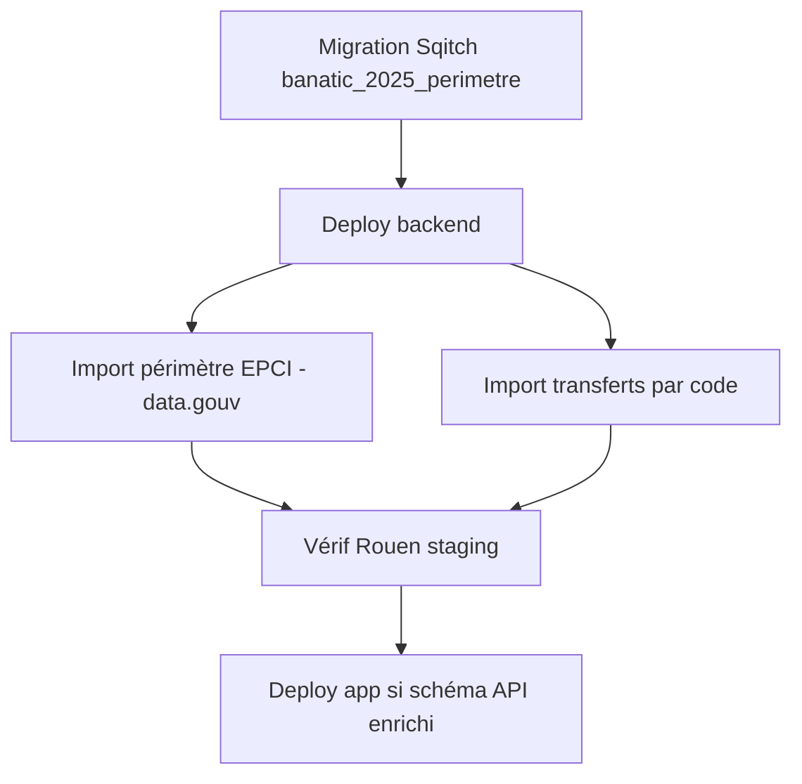

# feat: Inférence personnalisation Banatic — délégation totale au syndicat → Non pour l'EPCI

## Overview

Pour une question binaire liée à une compétence Banatic (ex. `dechets_2` → 2085), inférer **« Non (réponse Banatic) »** uniquement quand la délégation au syndicat est **totale** : toutes les communes membres de l'EPCI délèguent cette compétence au syndicat.

Conserver :

- `exercice` brut Banatic en base (souvent `true` pour une métropole comme Rouen)
- l'affichage **« Transfert vers … »** pour toute délégation (totale ou partielle)

Cas de référence : **Métropole Rouen Normandie** (SIREN `200023414`) — C2085 = OUI dans Banatic, mais 71/71 communes déléguées au SMEDAR → inférence **Non** + ligne transfert.

> **Vérif partielle (révision 2026-08-31)** : import du périmètre joué sur la base locale (seed, IDs identiques à staging) à partir de `perimetre-epci-a-fp.csv` → **Rouen = `collectivite_id` 5118, `nb_communes_membres` = 71**, et le recomptage des communes distinctes == `nb_membres` déclaré pour les 1255 EPCI du fichier (aucun écart). Reste à confirmer sur staging : `nb_communes_transferees` pour C2085 (fichier `3_transfert_code_2085.csv` non versionné) et la sortie API — cf. Tranche 5.

## Problem Statement / Motivation

Aujourd'hui, l'inférence binaire utilise uniquement `collectivite_banatic_2025_competence.exercice` (valeur OUI/NON du fichier `2_interco_competences_banatic.csv`). Le transfert (`collectivite_banatic_2025_transfert.nature_transfert`) est affiché mais **n'influence pas** `competenceExercee` ni la réponse inférée.

Pour Rouen, Banatic marque la métropole **OUI** sur C2085 alors que le traitement est entièrement délégué au SMEDAR. Le besoin métier est :

> Délégation totale au syndicat = **Non** pour l'EPCI (+ ligne transfert comme actuellement).

Le code actuel (`personnalisation-reponses-effectives.repository.ts`) :

```typescript
competenceExercee: collectiviteBanatic2025CompetenceTable.exercice,
// coalesce(reponse_binaire, competenceExercee)
```

## Règle métier cible (option B — stricte)

```
competenceExerceeEffective =
  exercice_banatic
  ET PAS (
    nb_communes_transferees >= nb_communes_membres
    ET nb_communes_membres > 0
  )
```

| Cas | `exercice` | Transfert | `nb_transf` / `nb_membres` | Inférence |
|-----|-----------|-----------|---------------------------|-----------|
| Rouen → SMEDAR | `true` | oui | 71 / 71 | **Non** |
| Délégation partielle | `true` | oui | 40 / 71 | **Oui** (+ ligne transfert) |
| Pas de délégation | `true` | non | — | **Oui** |
| Pas la compétence Banatic | `false` | — | — | **Non** |

**Réponse effective** : `coalesce(reponse_binaire.explicite, competenceExerceeEffective)` (forme inchangée).

**UI** : **pas de changement de code** (le backend renvoie déjà `competenceExercee` + `natureTransfert`), mais **changement d'affichage assumé** puisque `competenceExercee` passe de la valeur brute à la valeur effective :

- `reponse-binaire.tsx` : le label `(réponse Banatic)` se déplace du bouton *Oui* vers le bouton *Non* pour un cas Rouen (délégation totale).
- `justification.tsx` (`showLabelBanatic`, comparaison `competenceExercee !== reponseValue`) : le bandeau « réponse différente de Banatic » apparaît désormais pour une collectivité en délégation totale qui a répondu *Oui* explicitement.

À faire : relire les *stories* / *snapshots* de ces deux composants. Option d'atténuation : exposer `exerciceBanatic` brut (Tranche 3.3) pour que l'UI distingue « pas la compétence » de « compétence transférée », ou faire dépendre le libellé de la présence de `natureTransfert`.

## Principe d'architecture

Séparer trois notions :

| Concept | Stockage | Rôle |
|---------|----------|------|
| `exercice` | `collectivite_banatic_2025_competence` | Valeur brute Banatic (OUI/NON fichier `2_interco_…`) |
| Périmètre EPCI | `collectivite_banatic_2025_perimetre` (nouvelle table) | `nb_communes_membres`, **source unique** du dénominateur |
| Transfert | `collectivite_banatic_2025_transfert` enrichie | `nb_communes_transferees` + `nature_transfert` |
| Inférence | calculée à la lecture (JOIN périmètre + transfert) | `competenceExerceeEffective` |

La règle vit dans le **backend**, dans l'expression `CASE` SQL de la requête d'inférence (`getCompetenceSubquery`), couverte par les tests e2e.

> **Décision (révision 2026-08-31)** : `nb_communes_membres` n'est stocké **que** dans `collectivite_banatic_2025_perimetre` et rejoint au moment de la lecture. Pas de dénormalisation dans la table `transfert`, pas de colonne générée `delegation_totale`. Un périmètre absent → `NULL` au JOIN → le `CASE` retombe automatiquement sur `exercice` (fallback sûr, sans code de garde à l'import).

## Proposed Solution

### Tranche 1 — Schéma de données (Sqitch)

> **Nouvelle migration Sqitch, pas d'édition de l'existante.** `referentiel/banatic_2025` est déployée depuis le 2026-03-10 (`sqitch.plan:967`). Créer `sqitch add referentiel/banatic_2025_perimetre --requires referentiel/banatic_2025` → `deploy/` + `revert/` + `verify/` + entrée `sqitch.plan`. Ne **pas** modifier `deploy/referentiel/banatic_2025.sql`.

#### 1.1 Enrichir `collectivite_banatic_2025_transfert`

```sql
ALTER TABLE collectivite_banatic_2025_transfert
  ADD COLUMN nb_communes_transferees integer;
```

- `nb_communes_transferees` : communes **distinctes** du fichier transfert pour cet EPCI + compétence (numérateur).
- Le dénominateur (`nb_communes_membres`) vit dans `collectivite_banatic_2025_perimetre` (§1.2) et est rejoint à la lecture — **pas** dupliqué ici.
- Pas de colonne générée `delegation_totale` : la règle est calculée à la lecture (`CASE` SQL, cf. Tranche 3), donc pas besoin des deux compteurs sur la même ligne.

#### 1.2 Nouvelle table `collectivite_banatic_2025_perimetre`

```sql
CREATE TABLE collectivite_banatic_2025_perimetre (
  collectivite_id       integer PRIMARY KEY REFERENCES collectivite(id) ON DELETE CASCADE,
  nb_communes_membres   integer NOT NULL CHECK (nb_communes_membres >= 0),
  created_at            timestamptz NOT NULL DEFAULT now()
);

alter table collectivite_banatic_2025_perimetre enable row level security;
create policy allow_read_for_all on collectivite_banatic_2025_perimetre using (true);
```

**Source du dénominateur** — ⚠️ point corrigé à la révision 2026-08-31 :

- ❌ `2_interco_competences_banatic.csv` a **une ligne par EPCI** (confirmé par le README d'import, le seed `07-banatic_2025_competence_par_collectivite.sql` et le `firstRowPerSiren` défensif). Compter ses lignes par SIREN donne `1`, pas le nombre de communes membres. L'hypothèse « 71 adhésions dans le fichier 2 » est fausse.
- ✅ Utiliser le fichier **data.gouv EPCI ↔ communes** déjà consommé par `ImportCollectiviteRelationsService` (`RELATIONS_EPCI_COMMUNES_URL` = `https://www.data.gouv.fr/api/1/datasets/r/6e05c448-62cc-4470-aa0f-4f31adea0bc4`), en comptant **toutes** les communes par SIREN d'EPCI.
- ❌ Ne **pas** réutiliser `collectivite_relations` ni y appliquer `MIN_COMMUNE_POPULATION` (3000 hab.) : voir §1.3 cohérence.

#### 1.3 Cohérence numérateur / dénominateur (invariant)

`nb_communes_transferees` provient du CSV transfert **brut Banatic** (aucun filtre population). Le dénominateur `nb_communes_membres` doit donc lui aussi être **non filtré**, sinon une délégation partielle riche en petites communes serait classée « totale » à tort (`nb_transf >= nb_membres`). Conséquence pratique : dans l'import du périmètre, **ne pas reprendre** le garde `pmun_2025 < MIN_COMMUNE_POPULATION` de `ImportCollectiviteRelationsService`.

Fichiers à toucher :

- `data_layer/sqitch/deploy/referentiel/banatic_2025_perimetre.sql` + `revert/` + `verify/` + `sqitch.plan` (nouvelle change)
- `apps/backend/src/collectivites/shared/models/collectivite-banatic-2025-transfert.table.ts` (ajout `nbCommunesTransferees`)
- nouveau `apps/backend/src/collectivites/shared/models/collectivite-banatic-2025-perimetre.table.ts`

### Tranche 2 — Imports Banatic

#### 2.1 Nouvel import périmètre (`import-banatic-2025-perimetre`)

Nouveau script, **indépendant de l'import compétences** (il ne fait qu'ajouter le dénominateur). Il lit le fichier data.gouv EPCI ↔ communes (même source que `ImportCollectiviteRelationsService`) :

```typescript
// pour chaque SIREN d'EPCI présent dans le CSV :
//   nb_communes_membres = nombre de communes distinctes rattachées à ce SIREN
//   AUCUN filtre pmun_2025 / MIN_COMMUNE_POPULATION (cf. §1.3)
// résolution SIREN -> collectivite_id via findCollectiviteIdBySiren
// upsert (onConflictDoUpdate) dans collectivite_banatic_2025_perimetre
```

- SIREN sans `collectivite_id` en base → **warning** + skip (comme l'import transferts).
- Le comptage doit ignorer les doublons de lignes (`Set` de codes INSEE).
- `firstRowPerSiren` de l'import compétences reste inchangé et ne sert **pas** ici.

> Alternative envisagée : ajouter le comptage dans `ImportCollectiviteRelationsService` (déjà branché sur ce CSV) en exposant un total non filtré. Rejeté pour garder l'import Banatic autonome et re-jouable indépendamment.

#### 2.2 Import transferts (`import-banatic-2025-transferts`)

Enrichir `groupByEpci` dans `utils.ts` :

```typescript
type TransfertInfo = {
  epciSiren: string;
  epciName: string;
  syndicats: Map<string, SyndicatInfo>;
  communesTransferees: Set<string>; // codes INSEE distincts
};
```

À l'upsert :

- `nb_communes_transferees = info.communesTransferees.size` (seul ajout).
- **Aucune** lecture du périmètre ici : le rapprochement numérateur/dénominateur se fait à la lecture (Tranche 3), pas à l'import. Supprime le besoin de warning / `null` et découple les deux imports.

#### 2.3 Ordre d'exécution (README)

```
1. codes
2. crosswalk
3. compétences               (crée les collectivités EPCI manquantes)
3bis. périmètre              ← nouveau, requiert les collectivités de l'étape 3
4. transferts (par code)     ← enrichi (nb_communes_transferees), INDÉPENDANT du périmètre
```

L'étape 3bis et l'étape 4 peuvent tourner dans n'importe quel ordre après l'étape 3.

#### 2.4 Re-import staging / prod

1. re-run étape 3bis (périmètre) sur le CSV data.gouv EPCI ↔ communes
2. pour chaque code compétence concerné (`2080`, `2085`, …) : re-run étape 4 sur chaque `3_transfert_code_<CODE>.csv`

### Tranche 3 — Inférence personnalisation (backend)

#### 3.1 Règle métier

Logique (option B — stricte) :

- `exercice === null` → `null`
- `exercice === false` → `false`
- `exercice === true` + délégation totale (`nbCommunesMembres > 0 && nbCommunesTransferees != null && nbCommunesTransferees >= nbCommunesMembres`) → `false`
- sinon → `true`

> **Décision d'implémentation (2026-08-31)** : `buildReponseUnionQuery` construit une seule requête `UNION` produisant directement la map `questionId → valeur` ; l'inférence doit donc s'exprimer en SQL. La règle vit dans l'expression `CASE` de `getCompetenceSubquery` (§3.2), couverte par les tests e2e (§4).

#### 3.2 Repository

Modifier `PersonnalisationReponsesEffectivesRepository.getCompetenceSubquery` :

- ajouter un `leftJoin` sur `collectivite_banatic_2025_perimetre` (clé `collectivite_id`) en plus du `leftJoin` transfert existant
- exposer `competenceExercee` = valeur **effective** via le `CASE` SQL ci-dessous
- optionnel : exposer `exerciceBanatic` = `collectiviteBanatic2025CompetenceTable.exercice` brut (debug / UI, cf. 3.3)

`buildReponseUnionQuery` : le `coalesce(reponseBinaire.reponse, competenceSubquery.competenceExercee)` reste inchangé — il consomme déjà `competenceExercee`, qui devient la valeur effective. Vérifier aussi le `or(isNotNull(reponseBinaire), isNotNull(competenceSubquery.competenceExercee))` du `where` : `competenceExercee` effectif peut être `false` (au lieu de `null`) pour une délégation totale, ce qui est bien la ligne qu'on veut inclure.

**Expression SQL** (dans `getCompetenceSubquery`, `nb_communes_membres` venant du JOIN périmètre) :

```sql
CASE
  WHEN cb.exercice IS NULL THEN NULL
  WHEN cb.exercice = false THEN false
  WHEN p.nb_communes_membres > 0
    AND t.nb_communes_transferees >= p.nb_communes_membres THEN false
  ELSE cb.exercice
END
-- p ou t absent (LEFT JOIN NULL) => la condition n'est pas vraie => ELSE cb.exercice (fallback sûr)
```

#### 3.3 Schéma API (`packages/domain/src/collectivites/personnalisations/reponse.schema.ts`)

- `personnalisationReponseBaseSchema.competenceExercee` (`z.nullable(z.boolean())`) : inchangé côté type, porte désormais la valeur **effective**.
- optionnel : ajouter `exerciceBanatic: z.nullable(z.boolean())` au `personnalisationReponseBaseSchema` pour la transparence (permet à l'UI de distinguer « pas la compétence » de « compétence transférée » sans deviner via `natureTransfert`). Propager depuis `getCompetenceSubquery` et `list-personnalisation-reponses.repository.ts`.

### Tranche 4 — Tests

#### Cas de la règle `CASE` SQL (couverts par les e2e ci-dessous)

| Cas | `nbTransf` / `nbMembres` | Attendu |
|-----|-------------------------|---------|
| `exercice=true`, pas de transfert | `null` / `71` | `true` |
| `exercice=true`, délégation totale | `71` / `71` | `false` |
| `exercice=true`, sur-délégation | `72` / `71` | `false` (`>=`) |
| `exercice=true`, délégation partielle | `40` / `71` | `true` |
| `exercice=false` | `71` / `71` | `false` |
| `nbMembres=null` (périmètre absent) | `71` / `null` | `true` (= `exercice` brut, fallback) |
| `nbMembres=0` (garde-fou) | `0` / `0` | `true` (= `exercice`, pas de division par 0 implicite) |

#### Import périmètre (`import-banatic-2025-perimetre` — nouveau `utils.test.ts`)

- compter les communes **distinctes** par SIREN d'EPCI (`Set` de codes INSEE), pas de double comptage
- **ne pas** filtrer sur `pmun_2025` / `MIN_COMMUNE_POPULATION`
- SIREN non résolu en base → skip + warning, pas d'exception

#### Import transferts (`import-banatic-2025-transferts/utils.test.ts`)

- `communesTransferees` : `Set` de codes INSEE distincts ; EPCI multi-syndicats → taille du `Set` global (une commune comptée une fois même si listée sous deux syndicats)

#### E2E backend (`personnalisation-reponses-effectives.repository.e2e-spec.ts`)

- fixture Rouen-like : `exercice=true`, périmètre 71, transfert 71 → `payload = false`
- fixture partielle : périmètre 71, transfert 40 → `payload = true` + `natureTransfert` présent
- **fixtures à faire évoluer** dans `personnalisations.test-fixture.ts` :
  - `addTestCollectiviteTransfertCompetence` (l. ~350) → accepter `nbCommunesTransferees`
  - nouvelle `addTestCollectiviteBanaticPerimetre({ collectiviteId, nbCommunesMembres })`
  - `addTestQuestionBanaticCompetencePourCollectivite` (l. ~612, aujourd'hui `exercice:true` + transfert `'transfert de test'`) : le test existant qui attend `true` reste valide tant qu'aucun périmètre total n'est posé — l'assertion ne change pas, mais ajouter un cas jumeau avec périmètre total attendant `false`.

#### Non-régression scoring

Vérifier `action-personnalisations` / règles `dechets_2` + `dechets_4` :

- délégation totale → `dechets_2=NON` cohérent avec règles CAE EPCI
- délégation partielle → `dechets_2=OUI` ; `dechets_4` reste la question de précision

### Tranche 5 — Déploiement



**Vérif Rouen** (staging — `collectivite_id` **à confirmer**, le plan citait `5118`) :

```sql
-- 0. retrouver l'id (SIREN Métropole Rouen Normandie = 200023414)
SELECT id, nom, type FROM collectivite WHERE siren = '200023414';

-- 1. données brutes + périmètre + transfert pour C2085
SELECT
  cb.exercice,
  p.nb_communes_membres,
  t.nb_communes_transferees,
  t.nature_transfert
FROM collectivite_banatic_2025_competence cb
LEFT JOIN collectivite_banatic_2025_perimetre p
  ON p.collectivite_id = cb.collectivite_id
LEFT JOIN collectivite_banatic_2025_transfert t
  ON t.collectivite_id = cb.collectivite_id AND t.competence_code = cb.competence_code
WHERE cb.collectivite_id = :rouenId AND cb.competence_code = 2085;
-- attendu : exercice=true, nb_communes_membres=71, nb_communes_transferees=71, nature_transfert='SMEDAR (71 communes)'
```

API `listPersonnalisationReponses` pour `dechets_2` :

- `competenceExercee: false`
- `reponse: false`
- `natureTransfert: "SMEDAR (71 communes)"`
- `exerciceBanatic: true` (si exposé, cf. 3.3)

## Risques et décisions ouvertes

| Sujet | Question | Recommandation |
|-------|----------|----------------|
| Périmètre absent | `nb_communes_membres` non importé pour un EPCI | LEFT JOIN → `NULL` → `CASE` retombe sur `exercice` brut. Aucun code de garde à l'import ; log de couverture après import périmètre. |
| Source du dénominateur | D'où vient `nb_communes_membres` ? | Fichier data.gouv EPCI ↔ communes (`RELATIONS_EPCI_COMMUNES_URL`), **pas** `2_interco_…` (1 ligne/EPCI) ni `collectivite_relations` (filtré 3000 hab.). |
| Cohérence num./dénom. | Filtre population asymétrique → faux « total » | Numérateur et dénominateur tous deux non filtrés (§1.3). |
| Délégation partielle | `dechets_2=Oui` + transfert affiché — OK métier ? | Oui, aligné avec `dechets_4` pour la part syndicat. |
| Multi-syndicats | Rouen = 1 syndicat ; d'autres EPCI en ont plusieurs | `Set` de codes INSEE sur **tous** les syndicats ; une commune comptée une fois. |
| Codes compétence | Fichier transfert par code (`2080`, `2085`, …) | Documenter dans README ; pas seulement `1510`. |
| Affichage UI | Label Banatic déplacé + bandeau « réponse différente » | Assumé (cf. §UI). Relire stories/snapshots `reponse-binaire` + `justification`. |
| `exerciceBanatic` exposé | Utile pour support / debug / UI ? | Recommandé (permet à l'UI de distinguer « pas la compétence » de « transférée »), tranche 3.3. |
| `id` Rouen staging | `5118` cité dans le plan initial | **Confirmé** sur base locale (seed) : `id` 5118, `nb_communes_membres` 71. Revalider sur staging avec le SQL §Tranche 5. |
| Recomptage vs `nb_membres` | Le recomptage des INSEE distincts peut diverger de la colonne data.gouv | Sur le fichier actuel : 0 écart sur 1255 EPCI. L'import loggue tout écart, le recomptage fait foi. |

## Ordre d'implémentation recommandé

1. **Change Sqitch `banatic_2025_perimetre`** (deploy/revert/verify) + modèles Drizzle
2. **Import périmètre** depuis le CSV data.gouv EPCI ↔ communes (non filtré) + `utils.test.ts`
3. **Import transferts** : ajout `nb_communes_transferees` (`Set` INSEE) + `utils.test.ts`
4. **Repository personnalisation** : JOIN périmètre + `CASE` effectif dans `getCompetenceSubquery` ; fixtures ; e2e
5. **(optionnel)** exposer `exerciceBanatic` bout en bout ; ajustement libellés UI
6. **Doc README** import + **vérif Rouen staging** (confirmer `id` + 71/71)

## Fichiers clés existants

| Fichier | Rôle actuel |
|---------|-------------|
| `apps/backend/src/collectivites/personnalisations/services/personnalisation-reponses-effectives.repository.ts` | Inférence `coalesce` + `competenceExercee` (`getCompetenceSubquery` / `buildReponseUnionQuery`) |
| `apps/backend/src/collectivites/personnalisations/list-personnalisation-reponses/list-personnalisation-reponses.repository.ts` | Autre lecture exposant `competenceExercee` / `natureTransfert` (à propager si `exerciceBanatic`) |
| `packages/domain/src/collectivites/personnalisations/reponse.schema.ts` | `personnalisationReponseBaseSchema` (`competenceExercee`, `natureTransfert`) |
| `packages/domain/src/collectivites/personnalisations/competence-banatic.schema.ts` | Schéma compétence Banatic (`@tet/domain`) |
| `apps/app/src/collectivites/personnalisations/question/reponse-binaire.tsx` | Label « (réponse Banatic) » sur Oui/Non (`showLabelBanatic`) |
| `apps/app/src/collectivites/personnalisations/question/justification.tsx` | Ligne « Transfert vers … » + bandeau « réponse différente de Banatic » |
| `apps/backend/src/collectivites/import-collectivite-relations/import-collectivite-relations.service.ts` | Consomme déjà le CSV data.gouv EPCI ↔ communes (`RELATIONS_EPCI_COMMUNES_URL`, garde `MIN_COMMUNE_POPULATION`) |
| `apps/tools/src/migrations/banatic2025/import-banatic-2025-transferts/` | Import transferts (`groupByEpci`, `formatNatureTransfert`) |
| `apps/tools/src/migrations/banatic2025/import-banatic-2025-collectivite-competences/` | Import exercice Banatic (`firstRowPerSiren`) |
| `apps/tools/src/migrations/banatic2025/README.md` | Ordre d'exécution des imports |
| `data_layer/sqitch/deploy/referentiel/banatic_2025.sql` | Schéma tables Banatic 2025 **existant** (ne pas éditer — cf. Tranche 1) |
| `apps/backend/src/collectivites/personnalisations/personnalisations.test-fixture.ts` | Fixtures `addTestCollectiviteTransfertCompetence`, `addTestQuestionBanaticCompetencePourCollectivite` |
