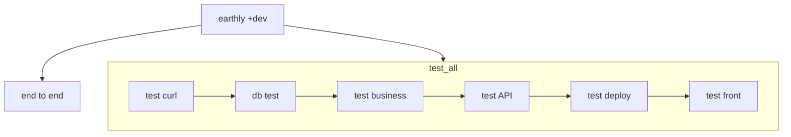
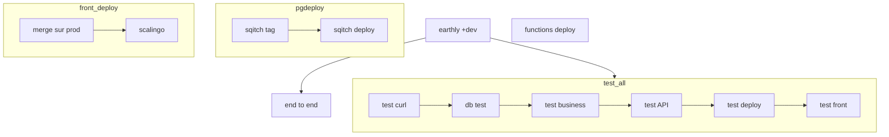
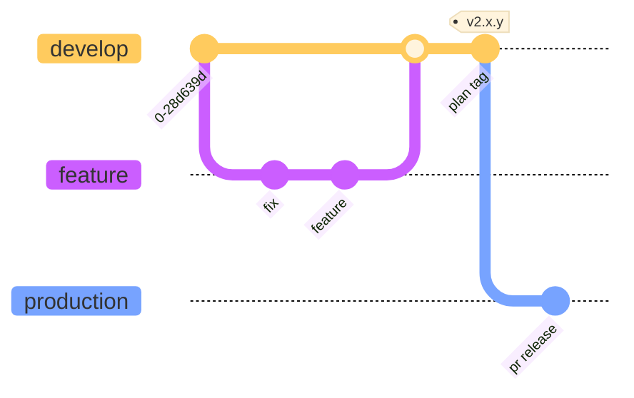
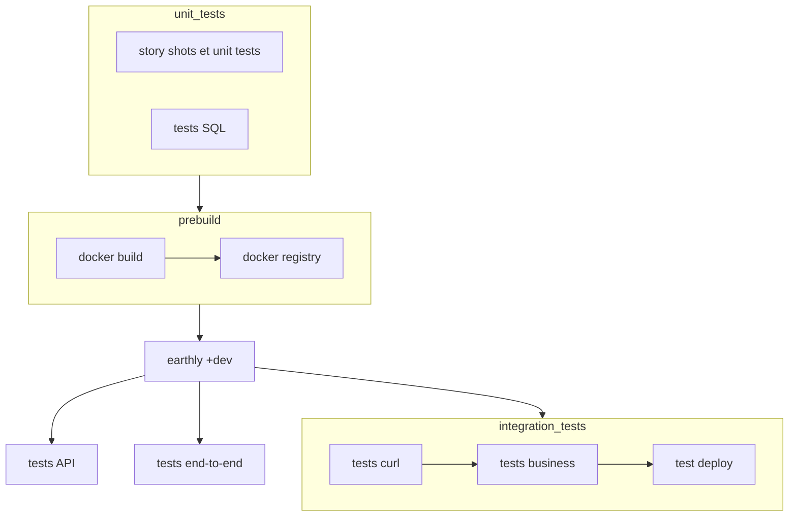
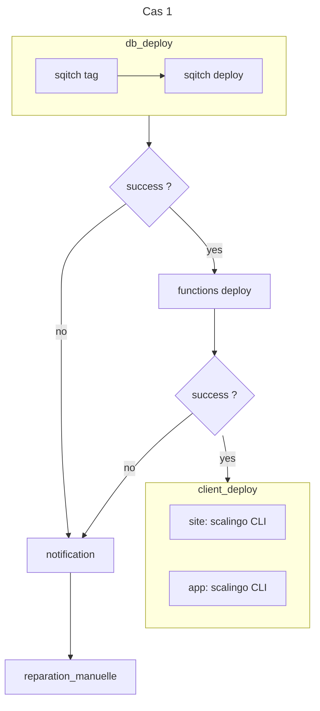
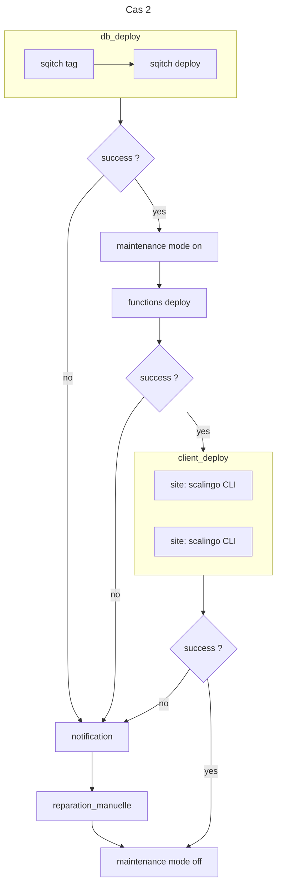

# Fonctionnement actuel

## Intégration continue

## Déploiement continu

  
## Workflow git

 
# Fonctionnement idéal               
## Intégration continue

            
## Cas 1

- db rétrocompatible avec le front et les edge functions
- edge functions rétrocompatibles avec le front

## Cas 2
- db non rétrocompatible avec le front et les edge functions

